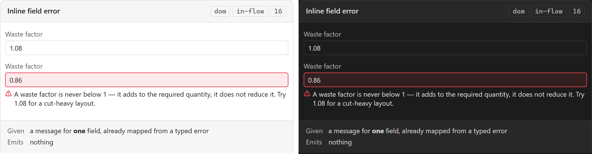

# Inline field error

The message beside the field that caused it. The narrowest error surface in the inventory, and
the one that keeps a validation failure from being escalated into a [[Toast]] a user has to
translate back into which box they typed in wrong.

## Specimen

A drawing of the proposal, not a screenshot of anything built — `src/` is a scaffold.
Obsidian's **default** light and dark, so a themed vault differs; shot from
[`component-gallery.html`](../concepts/component-gallery.html) by `npm run concept-shots`.

## Anatomy

- **A message adjacent to its control.** Adjacency is the whole design: a message in a summary at
  the top of a panel is a different component with a different job.
- **A mark on the control itself.** [[Design System]]'s *Error* row asks for an icon **and** a
  message, and the icon belongs to the field so the field is findable while scrolled.

## States

| State | Notes |
| --- | --- |
| Absent | The normal case |
| Present | The field is also marked invalid |

The field and the message are one thing to a user and two elements in the DOM, which is the
entire source of this component's accessibility work below.

## Contract

**Given** a message for **one** field, already mapped from a typed error. SDD §64 names the
category — `ValidationError` — and SDD §65 says how it arrives: an expected business failure uses
a typed `Result<T,E>` rather than a throw, so this message came back from a command that
declined, not from a crash that was caught.

**Emits** nothing.

**It does not validate.** The domain does. An inline error that decided validity would have moved
a rule out of the layer that owns it — and the layer bans in `eslint.config.mjs` cannot catch
that one, because a validity check written in a view imports nothing it is not allowed to.

The corollary for [[Inspector]]: an edit becomes a command (SDD §59), the command declines, and
*this* is where the decline is shown. A field that refused input locally would never have
produced the command, so the rule would never have run.

## Where it appears

[[Inspector]] fields today. The settings pane later — noting that today's pane is
**declarative**, so a validation message there is the definitions' problem and not this
component's until a control needs one. Any future form the same way.

`region: in-flow`, for the same reason as [[Empty state]]: it displaces content, it does not
overlay it.

## Accessibility

Three obligations, and this is the component where axe earns the most of its keep:

- **`aria-describedby`** from the control to the message, so the two are one announcement.
- **`aria-invalid`** on the control, so the state is programmatic and not just red.
- **Not colour alone** — PRD §44's *no color-only status encoding*, applied to the case where it
  is broken most often.

What the check reaches is the *association*. What it cannot reach is whether the message is about
the right field — a form wired to describe every input from one shared node passes axe and is
useless.

## Open

1. **Does a field error block the command, or does the command report it?** SDD §65 answers in
   principle — the command reports — but a field that submits a known-bad value on every keystroke
   is a different experience from one that waits. Slice 16 has to pick the moment.
2. **What happens to an error when the field is edited again.** Clearing on input hides a real
   problem; keeping it shows a stale one.

## Sources

PRD §44 · SDD §59 · SDD §64 · SDD §65, in
[`docs/prds/obsidian-renovation-planner.md`](../prds/obsidian-renovation-planner.md) and
[`docs/sdds/obsidian-renovation-planner-SDD.md`](../sdds/obsidian-renovation-planner-SDD.md).
