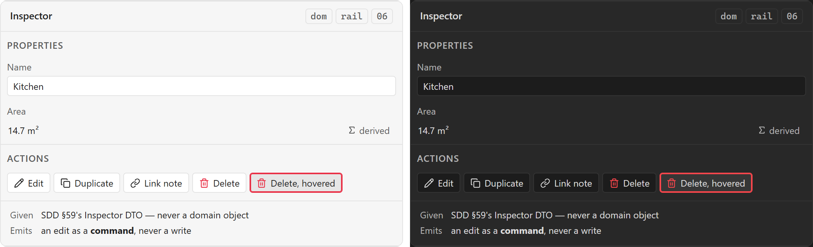

# Inspector

**Design authority since 2026-09-05:** the editor package's `EntityInspector` frame
([component library](../user-experience/renovation-planner-editor-specs/components/component-library.md)) with Floor, Room, Wall, Multi-selection and Review variants,
`InspectorDrawer` at constrained width reusing the same content, `HomeownerQuestionNav`'s three
rows — *What's here* (Existing), *What will change* (Planned), *What needs doing* (Work) —
`TransformationSummary`, `SemanticStateSwitch`, `LinkedContentList`, and twelve content
components from `FloorInspector` to `ReviewInspector`. The library package's
[`AssetInspector`](../user-experience/asset-library-delivery/specification/component-library.md) is the same shape over one asset (neutral, ready, missing, unreadable).
*Properties · Relations* below is the archived proposal.

The right column: what is selected, its properties, its relations, and what can be done to it.
The only component in this inventory through which a user **changes** a domain object, which is
why its contract is the longest section rather than its anatomy.

## Specimen



A drawing of the ORIGINAL proposal — the 2026-08 concept gallery — and not a screenshot of
anything built. That gallery is archived at
[`component-gallery.html`](../user-experience/archive/concepts/component-gallery.html) and no longer drives the app;
`npm run concept-shots` still regenerates these shots from it, as a record of what was proposed.
Obsidian's **default** light and dark, so a themed vault differs. What the shipped surface looks
like is `npm run harness-shot`'s to show, and what it is designed TOWARDS is the package component
named at the top of this note.

## Anatomy

- **Properties** — the selected object's own fields, each with an [[Inline field error]] slot.
- **Relations** — what it is connected to, per PRD §58's canonical relationship model.
- **Actions**, the seven PRD §39 names: Edit, Duplicate, Delete, Link Note, Create Work
  Package, Add Cost, Add Task. The last three are the interesting ones — they create a
  different entity *from* this one, which is the plugin's whole thesis in one button.

Delete is the one that opens a [[Modal]], per PRD §64. It is the only action here that must not
proceed on a click.

## States

| State | Notes |
| --- | --- |
| Default | One object selected |
| Empty | Nothing selected — [[Empty state]], and the commonest thing this panel shows |
| Multi-selection | Which fields are even meaningful across a set is open, below |
| Loading | The DTO is a query, and a query can be in flight |
| Error | A field's, via [[Inline field error]]; a whole-panel failure is slice 17's |

## Contract

**Given** SDD §59's **Inspector DTO** — not a domain object. The pipeline is explicit:

```text
Selection → Inspector Query → Inspector DTO → Vue UI
```

**Emits** an edit as a **command**, never a write. SDD §59 says *edits become commands* and
`CLAUDE.md`'s write boundary is what makes that a gate rather than a convention: nothing
outside `infrastructure/` writes to the vault, and `WRITE_BOUNDARY` in `eslint.config.mjs`
catches the case the layer bans cannot see — a write from a view.

Two consequences worth stating because both look correct locally:

- **A field it cannot render is not a field it may drop.** The business rule *a type this
  version does not know survives a round trip verbatim* reaches the inspector: an unknown zone
  type shows as itself.
- **A derived value it shows is not a value it computes.** [[Information Architecture]]'s rule
  is that a fact is shown where it is derived; a second rounding here disagrees with the engine.

## Where it appears

Plan editor mode. A future Dashboard could reuse it unchanged, because the DTO boundary is what
makes it portable — it never learned what a zone is.

## Accessibility

**Form labels**, and this is the component where axe does most of its real work here: every
field owes a programmatically associated label, and a placeholder is not one. The check reaches
the association; it cannot reach whether the label says the right thing.

The Delete action needs its destructiveness conveyed in text, not in colour — the same rule as
[[Status badge]], on the button where getting it wrong is most expensive.

## Open

1. **Properties and Relations: tabs, or one scroll?** PRD §39 and SDD §60 both list them as two
   labels in one column and neither says which.
2. **What a multi-selection inspector shows.** Common fields only, the count, or nothing.
   Undecided, and it is the case a single-selection design silently fails at.

**Since 2026-09-05:** question 1 is still open and the editor package says so — its §86
leaves Inspector tabs versus stacked sections to prototype evidence. Question 2 is answered by
M11: `MultiSelectionInspector` shows shared properties and batch actions, and
`MultiSelectionActionBar` carries the count.

## Sources

PRD §39 · SDD §59 · SDD §60, in
[`docs/product/prds/obsidian-renovation-planner.md`](../product/prds/obsidian-renovation-planner.md) and
[`docs/development/sdds/obsidian-renovation-planner-SDD.md`](../development/sdds/obsidian-renovation-planner-SDD.md).
