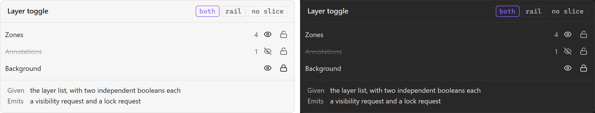

# Layer toggle

**Design authority since 2026-09-05:** the editor package's `LayerList`
([component library](../user-experience/renovation-planner-editor-specs/components/component-library.md)), whose descriptor carries name, visible, locked, opacity, status and
count, over seven canonical layers — Reference plan, Planned changes, Notes, Work markers,
Material markers, Photo pins, Review markers. Layers are VISIBILITY, never ownership, and never a
proxy for the Existing / Planned semantic state; `ChangeLegend` carries that.

The visibility and lock controls for a drawing layer. A DOM control whose **entire effect is on
the canvas**, which is what makes it one of only two `both` components here — it is styled by
CSS and it changes nothing a CSS rule can see.

## Specimen

A drawing of the ORIGINAL proposal — the 2026-08 concept gallery — and not a screenshot of
anything built. That gallery is archived at
[`component-gallery.html`](../user-experience/archive/concepts/component-gallery.html) and no longer drives the app;
`npm run concept-shots` still regenerates these shots from it, as a record of what was proposed.
Obsidian's **default** light and dark, so a themed vault differs. What the shipped surface looks
like is `npm run harness-shot`'s to show, and what it is designed TOWARDS is the package component
named at the top of this note.

## Anatomy

Per layer: a name, a visibility toggle, a lock toggle.

- **The layer set is fixed**, not user-defined. SDD §17 gives the Konva stage seven layers —
  BackgroundLayer, ArchitectureLayer, ZoneLayer, ConstructionLayer, AssetLayer,
  AnnotationLayer, InteractionLayer — and the last is transient, so whether it is even listed is
  open below.
- **The two conditions are PRD §39's**: an object can be hidden, visible or locked. Visibility
  and lock are two independent toggles, not three radio values: a locked layer is still visible,
  and that is the normal case for a background plan.

## States

| State | Second channel, per [[Design System]] |
| --- | --- |
| Visible / hidden | An icon — an eye, struck through when hidden. Never opacity alone |
| Unlocked / locked | An icon — a padlock. Never colour alone |
| Focus | A ring; two toggles per row means two stops, not one |
| Disabled | A layer that cannot be hidden (InteractionLayer, if listed) |

## Contract

**Given** the layer list with its two booleans per layer. **Emits** a visibility request and a
lock request.

**It does not touch Konva.** A layer's `visible` is render state; SDD §16 states that Konva
objects are never written to the vault, and SDD §15 separates persistent from ephemeral state —
which is exactly the axis this component's open question sits on. The toggle asks; the render
model answers.

The consequence for [[Selection handle]] is worth naming here rather than there: **a locked
object gets no handles.** One toggle in this component removes an affordance in another.

## Where it appears

[[Left rail]], Layers section.

## Accessibility

Two toggles per row is a **naming** problem before it is anything else: "toggle" is not an
accessible name and neither is "eye". Each control needs its layer in its name — *hide Zones*,
*lock Background* — or a screen-reader user meets fourteen identically-named buttons.

**Locked must be conveyed, not only drawn.** A padlock icon with no text alternative says
nothing, and this is the component where the drawn state and the announced state are furthest
apart.

## Open

1. **No slice builds this.** PRD §39 names the three object conditions and none of the seventeen
   design slices claims the control. That empty `slice:` is a fact for somebody to come back and
   change, not an omission — the same way `docs/product/business-rules/` names the four rules with no
   slice rather than implying all twenty-seven have one.
2. **Is layer visibility persisted or ephemeral?** SDD §15 draws the line and does not place
   this. Ephemeral means a reopened plan shows everything; persisted means a hidden layer is a
   stored preference and needs a schema version.
3. **Is InteractionLayer listed at all?** SDD §19 calls it transient-only. Listing it offers a
   toggle for something with no persistent content; omitting it means the rail and the scene
   disagree about how many layers there are.

**Since 2026-09-05:** question 1 is no longer true — `docs/tasks/Build the truthful layer
catalogue.md` and `docs/tasks/Control layer visibility without changing renovation data.md` claim
the control. Question 3 is answered by the canonical list, which has no interaction layer in it.
Question 2 stands.

## Sources

PRD §39 · SDD §15 · SDD §17, in
[`docs/product/prds/obsidian-renovation-planner.md`](../product/prds/obsidian-renovation-planner.md) and
[`docs/development/sdds/obsidian-renovation-planner-SDD.md`](../development/sdds/obsidian-renovation-planner-SDD.md).
