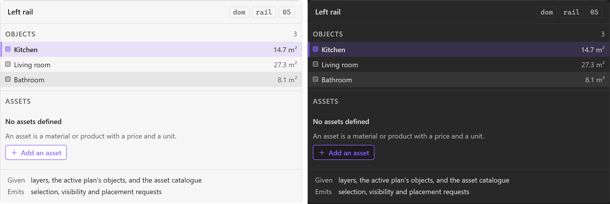

# Left rail

The left column of the plan editor: **Layers**, **Objects**, **Assets**. Three ways into the
same plan — by drawing order, by object, by catalogue — and the in-view half of the promise
that the canvas is never the only route.

The third section is named **Assets**, not `Library`. That is [[Information Architecture]]'s
naming register, not this note's choice: the entity is [[Asset]], and "asset library" is the
catalogue *concept* of PRD Epic 6 rather than the panel showing it.

## Specimen

A drawing of the proposal, not a screenshot of anything built — `src/` is a scaffold.
Obsidian's **default** light and dark, so a themed vault differs; shot from
[`component-gallery.html`](../concepts/component-gallery.html) by `npm run concept-shots`.

## Anatomy

Three sections, in SDD §60's order:

- **Layers** — the drawing layers and their two conditions, held by [[Layer toggle]].
- **Objects** — what is drawn on the active plan, as a list. This is the section PRD §40 is
  about: *spatial objects must remain accessible without the canvas.*
- **Assets** — the catalogue an object is placed from.

## States

| State | Notes |
| --- | --- |
| Default | — |
| Section collapsed / expanded | Per section, independently |
| Empty | Per section, via [[Empty state]] — three different causes, three different actions |

The three empty causes are worth separating rather than sharing one message: no layers is
impossible (SDD §17 fixes seven), no objects means nothing drawn yet, and no assets means the
catalogue is unpopulated. Only the middle one has an obvious action.

## Contract

**Given** the layer list, the object list for the active plan, and the asset catalogue.
**Emits** selection requests, visibility requests (which it forwards from [[Layer toggle]]) and
placement requests.

It holds no geometry. A row in the Objects section is a reference to a domain object, not a
handle on a Konva node — SDD §16's pipeline runs the other way, and a rail that reached into
the scene would be the canvas's second owner.

## Where it appears

Plan editor mode, per [[Sitemap]]. The project mode has no rails.

## Accessibility

**This is where PRD §40 is answered inside the view.** The Bases route is the other half —
[[The alternative list route is a Bases view]] — and the two are not redundant: one is reachable
while editing, the other while not.

Three stacked sections make **heading order** the live risk, and it is one of the few things
axe genuinely does check here: three `<h2>`s under the view's own heading, not an `<h2>` and
two `<h4>`s because they looked smaller.

## Open

1. **Tabs or stacked panels?** Three sections stacked in one narrow column on a laptop pane
   gives each about a third of the height. Tabs give one section all of it and hide two. The
   measurement that decides this is [[Design System]]'s open question 2.
2. **Whether Objects and the Bases list should agree on ordering.** They will not by default,
   and a user who learns one order and meets another has been given two products.
3. **What a truncated name owes.** Measured in `docs/concepts/plan-editor.html` at an 878px
   pane: German *labels* all fit — the toolbar, the status bar and the seven inspector actions
   overflow by nothing, and *Nicht gespeicherte Änderungen* survives at 29 characters against
   English's 15. What does not fit is **user data**: a zone named *Wohnzimmer im Erdgeschoss*
   loses 24px of its tail in a 132px box. Labels are bounded by a translator; a name is
   bounded by nobody. The mock proposes a `title`, which is what Obsidian's own rails do and
   which a keyboard user still cannot reach — so the decision is open rather than made.

## Sources

PRD §39 · PRD §40 · SDD §60, in
[`docs/prds/obsidian-renovation-planner.md`](../prds/obsidian-renovation-planner.md) and
[`docs/sdds/obsidian-renovation-planner-SDD.md`](../sdds/obsidian-renovation-planner-SDD.md).
