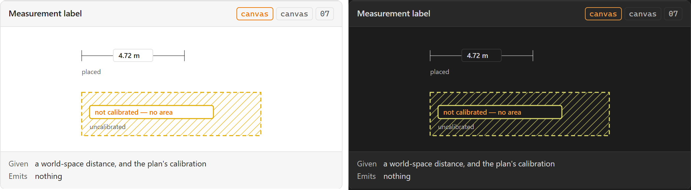

# Measurement label

**Design authority since 2026-09-05:** the editor package's `DimensionLabel` and
`EditableDimensionLabel` ([component library](../user-experience/renovation-planner-editor-specs/components/component-library.md)) — normalized value, unit, editable and
validation state; begin edit, commit a parsed value, cancel — under the rule that direct
manipulation and numeric entry converge on the same command. The *Measure tool* this note's
sources name is not in the package's creation catalog.

The number drawn beside a measurement — the Measure tool's output, and the one value a renovator
reads more often than any other. It is a small component with the inventory's most consequential
rule attached to it: it is the place a plugin most easily tells a confident lie.

## Specimen

A drawing of the ORIGINAL proposal — the 2026-08 concept gallery — and not a screenshot of
anything built. That gallery is archived at
[`component-gallery.html`](../user-experience/archive/concepts/component-gallery.html) and no longer drives the app;
`npm run concept-shots` still regenerates these shots from it, as a record of what was proposed.
Obsidian's **default** light and dark, so a themed vault differs. What the shipped surface looks
like is `npm run harness-shot`'s to show, and what it is designed TOWARDS is the package component
named at the top of this note.

## Anatomy

- **A value and a unit**, together. A bare number on a plan is ambiguous between millimetres and
  metres, and PRD §71's own example spans both.
- **The geometry it belongs to** — a leader line or a position along the measured edge. A label
  that has drifted from its edge is measuring something else.
- **Two layers, depending on lifecycle.** While the Measure tool is active it is a *measure
  preview* on SDD §19's InteractionLayer; once kept it belongs to the AnnotationLayer.

## States

| State | Notes |
| --- | --- |
| Preview | Following the pointer, not yet committed |
| Placed | Persisted as an annotation |
| **Uncalibrated** | The state that must exist. See below |

**Uncalibrated is not an error and not an empty value.** PRD §82's calibration model is a
minimum of Point A, Point B and a known distance; until it exists, a distance in world units has
no metric meaning. [[An uncalibrated plan never presents a measurement as true]] is a business
rule with a UI consequence, and the consequence is this component's: it owes a *state*, not a
hidden value and not a plausible-looking number.

## Contract

**Given** a world-space distance and the plan's calibration. **Emits** nothing.

**It displays precision; it never decides it.** PRD §71 separates the two explicitly — internal
precision is millimetres squared, display precision is two decimals of a square metre — and
this component owns only the second. A label that rounded to fit its own width would have
introduced a third precision nobody declared.

The related consequence from [[Information Architecture]]: a zone's area belongs to the
[[Plan canvas]] and the zone's own note. If this label and the [[Inspector]] disagree by a
rounding, one of them is wrong and neither can say which.

## Where it appears

[[Plan canvas]] — AnnotationLayer when placed, InteractionLayer while previewing.

## Accessibility

**A drawn number is invisible to a screen reader**, and this is the component where *the canvas
cannot be the only route* is least negotiable of anywhere in the inventory. A measurement is not
decoration a non-visual user can skip; it is the answer they came for.

The non-canvas route is [[Status bar]] for the live value and the annotation's own note for the
kept one. Neither is optional.

## Open

1. **Does the label scale with the world or with the screen?** Scaling with the world makes it
   illegible when zoomed out; scaling with the screen makes it move relative to its own geometry
   as the user zooms. Both are wrong in a different direction and SDD §24's viewport transform
   does not choose.
2. **What an uncalibrated measurement actually renders as.** A pixel count, a placeholder, or a
   refusal. The rule says it must not read as true; it does not say what it reads as instead.

**Since 2026-09-05:** question 2 moves: a plan is prepared through Reference Plan Setup (M06)
rather than a Calibrate tool, and the business rule that an uncalibrated plan never presents a
measurement as true still says nothing about what is drawn instead. Question 1 stands.

## Sources

PRD §39 · PRD §71 · PRD §82 · SDD §19 · SDD §25, in
[`docs/product/prds/obsidian-renovation-planner.md`](../product/prds/obsidian-renovation-planner.md) and
[`docs/development/sdds/obsidian-renovation-planner-SDD.md`](../development/sdds/obsidian-renovation-planner-SDD.md).
