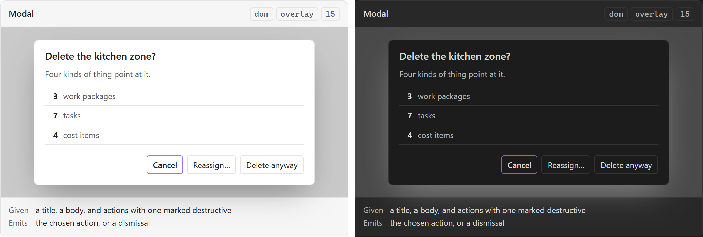

# Modal

The blocking surface for a decision that cannot be deferred. PRD §64's deletion dialog is the
worked case, and **the confirmation dialog is a use of this component rather than a second
one** — the four choices are content, not a variant.

## Specimen

A drawing of the proposal, not a screenshot of anything built — `src/` is a scaffold.
Obsidian's **default** light and dark, so a themed vault differs; shot from
[`component-gallery.html`](../user-experience/concepts/component-gallery.html) by `npm run concept-shots`.

## Anatomy

- **A title**, stating the decision rather than the category. *Delete Zone?* is a decision;
  *Confirm* is a category.
- **A body.** For deletion, PRD §64 makes it a **reference report** before it makes it a
  question: *Referenced by: 3 Work Packages, 7 Tasks, 4 Cost Items, 2 Documents.* The report is
  the point — a confirmation with no consequences listed is a speed bump.
- **Actions.** PRD §64's four: Cancel, Remove References, Reassign, Delete Anyway. Exactly one is
  destructive and it is neither the default nor focused on open.

## States

| State | Notes |
| --- | --- |
| Open | Blocking, focus trapped inside |
| Closed | Not rendered, not hidden |

The interesting states belong to its actions rather than to it. A modal whose body is still
loading its reference report is the exception, and it must not offer *Delete Anyway* before the
report arrives — an incomplete list is worse than a pending one.

## Contract

**Given** a title, a body, and a list of actions with one optionally marked destructive.
**Emits** the chosen action, or a dismissal.

**A dismissal is Cancel.** PRD §64's *silent cascading delete should be avoided* means an
unanswered dialog does nothing — so Escape, the backdrop and the close control all resolve to
the same non-action, and none of them may resolve to the destructive one.

**It does not perform the action.** The rule is
[[A delete reports what references it and offers four choices]]; the modal reports and offers,
and the command does. A modal that deleted
would be a write from a view, which `WRITE_BOUNDARY` refuses.

## Where it appears

Any surface. Today: [[Inspector]]'s Delete action, per PRD §39's inspector actions and PRD §64's
semantics.

## Accessibility

Five obligations, and only two of them are checkable here:

| Obligation | Checked by |
| --- | --- |
| `role="dialog"` and an accessible name | axe, in `tests/harness/accessibility.test.ts` |
| Valid ARIA attributes | axe |
| A focus trap | Nothing here |
| Focus returned to the trigger on close | Nothing here |
| Escape closes | Nothing here |

Obsidian's own `Modal` supplies most of the three unchecked rows. Hand-rolling supplies none of
them, and the three that nothing here can check are exactly the three a keyboard user notices
first.

## Open

1. **Obsidian's `Modal`, or the plugin's own?** The same trade [[Toast]] records, with the
   stakes reversed: for a toast the host's version costs test visibility, and for a modal the
   host's version *buys* the focus behaviour nobody wants to reimplement.
2. **Whether *Reassign* needs a second step.** PRD §64 lists it as one of four choices, but
   reassigning references requires choosing a target — which is either a modal inside a modal or
   a different component this note does not have.

## Sources

PRD §39 · PRD §64 · SDD §85, in
[`docs/product/prds/obsidian-renovation-planner.md`](../product/prds/obsidian-renovation-planner.md) and
[`docs/development/sdds/obsidian-renovation-planner-SDD.md`](../development/sdds/obsidian-renovation-planner-SDD.md).
