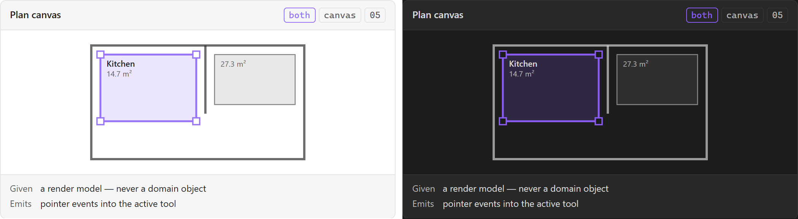

# Plan canvas

The centre column, and the one canvas element everything spatial is drawn into. Two components
in one boundary: a DOM host that owns the size, and a Konva stage that owns the scene. That is
why its `medium` is `both`, and it is the component the whole of [[Design System]]'s *the canvas
is not the DOM* section is about.

Named **Plan canvas**, never `Plan`. [[Information Architecture]]'s register: [[Plan]] is an
entity, and a region named with a bare entity noun makes "open the plan" ambiguous between a
note and a viewport.

## Specimen

A drawing of the proposal, not a screenshot of anything built — `src/` is a scaffold.
Obsidian's **default** light and dark, so a themed vault differs; shot from
[`component-gallery.html`](../concepts/component-gallery.html) by `npm run concept-shots`.

## Anatomy

**The DOM half** — one host element that claims the remaining width and the full height of the
[[View shell]]'s body row. It owns the size and nothing else; the size is what the drawn half
cannot compute for itself.

**The drawn half** — SDD §17's stage, seven layers, in order:

| Layer | Holds | Redraws |
| --- | --- | --- |
| BackgroundLayer | Imported plans, images, rendered PDF pages (SDD §18) | Rarely |
| ArchitectureLayer | The building's own structure | Rarely |
| ZoneLayer | [[Zone]] geometry | On edit |
| ConstructionLayer | Construction sections | On edit |
| AssetLayer | Placed assets | On edit |
| AnnotationLayer | Annotations, and a placed [[Measurement label]] | On edit |
| InteractionLayer | [[Selection handle]], [[Snap guide]], previews (SDD §19) | Constantly |

## States

| State | Notes |
| --- | --- |
| Default | A calibrated plan with content |
| Empty | No plan imported — [[Empty state]], and the first thing a new project shows |
| Loading | SDD §18 says the background redraws rarely; the first draw is not free |
| Uncalibrated | [[An uncalibrated plan never presents a measurement as true]] makes this a state the canvas owes, not a value it hides |

The uncalibrated row is the one that matters. A rule about persistence has a UI consequence
here: the surface owes a visible condition, and [[Measurement label]] owes the other half.

## Contract

**Given** a render model. Never a domain object — SDD §16 is explicit about the direction:
domain spatial object, then render model, then Vue component, then vue-konva, then Konva node.

**Emits** pointer events into the active tool, per SDD §56's three pointer methods. It does not
interpret them: which gesture means what is the tool's, which is what makes six tools possible
over one canvas.

**Konva objects are never written to the vault** (SDD §16). The layer bans keep `obsidian` out
of the inner layers; `WRITE_BOUNDARY` catches the case they cannot see, a write from a view.

## Where it appears

Plan editor mode. And **it is not the only route to anything** — [[Sitemap]] reaches that
conclusion from the mobile side, [[Accessibility]] from SDD §85, [[Design System]] from the
rendering mechanism. Three arguments, one requirement, owned by none of them.

## Accessibility

The canvas has **no DOM node per object**. A [[Zone]] therefore has no accessible name, no focus
ring it can inherit, and no hit target anything that reads the layout can measure. Three
consequences, none of them optional:

1. Every canvas state needs a **drawn** equivalent of the channel a DOM control inherits.
2. A minimum size is a **world-to-screen** decision — see [[Selection handle]].
3. The canvas cannot be the only route. [[Left rail]]'s Objects section and the Bases route are
   the two that exist.

## Open

1. **Which Obsidian variable means what on the canvas.** [[Design System]]'s open question 1,
   and nothing here can be drawn correctly until it is answered — the mapping needs the vendored
   `app.css` read per scheme, which `tests/harness/cssVars.test.ts` explicitly does not do.
2. **Whether the host or the shell owns the three-column grid** — the same question
   [[View shell]] records from the other side.

## Sources

SDD §16 · SDD §17 · SDD §18 · SDD §19 · SDD §60, in
[`docs/sdds/obsidian-renovation-planner-SDD.md`](../sdds/obsidian-renovation-planner-SDD.md).
