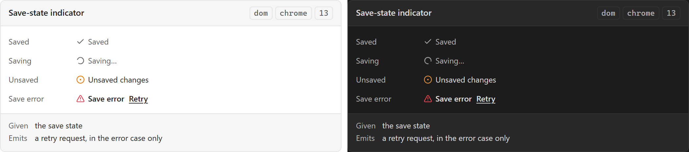

# Save-state indicator

**Design authority since 2026-09-05:** the editor package's `SaveStateIndicator`
([component library](../user-experience/renovation-planner-editor-specs/components/component-library.md)) with FIVE canonical states — Saved, Saving, Unsaved changes, Save
failed, and **Saved · refresh needed**, the one this note's four lacked: a confirmed write whose
read-back failed, shipped by the editor's trust path (checkpoint C3). The library package's
`PersistentWarning / SaveState` ([contracts](../user-experience/asset-library-delivery/specification/component-library.md)) carries the same five, and the project
package rules that a saved-but-stale display must not require another Apply.

Which of PRD §67's four states the document is in: **Saved**, **Saving**, **Unsaved Changes**,
**Save Error**. Four values, and they are the component's entire content — which is what makes
it the canonical case for the rule that status is never colour alone.

## Specimen

A drawing of the ORIGINAL proposal — the 2026-08 concept gallery — and not a screenshot of
anything built. That gallery is archived at
[`component-gallery.html`](../user-experience/archive/concepts/component-gallery.html) and no longer drives the app;
`npm run concept-shots` still regenerates these shots from it, as a record of what was proposed.
Obsidian's **default** light and dark, so a themed vault differs. What the shipped surface looks
like is `npm run harness-shot`'s to show, and what it is designed TOWARDS is the package component
named at the top of this note.

## Anatomy

**A mark and a word.** Both, always, never one. The mark is what a user reads at a glance and
the word is what makes it readable at all — and this is the component where the temptation to
ship a coloured dot is strongest, because the dot works perfectly for the author who built it.

## States

Exactly the four, and each maps onto a row of [[Design System]]'s state table rather than
inventing a channel:

| State | Second channel |
| --- | --- |
| Saved | A settled mark, and the word |
| Saving | Design System's *Loading*: a moving indicator **and** text |
| Unsaved Changes | A distinct mark, and the word — not the absence of the saved one |
| Save Error | Design System's *Error*: an icon **and** a message |

*Unsaved Changes* being a mark rather than an absence is the row worth defending. An indicator
that shows nothing when there is unsaved work is indistinguishable from one that has crashed.

**Saved carries a relative time once this session has saved** (AD18-R19, on both surfaces that
mount the indicator — the Plan Editor's status bar and the Asset designer's header). It is a
qualifier on the Saved word, not a fifth state:

| Since the last save this session | Reads |
| --- | --- |
| No save yet | `Saved` — an earlier save's time is not known |
| Under a minute | `Saved just now` |
| 1 to 59 minutes | `Saved N min ago` |
| An hour or more, same local calendar day | `Saved at HH:MM`, in the host language's own clock format |
| An hour or more, an earlier local calendar day | `Saved {date} at {time}` (EN) / `Am {date} um {time} gespeichert` (DE) |

The time is counted from a `savedAt` the save-state store stamps when a write lands, on a minute
tick that starts at that save (so *just now* lasts the first minute, or up to a second less: the
reading tolerates that much clock jitter at a tick) and only once there is one. The dated tier's
`{date}` is the host language's `Intl` month-short-plus-day-numeric format, and the day check runs
only once a save is already over an hour old, so a save under an hour old still reads in minutes
even just past local midnight. An indicator left open across midnight moves to the dated form on
the same minute tick that carries the hour switch, with no save of its own and no second interval.
**Saved · refresh needed** keeps precedence and carries no time: a stale canvas must never
read as freshly saved (contract C08).

## Contract

**Given** the save state. **Emits**, in the Save Error case only, a retry request.

**It does not save.** PRD §66's save strategy and the repository own that; PRD §67's autosave
fires after completed commands and debounced property edits, and this component observes the
result. [[Only a completed domain action persists]] is the rule behind the first of those two
triggers, and this indicator is where a user learns it held.

## Where it appears

[[Status bar]], third region, per SDD §60, in the Plan Editor — and the Asset designer's header
(`DesignerHeader.vue`), since AD18 moved it there. Those are its two homes — and if the bar turns out
not to exist in project mode, this component needs one, because autosave does not stop when the
mode changes.

## Accessibility

**This is the canonical "status not encoded only by colour" case** — PRD §44 lists it, SDD §85
lists it, and [[Accessibility]] owns the requirement. Every one of the four states above names a
word precisely so that this component cannot be built as three coloured dots.

It is also a live region, and unlike [[Status bar]] as a whole its changes are all meaningful:
four discrete transitions, none of them continuous. *Saving* is the exception worth care — a
fast save that flickers through Saving to Saved announces twice for one event.

**The relative time is never announced.** A minute tick is not an event, and in the Plan Editor
the indicator sits inside the status bar's `role="status"` region, where any text change is read
out. So while a relative time shows, the visible phrase (`Saved just now`) is `aria-hidden` and a
visually-hidden copy of the plain state word (`Saved`) stands beside it: that word is what a
screen reader has, and what the Saving → Saved transition announces. The designer's header is not
live and gets the same markup, one indicator with one spelling. The cost, accepted: a screen reader
never hears the time on either surface.

## Open

1. **Does Save Error also raise a [[Toast]], or is it the indicator's alone?** This is
   [[Shared UI vocabulary]]'s slice 17 question — which error category gets which surface — and
   this note deliberately does not answer it. A failure reported twice is the exact defect that
   group of slices exists to prevent.
2. **Whether *Saving* is shown at all for a save fast enough to be invisible.** A state that
   flashes for 30 ms is motion without information.

## Sources

PRD §44 · PRD §66 · PRD §67 · SDD §85, in
[`docs/product/prds/obsidian-renovation-planner.md`](../product/prds/obsidian-renovation-planner.md) and
[`docs/development/sdds/obsidian-renovation-planner-SDD.md`](../development/sdds/obsidian-renovation-planner-SDD.md).
