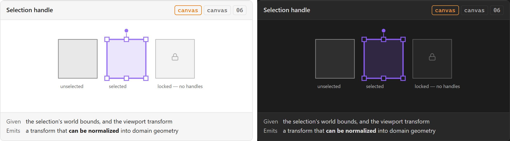

# Selection handle

**Design authority since 2026-09-05:** the editor package's `SelectionOverlay`
([component library](../user-experience/renovation-planner-editor-specs/components/component-library.md)) — outline, handles, dimensions and focus state for one entity,
emitting begin / preview / commit transform and request-dimension-edit — and
`MultiSelectionOverlay`'s stable numbered badges for several (M11). Its rule: direct manipulation
and numeric entry converge on the same command.

The drawn transform affordance on a selected spatial object — corners, edges, and a rotation
grip. Purely drawn: it has no DOM node, no CSS, and no accessible name of its own, which makes
it the clearest case in this inventory of a component that inherits none of the machinery a
control normally gets for free.

## Specimen

A drawing of the ORIGINAL proposal — the 2026-08 concept gallery — and not a screenshot of
anything built. That gallery is archived at
[`component-gallery.html`](../user-experience/archive/concepts/component-gallery.html) and no longer drives the app;
`npm run concept-shots` still regenerates these shots from it, as a record of what was proposed.
Obsidian's **default** light and dark, so a themed vault differs. What the shipped surface looks
like is `npm run harness-shot`'s to show, and what it is designed TOWARDS is the package component
named at the top of this note.

## Anatomy

- **On SDD §19's InteractionLayer**, which is transient-only. A handle is never persisted and is
  never part of the plan — it is drawn beside geometry, not into it.
- **Corner and edge handles** for resize, and a **rotation grip** where SDD §21's
  `snapRotation()` applies.
- **A bounding outline**, which is what [[Design System]]'s *Selected* state means on the canvas
  half: border weight plus handles, where a DOM control gets a checked mark.

## States

| State | Notes |
| --- | --- |
| Default | Present because something is selected |
| Hover | The cursor changes; on a canvas, the cursor is the DOM's one contribution |
| Dragging | A transform is in progress and not yet committed |
| Absent | Nothing selected, or the object is locked — see below |

**A locked object gets no handles at all.** That is [[Layer toggle]]'s decision surfacing here:
one toggle in the rail removes an affordance on the canvas, and *disabled handles* would be a
worse answer than none, because a drawn control that cannot be dragged has no cursor to say so.

## Contract

**Given** the selected object's bounds in world coordinates, plus the current viewport
transform. It needs both: bounds alone cannot be drawn, and the transform alone cannot be
positioned.

**Emits** a transform which **must be normalized into true domain geometry before it is
persisted**. SDD §20 is unusually direct about this: *do not persist `scaleX`/`scaleY` as true
dimensions.* A handle that emits Konva's scale factors has shipped a lie that every downstream
quantity then multiplies — a zone whose stored width is 1.0 and whose drawn width is 4.2 metres
will produce a requirement for the wrong amount of tile.

The normalisation is not this component's to perform; SDD §20's pipeline runs Konva transform,
normalize, domain geometry, command. What is this component's is emitting something that *can*
be normalized.

## Where it appears

[[Plan canvas]], InteractionLayer, whenever a selection exists.

## Accessibility

**A minimum handle size is a world-to-screen decision, not a CSS one.** A handle drawn 8 units
wide in world space is 8 screen pixels at one zoom and 2 at another; SDD §85's *adequate hit
targets* is a claim about the screen, so the size has to be computed against the viewport
transform on every redraw rather than declared once.

Nothing in this repository measures it. jsdom answers zero for every box, and axe has no rule
that reaches a canvas at all. `npm run test-build` is the only place a handle's size is checked.

## Open

1. **Is a handle keyboard-reachable?** SDD §85 requires keyboard-accessible controls, and a
   drawn handle has nothing to focus. Either the canvas grows a keyboard transform mode, or
   transform is [[Inspector]]-only for keyboard users — and those are different products, not
   two spellings of one.
2. **Whether rotation is in the MVP at all.** SDD §21 lists `snapRotation()`; PRD §39's tool list
   does not name a rotate tool, and the six initial tools in SDD §57 do not include one.

**Since 2026-09-05:** question 1 has the package's answer in principle — every canvas-only
affordance has a non-canvas route (its acceptance criterion), and the route for a transform is
`EditableDimensionLabel` and the Inspector, not a keyboard transform mode. Question 2 stands:
no package screen names rotation.

## Sources

SDD §19 · SDD §20 · SDD §21 · SDD §85, in
[`docs/development/sdds/obsidian-renovation-planner-SDD.md`](../development/sdds/obsidian-renovation-planner-SDD.md).
