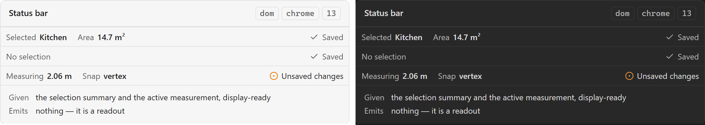

# Status bar

The bottom band: selection, measurements, save state — the three facts a renovator glances at
rather than goes looking for. A readout, not a control, and the surface two canvas components
depend on for the channel they cannot draw.

## Specimen

A drawing of the proposal, not a screenshot of anything built — `src/` is a scaffold.
Obsidian's **default** light and dark, so a themed vault differs; shot from
[`component-gallery.html`](../concepts/component-gallery.html) by `npm run concept-shots`.

## Anatomy

Three regions, in the order both received documents give (PRD §39 as *Status / Selection /
Measurements*, SDD §60 as *Status / Measurements / Save State*):

- **Selection** — what is selected, as a count or a name.
- **Measurements** — the live value from the Measure tool, and the readout
  [[Measurement label]] leans on.
- **Save state** — [[Save-state indicator]], which is its own component and its own note.

The two received orderings disagree about the middle. SDD §60 is the later document and names
save state explicitly, so its order is the one taken; that is a refinement recorded here rather
than a discrepancy smoothed over.

## States

| State | Notes |
| --- | --- |
| Default | Something selected, no measurement in flight |
| Empty selection | The commonest state, and not an [[Empty state]] — a bar with nothing to say stays a bar |
| Measuring | A live value, updating |

## Contract

**Given** the current selection summary and the active measurement. **Emits** nothing.

**It may not re-derive a number.** [[Information Architecture]]'s rule is that a fact is shown
where it is derived and referenced everywhere else, and a status bar that applies its own
rounding has quietly disagreed with the engine. Two business rules are reachable from this one
bar: [[Money is rounded once, where the pipeline finalizes it]] and
[[Internal precision and display precision are separate]].

The obligation this places on it is unusual for a readout: it must be handed display-ready
values, which means the component that derived them decided their precision.

## Where it appears

Plan editor mode, per [[Sitemap]] — and, more importantly, it is the **non-visual channel** for
[[Snap guide]] and the live half of [[Measurement label]]. Two canvas components have their
accessibility answer here, which is the strongest argument in the inventory for the bar existing
at all.

## Accessibility

A live region, and the trap is announcing **too much**. A status bar wired as one
`aria-live="polite"` container re-announces on every pointer move during a drag, which is noise
that a user turns the whole plugin off to escape.

The parts that change meaningfully get the live region; the parts that change continuously do
not. Which is which is a decision slice 13 has to make and this note cannot make for it — but
"the whole bar is live" is refused here rather than discovered later.

## Open

1. **Does the snap readout live here?** [[Snap guide]] records the same question. One of the two
   notes has to lose it, and the answer decides which.
2. **What the bar shows in project mode**, if it exists there at all. SDD §60 draws it inside the
   editor layout only, and [[The plan editor is a mode, not a second view]] makes that a mode
   rather than a view — so the bar's presence is now a per-mode question nothing has answered.

## Sources

PRD §39 · PRD §67 · SDD §60, in
[`docs/prds/obsidian-renovation-planner.md`](../prds/obsidian-renovation-planner.md) and
[`docs/sdds/obsidian-renovation-planner-SDD.md`](../sdds/obsidian-renovation-planner-SDD.md).
