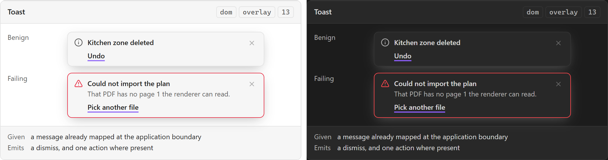

# Toast

**Design authority since 2026-09-05:** none of the three packages names a toast component,
which is itself the finding — a toast is Obsidian's `Notice` through slice 13's notice door, not
a component the plugin draws. What the editor package adds beside it is the PERSISTENT
counterpart, `PersistentWarningStrip` ([component library](../user-experience/renovation-planner-editor-specs/components/component-library.md)): a recoverable condition above
the canvas (M15, reference-plan warnings) with actions and a busy state, under the rule that
independent warnings must not suppress one another for sharing a region. A failure that needs to
outlive a timeout goes there, not here.

A transient message about something that **already happened**. Not a question, and not a failure
the user has to act on — those are [[Modal]]'s and [[Inline field error]]'s. The narrowest
definition available is the useful one here, because a toast is what every other surface's
failure gets routed to when nobody decided where it belonged.

## Specimen

A drawing of the ORIGINAL proposal — the 2026-08 concept gallery — and not a screenshot of
anything built. That gallery is archived at
[`component-gallery.html`](../user-experience/archive/concepts/component-gallery.html) and no longer drives the app;
`npm run concept-shots` still regenerates these shots from it, as a record of what was proposed.
Obsidian's **default** light and dark, so a themed vault differs. What the shipped surface looks
like is `npm run harness-shot`'s to show, and what it is designed TOWARDS is the package component
named at the top of this note.

## Anatomy

- **A message**, already translated and already user-facing.
- **Optionally one action** — undo, retry, reveal.
- **A dismiss**, always, and a timeout for the benign case.

## States

| State | Notes |
| --- | --- |
| Entering | Motion, and the one place this component has any |
| Present | Visible, counting down or waiting |
| Leaving | Dismissed, timed out, or superseded |

It has **no focus state and takes no focus**. A toast that steals focus interrupts the thing the
user was doing to tell them about the thing they already did.

Severity is a variant rather than a state, and each variant owes a mark as well as a colour —
[[Design System]]'s *Error* row applies to the failing one. **Met**, and it was not met when
slice 13 first shipped: see *Settled* below.

## Contract

**Given** a user-facing message that was already mapped at the application boundary. SDD §66 is
the pipeline: infrastructure exception, application error mapping, typed result, presentation,
user message. A toast that received an `Error` object and formatted it would be doing the
application layer's job in a view.

**Emits** a dismiss, and its action where one exists.

**It does not decide that it is the right surface.** That is slice 17's whole purpose — which of
SDD §64's eight categories becomes a toast, which an inline error, which a blocking modal, which
a persisted [[Status badge]]. A component that routed to itself would make that table
unenforceable.

## Where it appears

Any surface. `region: overlay` because it genuinely overlays rather than displacing content —
the distinction that separates it from [[Empty state]] and [[Status badge]], which are `in-flow`.

## Accessibility

`role="status"` for the benign, `role="alert"` for the failing, and **neither on a container that
appears**. A live region that is already in the DOM and gains a child announces reliably; one
that is inserted along with its content often does not. That is a mechanism detail, and it is the
one that decides whether this component works at all for the users it exists for.

The timeout is the other half: a message that disappears before it can be read is inaccessible in
a way no ARIA attribute fixes.

## Settled

**Obsidian's `Notice` is the container primitive.** Open question 1 was slice 13's to answer and
slice 13 answered it, so it is recorded here rather than left standing as a question the code has
already decided.

The argument that decided it is a division of labour rather than a preference. `Notice` already
offers four of the six things this component owes — manual dismiss (`hide()`), persist until
dismissed (`duration: 0`), real DOM to write severity markup and a dismiss control into
(`messageEl` / `containerEl`), and a message that can be replaced in place for a repeat count.
The last one is `messageEl` again rather than `setMessage`: this note cited that method before
the code existed, and the code went the other way, because the plugin's own markup — a severity
label, a message span and a dismiss button — has to survive the update, and `setMessage`
replaces the element's whole content. `notify.ts` writes `body.textContent` instead. It
offers neither hover-pause of the auto-dismiss timer nor a visible-slot cap with promotion, and
both fall out of one choice: every notice is constructed with `duration: 0` and the plugin owns
the timer. Both handles are `@since 1.8.7` and `manifest.json` declares `minAppVersion: 1.13.0`,
so neither is a bet. The alternative — a second Vue app with a plugin-global Pinia — would have
needed an exception to SDD §12 and given the plugin two toast surfaces instead of one.

**The consequence this note already predicted holds, and it is the price.** A `Notice` renders
outside the view's DOM, so it is outside `contentEl` — and `tests/harness/accessibility.test.ts`
scans `contentEl`. The surface carrying the most new ARIA in slice 13 is therefore the one
surface no axe scan reaches: the two live regions the plugin appends to `document.body` at
activation — outside a view twice over — and the dismiss control's accessible name, are
asserted by jsdom tests one attribute at a time and graded by no accessibility instrument.
Its markup also stays Obsidian's to change.

**Each variant carries a mark as well as a colour now, and it did not for a slice and a
half.** Slice 13 shipped `.rp-notice-severity` as an uppercase translated word plus a colour
and stopped — which satisfies SDD §85's status-not-colour-only rule, since a word is not a
colour, and does not satisfy the *Anatomy* sentence above, which asks for a mark as well.
The sibling contract [[Save-state indicator]] says why the stricter reading is the right one:
the coloured label works perfectly for the author who built it.

`.rp-notice-mark` is that mark — a disc for information, a tick for success, a triangle for a
warning, a cross for an error, each cut from one filled box with `clip-path` in
`styles/notices.css`. **No `setIcon`**, which this plugin has still never called: an icon call
would need the harness icon renderer that is deliberately absent, and an icon font would be a
second thing to theme. `currentColor` throughout, so each mark takes the colour rule its
severity already has and no colour literal appears — SDD §84's check, run over the assembled
sheet's parsed tree, refuses one.

It costs the accessible name nothing, which is the part worth stating rather than assuming:
the element is `aria-hidden` and carries no text, so the word remains the whole announcement
and the live-region text below is unchanged. **What no instrument here can settle is whether
the four silhouettes are told apart**, because the browser harness cannot draw a notice at all
— `tests/harness/obsidian.css` declares no `.notice` and no `.notice-container` rule, so there
is no chrome to draw one into and no capture to read by eye. `notify.test.ts` proves the
element exists, is hidden and carries no text, and that `styles/notices.css` declares a rule
the emitted class actually reaches — that last one being the defect class this repository has
shipped once already, on the sibling surface, where a selector was one word short of the
class the template emitted. The shapes themselves are step 12a of
`docs/tests/cases/Notices and save state.md`, and a vault is the only instrument.

**The Accessibility rule above is met the way it is written, and it took a review round to
get there.** Slice 13 first put `role`/`aria-live` on the `Notice` element itself, which is
the container that appears, refused in the sentence directly. `activateNotices()` creates two
empty regions instead — `role="status"`/`aria-live="polite"` and
`role="alert"`/`aria-live="assertive"` — and a notice announces by writing into the one its
severity names, so the region is in the document long before the message is. The notice
element carries neither attribute. The residual is that a region announces on a CHANGE, so an
identical message at the same severity re-raised after the first was dismissed writes the same
string and says nothing; a repeat while the first is still up differs by its `(×N)` suffix and
does announce.
`docs/tests/cases/Notices and save state.md` is where that gap is worked, and a vault is the
only instrument.

## Open

1. **Whether a toast may carry an undo.** SDD §30's undoable editor commands make it possible; PRD §67
   does not ask for it, and an undo that expires with a timeout is a promise with a clock on it.

## Sources

PRD §44 · PRD §67 · SDD §30 · SDD §64 · SDD §66, in
[`docs/product/prds/obsidian-renovation-planner.md`](../product/prds/obsidian-renovation-planner.md) and
[`docs/development/sdds/obsidian-renovation-planner-SDD.md`](../development/sdds/obsidian-renovation-planner-SDD.md).
