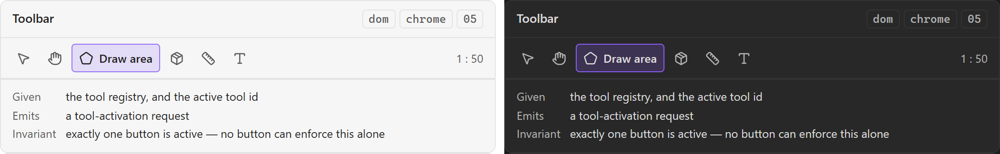

# Toolbar

**Design authority since 2026-09-05:** the editor package WITHDRAWS the permanent tool ribbon
this note describes. What replaces it, in
[its component library](../user-experience/renovation-planner-editor-specs/components/component-library.md): `EditorContextBar` (breadcrumbs, the `PerspectiveSwitch` for Plan /
Renovate / Review, Undo, Redo, View), `FloatingPrimaryActions` keeping Select and Add reachable
without a ribbon, and `CreationToolBar` shown only during a creation task. Select is the safe
default state and pan/zoom are gestures, not tools. Its reuse map refactors `EditorToolbar.vue`
into those three. Everything below about the six-button band is the archived proposal.

The horizontal band at the top of the plan editor holding the tool buttons. A **container**:
it owns which tools are present, their order, and which one is active — never what a tool
does. SDD §56 gives a tool `activate(context)`; the toolbar asks for that and does not perform
it.

## Specimen

A drawing of the ORIGINAL proposal — the 2026-08 concept gallery — and not a screenshot of
anything built. That gallery is archived at
[`component-gallery.html`](../user-experience/archive/concepts/component-gallery.html) and no longer drives the app;
`npm run concept-shots` still regenerates these shots from it, as a record of what was proposed.
Obsidian's **default** light and dark, so a themed vault differs. What the shipped surface looks
like is `npm run harness-shot`'s to show, and what it is designed TOWARDS is the package component
named at the top of this note.

## Anatomy

- **A horizontal group of [[Tool button]]s**, in the order both received documents give:
  Select, Pan, Draw Area, Place Asset, Measure, Annotate — PRD §39 as user-facing names,
  SDD §57 as the six initial classes (`SelectTool`, `PanTool`, `DrawPolygonTool`,
  `PlaceAssetTool`, `MeasureTool`, `AnnotationTool`).
- **Overflow, which is the toolbar's problem and not the button's.** SDD §61 optimises the MVP
  for Obsidian desktop, and a laptop pane is narrower than either diagram — a row of six
  buttons plus two rails plus a canvas is the density [[Design System]] says Obsidian's own
  spacing scale was never asked to solve.

## States

Default. It has no hover, focus or selected state of its own — each of those belongs to the
[[Tool button]] inside it.

What it does own is a single invariant: **exactly one button is active at a time.** That is the
toolbar's state and no button can enforce it alone, which is the reason this is a component
rather than a `
`.

## Contract

**Given** the tool registry and the id of the active tool. **Emits** a tool-activation request.

It does not activate the tool. SDD §57's six classes are constructed elsewhere and SDD §58
gives them their context; a toolbar that called `activate` directly would be a presentation
component reaching past the application layer.

## Where it appears

Plan editor mode only, per [[Sitemap]] — the project mode has no tools to hold. A future
surface that gains tools takes this component rather than drawing a second band.

## Accessibility

A toolbar is the **roving tabstop** pattern: one tab stop for the whole group, arrow keys
moving within it, and `role="toolbar"` naming it. Tabbing through six buttons to reach the
canvas is the alternative, and it is worse every single time.

Neither the roving tabstop nor the arrow-key handling is checked by anything here — axe reads
roles and names, not keyboard behaviour. `npm run test-build` is where it is verified.

## Open

1. **What happens at narrow widths** — a scroll, an overflow menu, or a second row. Undecided,
   and [[Design System]]'s open question 2 says why: deciding it from the diagram would be
   deciding it from a drawing the two received documents already disagree about.
2. **Whether the toolbar is the only home for a tool.** PRD §39 also asks for keyboard
   shortcuts, and a shortcut that activates a tool is a second input to one action — which
   `CLAUDE.md`'s *one action, every input* rule makes a wiring question, not a UI one.

**Since 2026-09-05:** question 1 is answered by M16 and the `CompactStatusBar` / `PanelRail`
pair — at constrained width the controls move into View and overlay panels, not into a second
row. Question 2 stands, and the package's `AddMenu` answers it the same way: activation delegates
to the one canonical tool or command entry point.

## Sources

PRD §39 · SDD §57 · SDD §60 · SDD §61, in
[`docs/product/prds/obsidian-renovation-planner.md`](../product/prds/obsidian-renovation-planner.md) and
[`docs/development/sdds/obsidian-renovation-planner-SDD.md`](../development/sdds/obsidian-renovation-planner-SDD.md).
