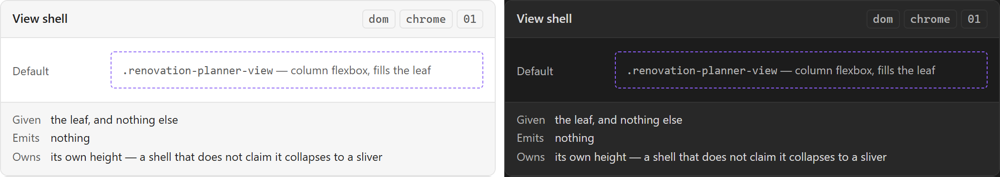

# View shell

The one element the workspace view draws: `.renovation-planner-view`, which is both the
stylesheet's only entry point into that view and the mount point the Vue app takes. It is not
a layout — it is the boundary between Obsidian's leaf and everything this plugin draws, and
the reason nothing outside the view knows the inside is Vue.

## Specimen

A drawing of the proposal, not a screenshot of anything built — `src/` is a scaffold.
Obsidian's **default** light and dark, so a themed vault differs; shot from
[`component-gallery.html`](../concepts/component-gallery.html) by `npm run concept-shots`.

## Anatomy

- **One root element**, carrying `.renovation-planner-view` and nothing else. A new surface
  takes one class the same way; a second entry class is a second answer to the same question.
- **A column flexbox filling the leaf** — `styles/view.css` says why: Obsidian's own pane
  supplies the height, and a column is what lets a future toolbar sit above a scrolling body
  without either one measuring the other.
- **Above it, Obsidian's chrome, which this component does not own.** The host nests
  `.workspace-leaf-content[data-type]` → `.view-header` + `.view-content` around every view.
  `styles/chrome.css` targets that nesting; restyling it is reaching outside the boundary.
- **Inside it, nothing yet.** SDD §60's [[Toolbar]], [[Left rail]], [[Plan canvas]],
  [[Inspector]] and [[Status bar]] are its children the day they exist.

## States

It has almost none of [[Design System]]'s ten — Default, and that is the honest list. What it
has instead is **modes**: [[The plan editor is a mode, not a second view]] makes the project
surface and the plan editor two modes of one view type, persisted through `getState()`.

A mode is not a state in the design-system sense and this note will not file it as one. A
state is a condition a control is in; a mode is which content the shell is showing.

## Contract

**Given** the leaf, and nothing else. **Emits** nothing.

Two obligations follow from being the entry point rather than a control:

- **It must claim its height.** A shell that does not fill the leaf collapses to a sliver of
  its pane — an actual defect in this repository, invisible to a suite that draws nothing and
  found only in the browser harness.
- **Every colour it declares comes from an Obsidian variable**, per SDD §84, so a themed vault
  stays themed. The build refuses a hard-coded colour in the partial; the variable it reads
  must be one something declares (`tests/harness/cssVars.test.ts`).

## Where it appears

The *Renovation Project* workspace view — registered today as `renovation-project`, per
[[Sitemap]], and one of only two surfaces `src/` actually has. It is the only registered
surface with a shell.

## Accessibility

`tests/harness/accessibility.test.ts` scans `contentEl`, which means it scans **inside** this
element. The landmark rules — `region`, `document-title`, `html-has-lang` — need whole-page
context and therefore cannot see the shell at all. Whether this element should be a landmark
is a question no check here can ask.

## Open

1. **Does the shell own the three-column grid, or does the plan-editor mode?** SDD §60 draws
   one layout; the shell also hosts a project mode that has no rails. Putting the grid here
   gives the project mode a layout it does not want.
2. **Whether the shell is a landmark.** Undecided, and unmeasurable here — see above.

## Sources

SDD §12 · SDD §60 · SDD §84, in
[`docs/sdds/obsidian-renovation-planner-SDD.md`](../sdds/obsidian-renovation-planner-SDD.md).
