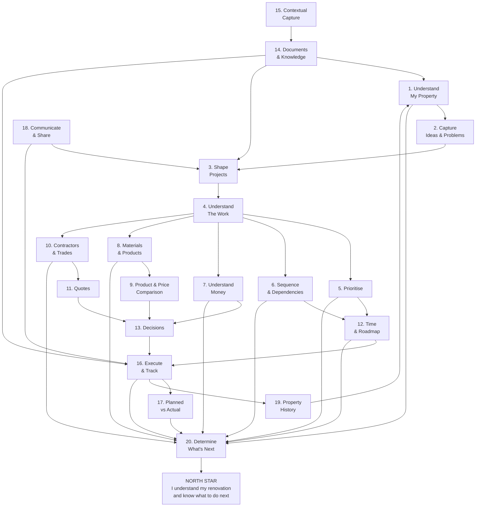
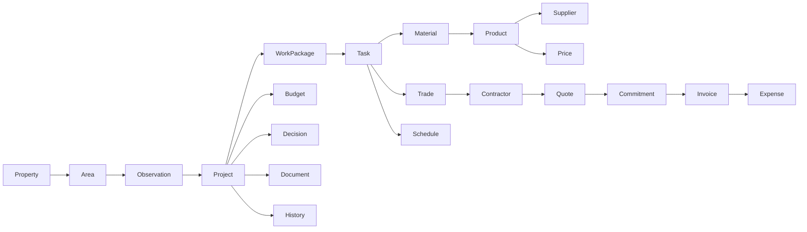
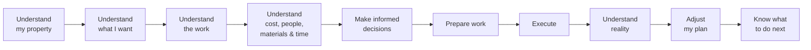

# Renovation Planner — Problem → User Need → Product Capability Map

## 1. Purpose

> **Design amendment — 2026-09-05.** The screens this map deliberately did not define now
> exist, as three design packages under [`docs/user-experience/`](../user-experience/): the
> editor (M00–M17), the project overview and details (P00–P07) and the asset library
> (AL00–AL11). §34's recommended next step — an experience layer over these capabilities — is
> what they are. One capability they refuse: **§29's readiness percentage.** The project package
> rules that domain project status is not calculated completion and that guidance is neither a
> wizard nor a checklist, so *Planning readiness: 58%* is not a surface. §29's IDEA survives as
> the editor's Review perspective (M17), which lists what is unresolved rather than scoring it.
> Where §29 and M17 disagree, M17 is the design.

This map translates the Renovation Planner problem space into product capabilities without prematurely defining screens, workflows, or technical implementation.

It connects:

**Problem → User Need → Desired Outcome → Product Capability → North-Star Contribution**

The product North Star is:

> **I understand my renovation and know what to do next.**

Every major capability should contribute to this outcome.

---

# 2. Product Model

Renovation is not a linear process. The homeowner continuously learns new things, makes decisions, encounters constraints, and adjusts the plan.

The product should therefore support the following loop:

**Observe → Understand → Plan → Decide → Execute → Document → Learn → Re-plan**

Examples of events that may change the plan:

- opening a wall reveals damage
    
- a contractor provides a higher estimate
    
- a material becomes unavailable
    
- measurements turn out to be wrong
    
- another project becomes more urgent
    
- budget becomes available or constrained
    
- additional work is discovered
    

The Renovation Planner should therefore support **progressive planning rather than complete upfront planning**.

A user should be able to start with:

> “I want to renovate the bathroom.”

and gradually arrive at:

> “I know what needs to happen, in what order, what I can do myself, who I need, what materials I need, what it will cost, and what I should do next.”

---

# 3. Capability Map



The most important capability is therefore not task management itself.

It is **Capability 20: Determine What's Next**.

All other capabilities provide the context required to make that recommendation understandable and useful.

---

# 4. Capability 1 — Understand My Property

## Problem

The homeowner starts with a physical property but has no structured representation of it.

Information about the house, garden, rooms, installations and current condition exists primarily in the physical world.

## User Need

> When I start thinking about renovation, help me build an understandable representation of my property so that everything else can be connected to the correct place.

## Desired Outcome

The homeowner can answer:

- What belongs to my property?
    
- Which areas exist?
    
- How are they related?
    
- What is currently there?
    
- What condition is it in?
    
- What dimensions do I know?
    
- What information do I already have?
    

## Product Capabilities

Support a spatial/property hierarchy such as:

```text
Property
├── House
│   ├── Ground Floor
│   │   ├── Kitchen
│   │   ├── Living Room
│   │   └── Bathroom
│   ├── First Floor
│   └── Basement
├── Garden
│   ├── Front Garden
│   └── Back Garden
├── Terrace
├── Garage
└── Shed
```

Property elements can contain:

- photos
    
- notes
    
- measurements
    
- dimensions
    
- plans
    
- sketches
    
- existing materials
    
- installed products
    
- equipment
    
- condition
    
- defects
    
- documents
    

## North-Star Contribution

> **I understand what I have.**

---

# 5. Capability 2 — Capture Ideas, Problems and Wishes

## Problem

Renovation usually starts with observations rather than projects.

Examples:

- “These tiles are cracked.”
    
- “We need more storage.”
    
- “I dislike this room.”
    
- “The terrace should be larger.”
    
- “Maybe we should insulate this wall.”
    
- “I like this kitchen design.”
    

Forcing these thoughts immediately into formal projects creates unnecessary friction.

## User Need

> When I notice something about my property, let me capture it without requiring me to know the solution yet.

## Desired Outcome

The homeowner builds an inventory of renovation opportunities.

## Product Capabilities

Capture:

- idea
    
- wish
    
- problem
    
- defect
    
- concern
    
- inspiration
    
- photo
    
- note
    
- measurement
    
- reference
    
- product idea
    

Each observation may optionally reference a property location.

Example:

```text
Bathroom

Problem:
Tiles are cracked near the shower.

Photo:
IMG_2842.jpg

Possible Idea:
Replace the complete floor.

State:
Needs investigation
```

## North-Star Contribution

> **I understand what I might want or need to change.**

---

# 6. Capability 3 — Shape Renovation Projects

## Problem

An intention such as:

> “Renovate the bathroom”

is too vague to execute.

## User Need

> When I decide to act on an idea or problem, help me transform it into a renovation project I can understand and manage.

## Desired Outcome

The homeowner understands:

- why the project exists
    
- what should change
    
- what success looks like
    
- which areas are affected
    
- what is included
    
- what is excluded
    
- approximate cost
    
- approximate effort
    
- priority
    
- dependencies
    

## Product Capabilities

Support:

**Observation / Idea → Renovation Project**

A project may progressively contain:

```text
Bathroom Renovation

Goal:
Modernise the bathroom.

Affected Area:
House / Ground Floor / Bathroom

Desired Outcome:
Walk-in shower, new tiles and new fixtures.

Initial Budget:
€12,000

Desired Period:
Spring 2027

Status:
Exploring
```

Incomplete projects must remain valid.

The system should help the homeowner progressively enrich them.

## North-Star Contribution

> **I understand what I am trying to achieve.**

---

# 7. Capability 4 — Understand the Work

## Problem

The inexperienced homeowner does not know what work may be hidden behind a renovation objective.

## User Need

> When I plan a renovation, help me discover what work may be required so that I don't overlook important activities.

## Desired Outcome

Large renovation goals become understandable pieces of work.

## Product Capabilities

Support decomposition:

```text
Project
    ↓
Work Package
    ↓
Task
```

Example:

```text
Bathroom Renovation
├── Preparation
├── Demolition
├── Plumbing
├── Electrical
├── Wall Preparation
├── Waterproofing
├── Tiling
├── Fixtures
├── Painting
└── Finalisation
```

Work can additionally be classified as:

- DIY
    
- professional
    
- undecided
    

Relevant trades may be associated with work:

- electrician
    
- plumber
    
- carpenter
    
- tiler
    
- painter
    
- roofer
    
- landscaper
    
- etc.
    

The system should eventually be able to help identify:

- commonly forgotten work
    
- typical work packages
    
- likely trades
    
- typical dependencies
    
- materials that may be required
    
- unresolved questions
    

## North-Star Contribution

> **I understand what needs to be done.**

---

# 8. Capability 5 — Prioritise

## Problem

The homeowner usually has more renovation ideas than available money, time and capacity.

## User Need

> When many improvements compete for my attention, help me decide what should happen first.

## Desired Outcome

The homeowner develops a rational property renovation roadmap.

## Product Capabilities

Allow projects and problems to be evaluated against dimensions such as:

- urgency
    
- safety
    
- damage prevention
    
- dependency
    
- cost
    
- budget availability
    
- effort
    
- comfort
    
- aesthetics
    
- energy efficiency
    
- value
    
- seasonality
    

Example:

```text
Roof Repair

Priority:
Critical

Reason:
Potential water ingress.

Dependency:
Should be completed before upstairs bedroom renovation.
```

## North-Star Contribution

> **I understand what matters most.**

---

# 9. Capability 6 — Dependencies and Sequence

## Problem

Renovation work has physical and logical dependencies.

Executing work in the wrong sequence can create delays, damage and rework.

## User Need

> When several activities interact, help me understand what must happen before something else can begin.

## Desired Outcome

The homeowner understands the logical construction sequence.

## Product Capabilities

Represent:

- predecessor
    
- successor
    
- blocker
    
- dependency
    
- parallel work
    
- milestone
    

Example:

```text
Demolition
   ↓
Plumbing
   ↓
Electrical
   ↓
Close Walls
   ↓
Waterproofing
   ↓
Tiling
   ↓
Fixtures
```

Dependencies should be possible between:

- tasks
    
- work packages
    
- projects
    

## North-Star Contribution

> **I understand in which order things need to happen.**

---

# 10. Capability 7 — Understand and Manage Money

## Problem

The homeowner has difficulty translating renovation ideas into financial consequences.

## User Need

> When I plan renovation work, help me understand what it might cost, what I can afford and what I have already committed.

## Desired Outcome

The homeowner can answer:

- What is my overall renovation budget?
    
- What can I realistically afford?
    
- What does this project probably cost?
    
- What have I budgeted?
    
- What have I committed?
    
- What have I already spent?
    
- How much remains?
    

## Product Capabilities

Support a cost lifecycle:

```text
Estimate
   ↓
Budget
   ↓
Quote
   ↓
Commitment
   ↓
Invoice
   ↓
Payment
   ↓
Actual Cost
```

Support cost categories:

- labour
    
- materials
    
- equipment
    
- transport
    
- delivery
    
- waste/disposal
    
- permits
    
- professional services
    
- contingency
    
- other
    

Allow budgeting at different scopes:

```text
Property Budget
    ↓
Project Budget
    ↓
Work Package Budget
    ↓
Task / Item Cost
```

Always preserve the distinction between:

**Expected Cost** and **Actual Cost**.

## North-Star Contribution

> **I understand what my renovation costs and what I can afford.**

---

# 11. Capability 8 — Materials and Products

## Problem

A renovation requires many materials and products that must be identified, quantified, selected, purchased and available at the correct time.

## User Need

> When work requires materials or products, help me understand what I need and track it until it is available.

## Desired Outcome

The homeowner knows:

- what is needed
    
- how much is needed
    
- why it is needed
    
- where it will be used
    
- which product has been selected
    
- where it can be purchased
    
- what it costs
    
- whether it has been ordered
    
- whether it has arrived
    

## Product Capabilities

Connect material requirements to:

- project
    
- area
    
- work package
    
- task
    

Support a procurement lifecycle:

```text
Needed
   ↓
Researching
   ↓
Candidates
   ↓
Compared
   ↓
Selected
   ↓
Planned Purchase
   ↓
Ordered
   ↓
Delivered
   ↓
Used
```

Support:

- quantity
    
- unit
    
- dimensions
    
- coverage
    
- waste allowance
    
- package size
    
- required quantity
    
- purchased quantity
    

## North-Star Contribution

> **I understand what I need to buy.**

---

# 12. Capability 9 — Compare Products and Prices

## Problem

Product research becomes fragmented across browser tabs, screenshots, bookmarks and notes.

## User Need

> When multiple products could satisfy the same need, help me compare them and preserve why I selected one.

## Desired Outcome

Purchasing decisions become understandable and traceable.

## Product Capabilities

Compare:

- product
    
- manufacturer
    
- supplier
    
- price
    
- unit price
    
- delivery cost
    
- availability
    
- quantity
    
- specifications
    
- quality
    
- lead time
    
- warranty
    

Preserve decisions:

```text
Requirement:
Bathroom Floor Tile

Selected:
Tile A

Alternatives:
Tile B
Tile C

Reason:
Similar appearance,
€14/m² cheaper,
available immediately.
```

## North-Star Contribution

> **I understand my purchasing decisions.**

---

# 13. Capability 10 — Contractors and Trades

## Problem

The homeowner becomes the coordinator of multiple independent professionals.

## User Need

> When professional work is required, help me organise who could do it, who I contacted and who is responsible.

## Desired Outcome

The homeowner knows:

- which trade is required
    
- which contractors are candidates
    
- who has been contacted
    
- who provided a quote
    
- who was selected
    
- what they should do
    
- when they are expected
    

## Product Capabilities

Maintain contractor information such as:

```text
Company
Contact Person
Trade
Phone
Email
Website
Notes
Experience
```

Connect contractors to:

- projects
    
- work packages
    
- tasks
    
- quotes
    
- appointments
    
- invoices
    
- payments
    
- documents
    

Possible contractor lifecycle:

```text
Candidate
   ↓
Contacted
   ↓
Site Visit
   ↓
Quote Requested
   ↓
Quote Received
   ↓
Selected / Rejected
   ↓
Scheduled
   ↓
Work In Progress
   ↓
Completed
```

## North-Star Contribution

> **I understand who I need and who is responsible.**

---

# 14. Capability 11 — Quote Management

## Problem

Contractor quotes are difficult to compare because they often contain different scopes, assumptions and exclusions.

## User Need

> When contractors provide offers, help me understand exactly what they are offering and how the quotes differ.

## Desired Outcome

The homeowner can make an informed purchasing decision rather than simply selecting the lowest total price.

## Product Capabilities

Capture:

- contractor
    
- scope
    
- work items
    
- labour
    
- materials
    
- quantities
    
- assumptions
    
- exclusions
    
- total price
    
- taxes
    
- payment terms
    
- schedule
    
- validity
    
- warranty
    

Connect accepted quotes to:

- project budget
    
- contractor
    
- work packages
    
- committed cost
    
- future invoices
    

## North-Star Contribution

> **I understand what I am buying and what I am committing to.**

---

# 15. Capability 12 — Time and Renovation Roadmap

## Problem

First-time renovators have difficulty turning work into a realistic schedule.

## User Need

> When planning work, help me understand approximately when things can happen and what affects the timeline.

## Desired Outcome

The homeowner understands both the long-term renovation roadmap and near-term schedule.

## Product Capabilities

Support:

- rough duration
    
- target periods
    
- earliest start
    
- target completion
    
- milestones
    
- contractor availability
    
- material lead time
    
- dependencies
    
- seasonal constraints
    

Planning should support progressive detail.

Early:

```text
2027

Spring
└── Bathroom

Summer
├── Terrace
└── Garden

Autumn
└── Living Room
```

Later:

```text
Bathroom Renovation
12 March → 16 April
```

## North-Star Contribution

> **I understand when things should happen.**

---

# 16. Capability 13 — Decisions

## Problem

A renovation produces hundreds of decisions.

Months later, the homeowner may remember what was chosen but not why.

## User Need

> When I make an important renovation decision, help me preserve the alternatives, reasoning and impact.

## Desired Outcome

Decisions become part of the project's knowledge rather than disappearing into memory or conversation.

## Product Capabilities

Capture:

```text
Decision:
Use porcelain floor tiles.

Alternatives:
Natural stone
Ceramic

Reason:
Lower maintenance and lower cost.

Budget Impact:
-€600

Date:
18 January 2027
```

Connect decisions to:

- projects
    
- areas
    
- work
    
- materials
    
- products
    
- contractors
    
- quotes
    
- budget
    

## North-Star Contribution

> **I understand why my renovation looks the way it does.**

---

# 17. Capability 14 — Documents and Knowledge

## Problem

Renovation information becomes fragmented across digital and physical locations.

## User Need

> When information accumulates, help me keep it connected to its renovation context.

## Desired Outcome

The homeowner searches by property or project context rather than remembering where a file was stored.

## Product Capabilities

Manage:

- photos
    
- floor plans
    
- sketches
    
- quotes
    
- invoices
    
- receipts
    
- contracts
    
- manuals
    
- warranties
    
- permits
    
- product sheets
    
- inspection reports
    
- correspondence
    

Documents may be associated with:

```text
Property
Area
Project
Work Package
Task
Material
Product
Contractor
Quote
Expense
Decision
```

## North-Star Contribution

> **I know where the information about my renovation is.**

---

# 18. Capability 15 — Contextual Capture

## Problem

Important renovation information often appears away from a desk.

The homeowner may be:

- standing in a room
    
- inspecting damage
    
- talking to a contractor
    
- visiting a hardware store
    
- walking through the garden
    

## User Need

> When I discover something, let me capture it immediately and organise it later.

## Desired Outcome

Important information is recorded when it appears.

## Product Capabilities

Quickly capture:

- photo
    
- note
    
- voice note
    
- measurement
    
- task
    
- idea
    
- defect
    
- expense
    
- receipt
    
- product
    
- contractor
    
- document
    

The system should favour:

**Capture first → organise later.**

## North-Star Contribution

> **I don't lose important information.**

---

# 19. Capability 16 — Execute and Track

## Problem

Once work begins, the homeowner needs to maintain situational awareness across many parallel activities.

## User Need

> When renovation work starts, help me understand what is happening, what is finished, what is blocked and what remains.

## Desired Outcome

The homeowner retains control during execution.

## Product Capabilities

Track work states such as:

```text
Planned
Ready
In Progress
Blocked
Completed
Cancelled
```

Capture:

- completed work
    
- blockers
    
- issues
    
- newly discovered work
    
- delays
    
- changes
    
- follow-up work
    

## North-Star Contribution

> **I understand where I currently am.**

---

# 20. Capability 17 — Planned vs. Actual

## Problem

Renovation rarely follows the original assumptions exactly.

Replacing original estimates with actual values destroys useful information.

## User Need

> When reality differs from my plan, help me understand what changed and what consequences it has.

## Desired Outcome

The homeowner can learn from deviations and adjust future plans.

## Product Capabilities

Preserve comparisons such as:

```text
Planned Cost      ↔ Actual Cost
Planned Duration  ↔ Actual Duration
Planned Start     ↔ Actual Start
Planned Material  ↔ Used Material
Planned Work      ↔ Actual Work
Planned Contractor ↔ Actual Contractor
```

Record reasons for relevant deviations.

Example:

```text
Original Estimate:
€4,500

Actual:
€6,200

Difference:
+€1,700

Reason:
Water damage discovered after demolition.
```

## North-Star Contribution

> **I understand what changed and what that means for my plan.**

---

# 21. Capability 18 — Communicate and Share

## Problem

Renovation plans need to be understood by people other than the homeowner.

## User Need

> When I discuss a renovation with someone else, help me communicate the relevant plan and context clearly.

## Desired Outcome

Partners, family members and contractors can understand the intended result without requiring the homeowner to reconstruct everything manually.

## Product Capabilities

Prepare context around:

- project objective
    
- affected area
    
- photos
    
- dimensions
    
- sketches
    
- desired result
    
- work scope
    
- materials
    
- open questions
    
- budget
    
- schedule
    

Possible use cases include:

- showing a project to a partner
    
- preparing a contractor site visit
    
- requesting a quote
    
- explaining planned work to friends helping with DIY
    
- discussing options with an architect
    

## North-Star Contribution

> **Other people understand what I am trying to achieve.**

---

# 22. Capability 19 — Property History

## Problem

After renovation work is completed, valuable information is often forgotten or lost.

Years later, homeowners may need to know:

- what was installed
    
- when it was installed
    
- who installed it
    
- what it cost
    
- which product was used
    
- where the warranty is
    

## User Need

> When I need information about my property later, help me understand what has changed over time.

## Desired Outcome

Renovation Planner becomes a long-term knowledge base for the property.

## Product Capabilities

Build a history of:

```text
Property
  ↓
Change
  ↓
Project
  ↓
Work Performed
  ↓
Products / Materials
  ↓
Contractor
  ↓
Cost
  ↓
Documents
  ↓
Completion Date
```

Example:

```text
Bathroom

Renovated:
April 2027

Contractor:
Example Plumbing GmbH

Floor:
ABC Porcelain Tile 60×60

Paint:
Example White 02

Total Cost:
€13,420

Documents:
Invoice
Warranty
Product Manual
Photos
```

## North-Star Contribution

> **I understand what has happened to my property over time.**

---

# 23. Capability 20 — Determine What's Next

This is the central capability of Renovation Planner.

## Problem

Even when the homeowner has captured projects, tasks, costs, materials and contractors, they may still face the question:

> **What should I actually do now?**

Generic project-management software usually stores information but leaves interpretation to the user.

For an inexperienced renovator, interpretation is precisely the difficult part.

## User Need

> When I open my renovation plan, help me understand the most useful actions I can take next.

## Desired Outcome

The homeowner leaves every planning session knowing how to make progress.

## Inputs

The system can derive useful next actions from:

- project priority
    
- unresolved questions
    
- dependencies
    
- blockers
    
- available budget
    
- contractor status
    
- missing quotes
    
- missing materials
    
- procurement lead times
    
- planned dates
    
- project readiness
    
- incomplete planning information
    
- outstanding decisions
    

## Example

Instead of showing only:

```text
Bathroom Renovation
Status: Planning
```

the system could communicate:

```text
Bathroom Renovation

You cannot schedule construction yet.

Next useful actions:

1. Measure the bathroom.
2. Decide whether the shower location will change.
3. Request plumbing quotes.
4. Estimate tile requirements.

Why?

The plumbing scope must be understood before the
budget and construction sequence can be finalised.
```

Or:

```text
Terrace Renovation

Ready to proceed.

Next:
Order decking material.

Why now?

Construction starts in 18 days and the selected
material currently has a 10–14 day lead time.
```

This capability transforms the product from a passive database into an **active renovation planning companion**.

## North-Star Contribution

> **I know what to do next.**

---

# 24. Cross-Capability Information Model

The capability map implies a connected renovation knowledge model.



The important principle is that these should not become isolated modules.

They describe **different perspectives on the same renovation**.

A receipt, for example, may simultaneously relate to:

- a product
    
- a supplier
    
- an expense
    
- a project
    
- a room
    
- a budget
    
- a completed task
    

The power of the system comes from those relationships.

---

# 25. Progressive Planning Model

The product should recognise different levels of certainty.

A project should not need complete information before it can exist.

## Level 1 — Idea

> “We should redo the terrace.”

Known:

- location
    
- rough intention
    

---

## Level 2 — Explore

> “We want a larger wooden terrace.”

Known:

- desired outcome
    
- initial photos
    
- dimensions
    
- possible approach
    

Unknown:

- exact material
    
- cost
    
- contractor
    

---

## Level 3 — Plan

Known:

- scope
    
- work packages
    
- material candidates
    
- cost estimate
    
- dependencies
    
- DIY vs professional work
    

---

## Level 4 — Prepare

Known:

- selected materials
    
- selected contractors
    
- accepted quotes
    
- required purchases
    
- planned dates
    

---

## Level 5 — Execute

Track:

- work
    
- issues
    
- expenses
    
- changes
    
- progress
    

---

## Level 6 — Complete

Capture:

- actual cost
    
- actual materials
    
- actual contractors
    
- completion documentation
    
- warranties
    
- final photos
    

---

## Level 7 — Property History

The project becomes part of the permanent property record.

---

# 26. Capability Maturity Model

The same progressive approach should apply to the product itself.

Not every capability needs to be sophisticated initially.

|Capability|Basic|Intermediate|Advanced|
|---|---|---|---|
|Property|Areas & rooms|Measurements & assets|Rich property model|
|Projects|Goal & status|Scope & phases|Guided planning|
|Work|Tasks|Work packages|Suggested work breakdown|
|Budget|Estimated cost|Budget vs actual|Forecasting|
|Materials|Shopping list|Quantity planning|Procurement planning|
|Products|Product links|Comparison|Price history|
|Contractors|Contact list|Quote tracking|Procurement workflow|
|Quotes|Attach documents|Structured comparison|Scope comparison|
|Schedule|Target date|Dependencies|Dynamic roadmap|
|Documents|Attach files|Contextual organisation|Property archive|
|Progress|Task status|Issues & blockers|Predictive next actions|
|Guidance|Static guidance|Context-aware prompts|Intelligent planning assistance|

This allows the product to grow without requiring a complex first release.

---

# 27. Capability Clusters

The twenty capabilities can be grouped into six larger product domains.

## A. Property

Contains:

- Understand My Property
    
- Capture Ideas & Problems
    
- Property History
    

Question answered:

> **What do I have and what do I want to change?**

---

## B. Planning

Contains:

- Shape Projects
    
- Understand the Work
    
- Prioritise
    
- Dependencies
    
- Time
    

Question answered:

> **What should happen and in what order?**

---

## C. Money & Procurement

Contains:

- Budget
    
- Materials
    
- Products
    
- Price Comparison
    
- Quotes
    

Question answered:

> **What do I need and what will it cost?**

---

## D. People

Contains:

- Trades
    
- Contractors
    
- Contractor Quotes
    

Question answered:

> **Who do I need to make this happen?**

---

## E. Execution & Knowledge

Contains:

- Documents
    
- Contextual Capture
    
- Execution Tracking
    
- Planned vs Actual
    
- Decisions
    

Question answered:

> **What is happening and what have I learned?**

---

## F. Guidance

Contains:

- Communication
    
- Readiness
    
- Next Actions
    

Question answered:

> **What should I do now?**

---

# 28. Product Hierarchy

A useful initial conceptual hierarchy therefore becomes:

```text
Property
│
├── Areas
│   ├── Rooms
│   ├── Garden Areas
│   ├── Buildings
│   └── Outdoor Areas
│
├── Observations
│   ├── Problems
│   ├── Ideas
│   └── Wishes
│
└── Renovation Projects
    │
    ├── Work Packages
    │   └── Tasks
    │
    ├── Materials
    │   └── Products
    │
    ├── Contractors
    │   └── Quotes
    │
    ├── Budget
    │   └── Expenses
    │
    ├── Schedule
    │
    ├── Decisions
    │
    └── Documents
```

This is a conceptual model, not yet a technical data model.

---

# 29. The Renovation Readiness Concept

The capability map suggests another important concept:

> **A project should have a visible level of readiness.**

The question should not simply be whether a project is "planned."

Instead, Renovation Planner could evaluate areas such as:

```text
Scope           ✓
Measurements    ✓
Work Breakdown  ✓
Dependencies    ⚠
Budget          ✓
Materials       ⚠
Contractors     ✕
Quotes          ✕
Schedule        ✕
```

Result:

> **Planning readiness: 58%**

More importantly:

> **Recommended next step: request plumbing quotes.**

This directly connects planning completeness to the North Star.

---

# 30. North-Star Capability Chain

The overall product logic can now be expressed as:



Everything ultimately leads toward:

> **I understand my renovation and know what to do next.**

---

# 31. Product Boundary

The capability map also clarifies what Renovation Planner is **not** primarily trying to become.

It is not fundamentally:

- a generic task manager
    
- professional BIM software
    
- CAD software
    
- contractor ERP software
    
- accounting software
    
- procurement software
    
- professional construction scheduling software
    
- a generic document management system
    

Those capabilities may appear in lightweight form where they serve the homeowner's renovation journey.

The product remains centred on one problem:

> **Helping an inexperienced homeowner progressively understand, plan and execute the renovation of their property.**

---

# 32. Core Product Promise

The product promise can now be expressed as:

> **Start with your property and an idea. Renovation Planner helps you progressively figure out what needs to be done, what it will cost, what you need, who you need, when it should happen, and what you should do next.**

---

# 33. North-Star Test

Every future feature should be challenged with:

> **Does this help the homeowner understand their renovation or know what to do next?**

If neither is true, the feature should require strong justification.

This provides a practical prioritisation filter for the product backlog.

---

# 34. Recommended Next Product Step

The capability map is intentionally broader than an MVP.

The next refinement should classify each capability into:

**Core Loop / Supporting / Later / Out of Scope**

and identify the smallest end-to-end product experience that delivers the North-Star outcome.

A likely first loop is:

```text
Create Property
    ↓
Capture Area
    ↓
Capture Renovation Idea
    ↓
Create Project
    ↓
Break Down Work
    ↓
Estimate Cost
    ↓
Identify Next Action
    ↓
Complete / Update
    ↓
Re-evaluate Next Action
```

This would give Renovation Planner a coherent first product experience rather than a collection of independent management features.