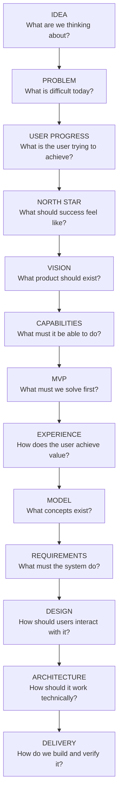

# Product Discovery → Product Vision → Product Definition Playbook

## 1. Purpose

This playbook defines a repeatable process for turning an early product idea into a structured, evidence-based product definition.

It is designed for situations where you start with:

- a rough product idea
    
- a known user problem
    
- a business opportunity
    
- an existing product that needs repositioning
    
- a collection of requested features
    
- a vague concept that needs structure
    

The process deliberately avoids jumping directly from idea to PRD.

Instead, it progresses through:

**Problem → User → Outcomes → North Star → Product Vision → Capabilities → Scope → Experience → Requirements → Architecture → Delivery**

The goal is to make sure the product is solving the right problem before committing to a specific solution.

---

# 2. Core Principle

> **Do not begin by asking what to build. Begin by understanding what the user is trying to achieve and why that is difficult today.**

A weak product definition often starts like this:

> We need a dashboard, task management, notifications, collaboration and AI.

A stronger product definition starts like this:

> This user is trying to achieve this outcome, but currently struggles because of these problems and constraints.

Capabilities and features should emerge from that understanding.

---

# 3. End-to-End Product Definition Flow


Each step narrows uncertainty.

---

# 4. Phase 0 — Capture the Raw Product Idea

## Goal

Document the original product idea without trying to make it perfect.

## Input

Anything from:

- founder idea
    
- customer request
    
- internal pain point
    
- competitor observation
    
- market opportunity
    
- technical opportunity
    
- feature request
    
- strategic initiative
    

## Questions

Capture:

- What triggered the idea?
    
- Who seems to have the problem?
    
- What are they trying to achieve?
    
- What appears difficult today?
    
- What solution are we currently imagining?
    
- Which assumptions are we already making?
    

## Important Rule

Separate:

**Observed problem**

from:

**Proposed solution**

Example:

Bad:

> Users need a kanban board.

Better:

> Users struggle to understand the current state and priority of work spread across multiple sources.

The kanban board is one possible solution.

## Artifact

**Product Opportunity Note**

Suggested sections:

```markdown
# Product Opportunity

## Trigger

## Suspected User

## Suspected Problem

## Desired Outcome

## Current Workarounds

## Initial Solution Ideas

## Assumptions

## Open Questions
```

---

# 5. Phase 1 — Problem Discovery

## Goal

Expand the initial idea into the broader problem space.

Do not yet define the product.

## Core Question

> **What is genuinely difficult for the user?**

## Investigate

Look for:

- user goals
    
- current behaviour
    
- workarounds
    
- frustrations
    
- uncertainties
    
- information gaps
    
- coordination problems
    
- economic consequences
    
- emotional consequences
    
- risk
    
- frequency
    
- context
    
- dependencies
    

## Useful Sources

Depending on the product:

- user interviews
    
- observation
    
- support requests
    
- app reviews
    
- Reddit/forums
    
- competitor reviews
    
- product communities
    
- search behaviour
    
- existing workflow analysis
    
- sales conversations
    
- internal domain experts
    
- analytics
    

## Problem Expansion Technique

Start from a simple statement:

> “User wants to do X.”

Then repeatedly ask:

> What makes X difficult?

Example:

```text
I want to renovate my bathroom.
    ↓
I don't know what work is involved.
    ↓
I don't know which trades are needed.
    ↓
I cannot estimate the cost.
    ↓
I don't know whether I can afford it.
    ↓
I hesitate to start.
```

This reveals the real problem structure.

## Output

A list of problem areas.

---

# 6. Phase 2 — Write the Problem Definition

## Goal

Create a coherent description of the user's reality before introducing the product.

## Recommended Structure

### Context

What situation is the user in?

### Primary User

Who experiences the problem?

### Core Problem

What prevents them from achieving the desired outcome?

### Problem Areas

Break the problem down into meaningful dimensions.

Typical dimensions include:

- understanding
    
- planning
    
- coordination
    
- information
    
- decision-making
    
- cost
    
- time
    
- people
    
- workflow
    
- documentation
    
- execution
    
- learning
    

### Consequences

Describe what happens when the problem remains unsolved.

Include:

- practical consequences
    
- financial consequences
    
- time consequences
    
- quality consequences
    
- emotional consequences
    

## Primary Problem Statement Template

> **[User] needs to [desired outcome], but currently struggles because [core causes]. Information/work is fragmented across [current environment], making it difficult to [important decisions/outcomes].**

## Test

The problem definition should still make sense if the proposed product did not exist.

If it contains screens, modules or features, it is probably too solution-oriented.

## Artifact

**Problem Definition**

---

# 7. Phase 3 — Derive Jobs to Be Done

## Goal

Translate the problem into user progress.

## Primary JTBD Template

> **When [situation], help me [motivation/action], so that [desired outcome].**

Example:

> When I want to improve my property but don't know where to begin, help me turn my ideas into manageable projects so that I can make progress confidently.

## Supporting Jobs

Create separate jobs for meaningful user outcomes.

Typical categories:

### Functional Jobs

What must the user accomplish?

### Decision Jobs

What must they decide?

### Information Jobs

What must they understand?

### Coordination Jobs

Who or what must they organise?

### Emotional Jobs

How do they want to feel?

### Social Jobs

How do they need to communicate or appear to others?

## Rule

JTBD should describe progress, not features.

Bad:

> When planning, let me use a calendar.

Better:

> When several activities depend on each other, help me understand when each activity should happen.

## Artifact

**JTBD Map**

---

# 8. Phase 4 — Define the North Star

## Goal

Identify the single user experience the product should continually create.

The North Star should be a **user state**, not a business KPI.

## Good North Star Characteristics

It should be:

- user-centred
    
- memorable
    
- outcome-oriented
    
- broad enough to survive feature changes
    
- specific enough to guide prioritisation
    

## Formula

> **I [understand/can/do/feel] X and [can achieve] Y.**

Examples:

> I understand my renovation and know what to do next.

> I understand the state of my business and can make the next decision confidently.

> I know what work matters and can focus my team on it.

## Questions

Ask:

- What should the user be able to say when the product works?
    
- What uncertainty should disappear?
    
- What decision becomes easier?
    
- What progress becomes possible?
    

## North-Star Test

Every future capability should answer:

> Does this materially help create the North-Star experience?

If not, challenge its priority.

## Artifact

**North-Star Statement**

---

# 9. Phase 5 — Create the Product Vision

## Goal

Describe the future product without prematurely specifying implementation.

## Product Vision Structure

### 1. Vision

What future are we trying to create?

### 2. North Star

Repeat the core experience.

### 3. Product Purpose

Why should this product exist?

### 4. Vision Statement

Recommended form:

> For **[target user]**  
> who **[problem/context]**,  
> **[product]** is a **[product category]**  
> that **[primary value]**.  
> Unlike **[current alternatives]**,  
> it **[differentiation]**.

### 5. Primary User

Define the intended user and important constraints.

### 6. Starting Situation

What does the world look like before the product?

### 7. Desired Future State

What does progress look like?

### 8. Product Philosophy

Define the principles that should influence future design decisions.

### 9. Product Pillars

Define the large value areas.

### 10. Product Promise

A concise description of the value exchange.

### 11. Differentiation

Why does this need to exist instead of generic alternatives?

### 12. Product Boundaries

What is deliberately not the product?

### 13. Long-Term Vision

Where could the product naturally evolve?

### 14. Vision Horizons

Near / mid / long term.

### 15. Vision Principles

Rules for future product decisions.

## Artifact

**Product Vision**

---

# 10. Phase 6 — Build the Problem → Need → Capability Map

## Goal

Translate the problem space into what the product must be capable of doing without defining screens or implementation.

This is the bridge from Discovery into Product Definition.

## Model

For every important problem:

```text
Problem
    ↓
User Need
    ↓
Desired Outcome
    ↓
Product Capability
    ↓
North-Star Contribution
```

## Capability Template

### Capability Name

### Problem

What makes the user's job difficult?

### User Need

What help is required?

### Desired Outcome

What should become possible?

### Product Capabilities

What must the system be able to support?

### North-Star Contribution

Which part of the North Star does this enable?

## Example

```text
Problem:
User cannot estimate project affordability.

User Need:
Understand likely and actual cost.

Desired Outcome:
User knows whether the project is financially feasible.

Capability:
Budgeting and cost lifecycle.

North-Star Contribution:
"I understand what my project costs."
```

## Rule

Do not define:

- page names
    
- button labels
    
- UI layout
    
- service architecture
    

yet.

## Artifact

**Capability Map**

---

# 11. Phase 7 — Cluster Capabilities into Product Domains

## Goal

Find the conceptual structure of the product.

Individual capabilities often naturally group together.

For example:

```text
Property
Planning
Money
People
Execution
Knowledge
Guidance
```

These clusters may later inform:

- navigation
    
- architecture
    
- bounded contexts
    
- teams
    
- epics
    
- product modules
    

But do not assume a 1:1 mapping yet.

## Questions

Ask:

- Which capabilities operate on the same information?
    
- Which capabilities belong to the same user mental model?
    
- Which capabilities form a coherent workflow?
    
- Which capabilities have strong dependencies?
    

## Artifact

**Capability Domain Model**

Often this can remain inside the Capability Map document.

---

# 12. Phase 8 — Define the Product Loop

## Goal

Find the recurring cycle through which users create value.

A product is usually stronger when it has a coherent loop rather than a collection of features.

## Example Generic Loop

```text
Observe
    ↓
Understand
    ↓
Plan
    ↓
Decide
    ↓
Execute
    ↓
Measure / Document
    ↓
Learn
    ↓
Adjust
```

Another product may instead use:

```text
Capture → Organise → Prioritise → Act → Review
```

## Questions

- What repeatedly triggers product usage?
    
- What information enters the system?
    
- What transformation occurs?
    
- What decision follows?
    
- What action occurs?
    
- What feedback does the user receive?
    
- Why do they return?
    

## Artifact

**Core Product Loop**

---

# 13. Phase 9 — Define the Product Boundary

## Goal

Prevent capability expansion from turning the product into an everything-tool.

For each adjacent domain ask:

> Is this a core user problem, or are we rebuilding an established specialist tool?

## Boundary Template

```markdown
## We Are

- ...
- ...
- ...

## We Are Not

- ...
- ...
- ...

## We Integrate With / Complement

- ...
```

## Example Reasoning

A renovation application may require cost tracking.

That does not mean it should become full accounting software.

The capability should be deep enough to solve the user's renovation problem, not every accounting problem.

## Artifact

**Product Boundary**

Usually part of Product Vision or Product Scope.

---

# 14. Phase 10 — Define MVP and Capability Priorities

Only after the previous work should MVP be defined.

## Goal

Find the smallest coherent product experience that demonstrates the North Star.

Not:

> Which five features can we build fastest?

Instead:

> What is the smallest end-to-end journey that creates meaningful user progress?

## Classification

For each capability classify:

### Core Loop

Required for the first value experience.

### Supporting

Improves the core loop but is not essential.

### Later

Valuable, but unnecessary for initial validation.

### Out of Scope

Explicitly excluded.

## Prioritisation Questions

For each capability ask:

- Does the core journey fail without it?
    
- Does it significantly reduce user uncertainty?
    
- Does it contribute directly to the North Star?
    
- Can it initially be represented in a simpler form?
    
- Does another capability depend on it?
    
- Is it necessary to validate the product hypothesis?
    

## Artifact

**MVP Product Scope & Capability Prioritisation**

---

# 15. Phase 11 — Define the First Value Journey

## Goal

Describe how the user gets from zero to meaningful value.

## Questions

- What is the user's entry point?
    
- What can they start with?
    
- What minimum information is required?
    
- When does the first useful result appear?
    
- What is the first “aha” moment?
    
- What does the user do next?
    

## Example

```text
Create Workspace
   ↓
Capture Current Situation
   ↓
Describe Goal
   ↓
Structure Work
   ↓
Identify Missing Information
   ↓
Receive Recommended Next Action
```

## Important

The journey should prove the North Star.

## Artifact

**Core User Journey / Experience Blueprint**

---

# 16. Phase 12 — Define Information Architecture and Domain Model

Now determine what concepts the product needs.

## Information Model

Identify key entities and their relationships.

Example:

```text
User
Project
Goal
Task
Decision
Document
Cost
Person
```

## Questions

- What things exist in the user's world?
    
- Which things have persistent identity?
    
- What relationships matter?
    
- What information has a lifecycle?
    
- What must be historical?
    
- What can be derived?
    

## Rule

Model the user's domain, not the UI.

Bad:

```text
DashboardCard
SidebarItem
Modal
```

Better:

```text
Project
Task
Contractor
Quote
Expense
```

## Artifact

**Information Architecture & Domain Model**

---

# 17. Phase 13 — Create the PRD

At this point the PRD becomes much more precise.

It should no longer invent the product.

It should specify the already-understood product.

## Inputs

The PRD should inherit from:

- Problem Definition
    
- JTBD
    
- North Star
    
- Product Vision
    
- Capability Map
    
- MVP Scope
    
- User Journey
    
- Domain Model
    

## PRD Focus

Now define:

- goals
    
- scope
    
- functional requirements
    
- user flows
    
- states
    
- rules
    
- acceptance criteria
    
- NFRs
    
- analytics
    
- risks
    
- dependencies
    
- success metrics
    

## Artifact

**MVP PRD**

---

# 18. Phase 14 — Create the UX / Product Design Specification

## Goal

Translate requirements into interaction design.

Now determine:

- navigation
    
- views
    
- interaction patterns
    
- screens
    
- information hierarchy
    
- mobile behaviour
    
- empty states
    
- onboarding
    
- error states
    
- progressive disclosure
    

## Principle

The UI should implement the mental model already established by the capability and domain work.

## Artifact

**UX / Product Design Specification**

---

# 19. Phase 15 — Create the Software Design Document

Technical architecture should follow the product definition.

## Inputs

- domain model
    
- capability boundaries
    
- UX flows
    
- functional requirements
    
- NFRs
    
- platform constraints
    

## Define

- architectural drivers
    
- system context
    
- containers
    
- components
    
- domain boundaries
    
- data model
    
- APIs
    
- event model
    
- persistence
    
- security
    
- observability
    
- error handling
    
- testing
    
- deployment
    

## Artifact

**Software Design Document**

---

# 20. Phase 16 — Convert the Product into a Delivery Backlog

Only now should the product be decomposed into delivery units.

A useful structure is:

```text
Product Vision
    ↓
Product Domains
    ↓
Epics / Capabilities
    ↓
Features
    ↓
Use Cases / PBIs
    ↓
Tasks
```

The exact hierarchy depends on the organisation.

## Traceability

Every backlog item should ultimately trace upward:

```text
Task
→ Use Case
→ Feature
→ Capability
→ User Need
→ Problem
→ North Star
```

This prevents backlog drift.

---

# 21. Standard Artifact Sequence

For a substantial new product, use this default order:

|#|Artifact|Primary Question|
|---|---|---|
|01|Product Opportunity|What is the initial idea?|
|02|Problem Definition|What problem exists?|
|03|JTBD Map|What progress does the user seek?|
|04|North-Star Definition|What core experience should we create?|
|05|Product Vision|What product should exist and why?|
|06|Capability Map|What must the product be capable of?|
|07|MVP Scope|What should we solve first?|
|08|User Journey|How does the user achieve value?|
|09|Domain / Information Model|What concepts does the product manage?|
|10|PRD|What exactly must be built?|
|11|UX / Design Spec|How should it work for the user?|
|12|SDD|How should the system work technically?|
|13|Backlog|How do we deliver it incrementally?|
|14|Test Strategy|How do we know it works?|
|15|Delivery Plan|How do we get it into users' hands?|

---

# 22. Lightweight Path

Not every idea requires fifteen documents.

For smaller products, combine artifacts.

## Lean Product Definition

```text
01 Problem + JTBD
02 North Star + Product Vision
03 Capability Map + MVP Scope
04 User Journey + Domain Model
05 PRD
06 SDD
07 Backlog
```

For very small experiments:

```text
Problem
→ Hypothesis
→ North Star
→ Core Journey
→ MVP
→ Test
```

The principle remains the same even when documentation is compressed.

---

# 23. Decision Gates

Introduce explicit gates between the major phases.

## Gate A — Problem Confidence

Before Product Vision:

- Is the user identifiable?
    
- Is the desired outcome understood?
    
- Are the main problems documented?
    
- Have we separated problem from solution?
    
- Do we understand current alternatives?
    

If not, continue Discovery.

---

## Gate B — Product Direction Confidence

Before Capability Mapping:

- Is the North Star clear?
    
- Does the vision address the problem?
    
- Is differentiation understandable?
    
- Are product boundaries explicit?
    

---

## Gate C — MVP Confidence

Before the PRD:

- Is the smallest useful journey defined?
    
- Are capabilities prioritised?
    
- Are Later and Out-of-Scope items explicit?
    
- Does MVP demonstrate the North Star?
    

---

## Gate D — Delivery Readiness

Before implementation:

- Is the user journey understood?
    
- Is the domain model stable enough?
    
- Are requirements testable?
    
- Are NFRs captured?
    
- Is architecture aligned?
    
- Are major unknowns resolved?
    

---

# 24. Product Principles Checklist

Every product produced through this process should be challenged against these questions.

## Problem

- Are we solving a real user problem?
    
- Have we described it without our proposed solution?
    
- Do we understand why the current situation is difficult?
    

## User

- Is the primary user clear?
    
- Do we understand their context and constraints?
    

## Outcome

- Do we know what progress means?
    
- Is there a clear North Star?
    

## Product

- Does the vision explain why the product should exist?
    
- Is the differentiation meaningful?
    
- Are the boundaries clear?
    

## Scope

- Is MVP a coherent end-to-end experience?
    
- Have we deliberately deferred non-essential capabilities?
    

## Experience

- Can a new user achieve value without already understanding our domain model?
    
- Does complexity emerge progressively?
    

## Delivery

- Can every major requirement trace back to a user problem or outcome?
    
- Can every backlog item trace back to product intent?
    

---

# 25. Common Failure Modes

## 25.1 Starting With Features

Symptom:

> “Let's build a dashboard, calendar and notifications.”

Correction:

Return to:

> What user problem requires these capabilities?

---

## 25.2 Treating the PRD as Discovery

A PRD should specify the product, not discover what the product should be.

Discovery should happen before it.

---

## 25.3 Generic North Stars

Weak:

> Increase productivity.

Better:

> I understand which work matters and know what to do next.

---

## 25.4 Building a Generic Tool

If the product becomes interchangeable with Notion, Trello or Excel, revisit domain-specific user needs.

---

## 25.5 Over-Modelling

Professional domains can become extremely complex.

Only model complexity that meaningfully improves the primary user's decision-making.

---

## 25.6 Building Too Much for MVP

MVP should prove the value loop, not reproduce the complete future vision.

---

## 25.7 No Traceability

When features cannot be connected back to a problem or user outcome, the backlog eventually becomes a collection of unrelated requests.

---

# 26. Recommended Repository Structure

For products managed as docs and code together:

```text
docs/
├── 01-vision/
│   ├── product-opportunity.md
│   ├── problem-definition.md
│   ├── jobs-to-be-done.md
│   └── product-vision.md
│
├── 02-product/
│   ├── capability-map.md
│   ├── mvp-scope.md
│   ├── product-boundaries.md
│   └── roadmap.md
│
├── 03-ux/
│   ├── core-user-journey.md
│   ├── information-architecture.md
│   └── design-spec.md
│
├── 04-requirements/
│   ├── prd.md
│   ├── use-cases/
│   └── nfr.md
│
├── 05-architecture/
│   ├── sdd.md
│   ├── domain-model.md
│   └── decisions/
│
├── 06-delivery/
│   ├── backlog.md
│   ├── test-strategy.md
│   └── delivery-plan.md
│
└── research/
```

This keeps the reasoning chain close to implementation.

---

# 27. Reusable Product Definition Prompt

The following prompt can be used when starting a new product:

> You are helping define a new product.
> 
> Do not jump directly into features or implementation.
> 
> Work progressively through the following stages:
> 
> 1. Understand the starting idea and separate observed problems from proposed solutions.
>     
> 2. Identify the primary user, context, desired outcome, current behaviour, constraints, pains and uncertainties.
>     
> 3. Create a detailed problem definition.
>     
> 4. Derive the primary and supporting Jobs to Be Done.
>     
> 5. Propose a user-centred North Star that describes the experience created when the product succeeds.
>     
> 6. Create a Product Vision including purpose, user, desired future state, product principles, differentiation, boundaries and long-term direction.
>     
> 7. Translate the problem space into a Problem → User Need → Desired Outcome → Capability Map.
>     
> 8. Cluster related capabilities into product domains.
>     
> 9. Identify the core product loop.
>     
> 10. Prioritise capabilities into Core Loop, Supporting, Later and Out of Scope.
>     
> 11. Define the smallest coherent MVP journey that demonstrates the North Star.
>     
> 12. Only after these stages, derive the domain model, PRD, UX specification, architecture and delivery backlog.
>     
> 
> At every stage, challenge assumptions and maintain traceability from proposed capabilities back to user problems and desired outcomes.
> 
> Prefer progressive complexity and user language over professional or technical jargon.
> 
> The final product definition should make clear:
> 
> - who the user is
>     
> - what they are trying to achieve
>     
> - why it is difficult today
>     
> - what experience the product should create
>     
> - what the product must be capable of
>     
> - what it should solve first
>     
> - what it deliberately does not attempt to solve
>     

---

# 28. Definition of Done for Product Vision & Definition

Before moving into detailed PRD work, the following should be true:

-  Primary user is defined.
    
-  User context is understood.
    
-  Core problem is documented.
    
-  Major problem dimensions are known.
    
-  Desired outcomes are clear.
    
-  Primary JTBD exists.
    
-  Supporting JTBDs exist.
    
-  North Star is explicit.
    
-  Product Vision exists.
    
-  Product principles are documented.
    
-  Product differentiation is clear.
    
-  Product boundaries are explicit.
    
-  Capability Map exists.
    
-  Capabilities trace to problems.
    
-  Core product loop exists.
    
-  Capability priorities exist.
    
-  MVP demonstrates the North Star.
    
-  Important assumptions and unknowns are visible.
    

Once these are true, detailed product specification is justified.

---

# 29. The Process in One View



---

# 30. Guiding Principle

The full process can be reduced to one rule:

> **Move from uncertainty to specificity one layer at a time.**

Do not specify architecture when the problem is unclear.

Do not specify screens when the capabilities are unclear.

Do not define features when the desired outcome is unclear.

Do not prioritise an MVP when the North Star is unclear.

The chain should remain:

> **Problem → Progress → Vision → Capability → Experience → Requirement → Design → Architecture → Delivery**

That traceability is what keeps product development focused on solving the original user problem rather than accumulating features.