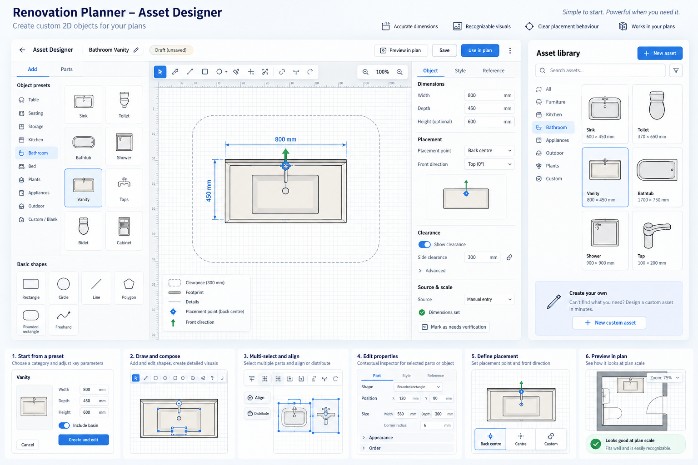
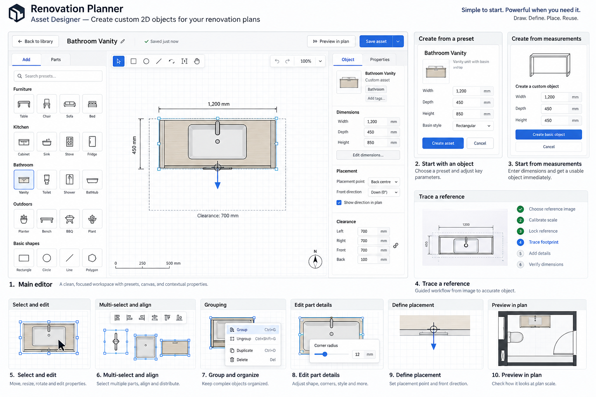

# Renovation Planner — Asset Designer execution package

**Start with [the orchestrator prompt](prompts/00-ORCHESTRATOR.md).** It audits the current checkout before delegating implementation.

Reviewed baseline: `d77e7c5eba5e6518b93a5be4606532ceab3a77eb` on 16 September 2026 — the commit this package was WRITTEN against, fourteen commits behind the checkout it is being executed on.

**Execution has started.** [`reports/AD00-baseline.md`](reports/AD00-baseline.md) is the audit of the real checkout, [`contracts/DECISIONS.md`](contracts/DECISIONS.md) carries accepted contract revision `r1`, and [`execution/state.json`](execution/state.json) is the live ledger. Where this README or a task card disagrees with `r1`, `r1` wins.

## Read and execute

| Document | Purpose |
|---|---|
| [Implementation plan](IMPLEMENTATION-PLAN.md) | Product scope, baseline, mockup corrections, screen states, waves, ownership and all 18 task cards. |
| [Orchestration runbook](ORCHESTRATION-RUNBOOK.md) | Worktrees, dispatch, leases, review, integration and restart rules. |
| [Contracts](contracts/DECISIONS.md) | The decisions AD01 must reconcile and accept. |
| [Acceptance and QA](ACCEPTANCE-AND-QA.md) | Fixtures, end-to-end scenarios, 42 regression obligations and release targets. |
| [Worker prompt](prompts/01-WORKER.md) | Bounded implementation brief shared by all task workers. |
| [Reviewer prompt](prompts/02-REVIEWER.md) | Independent review against actual code and evidence. |
| [Integrated QA prompt](prompts/03-INTEGRATED-QA.md) | Validate the full experience and failure paths. |
| [Resume prompt](prompts/04-RESUME.md) | Continue safely across sessions. |
| [Execution ledger](execution/README.md) | Machine-readable task graph/state and active leases. |
| [Sources](references/SOURCES.md) | Pinned repository evidence, official references and review limitations. |

Copy the entire directory into an appropriate repo location, such as `docs/tasks/asset-designer-expansion/`, subject to current repository conventions. Map task IDs into the existing Asset Designer epic; do not create a competing requirements hierarchy.

Default scope is the beta through AD16. AD17 is post-beta portability. Maximum suggested parallel implementation workers: three, with one lead integrator and explicit shared-file ownership.

**The optional readiness helper is deliberately NOT in this copy.** `scripts/ready-tasks.mjs`
lives in the external package only: nothing imports it and no npm script runs it, so `npm run analyze`
reports it as an unused file and its dependency walk as two functions over the complexity budget —
measured, both cleared by removing it and by nothing else. Declaring it as a fallow entry point or
raising a budget would weaken a quality gate for a planning aid, which the plan itself calls "not
proof of correctness". Run it from the package directory outside the repository if you want it.

## Visual references

These are the original generated boards, not screenshots of implemented functionality. The plan's correction table overrides their conflicting controls and copy.

### Overall look and feel

### Interaction concepts

