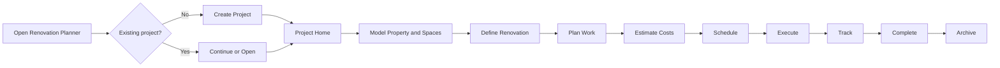
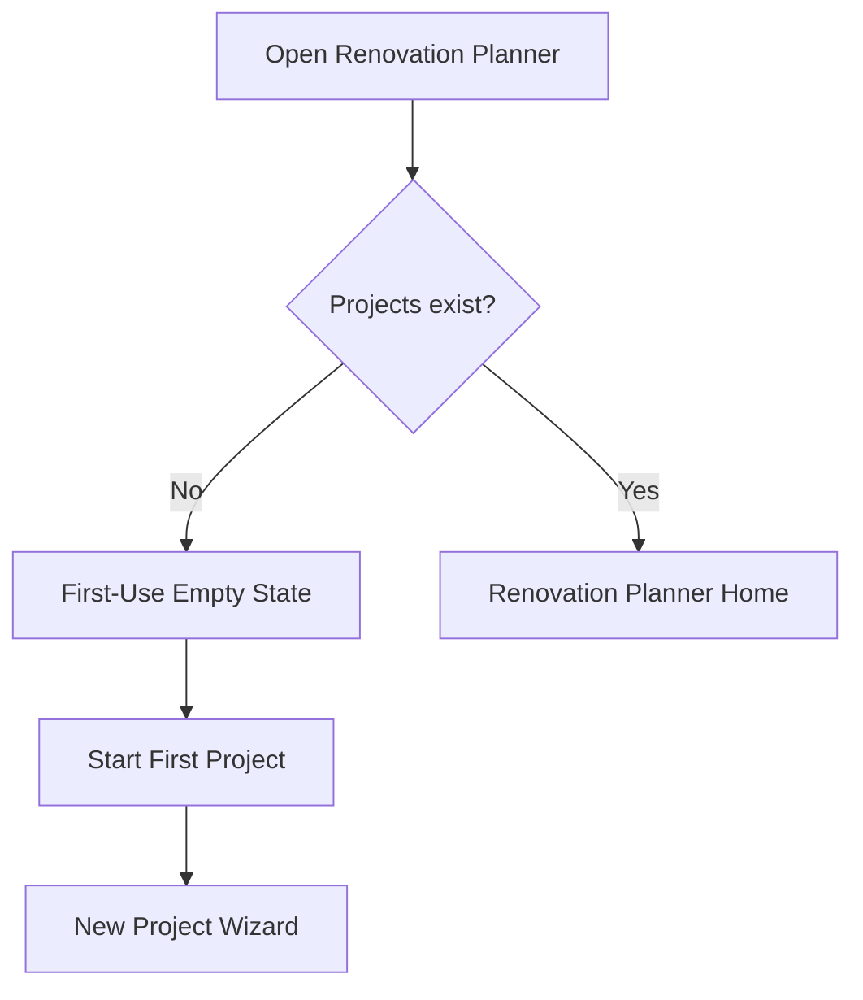
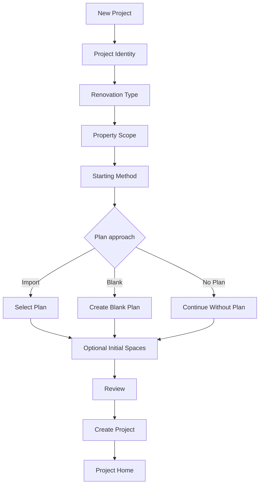
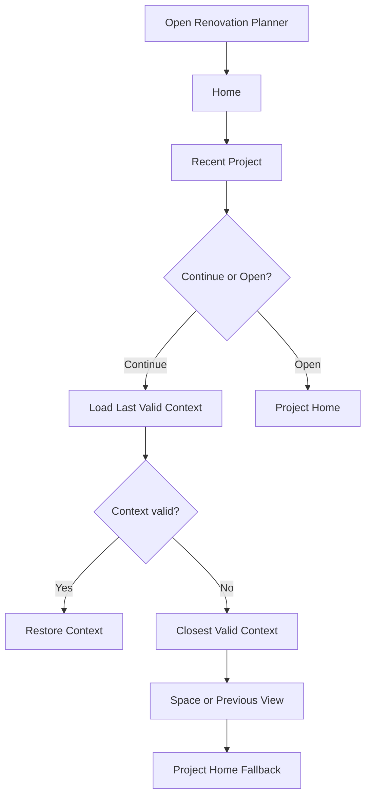

# Prototype Design Specification
## Renovation Project Workspace

**Product:** Renovation Planner  
**Document Type:** Prototype Design Specification  
**Status:** Draft  
**Version:** 0.1

## 1. Prototype Mission

Validate the project-first renovation experience before production implementation.

> Build the experience needed to answer UX questions, not the finished product.

The prototype must prove that a user can start a project, establish spaces, understand Project Home, work inside a room context, add renovation work and a rough estimate, leave, return, and continue without understanding the underlying technical data model.

## 2. Golden Path

```text
Planner Home
→ New Project
→ House Renovation 2026
→ Whole House
→ 2 Floors + Garden
→ Start Without a Plan
→ Select Initial Spaces
→ Project Home
→ Spaces
→ Kitchen
→ Add Work
→ Replace Floor
→ Rough Estimate €2,500
→ Work Detail
→ Project Home
→ Planner Home
→ Continue
→ Kitchen / Replace Floor
```

## 3. Questions to Answer

- Is first use self-explanatory?
- Is the wizard too long?
- Does no-plan setup feel first-class?
- Is Project Home useful as the default entry?
- Are Spaces and Design clearly distinct?
- Does the user understand spatial context?
- Does contextual creation feel predictable?
- Can work start simple and become detailed later?
- Is a rough estimate sufficient initially?
- Are next-best-actions useful?
- Is Open versus Continue understandable?
- Does restored context feel helpful?

## 4. Prototype Scope

Functional: first-use state, Planner Home, wizard, Project Home, Spaces, Space Detail, Add Space, Add Work, Work Detail, rough estimate, navigation, breadcrumbs, deterministic guidance, session restoration, representative validation/error/empty states.

Representative only: Design, Budget, Schedule, Documents, plan import/drawing entry points.

Out of scope: production Markdown persistence, sidecars/migrations, full Konva editor, PDF processing, quantity engine, scheduling engine, procurement, full work-package hierarchy, accounting, production audit/event infrastructure.

## 5. Fidelity

Use a functional mid-fidelity prototype: realistic navigation, forms, state, content, validation and transitions with Obsidian-native appearance. Final iconography, animation polish, production persistence, and production optimization are unnecessary.

## 6. Canonical Fixture

```text
House Renovation 2026
├── Ground Floor
│   ├── Kitchen
│   ├── Living Room
│   ├── Bathroom
│   └── Hallway
├── Upper Floor
│   ├── Bedroom
│   ├── Bedroom 2
│   └── Bathroom
└── Garden
    └── Terrace
```

Kitchen work:
- Replace Floor — Flooring — €2,500
- Paint Walls — Painting — €600
- Replace Kitchen — Kitchen — €12,000

Bathroom work:
- Replace Fixtures — Plumbing — €3,200
- Retile Shower — Tiling — €2,100

Project summary: 9 spaces, 5 work items, €20,400 estimated, schedule not planned.

## 7. Prototype State Contract

```ts
interface PrototypeProject {
  id: string;
  name: string;
  type: string;
  status: "planning" | "in-progress" | "completed";
  spaces: PrototypeSpace[];
  workItems: PrototypeWorkItem[];
}

interface PrototypeSpace {
  id: string;
  name: string;
  type: "building" | "floor" | "room" | "outdoor" | "zone";
  parentId?: string;
}

interface PrototypeWorkItem {
  id: string;
  projectId: string;
  spaceId?: string;
  title: string;
  category?: string;
  estimate?: number;
  status: "planned" | "in-progress" | "done";
}

interface PrototypeSession {
  projectId?: string;
  view?: string;
  spaceId?: string;
  entityId?: string;
}
```

Use Pinia plus localStorage or an equally lightweight mock repository. Provide a reset-fixture action for repeatable usability sessions. This is not the production domain model.

## 8. Visual Contract

Use the repository's Obsidian-native harness and Obsidian CSS variables. Do not create a separate visual language.

Use a compact spacing scale (approximately 4/8/12/16/24/32 px), restrained typography hierarchy, native focus behavior, theme-aware surfaces and borders, and whitespace before excessive card decoration.

Reusable prototype components: `ProjectShell`, `ProjectNavigation`, `Breadcrumbs`, `ProjectCard`, `MetricCard`, `GuidanceCard`, `SpaceCard`, `SpaceTree`, `EmptyState`, `StatusBadge`, `WizardShell`, `WizardProgress`, form fields, modal, tabs, activity list, work row, estimate summary.

## 9. Interaction Contracts

### Open vs Continue

`Open(project)` always enters Project Home.

`Continue(project)` restores the last valid meaningful context.

### Context propagation

Creating from Kitchen inherits `projectId` and `spaceId=Kitchen`. Do not ask users to reselect known context.

### Wizard

Identity → Scope → Starting Method → Initial Spaces → Review. Back preserves state; validation is step-local; optional steps can be skipped; Cancel returns Home; Create opens Project Home.

### Project guidance

Prototype deterministic rules:

```text
no spaces                 → Add your first space
spaces + no work          → Define renovation work for Kitchen
work + missing estimate   → Estimate Replace Floor
estimated work + no plan  → Start planning your schedule
```

Only one dominant next action is required initially.

### Rough-to-detailed estimate

A work item may remain at `€2,500`. Refinement can reveal area, waste, materials and labor. Detailed estimation is optional.

### Session restoration

Example stored state:

```ts
{
  projectId: "house-renovation-2026",
  view: "work-detail",
  spaceId: "kitchen",
  entityId: "replace-floor"
}
```

Fallback: Entity → Space → Functional View → Project Home.

### Back behavior

Wizard → previous wizard step. Work Detail → Space Work context. Space Detail → Spaces. Project Home → Planner Home. Preserve normal Obsidian history where practical.

## 10. Routing Contract

Conceptual routes:

```text
/projects
/project/:projectId
/project/:projectId/spaces
/project/:projectId/space/:spaceId
/project/:projectId/space/:spaceId/work
/project/:projectId/work/:workId
/project/:projectId/design
/project/:projectId/budget
/project/:projectId/schedule
/project/:projectId/documents
```

Equivalent state-driven navigation is acceptable if it remains predictable and restorable.

## 11. Required UI States

Prototype populated, empty, loading, validation-error and recoverable-error states for foundation screens.

Validate at least: missing project name, missing work title, invalid rough estimate.

Prototype one recoverable plan-import failure with Try Again, Choose Another File, and Continue Without Plan.

For destructive actions, explain impact rather than merely asking "Are you sure?"

## 12. Responsive & Accessibility Contract

Preserve project identity and context before secondary metrics. Collapse primary navigation when necessary. Space cards may become a list/tree. Avoid ordinary horizontal scrolling.

All primary actions are keyboard reachable. Dialog focus is trapped/restored. Icon-only actions have accessible names. Status never relies on color alone. Respect Obsidian theme contrast and font sizing.

## 13. Usability Test Script

Give the participant this scenario without explaining the UI:

> You are planning a renovation of a two-floor house with a garden. You want to begin without a floor plan. Set up the project, find the Kitchen, plan replacing its floor, estimate it at €2,500, return to the project overview, then leave the project and continue your work again.

Observe:
- hesitation,
- wrong turns,
- terminology questions,
- navigation reversals,
- unexpected context changes,
- whether guidance is noticed,
- whether Open/Continue is understood.

Do not coach unless the participant is irrecoverably blocked.

## 14. Success Criteria

The prototype succeeds when a first-time participant can:

1. start a project without documentation,
2. choose no-plan setup confidently,
3. create/use initial spaces,
4. understand Project Home,
5. find Kitchen,
6. create Replace Floor,
7. add €2,500,
8. return to Project Home,
9. leave and return,
10. use Continue to restore meaningful context.

No Golden Path step may require understanding Markdown, YAML, sidecars, zones, work packages, quantity engines, or implementation terminology.

## 15. Exit Criteria

Before production implementation:

- Golden Path works end-to-end.
- Major navigation labels test successfully.
- Wizard length is validated.
- Spaces vs Design is resolved.
- Open vs Continue is validated.
- Context inheritance is predictable.
- Project Home guidance is useful.
- Rough estimate interaction is sufficient.
- Critical empty/error states are understandable.
- Findings are fed back into PRD, UXD, wireframes and SDD.

## 16. Explicit Prototype Guardrail

Do not use prototype implementation convenience as justification for production architecture.

The prototype may use simplified state, fixtures and mocked capabilities. Production domain, persistence, eventing and rendering decisions remain governed by the SDD.

---

# Appendix A — Screen-Level Wireframe Reference

The following screen specification is included as the concrete visual/interaction baseline for implementation.

# UX Journey & Interaction Design Document
## Renovation Project Workspace

**Product:** Renovation Planner  
**Document Type:** UX Journey & Interaction Design (UXD)  
**Status:** Draft  
**Version:** 0.1  
**Related PRD:** Renovation Project Workspace PRD

---

# 1. Purpose

This document translates the Renovation Project Workspace PRD into an end-to-end user experience. It defines the user journey, information architecture, navigation, primary interaction flows, major screens, progressive disclosure, project guidance, session continuity, and interaction states.

> The user is renovating a property, not operating a data model.

# 2. Experience Vision

A user should always be able to answer:

1. What project am I working on?
2. Where in the property am I working?
3. What am I currently planning or executing?
4. What has already been done?
5. What should I do next?
6. How do I get back to where I was?

The conceptual journey is:

```text
Start → Understand → Model → Design → Plan → Estimate → Schedule → Execute → Track → Complete
```

This is not a mandatory sequential workflow.

# 3. UX Principles

- **Project before feature.** Projects are the primary entry point.
- **Context before configuration.** Known project and spatial context is inherited automatically.
- **Start simple.** A useful project requires minimal setup.
- **No mandatory drawing.** Floor plans are optional.
- **Progressive disclosure.** Advanced concepts appear when useful.
- **Guide rather than enforce.** Guidance is advisory and non-blocking.
- **Preserve orientation.** Project, space, and activity remain understandable.
- **Preserve continuity.** Returning users can continue meaningful work.
- **Actionable empty states.** Empty screens teach the next step.
- **Obsidian-native, product-focused.** Vault transparency remains available without becoming the main UX.

# 4. Primary User Journey



# 5. Experience Architecture

```text
Renovation Planner
├── Portfolio Context
│   ├── Projects
│   ├── Recent Projects
│   ├── Continue
│   └── New Project
└── Project Context
    ├── Overview
    ├── Spaces
    ├── Design
    ├── Work
    ├── Budget
    ├── Schedule
    └── Documentation
```

The Portfolio Context answers **which renovation?** The Project Context answers **what do I want to do within it?**

# 6. Information Architecture

## Global

```text
Renovation Planner
├── Projects
│   ├── Active
│   ├── Completed
│   └── Archived
├── New Project
└── Settings
```

## Spatial

```text
Project
├── Property / Site
├── Building
│   ├── Floor
│   │   ├── Room
│   │   │   └── Zone
│   │   └── Room
│   └── Floor
├── Garage
└── Outdoor Area
    ├── Garden
    ├── Terrace
    └── Other Area
```

The hierarchy must also work for apartments, partial renovations, and outdoor-only projects.

# 7. Navigation Model

Three dimensions cooperate:

1. **Project navigation:** Overview, Spaces, Design, Work, Budget, Schedule, Documentation.
2. **Spatial navigation:** Project → Building → Floor → Room → Zone.
3. **Context navigation:** for example Kitchen → Overview / Plan / Work / Materials / Costs / Documents.

Where practical, screens communicate:

```text
[Project] / [Spatial Context] / [Current Activity]
```

Example:

```text
House Renovation / Ground Floor / Kitchen / Work
```

Breadcrumbs are interactive.

# 8. First-Launch Journey



Suggested first-use state:

```text
Renovation Planner

Plan your renovation from idea to completion.

[ Start a Renovation Project ]

Plan spaces
Organize renovation work
Estimate costs
Track progress
```

Do not initially expose schemas, zones, quantity engines, work-package types, or storage configuration.


# 9. New Project Journey

The goal is to create enough structure for Project Home to be useful without turning onboarding into a questionnaire.



## Wizard Steps

### Project Identity
Only the project name is required. Description, image, and dates are optional.

### Renovation Type
Suggested choices: Whole house, Apartment, Selected rooms, Garden/outdoor, Garage/workshop, Extension, New construction, Custom. The choice influences defaults rather than locking behavior.

### Property Scope
Ask only questions that help establish useful initial structure, such as floors and major included areas. Everything remains editable.

### Starting Method
Present three equally valid paths:

```text
Import a Floor Plan
Use an existing image or document.

Draw a Plan
Start with an empty planning surface.

Start Without a Plan
Create rooms and work directly.
```

Starting without a plan must not appear inferior.

### Initial Spaces
Offer common rooms and custom spaces. This step is skippable.

### Review
Show a human-readable summary rather than internal entities.

# 10. Project Home Journey

Project Home is the persistent orientation and decision hub.

It should answer:

- Where are we?
- What has been planned?
- What needs attention?
- What is the budget/schedule state?
- What should I do next?

Concept:

```text
HOUSE RENOVATION 2026

Planning                              32%

NEXT STEPS
1. Calibrate Ground Floor plan
2. Define renovation work for Kitchen
3. Estimate Bathroom work

PROJECT
Spaces          11
Work items      24
Budget          €42,300
Schedule        14 weeks

RECENT ACTIVITY
Kitchen       Flooring added
Bathroom      Plumbing estimate updated
Garden        Terrace created
```

# 11. Next-Best-Action Model

A guidance item explains:

1. what is missing or useful,
2. why it matters,
3. where the action leads.

Example:

```text
Calibrate your Ground Floor plan

Calibration allows Renovation Planner to calculate
real-world measurements and quantities.

[Calibrate Plan]
```

Guidance is deterministic, contextual, prioritized, non-blocking, and dismissible where appropriate.

Priorities:

- Required Attention
- Recommended
- Optional

# 12. Spaces Journey

```text
HOUSE

Ground Floor
├── Kitchen
├── Living Room
├── Hallway
└── Bathroom

Upper Floor
├── Bedroom
├── Bedroom
└── Bathroom

OUTDOOR

Garden
├── Terrace
└── Pond Area
```

Users can add, rename, move, inspect, open, and optionally visualize spaces.

# 13. Space Detail Journey

Space Detail is a central contextual workspace.

```text
House Renovation / Ground Floor / Kitchen

KITCHEN
Status: Planning
Budget: €14,200

Overview | Plan | Work | Materials | Costs | Documents

RENOVATION SUMMARY
Demolition     2 items
Electrical     4 items
Plumbing       2 items
Flooring       1 item

NEXT ACTION
Estimate electrical work

[Continue]
```

The user thinks **I am working on the Kitchen**, and related information follows that context.

# 14. Contextual Creation

Actions inherit current context.

Creating `+ Add Work` from Kitchen defaults to:

```text
Project: House Renovation
Space: Kitchen
```

The user can override the association. This principle also applies to materials, documents, photos, costs, tasks, and zones.

# 15. Design Journey

The Design context answers:

> What should this space become?

It may combine floor plans, zones, proposed changes, assets, alternatives, and measurements.

The visual editor is one tool in this journey, not the application itself and not a prerequisite.

# 16. Work Planning Journey

Start with plain renovation intent:

```text
Kitchen
- Replace floor
- Paint walls
- Replace kitchen units
- Move sink
- Add electrical outlets
```

Advanced structure can emerge later:

```text
Replace Floor
├── Demolition
├── Preparation
├── Materials
├── Installation
├── Trade
├── Dependencies
└── Tasks
```

Advanced structure is never required for the first work item.

# 17. Cost Journey

Costs can be viewed and aggregated across:

```text
Project → Floor → Room → Work Item → Material
```

Users may begin with a simple estimate and later refine it with quantities, waste, materials, labor, committed costs, and actual costs. Simple and detailed estimates coexist.

# 18. Schedule Journey

Scheduling builds on existing work. Users progressively add phases, dates, durations, dependencies, and milestones. An unscheduled project remains valid.

# 19. Execution Journey

During execution, emphasize active work, tasks, procurement, blockers, upcoming work, actual costs, and documentation.

Project Home may adapt its emphasis from planning guidance to execution guidance.

# 20. Documentation Journey

Documentation includes notes, photos, invoices, quotations, manuals, decisions, receipts, contracts, and product information.

Documents should be attachable to spatial and work context while remaining normal Obsidian content where practical.


# 21. Continue Existing Project Journey



**Open Project** always opens Project Home.

**Continue Project** restores the previous meaningful working context where possible.

Useful session context includes project, primary view, selected building/floor/space/entity, last meaningful activity, and last-opened timestamp. Avoid persisting brittle transient UI details.

# 22. Progressive Disclosure Model

## Level 1 — Basic Planning
Spaces, Work, Tasks, Budget, Documents.

## Level 2 — Structured Planning
Plans, Zones, Materials, Trades, Work Packages, Schedule.

## Level 3 — Detailed Planning
Quantity calculations, Assemblies, Dependencies, Procurement, Estimated/Committed/Actual Cost, Advanced Scheduling.

These are conceptual complexity levels rather than mandatory user modes.

# 23. Empty States

Every empty state contains:

1. explanation,
2. value,
3. primary next action,
4. optional secondary action.

Example:

```text
No spaces yet

Spaces let you organize work, costs, plans and
documents around the physical parts of your renovation.

[Add a Space]

Import a floor plan
```

Empty states should teach the product through use.

# 24. Loading, Validation, and Errors

Loading should preserve surrounding context, prevent duplicate actions, and communicate long-running imports.

Validation should occur close to the relevant field and preserve entered data.

Errors answer:

1. What happened?
2. What was affected?
3. Was anything lost?
4. What can I do next?

Example:

```text
The floor plan could not be imported.

Your project was created and the original file was not changed.

[Try Again]
[Choose Another File]
[Continue Without Plan]
```

Recoverable failures must not block unrelated work.

# 25. Destructive Actions

Confirmation explains impact rather than merely asking "Are you sure?"

Example:

```text
Delete Kitchen?

This space contains:
12 work items
18 materials
7 documents

Choose what should happen to the associated items.

[Cancel]
[Delete]
```

# 26. Completion and Archive Journey

Completion provides a review of completed/remaining work, estimated/final cost, target/completion dates, and documentation completeness.

Archiving:

- removes the project from the default active list,
- preserves underlying data,
- allows reopening,
- allows restoration to active status.

Archive is organizational, not destructive.

# 27. Cross-Cutting Interaction Rules

- Prefer direct manipulation where understandable.
- Preserve spatial context across functional views.
- Use renovation/domain language, not implementation language.
- Avoid modal overuse; use full views for complex work.
- Give each screen a clear primary action where possible.
- Keep advanced options discoverable without dominating basic workflows.
- Never silently discard user input.
- Respect Obsidian themes and interaction conventions.

# 28. Primary Screen Inventory

The initial UX requires:

1. First-Use Empty State
2. Renovation Planner Home
3. New Project Wizard
4. Project Home
5. Spaces View
6. Space Detail
7. Design / Plan View
8. Work View
9. Budget View
10. Schedule View
11. Documentation View
12. Project Completion Review
13. Archived Projects
14. Project Settings

Each should later receive a wireframe/screen specification.

# 29. Primary User Flows to Validate

Before implementation is considered UX-complete, validate at least:

- First launch → first useful project
- Create project without floor plan
- Create project with imported floor plan
- Add first room
- Add first renovation work
- Estimate first work item
- Move from room context to project budget
- Return from project budget to same room
- Reopen Obsidian and continue previous work
- Recover when previous context no longer exists
- Complete and archive project

# 30. UX Success Criteria

A new user can create a project and understand the next action without documentation.

A returning user can resume meaningful work without reconstructing context.

A user can work on a specific room and reach its work, costs, materials, plans, and documentation without navigating unrelated global lists.

A basic user can plan a renovation without understanding zones, assemblies, quantity engines, or work-package hierarchies.

An advanced user can progressively access detailed planning capabilities.

The user can always determine the current project, spatial context, and functional context.

# 31. UX Validation Questions

Research and usability testing should answer:

1. Do users understand the distinction between Open and Continue?
2. Is Project Home useful enough to become the default project entry?
3. Does the primary navigation match users' mental model?
4. Do users understand Spaces versus Design?
5. Is the spatial hierarchy flexible enough?
6. Does contextual creation feel predictable?
7. Are next-best-actions useful rather than intrusive?
8. When should advanced planning concepts first appear?
9. Is the New Project Wizard too long?
10. Can users successfully start without a floor plan?
11. Do users understand how Obsidian notes relate to plugin objects?
12. Does navigation preserve enough context without becoming confusing?

# 32. Next Design Artifacts

This UXD should feed directly into:

```text
UX Journey & Interaction Design
        ↓
Wireframe / Screen Specification
        ↓
Interaction State Specification
        ↓
Domain & Data Model Alignment
        ↓
Application SDD / Implementation Design
        ↓
Backlog
```

The immediate next artifact should be a **Wireframe & Screen Specification** covering the highest-value journey first:

```text
Renovation Planner Home
→ New Project Wizard
→ Project Home
→ Spaces
→ Space Detail
→ Continue Project
```

# 33. Definition of Done

This UX design is ready to hand into screen-level design when:

- the end-to-end journey is defined,
- new and returning-user flows are defined,
- information architecture is stable enough to prototype,
- project and spatial navigation have clear responsibilities,
- contextual creation rules are defined,
- progressive disclosure has explicit principles,
- empty/error/recovery behavior is defined,
- session continuity is defined,
- the primary screens are inventoried,
- the key usability assumptions are explicit and testable.

# 34. Experience Principle Summary

> **Project before feature.**

> **User intent before domain structure.**

> **Context before configuration.**

> **Start simple and reveal depth when needed.**

> **The floor-plan editor is a tool inside the journey, not the journey itself.**

> **Every empty state should help the user move forward.**

> **Returning to a project should mean continuing work, not finding it again.**

> **The user should always know where they are, what has happened, and what they can do next.**


# Appendix A — Wireframe & Screen Specification

## A.1 Scope and Golden Path

This screen specification concretizes the foundation journey:

```text
First Launch
→ Planner Home
→ New Project Wizard
→ Project Home
→ Spaces
→ Space Detail
→ Add Renovation Work
→ Estimate Work
→ Project Home
```

Returning-user path:

```text
Planner Home → Recent Project → Continue → Last Meaningful Context
```

## A.2 Shared Project Shell

```text
┌──────────────────────────────────────────────────────────────┐
│ ← Projects   House Renovation 2026                  ⋯        │
├──────────────────────────────────────────────────────────────┤
│ Overview  Spaces  Design  Work  Budget  Schedule  Documents │
├──────────────────────────────────────────────────────────────┤
│                                                              │
│                    CURRENT VIEW                              │
│                                                              │
└──────────────────────────────────────────────────────────────┘
```

Required behavior:

- Back returns to Planner Home.
- Project name remains visible.
- Selected primary section is visually distinct.
- Shell remains stable while switching sections.
- Spatial breadcrumbs appear only when spatial context exists.

## A.3 Screen — First-Use Empty State

**Purpose:** Explain the product and provide one obvious starting action.

```text
Renovation Planner

Plan your renovation from idea to completion.

[ Start a Renovation Project ]

Plan spaces · Organize work · Budget · Track progress
```

Primary action: **Start a Renovation Project**.

Do not expose advanced configuration, zones, quantity engines, trades, or work-package concepts.

## A.4 Screen — Renovation Planner Home

**Purpose:** Choose, continue, or create a project.

```text
Renovation Planner                                  + New Project

CONTINUE
┌──────────────────────────────────────────────────────────┐
│ House Renovation 2026                                   │
│ Kitchen → Work → Electrical                             │
│ Last opened yesterday                    [ Continue → ] │
└──────────────────────────────────────────────────────────┘

ACTIVE PROJECTS
┌──────────────────────┐  ┌──────────────────────┐
│ House Renovation     │  │ Garden Renovation    │
│ Planning             │  │ In Progress          │
│ €42,300 planned      │  │ €8,200 planned       │
│ 32% planned          │  │ 64% complete         │
│ [Open]               │  │ [Open]               │
└──────────────────────┘  └──────────────────────┘

Completed / Archived
```

**Continue** restores last meaningful context. **Open** always opens Project Home.

Project cards should remain concise: name, lifecycle state, one useful progress/budget summary, and open action.

## A.5 Screen — New Project Wizard: Identity

```text
New Renovation Project
Step 1 of 5        ● ─ ○ ─ ○ ─ ○ ─ ○

What are you renovating?

Project name
[ House Renovation 2026 ]

Type
[ Whole house ▾ ]

Description                                  Optional
[                                             ]

[Cancel]                              [Continue →]
```

Only project name is required. Validation is inline and entered data survives back/forward navigation.

## A.6 Screen — New Project Wizard: Property Scope

```text
Step 2 of 5        ● ─ ● ─ ○ ─ ○ ─ ○

Tell us a little about the property.
You can change everything later.

Floors
[ 2 ]

Include
[✓] Basement
[ ] Attic
[✓] Garden
[✓] Garage

[← Back]                              [Continue →]
```

Ask only questions that immediately improve the generated project structure.

## A.7 Screen — New Project Wizard: Starting Method

```text
How would you like to start?

┌─────────────────┐ ┌─────────────────┐ ┌─────────────────┐
│ Import a Plan   │ │ Draw a Plan     │ │ Without a Plan  │
│ PDF / image     │ │ Blank canvas    │ │ Rooms & areas   │
│ [Select]        │ │ [Select]        │ │ [Select]        │
└─────────────────┘ └─────────────────┘ └─────────────────┘
```

All three paths are visually equivalent. "Without a Plan" is not a fallback or limited mode.

## A.8 Screen — New Project Wizard: Initial Spaces

```text
Add some spaces

Ground Floor
[✓] Kitchen       [✓] Living Room
[✓] Bathroom      [ ] Office
[✓] Hallway       [ ] Utility Room

Upper Floor
[✓] Bedroom       [✓] Bathroom

[+ Add custom space]

[Skip]   [← Back]                      [Continue →]
```

This step is optional and suggestions adapt to known scope.

## A.9 Screen — New Project Wizard: Review

```text
Ready to create your project

HOUSE RENOVATION 2026

Whole house
2 floors
Basement · Garden · Garage
Starting without a floor plan
7 initial spaces

Everything can be changed later.

[← Back]                         [Create Project →]
```

On success, transition directly to Project Home.

## A.10 Screen — Project Home

```text
← Projects   House Renovation 2026                  ⋯
────────────────────────────────────────────────────────────
Overview  Spaces  Design  Work  Budget  Schedule  Documents

HOUSE RENOVATION 2026                         Planning
Planning completeness
███████░░░░░░░░░░░░  32%

NEXT STEP
┌──────────────────────────────────────────────────────────┐
│ Define renovation work for the Kitchen                  │
│ Decide what should change before estimating costs.      │
│                                        [Plan Kitchen →] │
└──────────────────────────────────────────────────────────┘

Spaces          Work             Budget          Schedule
11              24 items         €42,300         Not planned

RECENT ACTIVITY
Kitchen       Flooring added                       Today
Bathroom      Estimate updated                     Yesterday
```

Primary action is the highest-priority next-best-action. Summary metrics may serve as shortcuts.

## A.11 Screen — Spaces

```text
Spaces                                           [+ Add Space]

HOUSE

▼ Ground Floor
  ┌──────────────┐ ┌──────────────┐ ┌──────────────┐
  │ Kitchen      │ │ Living Room  │ │ Bathroom     │
  │ 6 work items │ │ 2 work items │ │ Not planned │
  │ €14,200      │ │ €3,100       │ │             │
  └──────────────┘ └──────────────┘ └──────────────┘

▶ Upper Floor

OUTDOOR
▼ Garden
  Terrace
  Pond Area
```

Selecting a space opens Space Detail. At narrow widths or high space counts, use a tree/list rather than forcing cards.

## A.12 Screen — Add Space

```text
Add Space

Name
[ Kitchen ]

Type
[ Room ▾ ]

Parent
[ Ground Floor ▾ ]

[Cancel] [Add Space]
```

When invoked from a spatial parent, inherit that parent. Geometry and plan association are not required.

## A.13 Screen — Space Detail

```text
House Renovation / Ground Floor / Kitchen

KITCHEN                                      Planning
Budget €14,200

Overview  Plan  Work  Materials  Costs  Documents

NEXT STEP
Define the renovation work for this room.
                                         [+ Add Work]

RENOVATION SUMMARY
Demolition       2 items
Electrical       4 items
Plumbing         2 items
Flooring         1 item

COST
Estimated €14,200 · Actual €1,250
```

The selected space remains active when switching contextual sections.

## A.14 Screen — Add Renovation Work

```text
Add Work

Kitchen

What needs to be done?
[ Replace floor ]

Category                                      Optional
[ Flooring ▾ ]

Rough estimate                                Optional
[ € 2,500 ]

More options ▸

[Cancel]                              [Add Work]
```

Only the work title is required. `More options` progressively exposes trade, description, dependencies, quantities, dates, work package, and detailed costing.

Project and spatial context are inherited automatically.

## A.15 Screen — Work Detail / Estimate

```text
House Renovation / Ground Floor / Kitchen / Replace Floor

REPLACE FLOOR

Status: Planned

Estimate                                             €2,500
[Refine Estimate]

DETAILS
Category       Flooring
Space          Kitchen
Trade          Not assigned
Schedule       Not planned

TASKS
No tasks yet                                      [+ Add Task]

MATERIALS
No materials yet                              [+ Add Material]
```

Refinement may reveal:

```text
Area             24.3 m²
Waste             10 %
Required          26.7 m²

Tiles            €1,121
Adhesive           €180
Grout               €75
Labor             €1,200
------------------------
Estimate          €2,576
```

A rough estimate remains valid; detailed estimation is optional.

## A.16 Screen — Continue Project

Planner Home should surface one high-confidence continuation:

```text
Continue House Renovation 2026

Last worked on
Kitchen → Work → Replace Floor

Yesterday, 18:42

[Continue]
```

Restoration fallback:

```text
Entity → Space → Previous Functional View → Project Home
```

If restoration changes because something was deleted, communicate the fallback unobtrusively.

## A.17 Screen States

Every foundation screen must define:

- populated,
- empty,
- loading,
- validation error,
- recoverable error,
- unavailable/deleted context where relevant.

Loading should preserve the surrounding shell. Validation occurs near the affected control. Recoverable failures must not block unrelated project work.

## A.18 Destructive Interaction Pattern

Confirm impact rather than merely asking "Are you sure?"

```text
Delete Kitchen?

This space contains:
12 work items
18 materials
7 documents

Choose what should happen to the associated items.

[Cancel] [Delete]
```

## A.19 Responsive Rules

- Preserve project name and current context before secondary metrics.
- Primary navigation may collapse when width is insufficient.
- Space cards may become a list/tree.
- Avoid horizontal scrolling for ordinary management views.
- The spatial editor may require a larger pane, but basic project management must remain usable without it.

## A.20 Keyboard and Accessibility Rules

- All primary actions are keyboard reachable.
- Focus order follows visual hierarchy.
- Dialog focus is trapped and restored correctly.
- Icon-only actions have accessible labels/tooltips.
- Status is not communicated by color alone.
- Obsidian theme contrast and font sizing are respected.

## A.21 Golden-Path Prototype Acceptance Criteria

A low-fidelity prototype is ready for usability testing when a participant can:

1. start a first project,
2. choose a no-plan setup,
3. create initial spaces,
4. understand Project Home,
5. enter Kitchen,
6. create "Replace floor",
7. add a rough estimate,
8. navigate back to Project Home,
9. close/re-enter the experience,
10. use Continue to return to the previous work context.

No step should require understanding Markdown storage, YAML, zones, work packages, or quantity-engine terminology.

## A.22 Design Questions to Validate

- Are `Spaces` and `Design` clearly distinct?
- Is the seven-item project navigation too wide or conceptually heavy?
- Should Project Home show one next action or a short prioritized list?
- Are space cards better than a tree for typical renovation sizes?
- Should `Materials` live under Space Detail, Work Detail, or both as scoped views?
- Does `Continue` differ clearly enough from `Open`?
- Is Budget better named `Costs` for DIY renovators?
- Does the wizard contain too many steps?
- Is "planning completeness" understandable and trustworthy?
- How much underlying Obsidian note/file affordance should be visible by default?

## A.23 Next Artifact

After prototype/usability validation, produce a **Screen Component & Interaction State Specification** for the validated shell and screens, then align the domain/data model and application SDD to those interactions.
