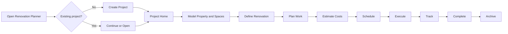
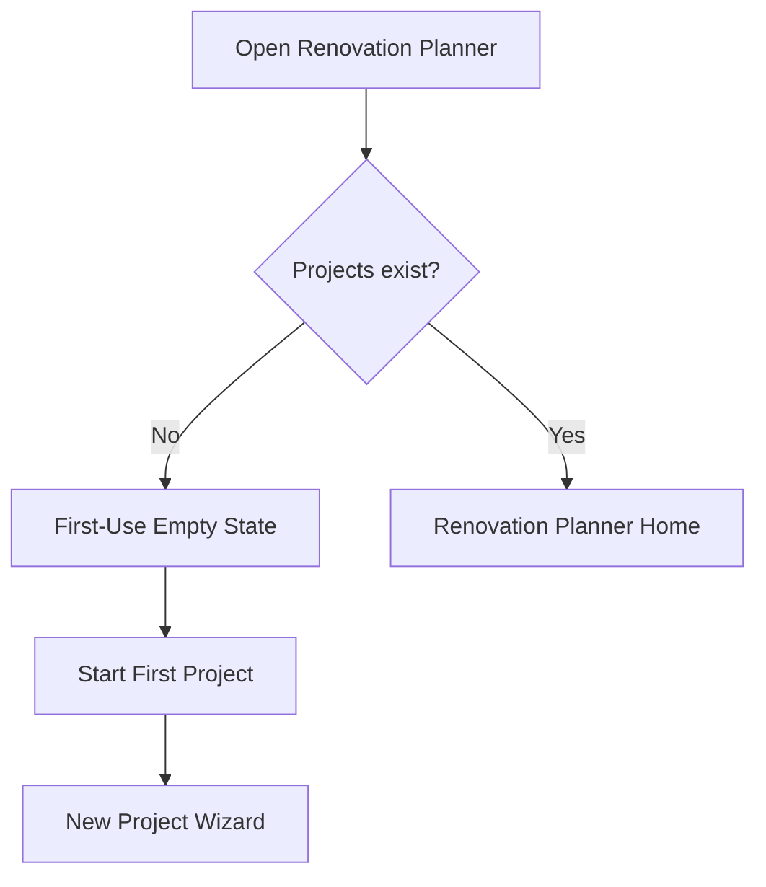
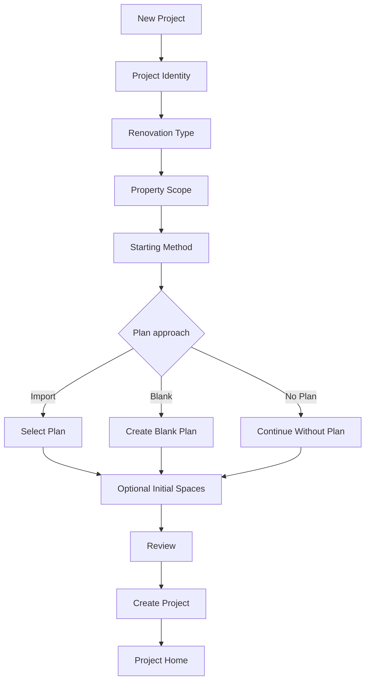
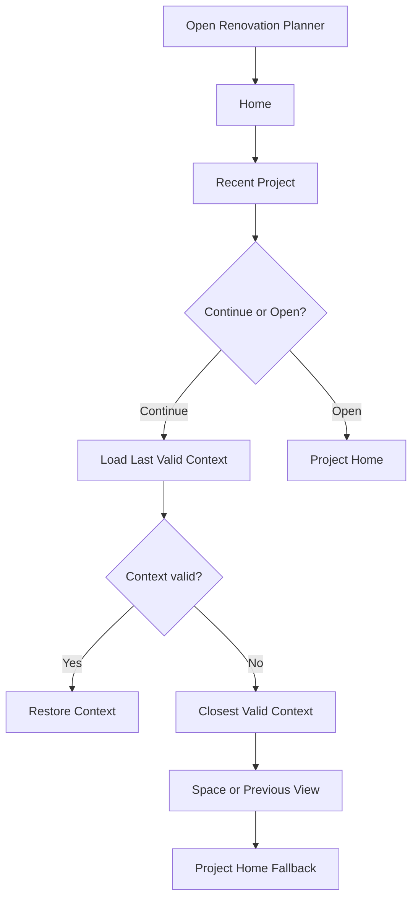

# UX Journey & Interaction Design Document
## Renovation Project Workspace

**Product:** Renovation Planner  
**Document Type:** UX Journey & Interaction Design (UXD)  
**Status:** Draft  
**Version:** 0.1  
**Related PRD:** Renovation Project Workspace PRD

---

# 1. Purpose

This document translates the Renovation Project Workspace PRD into an end-to-end user experience. It defines the user journey, information architecture, navigation, primary interaction flows, major screens, progressive disclosure, project guidance, session continuity, and interaction states.

> The user is renovating a property, not operating a data model.

# 2. Experience Vision

A user should always be able to answer:

1. What project am I working on?
2. Where in the property am I working?
3. What am I currently planning or executing?
4. What has already been done?
5. What should I do next?
6. How do I get back to where I was?

The conceptual journey is:

```text
Start → Understand → Model → Design → Plan → Estimate → Schedule → Execute → Track → Complete
```

This is not a mandatory sequential workflow.

# 3. UX Principles

- **Project before feature.** Projects are the primary entry point.
- **Context before configuration.** Known project and spatial context is inherited automatically.
- **Start simple.** A useful project requires minimal setup.
- **No mandatory drawing.** Floor plans are optional.
- **Progressive disclosure.** Advanced concepts appear when useful.
- **Guide rather than enforce.** Guidance is advisory and non-blocking.
- **Preserve orientation.** Project, space, and activity remain understandable.
- **Preserve continuity.** Returning users can continue meaningful work.
- **Actionable empty states.** Empty screens teach the next step.
- **Obsidian-native, product-focused.** Vault transparency remains available without becoming the main UX.

# 4. Primary User Journey



# 5. Experience Architecture

```text
Renovation Planner
├── Portfolio Context
│   ├── Projects
│   ├── Recent Projects
│   ├── Continue
│   └── New Project
└── Project Context
    ├── Overview
    ├── Spaces
    ├── Design
    ├── Work
    ├── Budget
    ├── Schedule
    └── Documentation
```

The Portfolio Context answers **which renovation?** The Project Context answers **what do I want to do within it?**

# 6. Information Architecture

## Global

```text
Renovation Planner
├── Projects
│   ├── Active
│   ├── Completed
│   └── Archived
├── New Project
└── Settings
```

## Spatial

```text
Project
├── Property / Site
├── Building
│   ├── Floor
│   │   ├── Room
│   │   │   └── Zone
│   │   └── Room
│   └── Floor
├── Garage
└── Outdoor Area
    ├── Garden
    ├── Terrace
    └── Other Area
```

The hierarchy must also work for apartments, partial renovations, and outdoor-only projects.

# 7. Navigation Model

Three dimensions cooperate:

1. **Project navigation:** Overview, Spaces, Design, Work, Budget, Schedule, Documentation.
2. **Spatial navigation:** Project → Building → Floor → Room → Zone.
3. **Context navigation:** for example Kitchen → Overview / Plan / Work / Materials / Costs / Documents.

Where practical, screens communicate:

```text
[Project] / [Spatial Context] / [Current Activity]
```

Example:

```text
House Renovation / Ground Floor / Kitchen / Work
```

Breadcrumbs are interactive.

# 8. First-Launch Journey



Suggested first-use state:

```text
Renovation Planner

Plan your renovation from idea to completion.

[ Start a Renovation Project ]

Plan spaces
Organize renovation work
Estimate costs
Track progress
```

Do not initially expose schemas, zones, quantity engines, work-package types, or storage configuration.


# 9. New Project Journey

The goal is to create enough structure for Project Home to be useful without turning onboarding into a questionnaire.



## Wizard Steps

### Project Identity
Only the project name is required. Description, image, and dates are optional.

### Renovation Type
Suggested choices: Whole house, Apartment, Selected rooms, Garden/outdoor, Garage/workshop, Extension, New construction, Custom. The choice influences defaults rather than locking behavior.

### Property Scope
Ask only questions that help establish useful initial structure, such as floors and major included areas. Everything remains editable.

### Starting Method
Present three equally valid paths:

```text
Import a Floor Plan
Use an existing image or document.

Draw a Plan
Start with an empty planning surface.

Start Without a Plan
Create rooms and work directly.
```

Starting without a plan must not appear inferior.

### Initial Spaces
Offer common rooms and custom spaces. This step is skippable.

### Review
Show a human-readable summary rather than internal entities.

# 10. Project Home Journey

Project Home is the persistent orientation and decision hub.

It should answer:

- Where are we?
- What has been planned?
- What needs attention?
- What is the budget/schedule state?
- What should I do next?

Concept:

```text
HOUSE RENOVATION 2026

Planning                              32%

NEXT STEPS
1. Calibrate Ground Floor plan
2. Define renovation work for Kitchen
3. Estimate Bathroom work

PROJECT
Spaces          11
Work items      24
Budget          €42,300
Schedule        14 weeks

RECENT ACTIVITY
Kitchen       Flooring added
Bathroom      Plumbing estimate updated
Garden        Terrace created
```

# 11. Next-Best-Action Model

A guidance item explains:

1. what is missing or useful,
2. why it matters,
3. where the action leads.

Example:

```text
Calibrate your Ground Floor plan

Calibration allows Renovation Planner to calculate
real-world measurements and quantities.

[Calibrate Plan]
```

Guidance is deterministic, contextual, prioritized, non-blocking, and dismissible where appropriate.

Priorities:

- Required Attention
- Recommended
- Optional

# 12. Spaces Journey

```text
HOUSE

Ground Floor
├── Kitchen
├── Living Room
├── Hallway
└── Bathroom

Upper Floor
├── Bedroom
├── Bedroom
└── Bathroom

OUTDOOR

Garden
├── Terrace
└── Pond Area
```

Users can add, rename, move, inspect, open, and optionally visualize spaces.

# 13. Space Detail Journey

Space Detail is a central contextual workspace.

```text
House Renovation / Ground Floor / Kitchen

KITCHEN
Status: Planning
Budget: €14,200

Overview | Plan | Work | Materials | Costs | Documents

RENOVATION SUMMARY
Demolition     2 items
Electrical     4 items
Plumbing       2 items
Flooring       1 item

NEXT ACTION
Estimate electrical work

[Continue]
```

The user thinks **I am working on the Kitchen**, and related information follows that context.

# 14. Contextual Creation

Actions inherit current context.

Creating `+ Add Work` from Kitchen defaults to:

```text
Project: House Renovation
Space: Kitchen
```

The user can override the association. This principle also applies to materials, documents, photos, costs, tasks, and zones.

# 15. Design Journey

The Design context answers:

> What should this space become?

It may combine floor plans, zones, proposed changes, assets, alternatives, and measurements.

The visual editor is one tool in this journey, not the application itself and not a prerequisite.

# 16. Work Planning Journey

Start with plain renovation intent:

```text
Kitchen
- Replace floor
- Paint walls
- Replace kitchen units
- Move sink
- Add electrical outlets
```

Advanced structure can emerge later:

```text
Replace Floor
├── Demolition
├── Preparation
├── Materials
├── Installation
├── Trade
├── Dependencies
└── Tasks
```

Advanced structure is never required for the first work item.

# 17. Cost Journey

Costs can be viewed and aggregated across:

```text
Project → Floor → Room → Work Item → Material
```

Users may begin with a simple estimate and later refine it with quantities, waste, materials, labor, committed costs, and actual costs. Simple and detailed estimates coexist.

# 18. Schedule Journey

Scheduling builds on existing work. Users progressively add phases, dates, durations, dependencies, and milestones. An unscheduled project remains valid.

# 19. Execution Journey

During execution, emphasize active work, tasks, procurement, blockers, upcoming work, actual costs, and documentation.

Project Home may adapt its emphasis from planning guidance to execution guidance.

# 20. Documentation Journey

Documentation includes notes, photos, invoices, quotations, manuals, decisions, receipts, contracts, and product information.

Documents should be attachable to spatial and work context while remaining normal Obsidian content where practical.


# 21. Continue Existing Project Journey



**Open Project** always opens Project Home.

**Continue Project** restores the previous meaningful working context where possible.

Useful session context includes project, primary view, selected building/floor/space/entity, last meaningful activity, and last-opened timestamp. Avoid persisting brittle transient UI details.

# 22. Progressive Disclosure Model

## Level 1 — Basic Planning
Spaces, Work, Tasks, Budget, Documents.

## Level 2 — Structured Planning
Plans, Zones, Materials, Trades, Work Packages, Schedule.

## Level 3 — Detailed Planning
Quantity calculations, Assemblies, Dependencies, Procurement, Estimated/Committed/Actual Cost, Advanced Scheduling.

These are conceptual complexity levels rather than mandatory user modes.

# 23. Empty States

Every empty state contains:

1. explanation,
2. value,
3. primary next action,
4. optional secondary action.

Example:

```text
No spaces yet

Spaces let you organize work, costs, plans and
documents around the physical parts of your renovation.

[Add a Space]

Import a floor plan
```

Empty states should teach the product through use.

# 24. Loading, Validation, and Errors

Loading should preserve surrounding context, prevent duplicate actions, and communicate long-running imports.

Validation should occur close to the relevant field and preserve entered data.

Errors answer:

1. What happened?
2. What was affected?
3. Was anything lost?
4. What can I do next?

Example:

```text
The floor plan could not be imported.

Your project was created and the original file was not changed.

[Try Again]
[Choose Another File]
[Continue Without Plan]
```

Recoverable failures must not block unrelated work.

# 25. Destructive Actions

Confirmation explains impact rather than merely asking "Are you sure?"

Example:

```text
Delete Kitchen?

This space contains:
12 work items
18 materials
7 documents

Choose what should happen to the associated items.

[Cancel]
[Delete]
```

# 26. Completion and Archive Journey

Completion provides a review of completed/remaining work, estimated/final cost, target/completion dates, and documentation completeness.

Archiving:

- removes the project from the default active list,
- preserves underlying data,
- allows reopening,
- allows restoration to active status.

Archive is organizational, not destructive.

# 27. Cross-Cutting Interaction Rules

- Prefer direct manipulation where understandable.
- Preserve spatial context across functional views.
- Use renovation/domain language, not implementation language.
- Avoid modal overuse; use full views for complex work.
- Give each screen a clear primary action where possible.
- Keep advanced options discoverable without dominating basic workflows.
- Never silently discard user input.
- Respect Obsidian themes and interaction conventions.

# 28. Primary Screen Inventory

The initial UX requires:

1. First-Use Empty State
2. Renovation Planner Home
3. New Project Wizard
4. Project Home
5. Spaces View
6. Space Detail
7. Design / Plan View
8. Work View
9. Budget View
10. Schedule View
11. Documentation View
12. Project Completion Review
13. Archived Projects
14. Project Settings

Each should later receive a wireframe/screen specification.

# 29. Primary User Flows to Validate

Before implementation is considered UX-complete, validate at least:

- First launch → first useful project
- Create project without floor plan
- Create project with imported floor plan
- Add first room
- Add first renovation work
- Estimate first work item
- Move from room context to project budget
- Return from project budget to same room
- Reopen Obsidian and continue previous work
- Recover when previous context no longer exists
- Complete and archive project

# 30. UX Success Criteria

A new user can create a project and understand the next action without documentation.

A returning user can resume meaningful work without reconstructing context.

A user can work on a specific room and reach its work, costs, materials, plans, and documentation without navigating unrelated global lists.

A basic user can plan a renovation without understanding zones, assemblies, quantity engines, or work-package hierarchies.

An advanced user can progressively access detailed planning capabilities.

The user can always determine the current project, spatial context, and functional context.

# 31. UX Validation Questions

Research and usability testing should answer:

1. Do users understand the distinction between Open and Continue?
2. Is Project Home useful enough to become the default project entry?
3. Does the primary navigation match users' mental model?
4. Do users understand Spaces versus Design?
5. Is the spatial hierarchy flexible enough?
6. Does contextual creation feel predictable?
7. Are next-best-actions useful rather than intrusive?
8. When should advanced planning concepts first appear?
9. Is the New Project Wizard too long?
10. Can users successfully start without a floor plan?
11. Do users understand how Obsidian notes relate to plugin objects?
12. Does navigation preserve enough context without becoming confusing?

# 32. Next Design Artifacts

This UXD should feed directly into:

```text
UX Journey & Interaction Design
        ↓
Wireframe / Screen Specification
        ↓
Interaction State Specification
        ↓
Domain & Data Model Alignment
        ↓
Application SDD / Implementation Design
        ↓
Backlog
```

The immediate next artifact should be a **Wireframe & Screen Specification** covering the highest-value journey first:

```text
Renovation Planner Home
→ New Project Wizard
→ Project Home
→ Spaces
→ Space Detail
→ Continue Project
```

# 33. Definition of Done

This UX design is ready to hand into screen-level design when:

- the end-to-end journey is defined,
- new and returning-user flows are defined,
- information architecture is stable enough to prototype,
- project and spatial navigation have clear responsibilities,
- contextual creation rules are defined,
- progressive disclosure has explicit principles,
- empty/error/recovery behavior is defined,
- session continuity is defined,
- the primary screens are inventoried,
- the key usability assumptions are explicit and testable.

# 34. Experience Principle Summary

> **Project before feature.**

> **User intent before domain structure.**

> **Context before configuration.**

> **Start simple and reveal depth when needed.**

> **The floor-plan editor is a tool inside the journey, not the journey itself.**

> **Every empty state should help the user move forward.**

> **Returning to a project should mean continuing work, not finding it again.**

> **The user should always know where they are, what has happened, and what they can do next.**
