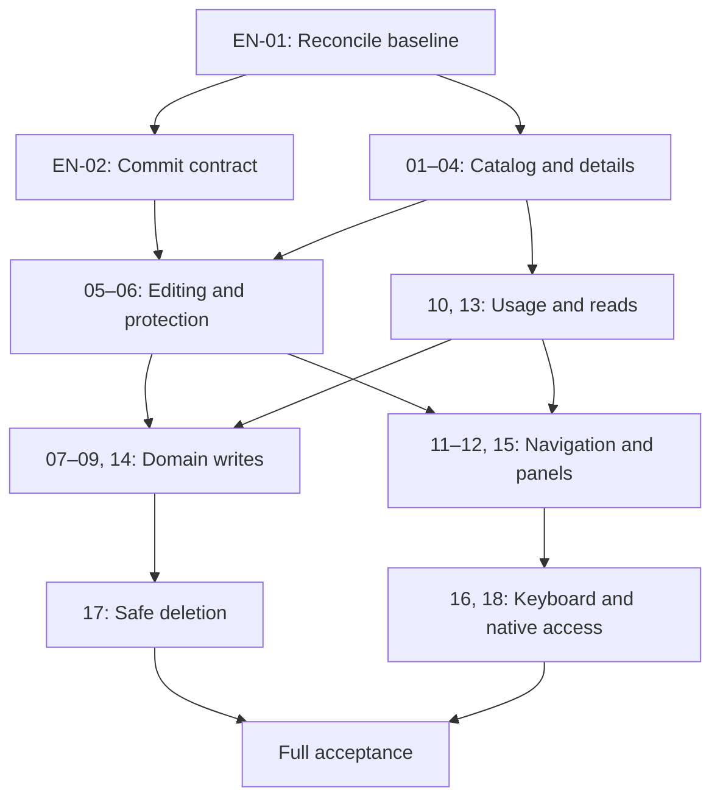

# Asset Library — Implementation backlog

Version 1.1 · 2026-09-05 · English project documentation · 18 PBIs, 2 technical enablers · Status: implementation in review

The implementation has been reconciled against `origin/main` at `d00e9993`. The [delivery record](delivery-record.md) maps all PBIs to production code, tests and decisions. Existing functionality was retained; final real-vault acceptance remains open.

The English edition preserves IDs, dependencies, scope, and acceptance intent. Existing screenshots are retained as **German-localized UI references**; they are not English-screen acceptance evidence. All document prose and executable-example wording is English.

## Feature groups

| ID | Feature |
| --- | --- |
| F01 | Find and browse the catalogue |
| F02 | Create and maintain definitions |
| F03 | Explore usage and source information |
| F04 | Handle errors and manage assets safely |
| F05 | Use an adaptive and accessible interface |

## Backlog

| ID | Use case | Feature | Dependencies |
| --- | --- | --- | --- |
| [PBI-01](pbis/PBI-01.md) | Open and resume the shared asset library | F01 | EN-01 |
| [PBI-02](pbis/PBI-02.md) | Compare and select assets within category groups | F01 | PBI-01 |
| [PBI-03](pbis/PBI-03.md) | Find an asset by name, supplier, or SKU | F01 | PBI-02 |
| [PBI-04](pbis/PBI-04.md) | Inspect the complete definition of a selected asset | F02 | PBI-02 |
| [PBI-05](pbis/PBI-05.md) | Explicitly save or discard asset metadata changes | F02 | PBI-04, EN-02 |
| [PBI-06](pbis/PBI-06.md) | Switch assets without accidentally losing input | F02 | PBI-05 |
| [PBI-07](pbis/PBI-07.md) | Change the library price while preserving project-specific prices | F02 | PBI-05, PBI-10 |
| [PBI-08](pbis/PBI-08.md) | Change an asset’s unit and waste allowance correctly | F02 | PBI-05 |
| [PBI-09](pbis/PBI-09.md) | Create a new asset without an existing project | F02 | PBI-01, PBI-06 |
| [PBI-10](pbis/PBI-10.md) | Understand project usage and each project’s price source | F03 | PBI-04 |
| [PBI-11](pbis/PBI-11.md) | Navigate from an asset to its note or a project using it | F03 | PBI-06, PBI-10 |
| [PBI-12](pbis/PBI-12.md) | Inspect the actual asset outline and open it in the designer | F03 | PBI-06 |
| [PBI-13](pbis/PBI-13.md) | Keep valid content after loading failures and retry the affected read | F04 | PBI-04 |
| [PBI-14](pbis/PBI-14.md) | Continue safely after save failures or external changes | F04 | PBI-05, PBI-13 |
| [PBI-15](pbis/PBI-15.md) | Use the library in narrow panels and host themes | F05 | PBI-03, PBI-06 |
| [PBI-16](pbis/PBI-16.md) | Complete library actions using only the keyboard | F05 | PBI-09, PBI-15 |
| [PBI-17](pbis/PBI-17.md) | Delete an unused asset without damaging its references | F04 | PBI-10, PBI-14 |
| [PBI-18](pbis/PBI-18.md) | Access asset information through native Obsidian notes and Bases | F03 | EN-01, PBI-11 |

## Technical prerequisites

- [EN-01 — Existing versus required behavior](enablers/EN-01.md)
- [EN-02 — Saving and conflicts](enablers/EN-02.md)

## Related documents

- [Implementation plan](implementation-plan.md)
- [Delivery rules and readiness/completion criteria](delivery-rules.md)
- [Screen and interaction specifications with images](specification/README.md)

All files are repository-ready Markdown. This package creates no external issues and makes no repository changes.


---

# Shared delivery rules

## Hierarchy and status

Epic **Asset library** → proposed feature groups F01–F05 → user-use-case PBIs → tasks. Feature IDs are local planning aids, not existing GitHub or Azure DevOps IDs. EN-01 and EN-02 are listed separately as technical enablers; map them to technical work items or linked tasks in the existing tracking system as appropriate.

All new PBIs have status **designed**. Selection of a visual direction does not replace technical refinement or estimation. Continue through scoped → tech refined → estimated → ready. P0/P1 priorities express relative delivery priority within this package, not production defect severity. P1 PBIs remain part of overall acceptance.

## Mandatory quality rules for every PBI

- Evolve the existing Vue implementation. Build only behavior missing from the actual delta.
- Write domain data only through agreed application use cases; no UI-to-repository shortcuts.
- Use one asset ID for the current row, inspector, and draft; discard outdated asynchronous responses.
- Preserve established Money, currency, dimension-kind, and reference rules.
- Preserve metadata that the form does not edit.
- Keyboard access, labels, local errors, and theme behavior belong to every UI change from the start. PBI-16 verifies the complete flow.
- No catalogue total, automatic currency conversion, or conflation of requirements with assets.
- A failed read is never presented as an empty dataset.
- Report mutation success only after a confirmed write; distinguish read-back failure.
- Use the existing translation catalogue for English and German UI. Do not ship demo controls in the plugin.
- English is the project documentation language: PBI titles, tasks, acceptance criteria, plans, and technical documentation must be English. German text belongs to explicitly identified localization references only.

## Definition of Ready

The user outcome and scope are understandable; dependencies are resolved; the data/command contract is known; the happy path and concrete exceptions are testable; the relevant state design exists or is scheduled before implementation; the team has completed sizing. Apply the existing project-specific Definition of Ready as well.

## Definition of Done

Agreed acceptance criteria are met, relevant tests pass, affected states have been checked in the actual host/harness, no P0/P1 regression remains under the agreed gate, documentation and captures are current, and limitations are explicit. Verify cost-pipeline, persistence, and refusal safety with appropriate technical tests; screenshots alone are insufficient.

Do not expand testing indiscriminately for layout-only changes. Reuse existing tests and cover concrete remaining risks.


---

---
id: EN-01
type: Enabler
status: in-review
depends_on: []
---
# EN-01 — Consolidate existing asset-library contracts

## Deliverable

A delta and contract matrix grounded in a specific repository commit. This is a technical enabler, intentionally separate from user-use-case PBIs.

## Tasks

- [ ] Record the target branch, commit SHA, and local repository instructions.
- [ ] Compare each PBI requirement with existing implementation and relevant tests: fulfilled / needs adaptation / missing / contradictory.
- [ ] Document Asset, AssetShape, AssetPriceOverride, and Requirement separately, including identity, ownership, and persistence source.
- [ ] Map every editable field to its read query, write command, type, unit, currency, validation, refusal, event, and UI component.
- [ ] Reconcile decisions D01–D14 in the UX specification; explicitly identify the old sections being changed.
- [ ] Check categories, unknown categories, height and other metadata, zero prices, and Bases access against current code.
- [ ] Assess reuse of navigation, view state, theme adapters, DialogHost, save state, and undo contracts.
- [ ] Record concrete differences from the React demo; do not derive production changes from demo defaults.

## Acceptance

A reviewer can trace the existing storage and mutation path for each visible field. Every PBI has a delta classification. Contradictions have either a decision or a narrowly scoped follow-up identifying affected PBIs. No unresolved model migration is hidden inside a layout task.

## Boundary

No rebuild or blanket refactoring. Persistence-schema or category-configuration changes are separate initiatives unless essential to the requested UI. Unknown values must not be silently destroyed by the UI; if the parser cannot load them yet, record that visible limitation and a follow-up item.


---

---
id: EN-02
type: Enabler
status: in-review
depends_on: [EN-01]
---
# EN-02 — Establish safe explicit saving and conflict handling

## Problem

The design presents one form with Save/Discard. Existing commands may write fields or parts such as height separately. A UI button does not automatically make these writes atomic.

## Deliverable

A decided commit contract and, where needed, the smallest coordinating application use case before PBI-05. Document unchanged, draft, in progress, rejected, confirmed, confirmed/read-back failed, conflict, and unknown write outcome states.

## Tasks

- [ ] Inspect UpdateAsset and separate writes; map the intended form fields precisely.
- [ ] Reuse an existing command if it covers the entire form. Otherwise design a coordinating use case with validated execution and a realistic partial-failure contract.
- [ ] Do not simply dispatch commands in parallel. Define how partial outcomes are shown and how retries avoid duplicate side effects.
- [ ] Connect version/expectation checking for external note edits to existing mechanisms; do not introduce global last-write-wins behavior.
- [ ] Separate price cascades and read-back from write confirmation; resolve unknown outcomes before retrying.
- [ ] Bind the draft to the asset ID and baseline; account for other UI writers.
- [ ] Check the existing undo contract. If insufficient, do not ship an Undo button and document the limitation.
- [ ] Use targeted fault fixtures to prove rejection, concurrent writes, partial failures, and confirmed writes followed by failed reads.

## Acceptance

The contract states actual guarantees and boundaries. No path reports an incomplete operation as fully saved. The chosen UI commit is executable with the existing model. Any technically necessary departure from whole-form saving is decided as a UX amendment before implementation, not introduced silently.


---

---
id: PBI-01
type: PBI
status: in-review
epic: Asset library
feature: F01
priority: P0
estimate: null
assignee: null
depends_on: [EN-01]
screens: [AL00, AL08]
---
# PBI-01 — Open and resume the shared asset library

## Context and value

**Epic:** Asset library · **Feature:** F01 — Find and browse the catalogue

As a private renovator, I want to complete this activity independently and understand its outcome, so that my reusable asset definitions and their project relationships remain reliable.

**Outcome:** Open and resume the shared asset library.

**References:** [AL00](specification/screens/AL00-browse.md), [AL08](specification/screens/AL08-empty-library.md). The [interaction rules](specification/interaction-rules.md) and [shared delivery rules](delivery-rules.md) also apply.

## Preconditions and trigger

Required predecessors: [EN-01](enablers/EN-01.md). Necessary application collaborators have been checked against the target commit; fixtures include the normal and failure conditions described here. The trigger is the user action in the main flow.

## Main flow

1. Activate the command or existing entry point
2. Reuse the existing library leaf
3. Load the catalogue
4. Restore the leaf’s valid selection and expanded groups.

## Alternative and error flows

The entry point remains available in a vault without projects. A saved selection that is no longer valid produces an understandable neutral state, not the details of another asset.

## Postconditions

On success, the observable outcome above is achieved. Read-only and navigation actions do not change asset data. Writes are considered saved only after a confirmed command result; failed read-back is reported separately. Rejection preserves existing data and the affected user input.

## Acceptance criteria

```gherkin
Feature: PBI-01 — Open and resume the shared asset library
  Scenario: Concrete acceptance example
    Given a vault contains no projects and two asset notes
    When the user activates the open-library command twice
    Then exactly one library leaf exists and both assets are accessible
```

Every rule under Alternative and error flows is also an individually binding acceptance criterion. Automation must use controlled fixtures for each distinct condition; a screenshot does not establish data consistency.

## Implementation tasks

- [ ] PBI-01-T01: Check the existing reveal/singleton path and both entry points.
- [ ] PBI-01-T02: Bind view-state restoration to valid asset IDs.
- [ ] PBI-01-T03: Distinguish initial loading from a genuinely empty library.
- [ ] PBI-01-T04: Add an integration check for an empty vault and repeated opening.
- [ ] PBI-01-T05: Update the affected screen specification and actual state capture; record remaining deviations.

## Scope boundary

No new global navigation or second ribbon icon.

## Definition of Ready and outstanding refinement

- [ ] Classify existing implementation as fulfilled / needs adaptation / missing; size only the actual delta.
- [ ] Record required EN-01/EN-02 decisions and affected error codes.
- [ ] Agree concrete fixtures, expected values, and test responsibility.
- [ ] Estimate effort and task boundaries together; this PBI is not yet ready.

## Acceptance and evidence

The Product Owner or RE/UX reviews the visible flow; engineering supplies the relevant integration/domain evidence. Use screenshots where layout or state matters. An existing test may be reused if it actually proves the agreed behavior. A new PBI file does not justify implementing existing functionality again.


---

---
id: PBI-02
type: PBI
status: in-review
epic: Asset library
feature: F01
priority: P0
estimate: null
assignee: null
depends_on: [PBI-01]
screens: [AL00, AL01]
---
# PBI-02 — Compare and select assets within category groups

## Context and value

**Epic:** Asset library · **Feature:** F01 — Find and browse the catalogue

As a private renovator, I want to complete this activity independently and understand its outcome, so that my reusable asset definitions and their project relationships remain reliable.

**Outcome:** Compare and select assets within category groups.

**References:** [AL00](specification/screens/AL00-browse.md), [AL01](specification/screens/AL01-selected-object.md). The [interaction rules](specification/interaction-rules.md) and [shared delivery rules](delivery-rules.md) also apply.

## Preconditions and trigger

Required predecessors: [PBI-01](pbis/PBI-01.md). Necessary application collaborators have been checked against the target commit; fixtures include the normal and failure conditions described here. The trigger is the user action in the main flow.

## Main flow

1. Expand a category
2. Read the aligned comparison values
3. Select an asset
4. Display its inspector.

## Alternative and error flows

Focus and selection remain distinguishable. A late detail response for asset A must not appear after the user selects B. Empty groups are disabled.

## Postconditions

On success, the observable outcome above is achieved. Read-only and navigation actions do not change asset data. Writes are considered saved only after a confirmed command result; failed read-back is reported separately. Rejection preserves existing data and the affected user input.

## Acceptance criteria

```gherkin
Feature: PBI-02 — Compare and select assets within category groups
  Scenario: Concrete acceptance example
    Given asset A is selected and its detail read is still running
    When the user selects asset B and the response for A subsequently arrives
    Then the row selection marker and inspector show only asset B
```

Every rule under Alternative and error flows is also an individually binding acceptance criterion. Automation must use controlled fixtures for each distinct condition; a screenshot does not establish data consistency.

## Implementation tasks

- [ ] PBI-02-T01: Adapt AssetShelves and AssetRow to the selected design.
- [ ] PBI-02-T02: Add one shared column-header row.
- [ ] PBI-02-T03: Use actual categories and stable IDs.
- [ ] PBI-02-T04: Check store selection and request generations.
- [ ] PBI-02-T05: Test the A-to-B race and category expansion.
- [ ] PBI-02-T06: Update the affected screen specification and actual state capture; record remaining deviations.

## Scope boundary

No sorting menus, multi-selection, or use of production type icons as evidence of geometry.

## Definition of Ready and outstanding refinement

- [ ] Classify existing implementation as fulfilled / needs adaptation / missing; size only the actual delta.
- [ ] Record required EN-01/EN-02 decisions and affected error codes.
- [ ] Agree concrete fixtures, expected values, and test responsibility.
- [ ] Estimate effort and task boundaries together; this PBI is not yet ready.

## Acceptance and evidence

The Product Owner or RE/UX reviews the visible flow; engineering supplies the relevant integration/domain evidence. Use screenshots where layout or state matters. An existing test may be reused if it actually proves the agreed behavior. A new PBI file does not justify implementing existing functionality again.


---

---
id: PBI-03
type: PBI
status: in-review
epic: Asset library
feature: F01
priority: P0
estimate: null
assignee: null
depends_on: [PBI-02]
screens: [AL02]
---
# PBI-03 — Find an asset by name, supplier, or SKU

## Context and value

**Epic:** Asset library · **Feature:** F01 — Find and browse the catalogue

As a private renovator, I want to complete this activity independently and understand its outcome, so that my reusable asset definitions and their project relationships remain reliable.

**Outcome:** Find an asset by name, supplier, or SKU.

**References:** [AL02](specification/screens/AL02-search-results.md). The [interaction rules](specification/interaction-rules.md) and [shared delivery rules](delivery-rules.md) also apply.

## Preconditions and trigger

Required predecessors: [PBI-02](pbis/PBI-02.md). Necessary application collaborators have been checked against the target commit; fixtures include the normal and failure conditions described here. The trigger is the user action in the main flow.

## Main flow

1. Enter a search term
2. See matching assets in expanded categories
3. Select a result
4. Clear the search and restore the previous groups.

## Alternative and error flows

No matches produces a search-empty state with reset. A selection outside the results remains selected; the wide inspector shows a notice. Searching does not destroy a local draft.

## Postconditions

On success, the observable outcome above is achieved. Read-only and navigation actions do not change asset data. Writes are considered saved only after a confirmed command result; failed read-back is reported separately. Rejection preserves existing data and the affected user input.

## Acceptance criteria

```gherkin
Feature: PBI-03 — Find an asset by name, supplier, or SKU
  Scenario: Concrete acceptance example
    Given the Oak parquet asset has SKU EP-190
    When the user enters " ep-190 " in search
    Then Oak parquet appears in the results
```

Every rule under Alternative and error flows is also an individually binding acceptance criterion. Automation must use controlled fixtures for each distinct condition; a screenshot does not establish data consistency.

## Implementation tasks

- [ ] PBI-03-T01: Consolidate the existing search projection for the agreed fields.
- [ ] PBI-03-T02: Define trimming and case handling.
- [ ] PBI-03-T03: Preserve group expansion before searching.
- [ ] PBI-03-T04: Add empty-result and outside-results feedback.
- [ ] PBI-03-T05: Verify reset, SKU search, and selection preservation.
- [ ] PBI-03-T06: Update the affected screen specification and actual state capture; record remaining deviations.

## Scope boundary

No fuzzy search, external product search, or new persisted asset properties.

## Definition of Ready and outstanding refinement

- [ ] Classify existing implementation as fulfilled / needs adaptation / missing; size only the actual delta.
- [ ] Record required EN-01/EN-02 decisions and affected error codes.
- [ ] Agree concrete fixtures, expected values, and test responsibility.
- [ ] Estimate effort and task boundaries together; this PBI is not yet ready.

## Acceptance and evidence

The Product Owner or RE/UX reviews the visible flow; engineering supplies the relevant integration/domain evidence. Use screenshots where layout or state matters. An existing test may be reused if it actually proves the agreed behavior. A new PBI file does not justify implementing existing functionality again.


---

---
id: PBI-04
type: PBI
status: in-review
epic: Asset library
feature: F02
priority: P0
estimate: null
assignee: null
depends_on: [PBI-02]
screens: [AL01, AL07]
---
# PBI-04 — Inspect the complete definition of a selected asset

## Context and value

**Epic:** Asset library · **Feature:** F02 — Create and maintain definitions

As a private renovator, I want to complete this activity independently and understand its outcome, so that my reusable asset definitions and their project relationships remain reliable.

**Outcome:** Inspect the complete definition of a selected asset.

**References:** [AL01](specification/screens/AL01-selected-object.md), [AL07](specification/screens/AL07-shape-and-note.md). The [interaction rules](specification/interaction-rules.md) and [shared delivery rules](delivery-rules.md) also apply.

## Preconditions and trigger

Required predecessors: [PBI-02](pbis/PBI-02.md). Necessary application collaborators have been checked against the target commit; fixtures include the normal and failure conditions described here. The trigger is the user action in the main flow.

## Main flow

1. Select an asset
2. Inspect its identity, existing metadata, price with currency and unit, and independently loaded geometry and usage.

## Alternative and error flows

A section that has not loaded does not display zero values. Fields omitted from the mockup, such as height, remain part of the production contract.

## Postconditions

On success, the observable outcome above is achieved. Read-only and navigation actions do not change asset data. Writes are considered saved only after a confirmed command result; failed read-back is reported separately. Rejection preserves existing data and the affected user input.

## Acceptance criteria

```gherkin
Feature: PBI-04 — Inspect the complete definition of a selected asset
  Scenario: Concrete acceptance example
    Given an asset has a library price in USD and a separately stored height
    When the user opens its definition
    Then USD and the actual height with its unit are displayed instead of EUR or an invented default
```

Every rule under Alternative and error flows is also an individually binding acceptance criterion. Automation must use controlled fixtures for each distinct condition; a screenshot does not establish data consistency.

## Implementation tasks

- [ ] PBI-04-T01: Apply the field matrix from EN-01.
- [ ] PBI-04-T02: Reuse AssetInspector and its section components.
- [ ] PBI-04-T03: Group additional existing properties meaningfully.
- [ ] PBI-04-T04: Display currency, unit, and section status.
- [ ] PBI-04-T05: Check large values and long labels.
- [ ] PBI-04-T06: Update the affected screen specification and actual state capture; record remaining deviations.

## Scope boundary

No new procurement, quantity, or project fields on the asset definition.

## Definition of Ready and outstanding refinement

- [ ] Classify existing implementation as fulfilled / needs adaptation / missing; size only the actual delta.
- [ ] Record required EN-01/EN-02 decisions and affected error codes.
- [ ] Agree concrete fixtures, expected values, and test responsibility.
- [ ] Estimate effort and task boundaries together; this PBI is not yet ready.

## Acceptance and evidence

The Product Owner or RE/UX reviews the visible flow; engineering supplies the relevant integration/domain evidence. Use screenshots where layout or state matters. An existing test may be reused if it actually proves the agreed behavior. A new PBI file does not justify implementing existing functionality again.


---

---
id: PBI-05
type: PBI
status: in-review
epic: Asset library
feature: F02
priority: P0
estimate: null
assignee: null
depends_on: [PBI-04, EN-02]
screens: [AL04]
---
# PBI-05 — Explicitly save or discard asset metadata changes

## Context and value

**Epic:** Asset library · **Feature:** F02 — Create and maintain definitions

As a private renovator, I want to complete this activity independently and understand its outcome, so that my reusable asset definitions and their project relationships remain reliable.

**Outcome:** Explicitly save or discard asset metadata changes.

**References:** [AL04](specification/screens/AL04-edit-definition.md). The [interaction rules](specification/interaction-rules.md) and [shared delivery rules](delivery-rules.md) also apply.

## Preconditions and trigger

Required predecessors: [PBI-04](pbis/PBI-04.md), [EN-02](enablers/EN-02.md). Necessary application collaborators have been checked against the target commit; fixtures include the normal and failure conditions described here. The trigger is the user action in the main flow.

## Main flow

1. Change the name, supplier, or SKU
2. Recognize the local draft
3. Activate Save
4. Read the confirmed values in the row and note, or choose Discard instead.

## Alternative and error flows

Blur does not trigger a write. Rejected validation preserves input and shows an error at the field. Double-clicking Save does not execute the commit twice.

## Postconditions

On success, the observable outcome above is achieved. Read-only and navigation actions do not change asset data. Writes are considered saved only after a confirmed command result; failed read-back is reported separately. Rejection preserves existing data and the affected user input.

## Acceptance criteria

```gherkin
Feature: PBI-05 — Explicitly save or discard asset metadata changes
  Scenario: Concrete acceptance example
    Given the stored supplier is Timber supplier and the asset has additional metadata not visible in the form
    When the user changes the supplier to Northern timber supplier and activates Save
    Then the re-read asset note contains Northern timber supplier and unchanged unrelated metadata
```

Every rule under Alternative and error flows is also an individually binding acceptance criterion. Automation must use controlled fixtures for each distinct condition; a screenshot does not establish data consistency.

## Implementation tasks

- [ ] PBI-05-T01: Introduce a draft bound to asset ID and baseline version.
- [ ] PBI-05-T02: Integrate the coordinated write path from EN-02.
- [ ] PBI-05-T03: Map errors to fields.
- [ ] PBI-05-T04: Preserve unedited data.
- [ ] PBI-05-T05: Read back confirmed data.
- [ ] PBI-05-T06: Add production persistence and rejection checks.
- [ ] PBI-05-T07: Update the affected screen specification and actual state capture; record remaining deviations.

## Scope boundary

Price and unit changes additionally require PBI-07/PBI-08; do not copy array-snapshot undo from the prototype.

## Definition of Ready and outstanding refinement

- [ ] Classify existing implementation as fulfilled / needs adaptation / missing; size only the actual delta.
- [ ] Record required EN-01/EN-02 decisions and affected error codes.
- [ ] Agree concrete fixtures, expected values, and test responsibility.
- [ ] Estimate effort and task boundaries together; this PBI is not yet ready.

## Acceptance and evidence

The Product Owner or RE/UX reviews the visible flow; engineering supplies the relevant integration/domain evidence. Use screenshots where layout or state matters. An existing test may be reused if it actually proves the agreed behavior. A new PBI file does not justify implementing existing functionality again.


---

---
id: PBI-06
type: PBI
status: in-review
epic: Asset library
feature: F02
priority: P0
estimate: null
assignee: null
depends_on: [PBI-05]
screens: [AL05]
---
# PBI-06 — Switch assets without accidentally losing input

## Context and value

**Epic:** Asset library · **Feature:** F02 — Create and maintain definitions

As a private renovator, I want to complete this activity independently and understand its outcome, so that my reusable asset definitions and their project relationships remain reliable.

**Outcome:** Switch assets without accidentally losing input.

**References:** [AL05](specification/screens/AL05-unsaved-changes.md). The [interaction rules](specification/interaction-rules.md) and [shared delivery rules](delivery-rules.md) also apply.

## Preconditions and trigger

Required predecessors: [PBI-05](pbis/PBI-05.md). Necessary application collaborators have been checked against the target commit; fixtures include the normal and failure conditions described here. The trigger is the user action in the main flow.

## Main flow

1. Change a draft
2. Request another selection or navigation
3. Read the protection dialog
4. Choose Keep editing or Discard and continue.

## Alternative and error flows

Esc means Keep editing. Discard executes the stored pending action exactly once. Search, group expansion, and width changes preserve the draft without showing the protection dialog.

## Postconditions

On success, the observable outcome above is achieved. Read-only and navigation actions do not change asset data. Writes are considered saved only after a confirmed command result; failed read-back is reported separately. Rejection preserves existing data and the affected user input.

## Acceptance criteria

```gherkin
Feature: PBI-06 — Switch assets without accidentally losing input
  Scenario: Concrete acceptance example
    Given asset A has an unsaved draft and asset B is visible in the list
    When the user selects B and chooses Keep editing in the protection dialog
    Then A and its unchanged draft remain active and B is not opened
```

Every rule under Alternative and error flows is also an individually binding acceptance criterion. Automation must use controlled fixtures for each distinct condition; a screenshot does not establish data consistency.

## Implementation tasks

- [ ] PBI-06-T01: Coordinate navigation intent in the root.
- [ ] PBI-06-T02: Use DialogHost and focus restoration.
- [ ] PBI-06-T03: Connect selection, New asset, and source navigation.
- [ ] PBI-06-T04: Handle normal closure according to the host contract.
- [ ] PBI-06-T05: Do not claim protection against forced termination.
- [ ] PBI-06-T06: Test the dialog and asset-ID isolation.
- [ ] PBI-06-T07: Update the affected screen specification and actual state capture; record remaining deviations.

## Scope boundary

No silent autosave or guaranteed crash recovery.

## Definition of Ready and outstanding refinement

- [ ] Classify existing implementation as fulfilled / needs adaptation / missing; size only the actual delta.
- [ ] Record required EN-01/EN-02 decisions and affected error codes.
- [ ] Agree concrete fixtures, expected values, and test responsibility.
- [ ] Estimate effort and task boundaries together; this PBI is not yet ready.

## Acceptance and evidence

The Product Owner or RE/UX reviews the visible flow; engineering supplies the relevant integration/domain evidence. Use screenshots where layout or state matters. An existing test may be reused if it actually proves the agreed behavior. A new PBI file does not justify implementing existing functionality again.


---

---
id: PBI-07
type: PBI
status: in-review
epic: Asset library
feature: F02
priority: P0
estimate: null
assignee: null
depends_on: [PBI-05, PBI-10]
screens: [AL04, AL06]
---
# PBI-07 — Change the library price while preserving project-specific prices

## Context and value

**Epic:** Asset library · **Feature:** F02 — Create and maintain definitions

As a private renovator, I want to complete this activity independently and understand its outcome, so that my reusable asset definitions and their project relationships remain reliable.

**Outcome:** Change the library price while preserving project-specific prices.

**References:** [AL04](specification/screens/AL04-edit-definition.md), [AL06](specification/screens/AL06-usage-and-price.md). The [interaction rules](specification/interaction-rules.md) and [shared delivery rules](delivery-rules.md) also apply.

## Preconditions and trigger

Required predecessors: [PBI-05](pbis/PBI-05.md), [PBI-10](pbis/PBI-10.md). Necessary application collaborators have been checked against the target commit; fixtures include the normal and failure conditions described here. The trigger is the user action in the main flow.

## Main flow

1. Read usage and price sources
2. Edit the shared price
3. Save
4. See the confirmed library price and unchanged project overrides.

## Alternative and error flows

Invalid or negative input is rejected. Currencies are not converted automatically. The UI does not claim that project costs have been updated solely because the asset write succeeded.

## Postconditions

On success, the observable outcome above is achieved. Read-only and navigation actions do not change asset data. Writes are considered saved only after a confirmed command result; failed read-back is reported separately. Rejection preserves existing data and the affected user input.

## Acceptance criteria

```gherkin
Feature: PBI-07 — Change the library price while preserving project-specific prices
  Scenario: Concrete acceptance example
    Given an asset costs 34.95 EUR per m² and project B has its own price of 31.00 EUR per m²
    When the user successfully changes the library price to 36.90 EUR per m²
    Then the library price is 36.90 EUR per m² and B’s override remains 31.00 EUR per m²
```

Every rule under Alternative and error flows is also an individually binding acceptance criterion. Automation must use controlled fixtures for each distinct condition; a screenshot does not establish data consistency.

## Implementation tasks

- [ ] PBI-07-T01: Use the Money and Currency contracts from EN-01.
- [ ] PBI-07-T02: Format the shared price field with its currency.
- [ ] PBI-07-T03: Connect existing cascade and refusal paths.
- [ ] PBI-07-T04: Test unchanged overrides and confirmed updates.
- [ ] PBI-07-T05: Verify that historical actual costs remain unchanged.
- [ ] PBI-07-T06: Update the affected screen specification and actual state capture; record remaining deviations.

## Scope boundary

No override editing in the library, exchange rates, or catalogue total.

## Definition of Ready and outstanding refinement

- [ ] Classify existing implementation as fulfilled / needs adaptation / missing; size only the actual delta.
- [ ] Record required EN-01/EN-02 decisions and affected error codes.
- [ ] Agree concrete fixtures, expected values, and test responsibility.
- [ ] Estimate effort and task boundaries together; this PBI is not yet ready.

## Acceptance and evidence

The Product Owner or RE/UX reviews the visible flow; engineering supplies the relevant integration/domain evidence. Use screenshots where layout or state matters. An existing test may be reused if it actually proves the agreed behavior. A new PBI file does not justify implementing existing functionality again.


---

---
id: PBI-08
type: PBI
status: in-review
epic: Asset library
feature: F02
priority: P0
estimate: null
assignee: null
depends_on: [PBI-05]
screens: [AL04]
---
# PBI-08 — Change an asset’s unit and waste allowance correctly

## Context and value

**Epic:** Asset library · **Feature:** F02 — Create and maintain definitions

As a private renovator, I want to complete this activity independently and understand its outcome, so that my reusable asset definitions and their project relationships remain reliable.

**Outcome:** Change an asset’s unit and waste allowance correctly.

**References:** [AL04](specification/screens/AL04-edit-definition.md). The [interaction rules](specification/interaction-rules.md) and [shared delivery rules](delivery-rules.md) also apply.

## Preconditions and trigger

Required predecessors: [PBI-05](pbis/PBI-05.md). Necessary application collaborators have been checked against the target commit; fixtures include the normal and failure conditions described here. The trigger is the user action in the main flow.

## Main flow

1. Change the unit or waste allowance
2. Validate input
3. Save an allowed change
4. Read the updated unit or percentage.

## Alternative and error flows

A dimension-kind change on an asset with existing requirements is rejected according to the domain rule and explained at the unit field. Percentage display and the internal factor are not confused; non-finite values are invalid.

## Postconditions

On success, the observable outcome above is achieved. Read-only and navigation actions do not change asset data. Writes are considered saved only after a confirmed command result; failed read-back is reported separately. Rejection preserves existing data and the affected user input.

## Acceptance criteria

```gherkin
Feature: PBI-08 — Change an asset’s unit and waste allowance correctly
  Scenario: Concrete acceptance example
    Given an asset with an area unit is referenced by an area-based requirement
    When the user attempts to save an incompatible length unit
    Then the stored area unit remains unchanged and the unit field explains the rejection
```

Every rule under Alternative and error flows is also an individually binding acceptance criterion. Automation must use controlled fixtures for each distinct condition; a screenshot does not establish data consistency.

## Implementation tasks

- [ ] PBI-08-T01: Apply the unit/dimension matrix and percentage conversion from EN-01.
- [ ] PBI-08-T02: Map existing refusals.
- [ ] PBI-08-T03: Prevent data loss after partial failure.
- [ ] PBI-08-T04: Check accepted and rejected changes and decimal/percentage boundaries.
- [ ] PBI-08-T05: Update the affected screen specification and actual state capture; record remaining deviations.

## Scope boundary

No implicit quantity conversion or recalculation outside the existing domain contract.

## Definition of Ready and outstanding refinement

- [ ] Classify existing implementation as fulfilled / needs adaptation / missing; size only the actual delta.
- [ ] Record required EN-01/EN-02 decisions and affected error codes.
- [ ] Agree concrete fixtures, expected values, and test responsibility.
- [ ] Estimate effort and task boundaries together; this PBI is not yet ready.

## Acceptance and evidence

The Product Owner or RE/UX reviews the visible flow; engineering supplies the relevant integration/domain evidence. Use screenshots where layout or state matters. An existing test may be reused if it actually proves the agreed behavior. A new PBI file does not justify implementing existing functionality again.


---

---
id: PBI-09
type: PBI
status: in-review
epic: Asset library
feature: F02
priority: P0
estimate: null
assignee: null
depends_on: [PBI-01, PBI-06]
screens: [AL03, AL08]
---
# PBI-09 — Create a new asset without an existing project

## Context and value

**Epic:** Asset library · **Feature:** F02 — Create and maintain definitions

As a private renovator, I want to complete this activity independently and understand its outcome, so that my reusable asset definitions and their project relationships remain reliable.

**Outcome:** Create a new asset without an existing project.

**References:** [AL03](specification/screens/AL03-create-object.md), [AL08](specification/screens/AL08-empty-library.md). The [interaction rules](specification/interaction-rules.md) and [shared delivery rules](delivery-rules.md) also apply.

## Preconditions and trigger

Required predecessors: [PBI-01](pbis/PBI-01.md), [PBI-06](pbis/PBI-06.md). Necessary application collaborators have been checked against the target commit; fixtures include the normal and failure conditions described here. The trigger is the user action in the main flow.

## Main flow

1. Choose New asset from an empty or populated library
2. Enter required data deliberately
3. Create the asset
4. See it selected in the appropriate category.

## Alternative and error flows

Cancel creates no file. An unknown price is not replaced with zero. Missing geometry does not prevent creation. Similar names may produce a hint but are never merged automatically.

## Postconditions

On success, the observable outcome above is achieved. Read-only and navigation actions do not change asset data. Writes are considered saved only after a confirmed command result; failed read-back is reported separately. Rejection preserves existing data and the affected user input.

## Acceptance criteria

```gherkin
Feature: PBI-09 — Create a new asset without an existing project
  Scenario: Concrete acceptance example
    Given a vault contains neither projects nor assets
    When the user creates an asset with a valid name, category, unit, and deliberate price but no outline
    Then exactly one new asset note exists and the asset is selected in its category
```

Every rule under Alternative and error flows is also an individually binding acceptance criterion. Automation must use controlled fixtures for each distinct condition; a screenshot does not establish data consistency.

## Implementation tasks

- [ ] PBI-09-T01: Use the existing NewAssetForm and CreateAsset.
- [ ] PBI-09-T02: Make defaults and currency explicit.
- [ ] PBI-09-T03: Connect protection for open drafts.
- [ ] PBI-09-T04: Preserve form errors and input.
- [ ] PBI-09-T05: Prevent duplicate creation.
- [ ] PBI-09-T06: Verify read-back and selection after creation.
- [ ] PBI-09-T07: Update the affected screen specification and actual state capture; record remaining deviations.

## Scope boundary

No geometry prerequisite, import, or automatic example data.

## Definition of Ready and outstanding refinement

- [ ] Classify existing implementation as fulfilled / needs adaptation / missing; size only the actual delta.
- [ ] Record required EN-01/EN-02 decisions and affected error codes.
- [ ] Agree concrete fixtures, expected values, and test responsibility.
- [ ] Estimate effort and task boundaries together; this PBI is not yet ready.

## Acceptance and evidence

The Product Owner or RE/UX reviews the visible flow; engineering supplies the relevant integration/domain evidence. Use screenshots where layout or state matters. An existing test may be reused if it actually proves the agreed behavior. A new PBI file does not justify implementing existing functionality again.


---

---
id: PBI-10
type: PBI
status: in-review
epic: Asset library
feature: F03
priority: P0
estimate: null
assignee: null
depends_on: [PBI-04]
screens: [AL06]
---
# PBI-10 — Understand project usage and each project’s price source

## Context and value

**Epic:** Asset library · **Feature:** F03 — Explore usage and source information

As a private renovator, I want to complete this activity independently and understand its outcome, so that my reusable asset definitions and their project relationships remain reliable.

**Outcome:** Understand project usage and each project’s price source.

**References:** [AL06](specification/screens/AL06-usage-and-price.md). The [interaction rules](specification/interaction-rules.md) and [shared delivery rules](delivery-rules.md) also apply.

## Preconditions and trigger

Required predecessors: [PBI-04](pbis/PBI-04.md). Necessary application collaborators have been checked against the target commit; fixtures include the normal and failure conditions described here. The trigger is the user action in the main flow.

## Main flow

1. Select an asset
2. Read projects with requirement counts and library or project-specific prices
3. Recognize the status of the usage check.

## Alternative and error flows

A failed read is not equivalent to no usage. An override is explicitly marked. Reselection or refresh uses current data; a late response does not show another asset.

## Postconditions

On success, the observable outcome above is achieved. Read-only and navigation actions do not change asset data. Writes are considered saved only after a confirmed command result; failed read-back is reported separately. Rejection preserves existing data and the affected user input.

## Acceptance criteria

```gherkin
Feature: PBI-10 — Understand project usage and each project’s price source
  Scenario: Concrete acceptance example
    Given project A uses the library price and project B has its own price for the same asset
    When the user opens the asset’s usage section
    Then A is labelled Library price and B is labelled Project-specific price
```

Every rule under Alternative and error flows is also an individually binding acceptance criterion. Automation must use controlled fixtures for each distinct condition; a screenshot does not establish data consistency.

## Implementation tasks

- [ ] PBI-10-T01: Connect AssetInspectorUsedIn to existing reference and override queries.
- [ ] PBI-10-T02: Maintain an independent read status.
- [ ] PBI-10-T03: Clearly label reference counts.
- [ ] PBI-10-T04: Check actual event coverage without implying unsupported freshness.
- [ ] PBI-10-T05: Test empty, failed, and override fixtures.
- [ ] PBI-10-T06: Update the affected screen specification and actual state capture; record remaining deviations.

## Scope boundary

No inventory quantities or cross-project totals. Project navigation is covered by PBI-11.

## Definition of Ready and outstanding refinement

- [ ] Classify existing implementation as fulfilled / needs adaptation / missing; size only the actual delta.
- [ ] Record required EN-01/EN-02 decisions and affected error codes.
- [ ] Agree concrete fixtures, expected values, and test responsibility.
- [ ] Estimate effort and task boundaries together; this PBI is not yet ready.

## Acceptance and evidence

The Product Owner or RE/UX reviews the visible flow; engineering supplies the relevant integration/domain evidence. Use screenshots where layout or state matters. An existing test may be reused if it actually proves the agreed behavior. A new PBI file does not justify implementing existing functionality again.


---

---
id: PBI-11
type: PBI
status: in-review
epic: Asset library
feature: F03
priority: P0
estimate: null
assignee: null
depends_on: [PBI-06, PBI-10]
screens: [AL06, AL07]
---
# PBI-11 — Navigate from an asset to its note or a project using it

## Context and value

**Epic:** Asset library · **Feature:** F03 — Explore usage and source information

As a private renovator, I want to complete this activity independently and understand its outcome, so that my reusable asset definitions and their project relationships remain reliable.

**Outcome:** Navigate from an asset to its note or a project using it.

**References:** [AL06](specification/screens/AL06-usage-and-price.md), [AL07](specification/screens/AL07-shape-and-note.md). The [interaction rules](specification/interaction-rules.md) and [shared delivery rules](delivery-rules.md) also apply.

## Preconditions and trigger

Required predecessors: [PBI-06](pbis/PBI-06.md), [PBI-10](pbis/PBI-10.md). Necessary application collaborators have been checked against the target commit; fixtures include the normal and failure conditions described here. The trigger is the user action in the main flow.

## Main flow

1. Activate Open note or a project row
2. Protect the draft if necessary
3. Open the resolved target through host navigation
4. Recover the library context on return.

## Alternative and error flows

A moved or missing file is not opened using an invented path. A project at the vault root is valid. Cancelling the protection dialog does not open a destination.

## Postconditions

On success, the observable outcome above is achieved. Read-only and navigation actions do not change asset data. Writes are considered saved only after a confirmed command result; failed read-back is reported separately. Rejection preserves existing data and the affected user input.

## Acceptance criteria

```gherkin
Feature: PBI-11 — Navigate from an asset to its note or a project using it
  Scenario: Concrete acceptance example
    Given the note belonging to an asset has moved within the vault
    When the user activates Open note
    Then the currently resolved path opens and no copy is created at the old path
```

Every rule under Alternative and error flows is also an individually binding acceptance criterion. Automation must use controlled fixtures for each distinct condition; a screenshot does not establish data consistency.

## Implementation tasks

- [ ] PBI-11-T01: Use existing note/project lookups and reveal actions.
- [ ] PBI-11-T02: Connect actual destinations instead of demo dialogs.
- [ ] PBI-11-T03: Run draft protection before navigating.
- [ ] PBI-11-T04: Explain missing targets and offer refresh.
- [ ] PBI-11-T05: Test vault-root paths, moves, and return navigation.
- [ ] PBI-11-T06: Update the affected screen specification and actual state capture; record remaining deviations.

## Scope boundary

No new project-detail page or embedded copy of the note in the library.

## Definition of Ready and outstanding refinement

- [ ] Classify existing implementation as fulfilled / needs adaptation / missing; size only the actual delta.
- [ ] Record required EN-01/EN-02 decisions and affected error codes.
- [ ] Agree concrete fixtures, expected values, and test responsibility.
- [ ] Estimate effort and task boundaries together; this PBI is not yet ready.

## Acceptance and evidence

The Product Owner or RE/UX reviews the visible flow; engineering supplies the relevant integration/domain evidence. Use screenshots where layout or state matters. An existing test may be reused if it actually proves the agreed behavior. A new PBI file does not justify implementing existing functionality again.


---

---
id: PBI-12
type: PBI
status: in-review
epic: Asset library
feature: F03
priority: P0
estimate: null
assignee: null
depends_on: [PBI-06]
screens: [AL07]
---
# PBI-12 — Inspect the actual asset outline and open it in the designer

## Context and value

**Epic:** Asset library · **Feature:** F03 — Explore usage and source information

As a private renovator, I want to complete this activity independently and understand its outcome, so that my reusable asset definitions and their project relationships remain reliable.

**Outcome:** Inspect the actual asset outline and open it in the designer.

**References:** [AL07](specification/screens/AL07-shape-and-note.md). The [interaction rules](specification/interaction-rules.md) and [shared delivery rules](delivery-rules.md) also apply.

## Preconditions and trigger

Required predecessors: [PBI-06](pbis/PBI-06.md). Necessary application collaborators have been checked against the target commit; fixtures include the normal and failure conditions described here. The trigger is the user action in the main flow.

## Main flow

1. Select an asset
2. Inspect the real outline and dimensions or its explicit state
3. Activate Edit shape
4. Open the existing designer on the same asset ID.

## Alternative and error flows

Not read, no shape, unscaled, measured, and damaged are different states. A damaged shape does not expose a known non-functional designer repair route. Values must be finite and include measurement units.

## Postconditions

On success, the observable outcome above is achieved. Read-only and navigation actions do not change asset data. Writes are considered saved only after a confirmed command result; failed read-back is reported separately. Rejection preserves existing data and the affected user input.

## Acceptance criteria

```gherkin
Feature: PBI-12 — Inspect the actual asset outline and open it in the designer
  Scenario: Concrete acceptance example
    Given the geometry read reports a damaged sidecar and the designer cannot repair that failure
    When the user opens the shape section
    Then a read error appears instead of No outline yet and no non-functional designer repair route is offered
```

Every rule under Alternative and error flows is also an individually binding acceptance criterion. Automation must use controlled fixtures for each distinct condition; a screenshot does not establish data consistency.

## Implementation tasks

- [ ] PBI-12-T01: Use AssetMark and AssetInspectorShape with existing geometry read models.
- [ ] PBI-12-T02: Render typed states and text alternatives.
- [ ] PBI-12-T03: Reuse designer reveal.
- [ ] PBI-12-T04: Test damaged sidecars, missing shapes, and selection tickets.
- [ ] PBI-12-T05: Update the affected screen specification and actual state capture; record remaining deviations.

## Scope boundary

No new designer or sidecar repair capability; that remains separate scope.

## Definition of Ready and outstanding refinement

- [ ] Classify existing implementation as fulfilled / needs adaptation / missing; size only the actual delta.
- [ ] Record required EN-01/EN-02 decisions and affected error codes.
- [ ] Agree concrete fixtures, expected values, and test responsibility.
- [ ] Estimate effort and task boundaries together; this PBI is not yet ready.

## Acceptance and evidence

The Product Owner or RE/UX reviews the visible flow; engineering supplies the relevant integration/domain evidence. Use screenshots where layout or state matters. An existing test may be reused if it actually proves the agreed behavior. A new PBI file does not justify implementing existing functionality again.


---

---
id: PBI-13
type: PBI
status: in-review
epic: Asset library
feature: F04
priority: P0
estimate: null
assignee: null
depends_on: [PBI-04]
screens: [AL09]
---
# PBI-13 — Keep valid content after loading failures and retry the affected read

## Context and value

**Epic:** Asset library · **Feature:** F04 — Handle errors and manage assets safely

As a private renovator, I want to complete this activity independently and understand its outcome, so that my reusable asset definitions and their project relationships remain reliable.

**Outcome:** Keep valid content after loading failures and retry the affected read.

**References:** [AL09](specification/screens/AL09-loading-and-errors.md). The [interaction rules](specification/interaction-rules.md) and [shared delivery rules](delivery-rules.md) also apply.

## Preconditions and trigger

Required predecessors: [PBI-04](pbis/PBI-04.md). Necessary application collaborators have been checked against the target commit; fixtures include the normal and failure conditions described here. The trigger is the user action in the main flow.

## Main flow

1. Load the library or a section
2. Read a specific explanation when loading fails
3. Keep valid previous content where available
4. Retry the failed read.

## Alternative and error flows

An initial failure does not show false emptiness. A library containing only unreadable files is not treated as empty. A newer schema version asks for a plugin update rather than inappropriate field repair.

## Postconditions

On success, the observable outcome above is achieved. Read-only and navigation actions do not change asset data. Writes are considered saved only after a confirmed command result; failed read-back is reported separately. Rejection preserves existing data and the affected user input.

## Acceptance criteria

```gherkin
Feature: PBI-13 — Keep valid content after loading failures and retry the affected read
  Scenario: Concrete acceptance example
    Given the library shows a valid catalogue and a subsequent refresh fails
    When the user inspects the state and activates Refresh
    Then the catalogue remains visible with a notice and only the read is repeated
```

Every rule under Alternative and error flows is also an individually binding acceptance criterion. Automation must use controlled fixtures for each distinct condition; a screenshot does not establish data consistency.

## Implementation tasks

- [ ] PBI-13-T01: Model initial loading, stale data, and section failures separately.
- [ ] PBI-13-T02: Map known refusals to useful actions.
- [ ] PBI-13-T03: Mark previous data as requiring refresh.
- [ ] PBI-13-T04: Test retry granularity and selection races.
- [ ] PBI-13-T05: Update the affected screen specification and actual state capture; record remaining deviations.

## Scope boundary

No blanket leaf reset or repeated write during a read retry.

## Definition of Ready and outstanding refinement

- [ ] Classify existing implementation as fulfilled / needs adaptation / missing; size only the actual delta.
- [ ] Record required EN-01/EN-02 decisions and affected error codes.
- [ ] Agree concrete fixtures, expected values, and test responsibility.
- [ ] Estimate effort and task boundaries together; this PBI is not yet ready.

## Acceptance and evidence

The Product Owner or RE/UX reviews the visible flow; engineering supplies the relevant integration/domain evidence. Use screenshots where layout or state matters. An existing test may be reused if it actually proves the agreed behavior. A new PBI file does not justify implementing existing functionality again.


---

---
id: PBI-14
type: PBI
status: in-review
epic: Asset library
feature: F04
priority: P0
estimate: null
assignee: null
depends_on: [PBI-05, PBI-13]
screens: [AL04, AL09]
---
# PBI-14 — Continue safely after save failures or external changes

## Context and value

**Epic:** Asset library · **Feature:** F04 — Handle errors and manage assets safely

As a private renovator, I want to complete this activity independently and understand its outcome, so that my reusable asset definitions and their project relationships remain reliable.

**Outcome:** Continue safely after save failures or external changes.

**References:** [AL04](specification/screens/AL04-edit-definition.md), [AL09](specification/screens/AL09-loading-and-errors.md). The [interaction rules](specification/interaction-rules.md) and [shared delivery rules](delivery-rules.md) also apply.

## Preconditions and trigger

Required predecessors: [PBI-05](pbis/PBI-05.md), [PBI-13](pbis/PBI-13.md). Necessary application collaborators have been checked against the target commit; fixtures include the normal and failure conditions described here. The trigger is the user action in the main flow.

## Main flow

1. Save a changed draft
2. Distinguish the outcome
3. Correct rejected input, refresh after a confirmed write with failed read-back, or review differences after a conflict.

## Alternative and error flows

External changes since the draft started are not silently overwritten. An unknown write outcome is resolved before retrying a non-idempotent write. Partial persistence is never presented as complete success.

## Postconditions

On success, the observable outcome above is achieved. Read-only and navigation actions do not change asset data. Writes are considered saved only after a confirmed command result; failed read-back is reported separately. Rejection preserves existing data and the affected user input.

## Acceptance criteria

```gherkin
Feature: PBI-14 — Continue safely after save failures or external changes
  Scenario: Concrete acceptance example
    Given a metadata write is confirmed and its subsequent read-back fails
    When the user activates the offered refresh
    Then no additional write is executed and the refresh notice disappears after a successful read
```

Every rule under Alternative and error flows is also an individually binding acceptance criterion. Automation must use controlled fixtures for each distinct condition; a screenshot does not establish data consistency.

## Implementation tasks

- [ ] PBI-14-T01: Integrate EN-02 outcomes in the form and status bar.
- [ ] PBI-14-T02: Define version checking and conflict resolution.
- [ ] PBI-14-T03: Distinguish read-back failure from write failure.
- [ ] PBI-14-T04: Test controlled faults between write and read.
- [ ] PBI-14-T05: Check draft preservation and retry counts.
- [ ] PBI-14-T06: Update the affected screen specification and actual state capture; record remaining deviations.

## Scope boundary

No invented rollback. Unsupported recovery is explained as a limitation.

## Definition of Ready and outstanding refinement

- [ ] Classify existing implementation as fulfilled / needs adaptation / missing; size only the actual delta.
- [ ] Record required EN-01/EN-02 decisions and affected error codes.
- [ ] Agree concrete fixtures, expected values, and test responsibility.
- [ ] Estimate effort and task boundaries together; this PBI is not yet ready.

## Acceptance and evidence

The Product Owner or RE/UX reviews the visible flow; engineering supplies the relevant integration/domain evidence. Use screenshots where layout or state matters. An existing test may be reused if it actually proves the agreed behavior. A new PBI file does not justify implementing existing functionality again.


---

---
id: PBI-15
type: PBI
status: in-review
epic: Asset library
feature: F05
priority: P0
estimate: null
assignee: null
depends_on: [PBI-03, PBI-06]
screens: [AL10]
---
# PBI-15 — Use the library in narrow panels and host themes

## Context and value

**Epic:** Asset library · **Feature:** F05 — Use an adaptive and accessible interface

As a private renovator, I want to complete this activity independently and understand its outcome, so that my reusable asset definitions and their project relationships remain reliable.

**Outcome:** Use the library in narrow panels and host themes.

**References:** [AL10](specification/screens/AL10-narrow-and-theme.md). The [interaction rules](specification/interaction-rules.md) and [shared delivery rules](delivery-rules.md) also apply.

## Preconditions and trigger

Required predecessors: [PBI-03](pbis/PBI-03.md), [PBI-06](pbis/PBI-06.md). Necessary application collaborators have been checked against the target commit; fixtures include the normal and failure conditions described here. The trigger is the user action in the main flow.

## Main flow

1. Reduce leaf width
2. Use the list or detail view with Back
3. Change width and theme
4. Preserve selection, search, and draft.

## Alternative and error flows

At 460px there is no horizontal page scrolling. Hidden columns also lose their headings. A short viewport allows scrolling while status remains visible. Custom theme controls appear only in the demo.

## Postconditions

On success, the observable outcome above is achieved. Read-only and navigation actions do not change asset data. Writes are considered saved only after a confirmed command result; failed read-back is reported separately. Rejection preserves existing data and the affected user input.

## Acceptance criteria

```gherkin
Feature: PBI-15 — Use the library in narrow panels and host themes
  Scenario: Concrete acceptance example
    Given an asset with a changed draft is selected in a wide leaf
    When the user narrows the leaf to 460px and then widens it again
    Then the asset ID and draft are preserved and no horizontal page scrolling occurs
```

Every rule under Alternative and error flows is also an individually binding acceptance criterion. Automation must use controlled fixtures for each distinct condition; a screenshot does not establish data consistency.

## Implementation tasks

- [ ] PBI-15-T01: Use container queries and meaningful minimum widths.
- [ ] PBI-15-T02: Reuse inspector content.
- [ ] PBI-15-T03: Integrate local panel mode and focus restoration.
- [ ] PBI-15-T04: Apply Obsidian tokens.
- [ ] PBI-15-T05: Check 1440/720/560/460px, short height, and three themes.
- [ ] PBI-15-T06: Update the affected screen specification and actual state capture; record remaining deviations.

## Scope boundary

No separate mobile product; 460px tests a leaf, not mobile platform certification.

## Definition of Ready and outstanding refinement

- [ ] Classify existing implementation as fulfilled / needs adaptation / missing; size only the actual delta.
- [ ] Record required EN-01/EN-02 decisions and affected error codes.
- [ ] Agree concrete fixtures, expected values, and test responsibility.
- [ ] Estimate effort and task boundaries together; this PBI is not yet ready.

## Acceptance and evidence

The Product Owner or RE/UX reviews the visible flow; engineering supplies the relevant integration/domain evidence. Use screenshots where layout or state matters. An existing test may be reused if it actually proves the agreed behavior. A new PBI file does not justify implementing existing functionality again.


---

---
id: PBI-16
type: PBI
status: in-review
epic: Asset library
feature: F05
priority: P1
estimate: null
assignee: null
depends_on: [PBI-09, PBI-15]
screens: [AL00, AL03, AL04, AL05, AL10]
---
# PBI-16 — Complete library actions using only the keyboard

## Context and value

**Epic:** Asset library · **Feature:** F05 — Use an adaptive and accessible interface

As a private renovator, I want to complete this activity independently and understand its outcome, so that my reusable asset definitions and their project relationships remain reliable.

**Outcome:** Complete library actions using only the keyboard.

**References:** [AL00](specification/screens/AL00-browse.md), [AL03](specification/screens/AL03-create-object.md), [AL04](specification/screens/AL04-edit-definition.md), [AL05](specification/screens/AL05-unsaved-changes.md), [AL10](specification/screens/AL10-narrow-and-theme.md). The [interaction rules](specification/interaction-rules.md) and [shared delivery rules](delivery-rules.md) also apply.

## Preconditions and trigger

Required predecessors: [PBI-09](pbis/PBI-09.md), [PBI-15](pbis/PBI-15.md). Necessary application collaborators have been checked against the target commit; fixtures include the normal and failure conditions described here. The trigger is the user action in the main flow.

## Main flow

1. Use search, groups, selection, forms, and dialogs with the keyboard
2. Understand outcomes and status through labels
3. Recover focus after returning.

## Alternative and error flows

Collapsed rows cannot receive focus. A dialog contains focus and restores it meaningfully. Text-field arrow keys are not captured by the catalogue. Host shortcuts remain intact.

## Postconditions

On success, the observable outcome above is achieved. Read-only and navigation actions do not change asset data. Writes are considered saved only after a confirmed command result; failed read-back is reported separately. Rejection preserves existing data and the affected user input.

## Acceptance criteria

```gherkin
Feature: PBI-16 — Complete library actions using only the keyboard
  Scenario: Concrete acceptance example
    Given a user has opened the draft-protection dialog entirely with the keyboard
    When the user presses Esc
    Then the draft is preserved and focus returns meaningfully to the triggering element
```

Every rule under Alternative and error flows is also an individually binding acceptance criterion. Automation must use controlled fixtures for each distinct condition; a screenshot does not establish data consistency.

## Implementation tasks

- [ ] PBI-16-T01: Consolidate existing local keyboard handlers.
- [ ] PBI-16-T02: Check button/current/expanded semantics.
- [ ] PBI-16-T03: Apply dialog focus and restrained aria-live announcements.
- [ ] PBI-16-T04: Run a keyboard walkthrough and screen-reader spot check.
- [ ] PBI-16-T05: Check German and English including long strings.
- [ ] PBI-16-T06: Update the affected screen specification and actual state capture; record remaining deviations.

## Scope boundary

This does not replace baseline accessibility in other PBIs; it verifies the end-to-end flow.

## Definition of Ready and outstanding refinement

- [ ] Classify existing implementation as fulfilled / needs adaptation / missing; size only the actual delta.
- [ ] Record required EN-01/EN-02 decisions and affected error codes.
- [ ] Agree concrete fixtures, expected values, and test responsibility.
- [ ] Estimate effort and task boundaries together; this PBI is not yet ready.

## Acceptance and evidence

The Product Owner or RE/UX reviews the visible flow; engineering supplies the relevant integration/domain evidence. Use screenshots where layout or state matters. An existing test may be reused if it actually proves the agreed behavior. A new PBI file does not justify implementing existing functionality again.


---

---
id: PBI-17
type: PBI
status: in-review
epic: Asset library
feature: F04
priority: P0
estimate: null
assignee: null
depends_on: [PBI-10, PBI-14]
screens: [AL11]
---
# PBI-17 — Delete an unused asset without damaging its references

## Context and value

**Epic:** Asset library · **Feature:** F04 — Handle errors and manage assets safely

As a private renovator, I want to complete this activity independently and understand its outcome, so that my reusable asset definitions and their project relationships remain reliable.

**Outcome:** Delete an unused asset without damaging its references.

**References:** [AL11](specification/screens/AL11-delete-object.md). The [interaction rules](specification/interaction-rules.md) and [shared delivery rules](delivery-rules.md) also apply.

## Preconditions and trigger

Required predecessors: [PBI-10](pbis/PBI-10.md), [PBI-14](pbis/PBI-14.md). Necessary application collaborators have been checked against the target commit; fixtures include the normal and failure conditions described here. The trigger is the user action in the main flow.

## Main flow

1. Choose the secondary delete action
2. Check current usage
3. Confirm an allowed deletion
4. See the confirmed catalogue state and meaningful successor focus.

## Alternative and error flows

Unknown usage blocks deletion. A new reference before commit is caught by the command. Referenced assets can be removed only through existing explicit reference resolution; otherwise block deletion and show usage.

## Postconditions

On success, the observable outcome above is achieved. Read-only and navigation actions do not change asset data. Writes are considered saved only after a confirmed command result; failed read-back is reported separately. Rejection preserves existing data and the affected user input.

## Acceptance criteria

```gherkin
Feature: PBI-17 — Delete an unused asset without damaging its references
  Scenario: Concrete acceptance example
    Given an asset had no references when usage was checked
    When a requirement starts referencing it before the final delete commit
    Then the command prevents invalid deletion and the asset remains in the catalogue
```

Every rule under Alternative and error flows is also an individually binding acceptance criterion. Automation must use controlled fixtures for each distinct condition; a screenshot does not establish data consistency.

## Implementation tasks

- [ ] PBI-17-T01: Integrate existing deleteAssetFlow and DeleteAsset.
- [ ] PBI-17-T02: Respect refusal and compensation contracts.
- [ ] PBI-17-T03: Prevent duplicate confirmation.
- [ ] PBI-17-T04: Verify sidecar/override handling.
- [ ] PBI-17-T05: Test the check-to-commit race and failures without optimistic removal.
- [ ] PBI-17-T06: Update the affected screen specification and actual state capture; record remaining deviations.

## Scope boundary

No automatic deletion of project requirements or undo promise without a restoration contract.

## Definition of Ready and outstanding refinement

- [ ] Classify existing implementation as fulfilled / needs adaptation / missing; size only the actual delta.
- [ ] Record required EN-01/EN-02 decisions and affected error codes.
- [ ] Agree concrete fixtures, expected values, and test responsibility.
- [ ] Estimate effort and task boundaries together; this PBI is not yet ready.

## Acceptance and evidence

The Product Owner or RE/UX reviews the visible flow; engineering supplies the relevant integration/domain evidence. Use screenshots where layout or state matters. An existing test may be reused if it actually proves the agreed behavior. A new PBI file does not justify implementing existing functionality again.


---

---
id: PBI-18
type: PBI
status: in-review
epic: Asset library
feature: F03
priority: P1
estimate: null
assignee: null
depends_on: [EN-01, PBI-11]
screens: [AL07]
---
# PBI-18 — Access asset information through native Obsidian notes and Bases

## Context and value

**Epic:** Asset library · **Feature:** F03 — Explore usage and source information

As a private renovator, I want to complete this activity independently and understand its outcome, so that my reusable asset definitions and their project relationships remain reliable.

**Outcome:** Access asset information through native Obsidian notes and Bases.

**References:** [AL07](specification/screens/AL07-shape-and-note.md). The [interaction rules](specification/interaction-rules.md) and [shared delivery rules](delivery-rules.md) also apply.

## Preconditions and trigger

Required predecessors: [EN-01](enablers/EN-01.md), [PBI-11](pbis/PBI-11.md). Necessary application collaborators have been checked against the target commit; fixtures include the normal and failure conditions described here. The trigger is the user action in the main flow.

## Main flow

1. Follow the documented native access route
2. Open the asset note or an appropriate Bases view
3. Read catalogue-compatible metadata.

## Alternative and error flows

The custom UI is not the only access route. Only existing production frontmatter fields are promised as Bases columns. Geometry and cross-project joins are not advertised as native Bases capabilities.

## Postconditions

On success, the observable outcome above is achieved. Read-only and navigation actions do not change asset data. Writes are considered saved only after a confirmed command result; failed read-back is reported separately. Rejection preserves existing data and the affected user input.

## Acceptance criteria

```gherkin
Feature: PBI-18 — Access asset information through native Obsidian notes and Bases
  Scenario: Concrete acceptance example
    Given a real asset note contains frontmatter fields confirmed by the data contract
    When the user follows the supplied Bases recipe
    Then the supported metadata can be read outside the dedicated library view
```

Every rule under Alternative and error flows is also an individually binding acceptance criterion. Automation must use controlled fixtures for each distinct condition; a screenshot does not establish data consistency.

## Implementation tasks

- [ ] PBI-18-T01: Check the existing Bases strategy from EN-01.
- [ ] PBI-18-T02: Prefer extending an existing recipe or provide a documented recipe.
- [ ] PBI-18-T03: Reconcile note and field names with persistence.
- [ ] PBI-18-T04: Verify the route with a real asset note.
- [ ] PBI-18-T05: Update the affected screen specification and actual state capture; record remaining deviations.

## Scope boundary

No automatic .base file creation without a decided strategy and no new Bases engine.

## Definition of Ready and outstanding refinement

- [ ] Classify existing implementation as fulfilled / needs adaptation / missing; size only the actual delta.
- [ ] Record required EN-01/EN-02 decisions and affected error codes.
- [ ] Agree concrete fixtures, expected values, and test responsibility.
- [ ] Estimate effort and task boundaries together; this PBI is not yet ready.

## Acceptance and evidence

The Product Owner or RE/UX reviews the visible flow; engineering supplies the relevant integration/domain evidence. Use screenshots where layout or state matters. An existing test may be reused if it actually proves the agreed behavior. A new PBI file does not justify implementing existing functionality again.


---

# Asset Library — Detailed Implementation Plan

Version 1.1 · 2026-09-05 · Planning baseline, not a calendar or capacity commitment.

## Goal and scope

Integrate the second selected Asset Library direction into the existing Vue 3 Obsidian interface. Deliver reviewable flows for browsing, editing, usage context, navigation, failure handling and safe management. The package contains 18 PBIs and two enablers; the [backlog index](README.md) links them all.

The React prototype remains a design tool. Retain the production stack, existing Pinia stores and designer. The existing library specification remains authoritative for domain and technical contracts not explicitly superseded.

## 1. Establish a reliable baseline

Run EN-01 first and document the following for every PBI:

| Area | Required record |
| --- | --- |
| Codebase | Branch, inspected commit, repository instructions |
| Delta | Already satisfied / needs adaptation / missing / contradictory |
| Components | Concrete existing Vue/store files |
| Data | Entity, query, DTO, command and persistence source |
| Errors | Known refusals, UI wording and allowed recovery path |
| Evidence | Existing test or new targeted check |
| Decision | Relevant D01–D14, owner and outcome |

Candidates identified in the design session include AssetLibraryRoot/Body, AssetShelf/Shelves/Row/Mark, AssetInspector/Fields/Shape/UsedIn, AssetLibraryStore, AssetSelectionStore, NewAssetForm, DialogHost and deleteAssetFlow. Confirm names at the target commit. Do not create an assumed file solely because it appears in this plan.

**Gate G0:** The field/command matrix and domain edge cases are traceable. EN-02 resolves form-wide persistence. Unknown categories and missing designer repair must not become incidental model migrations; create a separate dependency if needed.

## 2. Delivery waves

| Wave | PBIs / enablers | Reviewable outcome | Gate |
| --- | --- | --- | --- |
| A — Contracts | EN-01, EN-02 | Delta matrix, commit/conflict contract, decisions | G0 |
| B — Safe vertical slice | PBI-01–06, PBI-13–14; foundation from PBI-15 | Find, select, save metadata, protect drafts, handle specific errors | G1 |
| C — Definitions and project context | PBI-09–10, then PBI-07–08 | Creation and correct prices/units with real usage | G2 |
| D — Sources and safe management | PBI-11–12, PBI-17–18 | Real note/project/designer paths and safe deletion | G3 |
| E — Full acceptance | Complete PBI-15, PBI-16; regression of delivered PBIs | Narrow leaves, themes, keyboard and documented state acceptance | G4 |

Waves are not sprints. Independent PBIs may finish earlier when all hard dependencies are met. Build responsive and keyboard foundations in every wave; E verifies completeness and integration. Do not release an inaccessible intermediate implementation by deferring accessibility to QA.

## 3. Dependencies and work streams



This diagram groups work for readability. Exact binding dependencies are in each PBI’s frontmatter. After G0, catalog layout and the commit use case can progress separately. Coordinate changes to shared root/inspector components and favor small integrated PRs. Do not implement the same mutation through competing UI paths.

## 4. First vertical slice in detail

**Scenario:** Find existing oak flooring → select it → change supplier → explicitly save → read the actual note and row again → switch to narrow layout → return to the list.

1. EN-01/02 settle the required existing data/command paths.
2. PBI-01–04 deliver real reads; a single selection controls all sections.
3. PBI-05/06 deliver local drafts and intentional metadata commits. Price and dimensional changes are outside this slice’s demonstration.
4. PBI-13/14 cover initial read failure, a rejected write and a confirmed write with failed read-back.
5. Integrate the 460px return path from PBI-15 without losing draft or selection.
6. Verify in the actual plugin/harness, not only the React demo. Check saved data through the production repository path.

**Gate G1:** The flow succeeds; two deliberately triggered failures behave correctly; no duplicate writes or draft leakage between asset IDs; footer and return path remain reachable. Integrate and regression-check functionality that already exists.

## 5. Review and integration packages

| Package | Typical content | Review focus |
| --- | --- | --- |
| PR-A | Baseline matrix and decided UX amendments | RE/UX and architecture: scope/contracts |
| PR-B | Catalog layout, search and selection | User understanding and race safety |
| PR-C | Commit use case and form integration | Consistency, refusals and draft protection |
| PR-D | Creation, usage, prices and units | Money/Requirement rules |
| PR-E | Native navigation and geometry states | Host integration and real sources |
| PR-F | Safe deletion | References, compensation and freshness |
| PR-G | Remaining panel/keyboard integration and documentation | Complete flow and actual state captures |

These are logical review packages, not a requirement for seven large PRs. Split further according to the actual delta. Each code PR includes relevant tests and documentation updates; do not defer evidence collection to PR-G.

## 6. Data model and architecture constraints

- Asset is vault-wide; Requirement and price overrides have project context. Do not add projectId to the shared definition.
- Read outlines from actual geometry and prices from Money with explicit currency. Demo values are never production defaults.
- Preserve existing fields even when absent from the mockup. Height and shape have different sources.
- Form-wide commit must reflect actual write guarantees. Uncoordinated individual commands must not suggest atomicity.
- Reconcile freshness through existing events/reads. Avoid expensive global reindexing on every keystroke.
- Require demonstrated need and a separate migration/rollback plan for persistence changes. Visual redesign alone does not justify migration.
- Use Obsidian CSS variables and existing dialog/navigation adapters. The browser demo toolbar is not part of the plugin.

## 7. Verification and gates

| Gate | Required evidence |
| --- | --- |
| G0 | Target commit, complete field/command matrix, commit decision, delta per PBI |
| G1 | Complete first slice plus refusal and read-back failure |
| G2 | Creation without a project, preserved override, dimensional/currency limits verified |
| G3 | Real navigation targets, missing file, broken shape, safe delete reference checks |
| G4 | Screen coverage, keyboard walkthrough, host themes, relevant repository gates, current documentation |

Use existing Vitest, contract and harness suites selectively. Minimum fixtures: empty vault; only unreadable assets; duplicate names with distinct IDs; referenced asset; mixed currencies and override; external edit during a draft; late reads; damaged sidecar; successful write/failed read; new reference before delete commit. Use concrete expected values in tests.

Check leaf widths of 1440, 720, 560 and 460px plus limited height. Native theme tests cover light, dark and one custom theme. Check DE/EN labels. A 460px check alone does not establish mobile operating-system support.

Supply actual state captures for the missing AL03–AL09 and AL11 images. Each capture records commit, fixture, viewport and state. Do not mark uncaptured states as visually accepted. Existing German-localized reference screenshots do not replace English UI verification.

## 8. Capacity and estimation

Do not assign reliable duration or story points before the delta matrix and team capacity are known. After G0, estimate adaptations rather than already implemented functions. Record dependencies, review effort and risk allowance separately. Wave B is the first commitment candidate; replan C–E based on its outcome.

The delivery manager coordinates dependencies, capacity and gates. PO/RE own value, scope and domain criteria; UX checks states and interaction; engineering owns contracts, implementation and technical evidence. One person may fill multiple roles. Do not invent assignees or dates.

## 9. Risks and responses

| Risk | Early signal | Response |
| --- | --- | --- |
| Outdated specification causes duplicate implementation | Behavior already exists at the target commit | EN-01 reduces the delta |
| Shared form saves only partially | Multiple independent commands required | EN-02 defines coordination before UI commit |
| Price impact is overstated | Asset saved but Requirement propagation unresolved | Separate statuses; no blanket success claim |
| External note edit is lost | Baseline differs before write | Handle conflict; never silently overwrite |
| Category expansion grows scope | Parser migration needed for unfamiliar values | Separate follow-up; prevent UI data loss |
| Broken shape leads to a dead end | Designer refuses the same read | Explain appropriate recovery; plan repair separately |
| Lifecycle/undo is oversimplified | Proposal reuses a React snapshot | Use the existing command contract or omit the action |

## 10. Completion and rollback

Apply normal plugin-release and repository gates from the target commit. Back up a test vault and accept realistic flows there. A pure UI delta must support code rollback without deleting domain data written since deployment. If G0 establishes a migration requirement, test its backup, compatibility and restore contract separately before release.

PBIs and the plan may be placed under `docs/backlog/asset-library/`, linking screens in the designated UX folder. Adjust links when moving files. The bundled `specification/` keeps this download self-contained. This package does not itself mutate the repository.
