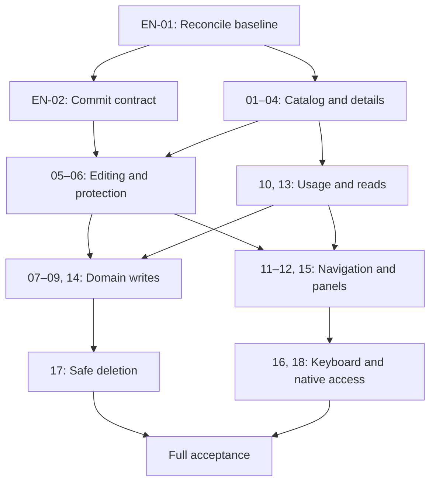

# Asset Library — Detailed Implementation Plan

Version 1.1 · 2026-09-05 · Planning baseline, not a calendar or capacity commitment.

Implementation status: in review. See the [delivery record](delivery-record.md) for the baseline, completed engineering delta, evidence and remaining acceptance.

## Goal and scope

Integrate the second selected Asset Library direction into the existing Vue 3 Obsidian interface. Deliver reviewable flows for browsing, editing, usage context, navigation, failure handling and safe management. The package contains 18 PBIs and two enablers; the [backlog index](README.md) links them all.

The React prototype remains a design tool. Retain the production stack, existing Pinia stores and designer. The existing library specification remains authoritative for domain and technical contracts not explicitly superseded.

## 1. Establish a reliable baseline

Run EN-01 first and document the following for every PBI:

| Area | Required record |
| --- | --- |
| Codebase | Branch, inspected commit, repository instructions |
| Delta | Already satisfied / needs adaptation / missing / contradictory |
| Components | Concrete existing Vue/store files |
| Data | Entity, query, DTO, command and persistence source |
| Errors | Known refusals, UI wording and allowed recovery path |
| Evidence | Existing test or new targeted check |
| Decision | Relevant D01–D14, owner and outcome |

Candidates identified in the design session include AssetLibraryRoot/Body, AssetShelf/Shelves/Row/Mark, AssetInspector/Fields/Shape/UsedIn, AssetLibraryStore, AssetSelectionStore, NewAssetForm, DialogHost and deleteAssetFlow. Confirm names at the target commit. Do not create an assumed file solely because it appears in this plan.

**Gate G0:** The field/command matrix and domain edge cases are traceable. EN-02 resolves form-wide persistence. Unknown categories and missing designer repair must not become incidental model migrations; create a separate dependency if needed.

## 2. Delivery waves

| Wave | PBIs / enablers | Reviewable outcome | Gate |
| --- | --- | --- | --- |
| A — Contracts | EN-01, EN-02 | Delta matrix, commit/conflict contract, decisions | G0 |
| B — Safe vertical slice | PBI-01–06, PBI-13–14; foundation from PBI-15 | Find, select, save metadata, protect drafts, handle specific errors | G1 |
| C — Definitions and project context | PBI-09–10, then PBI-07–08 | Creation and correct prices/units with real usage | G2 |
| D — Sources and safe management | PBI-11–12, PBI-17–18 | Real note/project/designer paths and safe deletion | G3 |
| E — Full acceptance | Complete PBI-15, PBI-16; regression of delivered PBIs | Narrow leaves, themes, keyboard and documented state acceptance | G4 |

Waves are not sprints. Independent PBIs may finish earlier when all hard dependencies are met. Build responsive and keyboard foundations in every wave; E verifies completeness and integration. Do not release an inaccessible intermediate implementation by deferring accessibility to QA.

## 3. Dependencies and work streams

This diagram groups work for readability. Exact binding dependencies are in each PBI’s frontmatter. After G0, catalog layout and the commit use case can progress separately. Coordinate changes to shared root/inspector components and favor small integrated PRs. Do not implement the same mutation through competing UI paths.

## 4. First vertical slice in detail

**Scenario:** Find existing oak flooring → select it → change supplier → explicitly save → read the actual note and row again → switch to narrow layout → return to the list.

1. EN-01/02 settle the required existing data/command paths.
2. PBI-01–04 deliver real reads; a single selection controls all sections.
3. PBI-05/06 deliver local drafts and intentional metadata commits. Price and dimensional changes are outside this slice’s demonstration.
4. PBI-13/14 cover initial read failure, a rejected write and a confirmed write with failed read-back.
5. Integrate the 460px return path from PBI-15 without losing draft or selection.
6. Verify in the actual plugin/harness, not only the React demo. Check saved data through the production repository path.

**Gate G1:** The flow succeeds; two deliberately triggered failures behave correctly; no duplicate writes or draft leakage between asset IDs; footer and return path remain reachable. Integrate and regression-check functionality that already exists.

## 5. Review and integration packages

| Package | Typical content | Review focus |
| --- | --- | --- |
| PR-A | Baseline matrix and decided UX amendments | RE/UX and architecture: scope/contracts |
| PR-B | Catalog layout, search and selection | User understanding and race safety |
| PR-C | Commit use case and form integration | Consistency, refusals and draft protection |
| PR-D | Creation, usage, prices and units | Money/Requirement rules |
| PR-E | Native navigation and geometry states | Host integration and real sources |
| PR-F | Safe deletion | References, compensation and freshness |
| PR-G | Remaining panel/keyboard integration and documentation | Complete flow and actual state captures |

These are logical review packages, not a requirement for seven large PRs. Split further according to the actual delta. Each code PR includes relevant tests and documentation updates; do not defer evidence collection to PR-G.

## 6. Data model and architecture constraints

- Asset is vault-wide; Requirement and price overrides have project context. Do not add projectId to the shared definition.
- Read outlines from actual geometry and prices from Money with explicit currency. Demo values are never production defaults.
- Preserve existing fields even when absent from the mockup. Height and shape have different sources.
- Form-wide commit must reflect actual write guarantees. Uncoordinated individual commands must not suggest atomicity.
- Reconcile freshness through existing events/reads. Avoid expensive global reindexing on every keystroke.
- Require demonstrated need and a separate migration/rollback plan for persistence changes. Visual redesign alone does not justify migration.
- Use Obsidian CSS variables and existing dialog/navigation adapters. The browser demo toolbar is not part of the plugin.

## 7. Verification and gates

| Gate | Required evidence |
| --- | --- |
| G0 | Target commit, complete field/command matrix, commit decision, delta per PBI |
| G1 | Complete first slice plus refusal and read-back failure |
| G2 | Creation without a project, preserved override, dimensional/currency limits verified |
| G3 | Real navigation targets, missing file, broken shape, safe delete reference checks |
| G4 | Screen coverage, keyboard walkthrough, host themes, relevant repository gates, current documentation |

Use existing Vitest, contract and harness suites selectively. Minimum fixtures: empty vault; only unreadable assets; duplicate names with distinct IDs; referenced asset; mixed currencies and override; external edit during a draft; late reads; damaged sidecar; successful write/failed read; new reference before delete commit. Use concrete expected values in tests.

Check leaf widths of 1440, 720, 560 and 460px plus limited height. Native theme tests cover light, dark and one custom theme. Check DE/EN labels. A 460px check alone does not establish mobile operating-system support.

Supply actual state captures for the missing AL03–AL09 and AL11 images. Each capture records commit, fixture, viewport and state. Do not mark uncaptured states as visually accepted. Existing German-localized reference screenshots do not replace English UI verification.

## 8. Capacity and estimation

Do not assign reliable duration or story points before the delta matrix and team capacity are known. After G0, estimate adaptations rather than already implemented functions. Record dependencies, review effort and risk allowance separately. Wave B is the first commitment candidate; replan C–E based on its outcome.

The delivery manager coordinates dependencies, capacity and gates. PO/RE own value, scope and domain criteria; UX checks states and interaction; engineering owns contracts, implementation and technical evidence. One person may fill multiple roles. Do not invent assignees or dates.

## 9. Risks and responses

| Risk | Early signal | Response |
| --- | --- | --- |
| Outdated specification causes duplicate implementation | Behavior already exists at the target commit | EN-01 reduces the delta |
| Shared form saves only partially | Multiple independent commands required | EN-02 defines coordination before UI commit |
| Price impact is overstated | Asset saved but Requirement propagation unresolved | Separate statuses; no blanket success claim |
| External note edit is lost | Baseline differs before write | Handle conflict; never silently overwrite |
| Category expansion grows scope | Parser migration needed for unfamiliar values | Separate follow-up; prevent UI data loss |
| Broken shape leads to a dead end | Designer refuses the same read | Explain appropriate recovery; plan repair separately |
| Lifecycle/undo is oversimplified | Proposal reuses a React snapshot | Use the existing command contract or omit the action |

## 10. Completion and rollback

Apply normal plugin-release and repository gates from the target commit. Back up a test vault and accept realistic flows there. A pure UI delta must support code rollback without deleting domain data written since deployment. If G0 establishes a migration requirement, test its backup, compatibility and restore contract separately before release.

PBIs and the plan may be placed under `docs/backlog/asset-library/`, linking screens in the designated UX folder. Adjust links when moving files. The bundled `specification/` keeps this download self-contained. This package does not itself mutate the repository.
