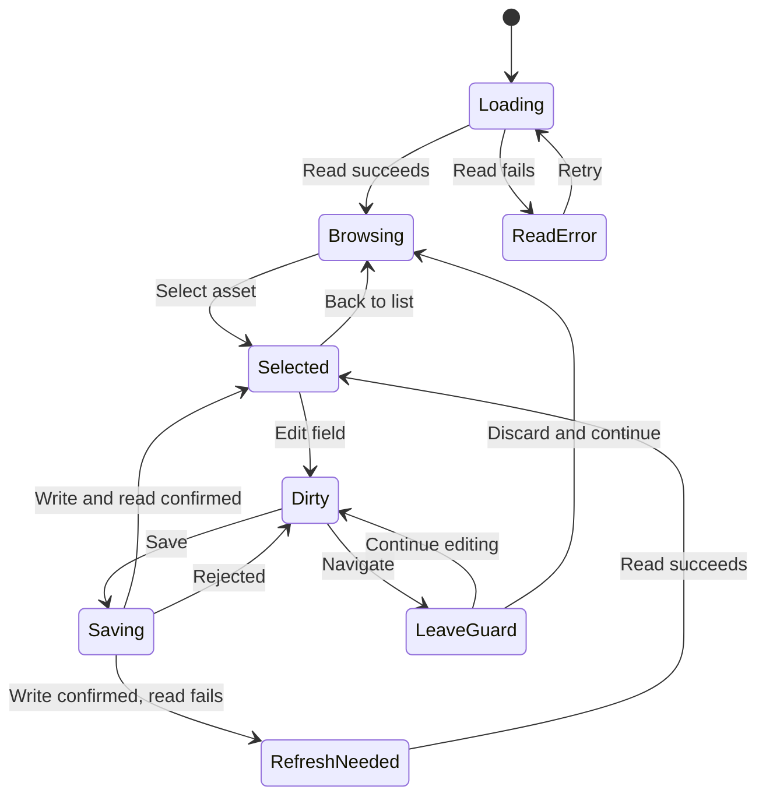

# Renovation Planner — Asset Library UI/UX Specification

Version 1.1 · 2026-09-05 · English project documentation · Design direction selected; interaction contracts proposed for refinement.

## Scope and authority

This package continues the **second displayed concept**, selected by the user: compact category shelves with aligned columns and a narrower right inspector. It specifies the vault-wide asset library inside an Obsidian workspace leaf. Production remains Vue 3, TypeScript and Pinia. The React prototype demonstrates interactions; it is not production architecture or a replacement domain model.


The visual direction is selected. New behavior defined here is a proposed implementation contract, not evidence of user validation or current implementation. Existing domain safety rules remain authoritative. Consolidate conflicts explicitly before implementation; see the [decision register](decision-register.md).

## Language policy

English is the project language for documentation, PBI titles, tasks, acceptance criteria, and technical descriptions. English action names in this package express the canonical UX meaning and must resolve through the existing localization catalogue. German remains a supported UI locale. Existing concept images and browser captures are retained as German-localized references; their pixels have not been translated and do not prove English UI acceptance.

## Read in this order

1. [Interaction rules](interaction-rules.md)
2. Individual screen specifications below
3. [Component contracts](docs/user-experience/asset-library-delivery/specification/component-library.md)
4. [Decision and reconciliation register](decision-register.md)
5. [Implementation and verification plan](docs/user-experience/asset-library-delivery/specification/implementation-plan.md)

## Mental model

An asset is a reusable definition of a thing or service. A requirement is the amount needed by a project. Procurement and incurred costs are separate. The library owns no project and shows no aggregate financial value. Used in provides context without moving ownership into a project.

## Evidence boundaries

The package includes the selected concept and two browser captures of the prototype. Screens for errors, deletion, and empty states are specified in text but do not yet have dedicated screenshots. Each screen identifies whether its image shows that state or only the shared composition. Images are not acceptance evidence for unshown states. Prototype screenshots were captured at 1363 × 936; narrow mode uses a 460px container. Exact same-viewport visual matching against the 1487 × 1058 concept was not established.

## Obsidian integration

No account, plugin logo, or standalone application navigation. Use the host’s typography, workspace behavior, semantic CSS variables, and accent. Test light, dark, and a custom theme. The demo toolbar and theme buttons belong only to the prototype.

## Source basis

Repository files were inspected earlier in this design session on main; no immutable commit was recorded. Reconcile against the target commit before delivery.

- [Existing library specification](https://github.com/Luis85/renovation-planner/blob/main/docs/user-experience/asset-library-overview-DESIGN-SPEC.md)
- [Editor design set](https://github.com/Luis85/renovation-planner/tree/main/docs/user-experience/renovation-planner-editor-specs)
- [Asset entity](https://github.com/Luis85/renovation-planner/blob/main/docs/entities/Asset.md)
- [Asset library epic](https://github.com/Luis85/renovation-planner/blob/main/docs/requirements/Asset%20library.md)
- [Library presentation components](https://github.com/Luis85/renovation-planner/tree/main/src/presentation/library)

## Screen index

| ID | Screen | User goal |
| --- | --- | --- |
| AL00 | [Browse the library](AL00-browse.md) | Recognize an existing asset before defining it again. |
| AL01 | [Inspect an asset definition](AL01-selected-object.md) | Understand an asset’s definition, shape, and usage together. |
| AL02 | [Search and evaluate results](AL02-search-results.md) | Find an asset by name, supplier, or SKU. |
| AL03 | [Create a new asset](AL03-create-object.md) | Capture a reusable definition with a small number of inputs. |
| AL04 | [Edit the definition](AL04-edit-definition.md) | Deliberately correct metadata and the library price. |
| AL05 | [Leave an asset with unsaved changes](AL05-unsaved-changes.md) | Prevent accidental loss of user input. |
| AL06 | [Understand usage and price impact](screens/AL06-usage-and-price.md) | Recognize which projects use the shared price. |
| AL07 | [Open the shape and note](screens/AL07-shape-and-note.md) | Navigate from the catalogue to geometry or documentation. |
| AL08 | [Start with an empty library](screens/AL08-empty-library.md) | Create the first asset even before a project exists. |
| AL09 | [Handle loading, saving, and data errors](screens/AL09-loading-and-errors.md) | Work with incomplete data without false confidence. |
| AL10 | [Work in a narrow panel](screens/AL10-narrow-and-theme.md) | Use the library and details safely with limited space. |
| AL11 | [Delete an asset safely](AL11-delete-object.md) | Remove a definition without damaging its usage references. |


---

---
id: AL00
status: proposed
version: 1.1
surface: asset-library
language: en
---
# AL00 — Browse the library

## Purpose and use case

Recognize an existing asset before defining it again.

**Actor:** a private renovator; no prior CAD or data-model knowledge is assumed.

## Entry and preconditions

Open the library through the Obsidian command or the project-overview entry point. Without a restored selection, the inspector starts in a neutral state.

## Visual reference


**Image status:** Layout reference with a selected asset; the neutral inspector is not shown. This retained image uses German-localized UI labels; the English prose defines the behavior and is not an assertion that an English screen has been captured.

## Structure and components

Title and vault-wide scope; search and New asset; one set of column headings; collapsible category groups; rows containing name, unit, price, waste allowance, and supplier; status bar.

Uses the shared `AssetLibraryShell`, `AssetShelves`, `AssetRow`, `AssetInspector`, and state-dependent fields, dialogs, or feedback from the [component library](docs/user-experience/asset-library-delivery/specification/component-library.md). Domain commands do not belong inside presentation components.

## Interactions and transitions

Expand or collapse a category. Select a row by click or Enter. Show selection through a leading rule and background; focus is independent. Double-clicking does not automatically open the designer.

The [central interaction rules](interaction-rules.md) additionally apply, particularly focus management, local-draft protection, and explicit write outcomes.

## Exceptions and boundaries

Empty categories remain visible and disabled for the current small taxonomy. Derive order from the production category catalogue, never from the four demo categories.

## Acceptance criteria

Selection changes no domain data; the entire row remains keyboard-activatable. Expansion updates aria-expanded. With no selection, display “Select an asset to view its definition.”

Every essential action must be available without a mouse. Errors and status include readable text; color alone is insufficient. Layout changes alter neither domain data nor the current draft.

## Verification

Test the happy path from the stated entry to the specified outcome. Then reproduce the stated exception using a controlled fixture or deliberately induced rejection. Record the screenshot and observed state separately; this specification is not evidence of a passed test.


---

---
id: AL01
status: proposed
version: 1.1
surface: asset-library
language: en
---
# AL01 — Inspect an asset definition

## Purpose and use case

Understand an asset’s definition, shape, and usage together.

**Actor:** a private renovator; no prior CAD or data-model knowledge is assumed.

## Entry and preconditions

Select a row or restore a saved valid selection.

## Visual reference


**Image status:** Browser capture of this baseline state; usage data is illustrative. This retained image uses German-localized UI labels; the English prose defines the behavior and is not an assertion that an English screen has been captured.

## Structure and components

Identity; Used in above Definition; editable fields; read-only outline and dimensions; Edit shape and Open note.

Uses the shared `AssetLibraryShell`, `AssetShelves`, `AssetRow`, `AssetInspector`, and state-dependent fields, dialogs, or feedback from the [component library](docs/user-experience/asset-library-delivery/specification/component-library.md). Domain commands do not belong inside presentation components.

## Interactions and transitions

Selection loads definition, geometry, and usage independently. Results may appear only for the current asset. A project row opens the corresponding project while preserving library context.

The [central interaction rules](interaction-rules.md) additionally apply, particularly focus management, local-draft protection, and explicit write outcomes.

## Exceptions and boundaries

Usage may be loading, empty, or failed while the definition is already readable. Failure never means unused.

## Acceptance criteria

Quickly switching between assets never shows a late result from the first asset. Project-specific prices are explicitly marked. Numeric values include unit and currency.

Every essential action must be available without a mouse. Errors and status include readable text; color alone is insufficient. Layout changes alter neither domain data nor the current draft.

## Verification

Test the happy path from the stated entry to the specified outcome. Then reproduce the stated exception using a controlled fixture or deliberately induced rejection. Record the screenshot and observed state separately; this specification is not evidence of a passed test.


---

---
id: AL02
status: proposed
version: 1.1
surface: asset-library
language: en
---
# AL02 — Search and evaluate results

## Purpose and use case

Find an asset by name, supplier, or SKU.

**Actor:** a private renovator; no prior CAD or data-model knowledge is assumed.

## Entry and preconditions

Focus the search field and enter a term.

## Visual reference


**Image status:** Composition reference only; not a capture of a filtered list. This retained image uses German-localized UI labels; the English prose defines the behavior and is not an assertion that an English screen has been captured.

## Structure and components

Search field with an accessible clear action; results in their existing groups; result count; No matching assets where applicable.

Uses the shared `AssetLibraryShell`, `AssetShelves`, `AssetRow`, `AssetInspector`, and state-dependent fields, dialogs, or feedback from the [component library](docs/user-experience/asset-library-delivery/specification/component-library.md). Domain commands do not belong inside presentation components.

## Interactions and transitions

Search ignores case and surrounding whitespace. Search name, supplier, SKU, and category. Matching groups are open during search. Clearing search restores the prior group state.

The [central interaction rules](interaction-rules.md) additionally apply, particularly focus management, local-draft protection, and explicit write outcomes.

## Exceptions and boundaries

A filtered-out selection remains selected internally; the wide inspector shows “Selected asset is outside the results.” In a narrow panel, searching displays the list without deleting a draft.

## Acceptance criteria

An unsuccessful search does not remove an existing asset or create one. The result count counts assets, not categories. Search terms are not persisted as domain changes.

Every essential action must be available without a mouse. Errors and status include readable text; color alone is insufficient. Layout changes alter neither domain data nor the current draft.

## Verification

Test the happy path from the stated entry to the specified outcome. Then reproduce the stated exception using a controlled fixture or deliberately induced rejection. Record the screenshot and observed state separately; this specification is not evidence of a passed test.


---

---
id: AL03
status: proposed
version: 1.1
surface: asset-library
language: en
---
# AL03 — Create a new asset

## Purpose and use case

Capture a reusable definition with a small number of inputs.

**Actor:** a private renovator; no prior CAD or data-model knowledge is assumed.

## Entry and preconditions

Activate New asset; handle any pending changes through AL05 first.

## Visual reference


**Image status:** The entry point is visible; the creation dialog is specified in text. This retained image uses German-localized UI labels; the English prose defines the behavior and is not an assertion that an English screen has been captured.

## Structure and components

Dialog with name, category, unit, and a clearly labelled price including currency; other existing metadata is secondary; Create and Cancel.

Uses the shared `AssetLibraryShell`, `AssetShelves`, `AssetRow`, `AssetInspector`, and state-dependent fields, dialogs, or feedback from the [component library](docs/user-experience/asset-library-delivery/specification/component-library.md). Domain commands do not belong inside presentation components.

## Interactions and transitions

Focus Name. Explicit creation performs exactly one create operation. Categories and units match the domain catalogue. Zero is a deliberately supplied price, not a substitute for unknown. After success select the new asset and category and reset search deliberately.

The [central interaction rules](interaction-rules.md) additionally apply, particularly focus management, local-draft protection, and explicit write outcomes.

## Exceptions and boundaries

A similar name is a hint linking to existing results, not an automatic merge. Creation requires no outline. Do not show success when the write was rejected.

## Acceptance criteria

Cancel creates no file. Repeated clicks while saving create no duplicate. Failure preserves every input. If price is missing and the model cannot represent unknown, require a value.

Every essential action must be available without a mouse. Errors and status include readable text; color alone is insufficient. Layout changes alter neither domain data nor the current draft.

## Verification

Test the happy path from the stated entry to the specified outcome. Then reproduce the stated exception using a controlled fixture or deliberately induced rejection. Record the screenshot and observed state separately; this specification is not evidence of a passed test.


---

---
id: AL04
status: proposed
version: 1.1
surface: asset-library
language: en
---
# AL04 — Edit the definition

## Purpose and use case

Deliberately correct metadata and the library price.

**Actor:** a private renovator; no prior CAD or data-model knowledge is assumed.

## Entry and preconditions

Select a readable asset and change a field.

## Visual reference


**Image status:** Shows fields in the clean state; saving and error states are not shown. This retained image uses German-localized UI labels; the English prose defines the behavior and is not an assertion that an English screen has been captured.

## Structure and components

Fields as in the selected design; Unsaved changes status; contextual Save and Discard actions; field-level errors.

Uses the shared `AssetLibraryShell`, `AssetShelves`, `AssetRow`, `AssetInspector`, and state-dependent fields, dialogs, or feedback from the [component library](docs/user-experience/asset-library-delivery/specification/component-library.md). Domain commands do not belong inside presentation components.

## Interactions and transitions

Input creates a local draft. Blur does not save. Save validates all changed fields, executes the agreed command path, and reads back the result. Discard restores the last confirmed baseline.

The [central interaction rules](interaction-rules.md) additionally apply, particularly focus management, local-draft protection, and explicit write outcomes.

## Exceptions and boundaries

Do not convert currency implicitly. A unit change across dimension kinds may be rejected for referenced assets. Partial saving must not appear as complete success.

## Acceptance criteria

Reject negative or non-finite prices. Show errors at the field and preserve input. Until confirmed persistence, the list displays the last saved value.

Every essential action must be available without a mouse. Errors and status include readable text; color alone is insufficient. Layout changes alter neither domain data nor the current draft.

## Verification

Test the happy path from the stated entry to the specified outcome. Then reproduce the stated exception using a controlled fixture or deliberately induced rejection. Record the screenshot and observed state separately; this specification is not evidence of a passed test.


---

---
id: AL05
status: proposed
version: 1.1
surface: asset-library
language: en
---
# AL05 — Leave an asset with unsaved changes

## Purpose and use case

Prevent accidental loss of user input.

**Actor:** a private renovator; no prior CAD or data-model knowledge is assumed.

## Entry and preconditions

Request another selection, New asset, note/designer/project navigation, or closure while the draft is changed.

## Visual reference


**Image status:** Context reference only; the protection dialog is not shown. This retained image uses German-localized UI labels; the English prose defines the behavior and is not an assertion that an English screen has been captured.

## Structure and components

Dialog identifying the asset and explaining the situation; Keep editing as the safe return; Discard and continue; no automatic save.

Uses the shared `AssetLibraryShell`, `AssetShelves`, `AssetRow`, `AssetInspector`, and state-dependent fields, dialogs, or feedback from the [component library](docs/user-experience/asset-library-delivery/specification/component-library.md). Domain commands do not belong inside presentation components.

## Interactions and transitions

Remember the triggering navigation as a pending action. Keep editing returns to the triggering field. Discard resets the draft and executes the pending action exactly once. Esc means Keep editing.

The [central interaction rules](interaction-rules.md) additionally apply, particularly focus management, local-draft protection, and explicit write outcomes.

## Exceptions and boundaries

Search, group state, and responsive changes do not discard input and therefore need no protection dialog. Forced termination of Obsidian cannot reliably be intercepted; promise no recovery guarantee.

## Acceptance criteria

Switching from A to B with a dirty A never displays A’s input under B. Closing the protection dialog does not execute navigation.

Every essential action must be available without a mouse. Errors and status include readable text; color alone is insufficient. Layout changes alter neither domain data nor the current draft.

## Verification

Test the happy path from the stated entry to the specified outcome. Then reproduce the stated exception using a controlled fixture or deliberately induced rejection. Record the screenshot and observed state separately; this specification is not evidence of a passed test.


---

---
id: AL06
status: proposed
version: 1.1
surface: asset-library
language: en
---
# AL06 — Understand usage and price impact

## Purpose and use case

Recognize which projects use the shared price.

**Actor:** a private renovator; no prior CAD or data-model knowledge is assumed.

## Entry and preconditions

Read Used in, particularly before changing a price.

## Visual reference


**Image status:** Usage section is visible; data and project links are simulated in the prototype. This retained image uses German-localized UI labels; the English prose defines the behavior and is not an assertion that an English screen has been captured.

## Structure and components

Project name and requirement count; price source Library price or Project-specific price; explicit notice when the read is incomplete.

Uses the shared `AssetLibraryShell`, `AssetShelves`, `AssetRow`, `AssetInspector`, and state-dependent fields, dialogs, or feedback from the [component library](docs/user-experience/asset-library-delivery/specification/component-library.md). Domain commands do not belong inside presentation components.

## Interactions and transitions

A project row opens the existing project-detail view. Edit project-specific prices only there. Library changes do not change override definitions or historical actual costs.

The [central interaction rules](interaction-rules.md) additionally apply, particularly focus management, local-draft protection, and explicit write outcomes.

## Exceptions and boundaries

Do not claim all costs are already updated: persisted requirements, cascades, and price sources must be reconciled with the current cost model. Failed refresh remains visible.

## Acceptance criteria

Saving the library definition does not replace a project-specific price. Currency differences are not converted. Usage is shown as empty only after a successful read.

Every essential action must be available without a mouse. Errors and status include readable text; color alone is insufficient. Layout changes alter neither domain data nor the current draft.

## Verification

Test the happy path from the stated entry to the specified outcome. Then reproduce the stated exception using a controlled fixture or deliberately induced rejection. Record the screenshot and observed state separately; this specification is not evidence of a passed test.


---

---
id: AL07
status: proposed
version: 1.1
surface: asset-library
language: en
---
# AL07 — Open the shape and note

## Purpose and use case

Navigate from the catalogue to geometry or documentation.

**Actor:** a private renovator; no prior CAD or data-model knowledge is assumed.

## Entry and preconditions

Activate Edit shape or Open note on the selected asset.

## Visual reference


**Image status:** Actions are visible; prototype dialogs only explain the intended transitions. This retained image uses German-localized UI labels; the English prose defines the behavior and is not an assertion that an English screen has been captured.

## Structure and components

Measured outline with dimensions or an explicitly named state; two distinct action labels.

Uses the shared `AssetLibraryShell`, `AssetShelves`, `AssetRow`, `AssetInspector`, and state-dependent fields, dialogs, or feedback from the [component library](docs/user-experience/asset-library-delivery/specification/component-library.md). Domain commands do not belong inside presentation components.

## Interactions and transitions

Edit shape uses the existing designer-reveal path for the asset ID. Open note uses the actual resolved note path. Apply AL05 first where necessary. Returning preserves selection, search, and groups.

The [central interaction rules](interaction-rules.md) additionally apply, particularly focus management, local-draft protection, and explicit write outcomes.

## Exceptions and boundaries

Not read, no outline, unscaled, measured, and read failure stay distinct. Offer designer navigation for unreadable geometry only if the destination supports a genuinely functional recovery action.

## Acceptance criteria

Never infer measurements from an icon. A missing note produces a specific state and updates the catalogue. Do not embed a copy of the complete designer inside the library.

Every essential action must be available without a mouse. Errors and status include readable text; color alone is insufficient. Layout changes alter neither domain data nor the current draft.

## Verification

Test the happy path from the stated entry to the specified outcome. Then reproduce the stated exception using a controlled fixture or deliberately induced rejection. Record the screenshot and observed state separately; this specification is not evidence of a passed test.


---

---
id: AL08
status: proposed
version: 1.1
surface: asset-library
language: en
---
# AL08 — Start with an empty library

## Purpose and use case

Create the first asset even before a project exists.

**Actor:** a private renovator; no prior CAD or data-model knowledge is assumed.

## Entry and preconditions

A successful catalogue read returns zero readable assets and zero known unreadable asset files.

## Visual reference


**Image status:** Style reference only; the empty state is not shown. This retained image uses German-localized UI labels; the English prose defines the behavior and is not an assertion that an English screen has been captured.

## Structure and components

Title; short explanation of the shared catalogue; Create first asset; no empty inspector form or invented examples.

Uses the shared `AssetLibraryShell`, `AssetShelves`, `AssetRow`, `AssetInspector`, and state-dependent fields, dialogs, or feedback from the [component library](docs/user-experience/asset-library-delivery/specification/component-library.md). Domain commands do not belong inside presentation components.

## Interactions and transitions

Creation opens AL03. On success replace the empty state with the list and select the asset.

The [central interaction rules](interaction-rules.md) additionally apply, particularly focus management, local-draft protection, and explicit write outcomes.

## Exceptions and boundaries

Unreadable files mean the library is not genuinely empty. Loading failure must not imply zero stock or ask the user to redefine existing assets.

## Acceptance criteria

A vault without projects can create and find assets. Do not copy prices or shape values from a demo asset.

Every essential action must be available without a mouse. Errors and status include readable text; color alone is insufficient. Layout changes alter neither domain data nor the current draft.

## Verification

Test the happy path from the stated entry to the specified outcome. Then reproduce the stated exception using a controlled fixture or deliberately induced rejection. Record the screenshot and observed state separately; this specification is not evidence of a passed test.


---

---
id: AL09
status: proposed
version: 1.1
surface: asset-library
language: en
---
# AL09 — Handle loading, saving, and data errors

## Purpose and use case

Work with incomplete data without false confidence.

**Actor:** a private renovator; no prior CAD or data-model knowledge is assumed.

## Entry and preconditions

Initial loading, a failed read/write, an external edit, or a disappeared selection.

## Visual reference


**Image status:** Layout reference only; error states still require dedicated visual acceptance. This retained image uses German-localized UI labels; the English prose defines the behavior and is not an assertion that an English screen has been captured.

## Structure and components

Initial loading notice; persistent warning strip when previous data exists; explanation and appropriate action within the affected section.

Uses the shared `AssetLibraryShell`, `AssetShelves`, `AssetRow`, `AssetInspector`, and state-dependent fields, dialogs, or feedback from the [component library](docs/user-experience/asset-library-delivery/specification/component-library.md). Domain commands do not belong inside presentation components.

## Interactions and transitions

Retry repeats only the failed operation. Where appropriate, repair an unreadable note through Open note. A newer schema version identifies updating the plugin as the remedy. Write failure preserves the draft.

The [central interaction rules](interaction-rules.md) additionally apply, particularly focus management, local-draft protection, and explicit write outcomes.

## Exceptions and boundaries

A successful write followed by failed read-back means “Saved · Refresh needed”, not Save failed. Resolve unknown write outcomes before repeating a non-idempotent operation.

## Acceptance criteria

Old search or selection responses cannot replace newer state. Null, missing, unreadable, and not loaded are distinct. A conflict never silently overwrites external changes.

Every essential action must be available without a mouse. Errors and status include readable text; color alone is insufficient. Layout changes alter neither domain data nor the current draft.

## Verification

Test the happy path from the stated entry to the specified outcome. Then reproduce the stated exception using a controlled fixture or deliberately induced rejection. Record the screenshot and observed state separately; this specification is not evidence of a passed test.


---

---
id: AL10
status: proposed
version: 1.1
surface: asset-library
language: en
---
# AL10 — Work in a narrow panel

## Purpose and use case

Use the library and details safely with limited space.

**Actor:** a private renovator; no prior CAD or data-model knowledge is assumed.

## Entry and preconditions

The Obsidian leaf becomes narrower; layout responds to container width.

## Visual reference


**Image status:** Browser capture of the dark 460px detail panel; not native smartphone certification. This retained image uses German-localized UI labels; the English prose defines the behavior and is not an assertion that an English screen has been captured.

## Structure and components

Below 560px display one content surface: list or inspector with Back to library. Keep status visible. Inherit the host theme.

Uses the shared `AssetLibraryShell`, `AssetShelves`, `AssetRow`, `AssetInspector`, and state-dependent fields, dialogs, or feedback from the [component library](docs/user-experience/asset-library-delivery/specification/component-library.md). Domain commands do not belong inside presentation components.

## Interactions and transitions

Selection opens details. Back restores the list with the same search, groups, and scroll position. Width changes preserve asset ID and draft. Searching starts in the list.

The [central interaction rules](interaction-rules.md) additionally apply, particularly focus management, local-draft protection, and explicit write outcomes.

## Exceptions and boundaries

At 560–719px every column must retain a useful minimum width; switch to one pane earlier if needed rather than overlap content. Short height permits independent scrolling.

## Acceptance criteria

At 460px there is no horizontal page scrolling. Back is keyboard-accessible. Dark/custom themes preserve visible focus, status words, and readable text.

Every essential action must be available without a mouse. Errors and status include readable text; color alone is insufficient. Layout changes alter neither domain data nor the current draft.

## Verification

Test the happy path from the stated entry to the specified outcome. Then reproduce the stated exception using a controlled fixture or deliberately induced rejection. Record the screenshot and observed state separately; this specification is not evidence of a passed test.


---

---
id: AL11
status: proposed
version: 1.1
surface: asset-library
language: en
---
# AL11 — Delete an asset safely

## Purpose and use case

Remove a definition without damaging its usage references.

**Actor:** a private renovator; no prior CAD or data-model knowledge is assumed.

## Entry and preconditions

Secondary Delete asset action in the detail menu; not the primary action on a catalogue row.

## Visual reference


**Image status:** Detail context only; the delete action is not implemented in the prototype. This retained image uses German-localized UI labels; the English prose defines the behavior and is not an assertion that an English screen has been captured.

## Structure and components

Current asset name, checked usage, explicit effects; Cancel and a clearly labelled final delete action only when allowed.

Uses the shared `AssetLibraryShell`, `AssetShelves`, `AssetRow`, `AssetInspector`, and state-dependent fields, dialogs, or feedback from the [component library](docs/user-experience/asset-library-delivery/specification/component-library.md). Domain commands do not belong inside presentation components.

## Interactions and transitions

Recheck references before confirmation. Delete an unreferenced asset through the existing DeleteAsset path. For references, use only existing supported resolution; otherwise show usage and block deletion.

The [central interaction rules](interaction-rules.md) additionally apply, particularly focus management, local-draft protection, and explicit write outcomes.

## Exceptions and boundaries

While usage checking runs or has failed, deletion is unavailable and its reason is explained. Never automatically delete requirements or project data. Handle geometry and price references through existing transaction/compensation contracts.

## Acceptance criteria

The command catches references created between checking and commit. After success continue selection meaningfully; do not optimistically remove the asset after failure. No blanket undo promise without real restoration.

Every essential action must be available without a mouse. Errors and status include readable text; color alone is insufficient. Layout changes alter neither domain data nor the current draft.

## Verification

Test the happy path from the stated entry to the specified outcome. Then reproduce the stated exception using a controlled fixture or deliberately induced rejection. Record the screenshot and observed state separately; this specification is not evidence of a passed test.


---

# Asset Library — Interaction Rules

Version 1.1 · Proposed behavior contract · 2026-09-05 · Language: English

## 1. State ownership

| State | Owner | Persistence |
| --- | --- | --- |
| Asset definition, price, unit | Domain and repository | Existing vault files |
| Outline and other geometry | Existing geometry contract | Existing sidecar |
| Selected asset, expanded groups | Workspace/view state | Per leaf under the host contract |
| Search text and scroll position | UI state | Current view; never new asset properties |
| Draft and field errors | Form state bound to asset ID | Never silently written to the note or global store |
| Loading, writing and refreshing | Each operation/section | Transient |

The list and inspector share one selection. Reads carry a generation identifier; discard results for an earlier selection. Each draft belongs to exactly one asset ID and baseline version.

## 2. Navigation and selection

- Click, Enter or Space on a row selects its asset without changing data.
- A single click opens neither the designer nor placement. The library has no implicit target plan.
- Distinguish focus from selection. Use `aria-current` for a button representing the current row; do not put invalid `aria-selected` on ordinary buttons.
- Group headers are buttons with `aria-expanded`. Collapsed content leaves the tab order. Empty groups in the current small taxonomy are not interactive.
- Reopening the library follows the existing reveal/singleton contract; it does not create another tab each time.
- Open projects, the designer and notes through established navigation functions. Preserve context on return; never silently replace a lost selection with an arbitrary asset.

## 3. Search

Search reads local data, responds to input and never changes definitions. Trim input and compare case-insensitively across name, supplier, SKU and category. Confirm locale behavior and production search semantics before integration; do not claim new fuzzy search.

Expand matching groups while searching. Preserve previous expansion state separately and restore it when search clears. No results offers Clear search and differs in wording and structure from an empty library.

Filtering alone does not clear selection. A wide inspector shows “Selected asset is outside the search results” when appropriate. In a narrow leaf, search opens the results list while preserving the local draft. Selecting another asset invokes draft protection when necessary.

## 4. Editing and commit

The selected direction presents one coherent definition. The proposal is **explicit saving of the form draft**. This may amend existing field-by-field inline editing. The prototype does not establish atomic production persistence.

1. Retain baseline data and its version/expected value.
2. Capture changes locally and show “Unsaved changes”.
3. Validate in the client for useful feedback; domain validation remains authoritative.
4. Save invokes one agreed commit path. Prevent duplicate execution during an active commit.
5. Do not blindly dispatch independent commands and report blanket success. If no transaction exists, define a coordinated use case or an explicitly field-based UI first.
6. Distinguish write success from read-back success. After a confirmed write and failed read-back, retain the confirmed state and offer Refresh; do not repeat the write.
7. Rejected saves preserve the draft and specific field errors. Never silently reset it.
8. External changes since draft creation produce a conflict. Show differences for affected fields. Reload discards only after an explicit choice; Continue editing preserves the draft. No silent last-write-wins policy.

Show Undo only when production command history can safely reverse the operation. The prototype’s array snapshot is not a production undo contract.

## 5. Field rules

| Field | UI rule | Domain reconciliation |
| --- | --- | --- |
| Name | Required, trimmed, not visually blank | Existing length/name constraints |
| Category | Production vocabulary; never silently replace unknown values | Treat extensibility separately from the current parser |
| Unit | Visible, understandable unit | Protect references and dimensional type |
| Library price | Decimal input, explicit currency, finite and nonnegative | Money precision, currency and command refusals |
| Waste allowance | Percentage in UI, finite and nonnegative | Verify percent/factor conversion and bounds |
| Supplier / SKU | Optional, no invented defaults | Preserve existing field types; do not invent a relation |
| Height | Only if supported by the existing asset contract; explicit unit | SetAssetHeight and partial-commit risk |
| Outline / derived dimensions | Read-only in the catalog | Read geometry; never infer from icon size |

The UI may accept comma and period decimal separators, but must not silently interpret ambiguous thousands separators. Display invalid input feedback at its field. Show currency with the value; never convert automatically. Missing price differs from zero. If the model cannot represent unknown price, creation requires an intentional value.

The demo shows only seven fields. Saving must preserve other production properties. Updates send only supported changes and retain the remaining record.

## 6. Shared price definition

The library shows a shared default price. Usage shows each project’s price basis. Project overrides are stored separately and maintained in project details. A library correction overwrites neither overrides, quotations nor historical actual costs.

The existing cost/event contract determines which Requirement values are recalculated or marked stale. Do not claim “All project costs updated” when only the asset write is confirmed. A failed downstream update requires persistent, specific feedback.

Do not show a catalog total or sum prices across currencies. Counts in Used in count references, not inventory or quantities.

## 7. Draft protection

Guard actions that would abandon a draft: another selection, creation, opening a note or designer, project navigation, and normal closing where the host supports vetoing it. The safe default is Continue editing. The alternative is Discard and continue. Esc closes only the dialog and executes no pending action.

Width changes, search and group expansion need no guard because they preserve the draft. Restart or forced termination has no recovery guarantee without a separate recovery contract. Do not introduce automatic saving to avoid this limitation.

## 8. Asynchronous states

| State | Presentation | Allowed next action |
| --- | --- | --- |
| Initial load | Brief loading message; no false zeros | Wait; retry after failure |
| Valid data, refresh pending | Preserve content, subtle status | Read; dependent writes follow freshness contract |
| Refresh failed | Content and persistent warning | Refresh |
| Section read failed | Local error; other sections remain | Reload that section |
| Write pending | Busy Save; retain draft | No second commit |
| Write rejected | Field error or specific form error | Correct and save |
| Write confirmed, read-back failed | Saved · Refresh needed | Repeat the read |
| Write outcome unknown | Check status | Resolve before retrying |
| Asset disappeared | Asset is no longer available | Return to library; never edit another record |
| Newer schema version | Plugin update required | Do not suggest field edits as repair |

Unknown usage blocks deletion. An asset can validly have no shape. A damaged shape is a read error, not “No outline yet”.

## 9. Keyboard and focus

| Input | Behavior |
| --- | --- |
| Tab / Shift+Tab | Natural order: search, New, groups/rows, inspector |
| Enter / Space on row | Select |
| Enter / Space on group header | Expand/collapse |
| Enter in form | Only valid explicit submission; no duplicate action |
| Esc in ordinary field | Does not discard the entire form |
| Esc in dialog | Safe cancellation under the dialog contract |
| Open dialog | Focus first meaningful input; contain focus |
| Close dialog | Restore trigger focus or stable fallback |
| Back to list | Focus selected visible row, otherwise search |

Preserve and test existing arrow-key navigation. It must not intercept text input or block Obsidian-wide shortcuts. Register new shortcuts as local actions and check host bindings. Announce status sparingly through `aria-live=polite`; associate errors with labelled fields and use alerts when necessary.

## 10. Responsive layout and theme

Use workspace-container width, not browser width. At 720px and above, list and inspector sit side by side. At 560–719px, use a compact inspector and remove secondary columns. Below 560px, show list or details with a return path. These thresholds come from the existing specification and need testing with real German label lengths. The selected wide ratio may be proportional but needs practical minimum widths.

Keep the status bar outside scrolling content. Remove column headings together with their cells. Never rotate text vertically or compress it excessively. Production uses host themes without its own theme selector: DOM styles use Obsidian variables, while canvas/geometry colors use the existing adapter.

## 11. Destructive actions

Deletion is secondary. Check current references, guard again inside the command and use existing reference resolution. Never automatically remove project requirements. Usage-read failures block deletion with a readable reason. After success, focus the next visible row, otherwise the previous row, otherwise search. An empty list enters AL08.

## 12. Transition model



The diagram simplifies destinations after discard. The pending action may select another asset, create one or open another plugin view. Section read states are independent of form state.


---

# Asset Library — Component contracts

Status: proposed composition; reuse existing Vue components. Proposed wrapper names remain conceptual until reconciled with code.

| Component | Responsibility | Inputs / outputs | States |
| --- | --- | --- | --- |
| AssetLibraryShell | Arrange toolbar, content, inspector, and status for leaf width | width, selection, requestBack | wide, compact, single pane |
| AssetLibraryToolbar | Search and creation entry | query, searchChanged, createRequested | ready, searching |
| AssetShelves / AssetShelf | Render existing categories and grouped assets | categories, entries, expanded, toggle | empty, open, closed, filtered |
| AssetRow | Identity and comparison values | assetSummary, current, select | normal, focused, current |
| AssetMark | Display actual geometry state | outlineReadModel, state | not read, no shape, unscaled, measured, error |
| AssetInspector | Combine one selected asset and section states | assetId, sections, navigation intents | neutral, ready, missing, unreadable |
| AssetDefinitionForm | Hold an ID-bound draft and field errors | baseline, draftChanged, saveRequested, discard | clean, dirty, validating, saving, error |
| AssetUsageList | Project usage with price sources | usageRows, status, openProject | loading, empty, ready, error |
| AssetShapeSummary | Read-only dimensions and designer entry | geometryReadModel, openDesigner | as AssetMark |
| NewAssetDialog | Capture a minimal new definition | defaults, createRequested, cancel | draft, saving, error |
| UnsavedChangesDialog | Protect pending navigation | assetName, continueEditing, discardAndContinue | open |
| AssetDeleteFlow | Present the existing safe deletion path | selectedId, usageStatus, delete intent | checking, blocked, confirmable, error |
| PersistentWarning / SaveState | Report persistent problems and accurate save status | operation state, retry | saved, dirty, saving, failed, refresh needed |

## Reuse

The inspected codebase contains `AssetLibraryRoot.vue`, `AssetLibraryBody.vue`, `AssetShelf.vue`, `AssetShelves.vue`, `AssetRow.vue`, `AssetMark.vue`, `AssetInspector.vue`, `AssetInspectorFields.vue`, `AssetInspectorShape.vue`, and `AssetInspectorUsedIn.vue`, plus `AssetLibraryStore`, `AssetSelectionStore`, `NewAssetForm.vue`, and `deleteAssetFlow.ts`.

Consolidate these first. Do not copy React demo code into a second production library. A unified form may compose existing field components, but must not accidentally trigger their commands in addition to its own commit.

## Shared contracts

- One asset ID is the selection source for row, inspector, and writes.
- Presentation components know no concrete repository implementations.
- Inputs are read-only; outputs express user intent. Application use cases coordinate writes and navigation.
- Dialogs use existing DialogHost, focus management, and translation catalogues.
- A category icon in AssetMark is never proof of geometry.
- Derived values are identifiable and lead to their actual source when editing is requested.
- List and error states render with identical inputs under light, dark, and custom themes.

## Theme roles

Use `--background-primary`, `--background-secondary`, `--background-modifier-border`, `--background-modifier-hover`, `--text-normal`, `--text-muted`, `--interactive-accent`, and existing error/focus roles. Never assume a particular accent color. Status words and the selection rule accompany color coding.

## Component verification

Target concurrent selection reads; switching forms during a write; hidden rows in tab order; dialog focus after cancellation; long German labels at 460px; and prices in different currencies. Avoid purely structural tests that duplicate component markup.


---

# Decisions and reconciliation

## Status

The user confirmed the second displayed visual direction. This does not automatically confirm every technical or domain simplification in the prototype. Refine the following proposals for implementation.

| ID | Topic | Decision / proposal | Required implementation reconciliation |
| --- | --- | --- | --- |
| D01 | Structure | Selected: compact category groups, aligned columns, right inspector | Evolve the existing shelves composition |
| D02 | Column headings | Selected mock shows one shared header row; earlier specification says none | Record an explicit visual amendment; hide headings with their columns |
| D03 | Saving | Proposed: unified draft with Save/Discard | Check field-level commands and atomicity; do not claim this already exists |
| D04 | Taxonomy | Four demo categories are only fixtures | Retain production vocabulary; do not coerce unknown values into Custom |
| D05 | Dimensions and icons | Demo uses type icons and a generated plank | Use actual geometry and error states in production |
| D06 | Usage | Above price fields, mark project overrides | Verify reads and refresh/cascade contracts |
| D07 | Height / other fields | Mock does not cover the entire asset | Preserve existing fields and expose them in groups; no implicit deletion |
| D08 | Price currency | Always explicit with library price | Do not turn EUR fixtures into a global currency |
| D09 | Zero price | No automatic zero for unknown | Clarify creation defaults and model support |
| D10 | Deletion | Secondary action with checked reference state | Reuse deletion and compensation contracts |
| D11 | Undo | Offer only with safe production history | Do not copy array-snapshot undo |
| D12 | Bases | Native notes stay accessible; library does not replace Bases | Reconcile epic completion with the existing recipe/.base strategy |
| D13 | Many empty categories | Current small taxonomy shows empty groups | Decide a rule when configurable taxonomies become large; do not invent an arbitrary limit |
| D14 | Damaged geometry | No designer entry without a working destination | Specify designer recovery separately if absent |

## Engineering reconciliation task

Record the target commit. For each visible field document its source, read query, write command, validation, persistence, event, and refusal. Keep Asset, AssetShape, AssetPriceOverride, and Requirement distinct. Check measurement units, currency, and waste conversion against existing tests. Only then mark UI PBIs ready.

The existing extensive asset-library specification contains historical statements such as “No code exists” despite Vue components being present. Treat these as documentation drift, not instructions to rebuild. This package supplements UX; it does not replace detailed failure and persistence contracts wholesale.

## Outstanding visual verification

Dedicated mockups or harness captures are missing for AL03–AL09 and AL11. Render those states against these text/control contracts before visual acceptance. Existing screenshots are explicitly identified as baseline or reference images in the screen files, and their German localization is identified.


---

# Implementation and Verification

## Goal

Integrate the selected design into the existing Obsidian Asset Library with consistent specified interactions. The React prototype is a design reference, not a replacement production system.

## Sequence and dependencies

| Package | Deliverable / use case | Dependencies | Complete when |
| --- | --- | --- | --- |
| WP0 | Reconcile existing data model and UI contracts | None | Target commit, field/command mapping and decisions D01–D14 documented |
| WP1 | Browse and select an asset (AL00–02) | WP0 | Shelves, shared heading row, search and one selection source work |
| WP2 | Explicitly edit the definition (AL04–05) | WP0, WP1 | Commit strategy agreed; drafts, errors and navigation protected |
| WP3 | Create an asset (AL03, AL08) | WP1, WP2 | Empty vault through newly selected asset works end to end |
| WP4 | Open usage and sources (AL06–07) | WP1, WP2 | Real usage/override reads and navigation integrated |
| WP5 | Handle data errors and external changes (AL09) | WP2–4 | Conflicts, write/read-back and partial failures distinguishable |
| WP6 | Narrow panels and themes (AL10) | WP1; continuously WP2–5 | 460px and host themes work without state loss |
| WP7 | Safely remove referenced assets (AL11) | WP0, WP4, WP5 | Safe refusal/resolution paths and focus succession work |
| WP8 | Accept screens and reconcile documentation | WP1–7 | Real state captures and updated specification available |

## First vertical slice

Open an existing library → search for an asset → select it → correct its supplier → explicitly save → read back the confirmed row and note → open the narrow inspector → return to the list. Verify the saving state, a domain refusal and a failed read-back. Geometry creation, import and a complete asset designer are outside this slice.

WP0 is mandatory. If existing commands save individual fields, document a coordinated commit strategy before UI implementation. One shared button must not imply unsupported atomicity.

## Example PBIs as use cases

| Epic | Feature | PBI |
| --- | --- | --- |
| Asset library | Browse catalog | Find an existing asset by SKU |
| Asset library | Maintain definitions | Change the library price and understand project price sources |
| Asset library | Maintain definitions | Continue editing after a rejected save |
| Asset library | Maintain definitions | Switch assets without accidentally losing changes |
| Asset library | Navigation | Open the selected asset’s note |
| Asset library | Safe management | Review an asset with existing usage and delete it when allowed |

Tasks include UI work, use-case reconciliation and targeted verification. Follow the project lifecycle: designed → scoped → tech refined → estimated → ready. This UX draft does not automatically make a PBI ready.

## Acceptance scenarios

```gherkin
Feature: Edit a shared definition
  Scenario: Preserve a project override
    Given an asset has a library price and an override for project B
    When the user successfully changes the library price
    Then the override for project B remains unchanged
    And the usage section identifies its override price basis

  Scenario: Read-back fails after a confirmed write
    Given the write command confirms a valid change
    When the subsequent read fails
    Then the UI shows "Saved · Refresh needed"
    And Refresh does not invoke a second write command

  Scenario: Switch selection with a dirty draft
    Given asset A has an edited draft
    When the user selects asset B
    Then the leave guard opens
    When the user chooses Continue editing
    Then asset A remains selected with its draft

  Scenario: Usage check fails
    Given asset usage could not be read
    When the user views the delete action
    Then deletion cannot be executed
    And its blocking reason is readable
```

## Targeted test matrix

- 1440px, 720px, 560px and 460px leaves, plus limited height: main view, dialog and error field.
- Light, dark and one custom theme: focus, selection and warning text.
- Empty vault, only unreadable assets, no results, long German name, large prices and another currency.
- Selection race A→B, late search result, external note edit, unknown category and newer schema version.
- Double-clicked creation, rejected write, confirmed write/failed read, reference change before delete commit.
- Keyboard through search, row, form, leave guard and Back; actual screen-reader checks for relevant states.

Extend existing Vitest and harness tests for concrete risks. Earlier browser checks cover only the demo happy path and a few errors; they do not replace integration tests.

## Delivery

Place screens and images under `docs/user-experience/renovation-planner-asset-library-specs/`. Amend the older specification with a link and identify exactly which sections are superseded. Component mapping and implementation plans reference the inspected commit. This download does not modify the repository. The detailed delivery baseline is [the package implementation plan](docs/user-experience/asset-library-delivery/implementation-plan.md).
