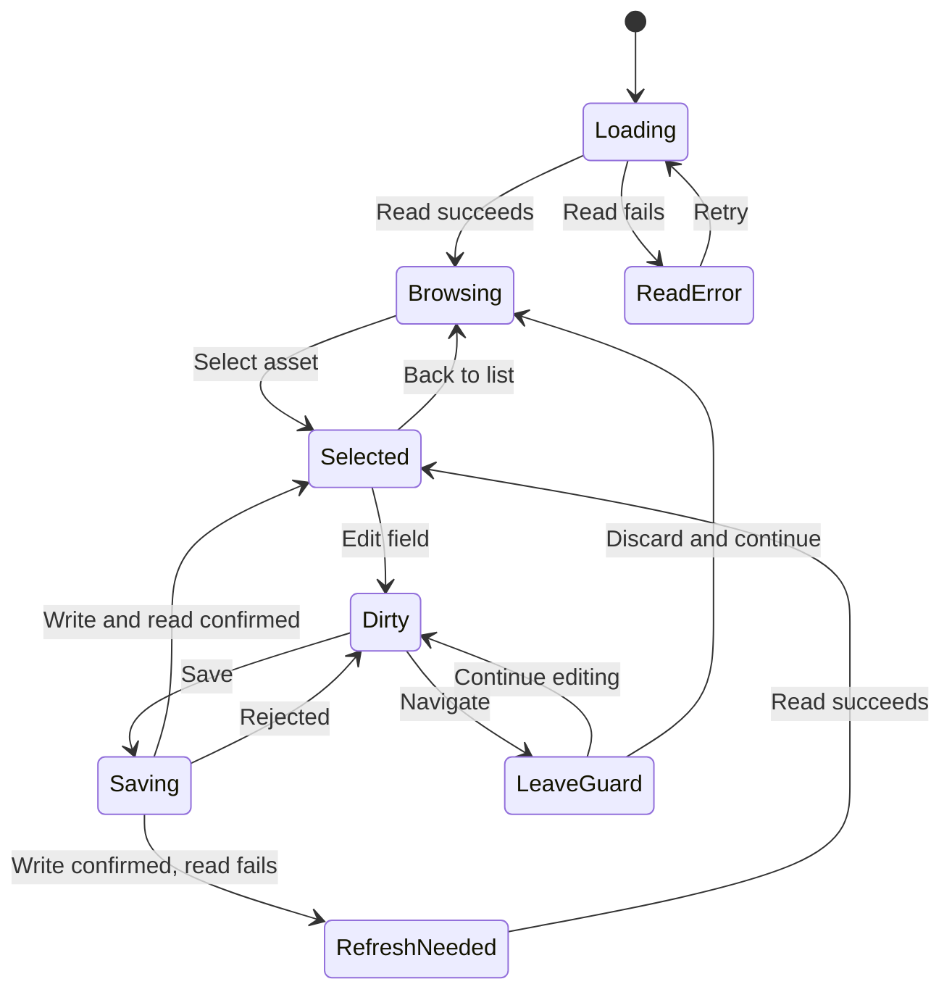

# Asset Library — Interaction Rules

Version 1.1 · Proposed behavior contract · 2026-09-05 · Language: English

## 1. State ownership

| State | Owner | Persistence |
| --- | --- | --- |
| Asset definition, price, unit | Domain and repository | Existing vault files |
| Outline and other geometry | Existing geometry contract | Existing sidecar |
| Selected asset, expanded groups | Workspace/view state | Per leaf under the host contract |
| Search text and scroll position | UI state | Current view; never new asset properties |
| Draft and field errors | Form state bound to asset ID | Never silently written to the note or global store |
| Loading, writing and refreshing | Each operation/section | Transient |

The list and inspector share one selection. Reads carry a generation identifier; discard results for an earlier selection. Each draft belongs to exactly one asset ID and baseline version.

## 2. Navigation and selection

- Click, Enter or Space on a row selects its asset without changing data.
- A single click opens neither the designer nor placement. The library has no implicit target plan.
- Distinguish focus from selection. Use `aria-current` for a button representing the current row; do not put invalid `aria-selected` on ordinary buttons.
- Group headers are buttons with `aria-expanded`. Collapsed content leaves the tab order. Empty groups in the current small taxonomy are not interactive.
- Reopening the library follows the existing reveal/singleton contract; it does not create another tab each time.
- Open projects, the designer and notes through established navigation functions. Preserve context on return; never silently replace a lost selection with an arbitrary asset.

## 3. Search

Search reads local data, responds to input and never changes definitions. Trim input and compare case-insensitively across name, supplier, SKU and category. Confirm locale behavior and production search semantics before integration; do not claim new fuzzy search.

Expand matching groups while searching. Preserve previous expansion state separately and restore it when search clears. No results offers Clear search and differs in wording and structure from an empty library.

Filtering alone does not clear selection. A wide inspector shows “Selected asset is outside the search results” when appropriate. In a narrow leaf, search opens the results list while preserving the local draft. Selecting another asset invokes draft protection when necessary.

## 4. Editing and commit

The selected direction presents one coherent definition. The proposal is **explicit saving of the form draft**. This may amend existing field-by-field inline editing. The prototype does not establish atomic production persistence.

1. Retain baseline data and its version/expected value.
2. Capture changes locally and show “Unsaved changes”.
3. Validate in the client for useful feedback; domain validation remains authoritative.
4. Save invokes one agreed commit path. Prevent duplicate execution during an active commit.
5. Do not blindly dispatch independent commands and report blanket success. If no transaction exists, define a coordinated use case or an explicitly field-based UI first.
6. Distinguish write success from read-back success. After a confirmed write and failed read-back, retain the confirmed state and offer Refresh; do not repeat the write.
7. Rejected saves preserve the draft and specific field errors. Never silently reset it.
8. External changes since draft creation produce a conflict. Show differences for affected fields. Reload discards only after an explicit choice; Continue editing preserves the draft. No silent last-write-wins policy.

Show Undo only when production command history can safely reverse the operation. The prototype’s array snapshot is not a production undo contract.

## 5. Field rules

| Field | UI rule | Domain reconciliation |
| --- | --- | --- |
| Name | Required, trimmed, not visually blank | Existing length/name constraints |
| Category | Production vocabulary; never silently replace unknown values | Treat extensibility separately from the current parser |
| Unit | Visible, understandable unit | Protect references and dimensional type |
| Library price | Decimal input, explicit currency, finite and nonnegative | Money precision, currency and command refusals |
| Waste allowance | Percentage in UI, finite and nonnegative | Verify percent/factor conversion and bounds |
| Supplier / SKU | Optional, no invented defaults | Preserve existing field types; do not invent a relation |
| Height | Only if supported by the existing asset contract; explicit unit | SetAssetHeight and partial-commit risk |
| Outline / derived dimensions | Read-only in the catalog | Read geometry; never infer from icon size |

The UI may accept comma and period decimal separators, but must not silently interpret ambiguous thousands separators. Display invalid input feedback at its field. Show currency with the value; never convert automatically. Missing price differs from zero. If the model cannot represent unknown price, creation requires an intentional value.

The demo shows only seven fields. Saving must preserve other production properties. Updates send only supported changes and retain the remaining record.

## 6. Shared price definition

The library shows a shared default price. Usage shows each project’s price basis. Project overrides are stored separately and maintained in project details. A library correction overwrites neither overrides, quotations nor historical actual costs.

The existing cost/event contract determines which Requirement values are recalculated or marked stale. Do not claim “All project costs updated” when only the asset write is confirmed. A failed downstream update requires persistent, specific feedback.

Do not show a catalog total or sum prices across currencies. Counts in Used in count references, not inventory or quantities.

## 7. Draft protection

Guard actions that would abandon a draft: another selection, creation, opening a note or designer, project navigation, and normal closing where the host supports vetoing it. The safe default is Continue editing. The alternative is Discard and continue. Esc closes only the dialog and executes no pending action.

Width changes, search and group expansion need no guard because they preserve the draft. Restart or forced termination has no recovery guarantee without a separate recovery contract. Do not introduce automatic saving to avoid this limitation.

## 8. Asynchronous states

| State | Presentation | Allowed next action |
| --- | --- | --- |
| Initial load | Brief loading message; no false zeros | Wait; retry after failure |
| Valid data, refresh pending | Preserve content, subtle status | Read; dependent writes follow freshness contract |
| Refresh failed | Content and persistent warning | Refresh |
| Section read failed | Local error; other sections remain | Reload that section |
| Write pending | Busy Save; retain draft | No second commit |
| Write rejected | Field error or specific form error | Correct and save |
| Write confirmed, read-back failed | Saved · Refresh needed | Repeat the read |
| Write outcome unknown | Check status | Resolve before retrying |
| Asset disappeared | Asset is no longer available | Return to library; never edit another record |
| Newer schema version | Plugin update required | Do not suggest field edits as repair |

Unknown usage blocks deletion. An asset can validly have no shape. A damaged shape is a read error, not “No outline yet”.

## 9. Keyboard and focus

| Input | Behavior |
| --- | --- |
| Tab / Shift+Tab | Natural order: search, New, groups/rows, inspector |
| Enter / Space on row | Select |
| Enter / Space on group header | Expand/collapse |
| Enter in form | Only valid explicit submission; no duplicate action |
| Esc in ordinary field | Does not discard the entire form |
| Esc in dialog | Safe cancellation under the dialog contract |
| Open dialog | Focus first meaningful input; contain focus |
| Close dialog | Restore trigger focus or stable fallback |
| Back to list | Focus selected visible row, otherwise search |

Preserve and test existing arrow-key navigation. It must not intercept text input or block Obsidian-wide shortcuts. Register new shortcuts as local actions and check host bindings. Announce status sparingly through `aria-live=polite`; associate errors with labelled fields and use alerts when necessary.

## 10. Responsive layout and theme

Use workspace-container width, not browser width. At 720px and above, list and inspector sit side by side. At 560–719px, use a compact inspector and remove secondary columns. Below 560px, show list or details with a return path. These thresholds come from the existing specification and need testing with real German label lengths. The selected wide ratio may be proportional but needs practical minimum widths.

Keep the status bar outside scrolling content. Remove column headings together with their cells. Never rotate text vertically or compress it excessively. Production uses host themes without its own theme selector: DOM styles use Obsidian variables, while canvas/geometry colors use the existing adapter.

## 11. Destructive actions

Deletion is secondary. Check current references, guard again inside the command and use existing reference resolution. Never automatically remove project requirements. Usage-read failures block deletion with a readable reason. After success, focus the next visible row, otherwise the previous row, otherwise search. An empty list enters AL08.

## 12. Transition model

The diagram simplifies destinations after discard. The pending action may select another asset, create one or open another plugin view. Section read states are independent of form state.
