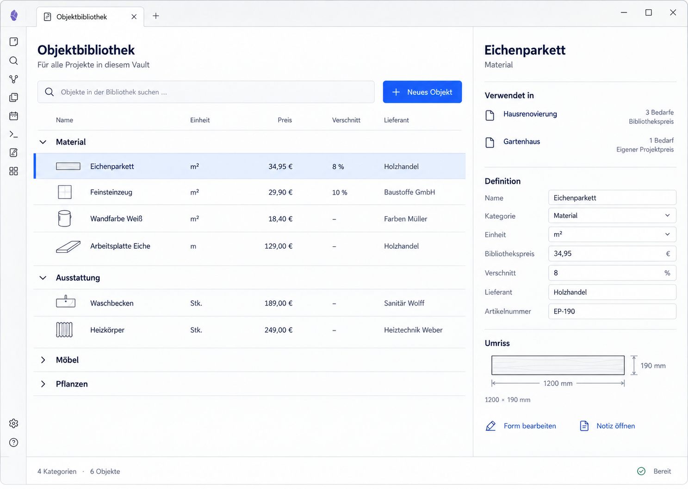

# AL00 — Browse the library

## Purpose and use case

Recognize an existing asset before defining it again.

**Actor:** a private renovator; no prior CAD or data-model knowledge is assumed.

## Entry and preconditions

Open the library through the Obsidian command or the project-overview entry point. Without a restored selection, the inspector starts in a neutral state.

## Visual reference

**Image status:** Layout reference with a selected asset; the neutral inspector is not shown. This retained image uses German-localized UI labels; the English prose defines the behavior and is not an assertion that an English screen has been captured.

## Structure and components

Title and vault-wide scope; search and New asset; one set of column headings; collapsible category groups; rows containing name, unit, price, waste allowance, and supplier; status bar.

Uses the shared `AssetLibraryShell`, `AssetShelves`, `AssetRow`, `AssetInspector`, and state-dependent fields, dialogs, or feedback from the [component library](../component-library.md). Domain commands do not belong inside presentation components.

## Interactions and transitions

Expand or collapse a category. Select a row by click or Enter. Show selection through a leading rule and background; focus is independent. Double-clicking does not automatically open the designer.

The [central interaction rules](../interaction-rules.md) additionally apply, particularly focus management, local-draft protection, and explicit write outcomes.

## Exceptions and boundaries

Empty categories remain visible and disabled for the current small taxonomy. Derive order from the production category catalogue, never from the four demo categories.

## Acceptance criteria

Selection changes no domain data; the entire row remains keyboard-activatable. Expansion updates aria-expanded. With no selection, display “Select an asset to view its definition.”

Every essential action must be available without a mouse. Errors and status include readable text; color alone is insufficient. Layout changes alter neither domain data nor the current draft.

## Verification

Test the happy path from the stated entry to the specified outcome. Then reproduce the stated exception using a controlled fixture or deliberately induced rejection. Record the screenshot and observed state separately; this specification is not evidence of a passed test.
