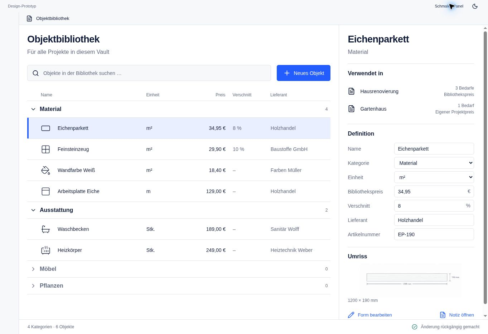

# AL01 — Inspect an asset definition

## Purpose and use case

Understand an asset’s definition, shape, and usage together.

**Actor:** a private renovator; no prior CAD or data-model knowledge is assumed.

## Entry and preconditions

Select a row or restore a saved valid selection.

## Visual reference

**Image status:** Browser capture of this baseline state; usage data is illustrative. This retained image uses German-localized UI labels; the English prose defines the behavior and is not an assertion that an English screen has been captured.

## Structure and components

Identity; Used in above Definition; editable fields; read-only outline and dimensions; Edit shape and Open note.

Uses the shared `AssetLibraryShell`, `AssetShelves`, `AssetRow`, `AssetInspector`, and state-dependent fields, dialogs, or feedback from the [component library](../component-library.md). Domain commands do not belong inside presentation components.

## Interactions and transitions

Selection loads definition, geometry, and usage independently. Results may appear only for the current asset. A project row opens the corresponding project while preserving library context.

The [central interaction rules](../interaction-rules.md) additionally apply, particularly focus management, local-draft protection, and explicit write outcomes.

## Exceptions and boundaries

Usage may be loading, empty, or failed while the definition is already readable. Failure never means unused.

## Acceptance criteria

Quickly switching between assets never shows a late result from the first asset. Project-specific prices are explicitly marked. Numeric values include unit and currency.

Every essential action must be available without a mouse. Errors and status include readable text; color alone is insufficient. Layout changes alter neither domain data nor the current draft.

## Verification

Test the happy path from the stated entry to the specified outcome. Then reproduce the stated exception using a controlled fixture or deliberately induced rejection. Record the screenshot and observed state separately; this specification is not evidence of a passed test.
