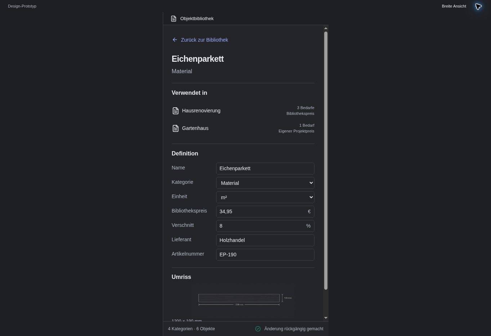

# AL10 — Work in a narrow panel

## Purpose and use case

Use the library and details safely with limited space.

**Actor:** a private renovator; no prior CAD or data-model knowledge is assumed.

## Entry and preconditions

The Obsidian leaf becomes narrower; layout responds to container width.

## Visual reference

**Image status:** Browser capture of the dark 460px detail panel; not native smartphone certification. This retained image uses German-localized UI labels; the English prose defines the behavior and is not an assertion that an English screen has been captured.

## Structure and components

Below 560px display one content surface: list or inspector with Back to library. Keep status visible. Inherit the host theme.

Uses the shared `AssetLibraryShell`, `AssetShelves`, `AssetRow`, `AssetInspector`, and state-dependent fields, dialogs, or feedback from the [component library](../component-library.md). Domain commands do not belong inside presentation components.

## Interactions and transitions

Selection opens details. Back restores the list with the same search, groups, and scroll position. Width changes preserve asset ID and draft. Searching starts in the list.

The [central interaction rules](../interaction-rules.md) additionally apply, particularly focus management, local-draft protection, and explicit write outcomes.

## Exceptions and boundaries

At 560–719px every column must retain a useful minimum width; switch to one pane earlier if needed rather than overlap content. Short height permits independent scrolling.

## Acceptance criteria

At 460px there is no horizontal page scrolling. Back is keyboard-accessible. Dark/custom themes preserve visible focus, status words, and readable text.

Every essential action must be available without a mouse. Errors and status include readable text; color alone is insufficient. Layout changes alter neither domain data nor the current draft.

## Verification

Test the happy path from the stated entry to the specified outcome. Then reproduce the stated exception using a controlled fixture or deliberately induced rejection. Record the screenshot and observed state separately; this specification is not evidence of a passed test.
