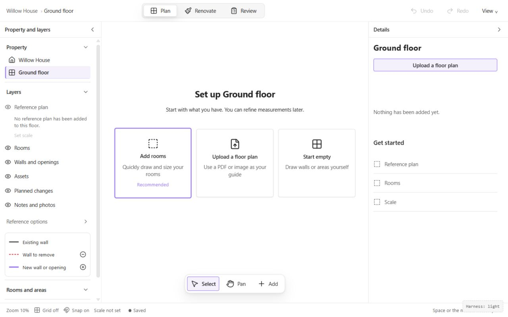
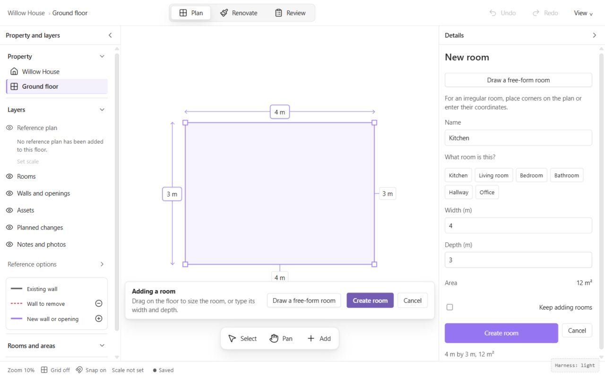
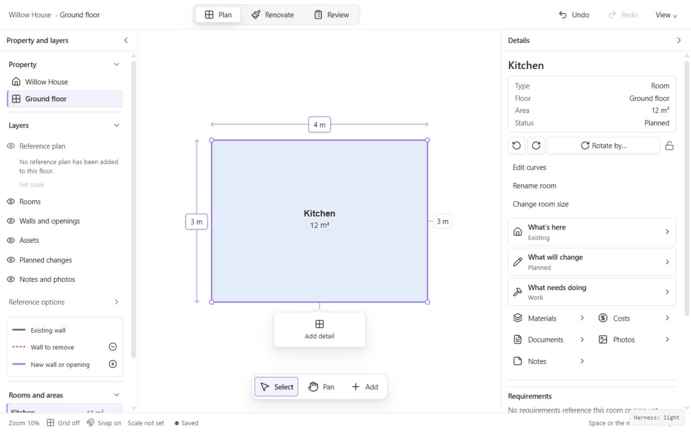
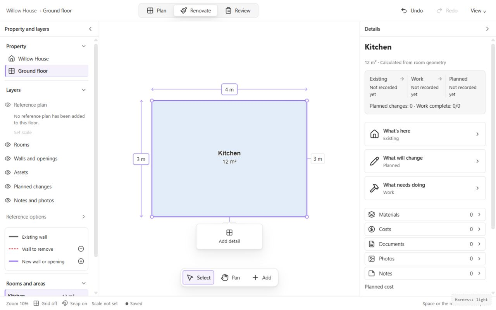
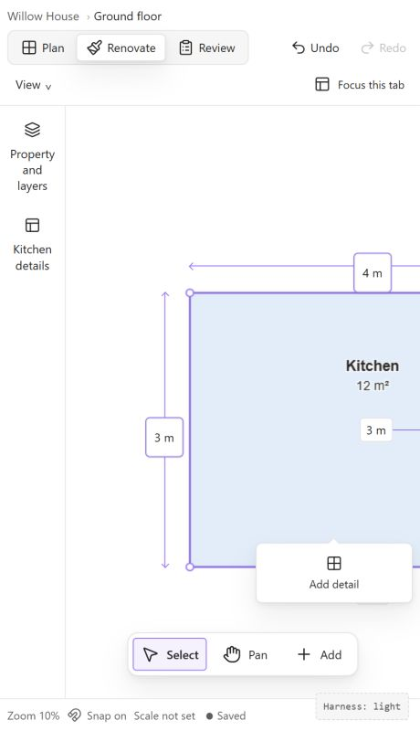
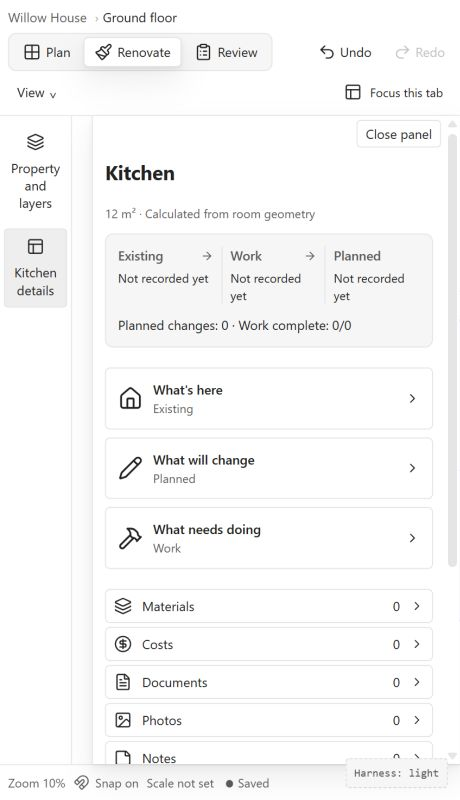
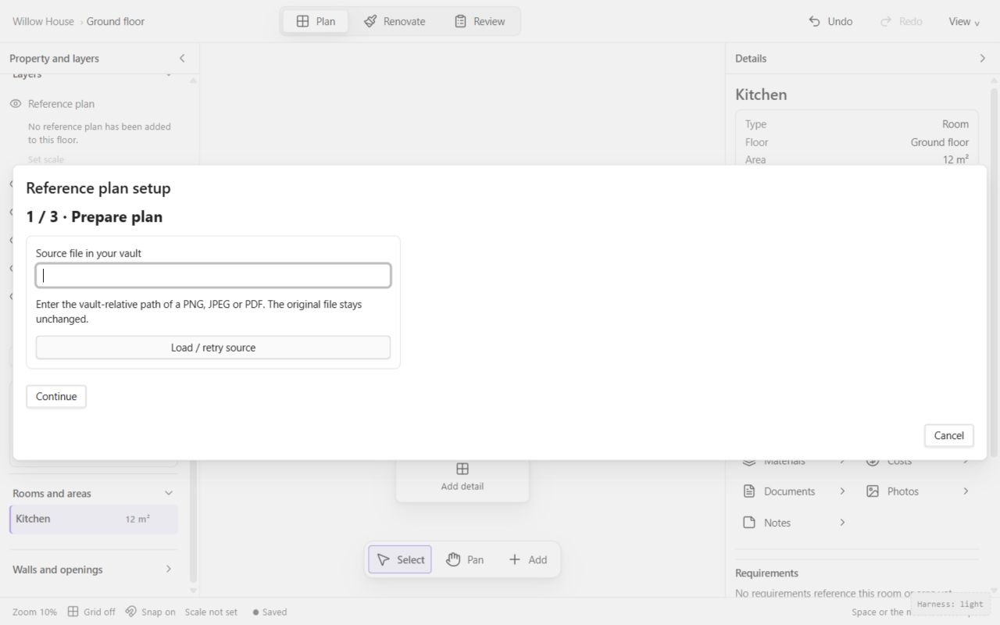
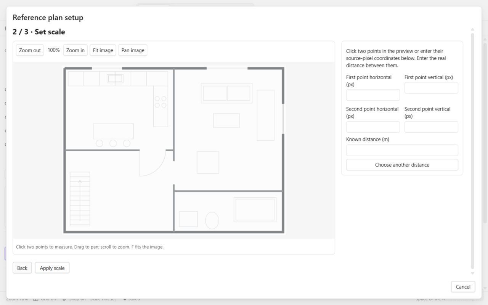
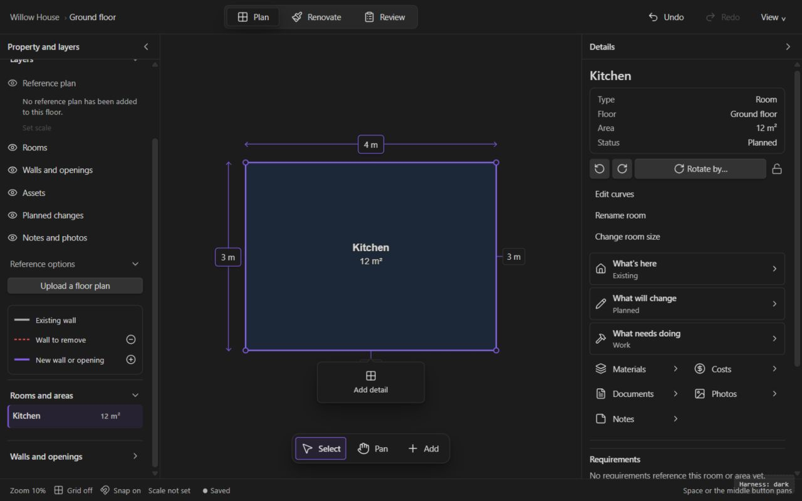

# Current editor walkthrough and visual evidence

Captured 2026-09-13 from baseline `4ca4c7ea77e72e3ce4ea631884b353662d69964a`, using the Codex in-app browser and the repository's real Vue/Konva harness. This is a bounded browser walkthrough with synthetic records and FakeVault services, not native Obsidian acceptance or a participant usability study. See [provenance](evidence/provenance.json).

The accepted product-flow route was `?view=plan-editor&reference&planning&fidelity&theme=light`. It enables the connected command/planning workspace. The earlier plain `?view=plan-editor` exploration was excluded from product capability findings: that fixture deliberately omits services and displays unavailable controls. No production capability is declared missing from that fixture.

All nine accepted screenshots below were captured during this run, saved as the exact captured bytes and visually inspected. Full screenshots preserve the actual pane, controls and synthetic content. User references are separately named [reference 1](evidence/reference-01-editor-principles.png) and [reference 2](evidence/reference-02-perspectives.png); neither is presented as the current product.

## Walkthrough steps

### 1. Open an empty connected plan — healthy starting choices

**Observed:** the central empty state offers Add rooms (recommended), Upload a floor plan and Start empty. Plan/Renovate/Review are visible. The left panel lists layers, including a missing reference; the right panel repeats upload/setup information. This already supports a gradual start without an existing drawing.

**Opportunity:** clarify priority between central starter, right-hand upload and setup checklist. Do not redesign the working three-choice entry without observed failure. Test whether Scale not set plus the checklist implies that a reference is mandatory. That interpretation is a hypothesis, not a confirmed participant problem.

**Accessibility limit:** labels are exposed in the accessibility tree. Reading order, spoken instructions, contrast and target dimensions were not measured.

### 2. Size and name a room — working draft, competing emphasis

**Action:** chose Add rooms, selected the Kitchen name suggestion, entered width 4 and depth 3, then left the field. **Observed:** preview, dimensions and 12 m² summary agree. Create room becomes available. Details and the canvas banner both expose Create/Cancel; free-form choice appears prominently above basic fields and again in the banner.

**Opportunity:** put the ordinary name/size path first, with irregular shape controls as a secondary option. Treat duplicate action routes as an intentional access/visibility choice to evaluate, not a defect by count. Both must use the same state and remain reachable at supported widths.

**Accessibility limit:** typing worked with labeled fields. This mixed pointer/typing walkthrough is not a keyboard-only completion test. No invalid input or assistive-technology scenario was executed.

### 3. Create the room — correct transition, dense Plan Details

**Action:** activated Create room in Details. **Observed:** one Kitchen appeared in the Rooms list, the task banner disappeared, Select became active and Undo became available. The room displays 4 m × 3 m and 12 m². Plan Details starts with type/floor/area/status and rotation, then Edit curves, Rename room and Change room size, then renovation navigation and Requirements further down.

**Opportunity:** identity/size/name should be easier to scan than specialist shape operations. Existing/planned/work and related content remain important, but their prominence can respond to perspective. Verify whether the user understands that the displayed Room status and planned renovation are different concepts.

**Evidence boundary:** the observed result is the connected synthetic workspace state. Saved files on a real disk and undo/reopen behavior were not checked in this walkthrough.

### 4. Switch to Renovate — positive continuity, room for clearer hierarchy

**Action:** activated Renovate. **Observed:** the same Kitchen, dimensions and camera remained; Details changed to Existing/Work/Planned overview, contextual navigation and linked-content counts. This directly supports the screenshot reference's continuity principle for this single-room case.

**Opportunity:** make the primary next action clear without making every unrecorded section look equally urgent. Preserve truthful absence versus zero values. Plan → Renovate is not itself a missing feature.

**Limit:** no work, cost or intended-geometry edit was made. Multi-selection, wall/opening, room-less records and Review return require separate checks.

### 5. Narrow the pane to 460 px — controls survive, framing changes

**Action:** changed viewport from 1280 × 800 to 460 × 800. **Observed:** context controls reflow; Property and layers/Kitchen details rails replace side columns; Select/Pan/Add remain visible. The room is partly outside the viewport because the camera is preserved.

**Opportunity:** users need an evident route to fit/reveal the scene and return from panels. Preserving camera is protective; this observation does not justify auto-fitting on every resize. Rail wording wraps substantially and needs a German/large-text check.

**Limit:** 460 px here is a browser viewport with the harness leaf; actual Obsidian leaf width/host zoom was not measured. No claim that the entire compact workflow passes follows from this screen.

### 6. Open and close narrow Details — usable drawer, explicit tradeoff

**Action:** opened Kitchen details. **Observed:** the selected name and renovation content are visible; Close panel is available; the drawer covers most of the canvas and scrolls. Closing it returned to the rail; restoring full width retained the room and perspective. The frame adapts instead of cramming two full sidebars into a narrow pane.

**Opportunity:** test alternating exact input and canvas inspection during active tasks, including caret/focus and draft preservation. A drawer covering the canvas is not automatically a defect; inability to return to the same task would be.

**Accessibility limit:** focus was reported on the panel container and then the rail after closing. Spoken output and all keyboard traversal were not evaluated.

### 7. Begin reference setup — strongest observed language friction

**Action:** returned to Plan, expanded Reference options and chose Upload a floor plan. **Observed:** stage 1/3 asks for “Source file in your vault” and explains a “vault-relative path”; Load / retry source and Continue are separate actions. The file field received focus.

**Opportunity:** the visible entry promises upload, while the dialog expects an already available vault file. Lead with choosing a file from the existing suggestions and explain the local-source requirement in everyday language. Typed exact paths can remain an alternate route. This does not authorize adding external-file import or changing vault storage semantics.

**Limit:** file suggestions were not evaluated as a novice; the synthetic `scan.png` path was known from the fixture. We cannot claim choosing without typing is absent in production, only that the visible instruction foregrounds paths.

### 8. Load reference and reach Set scale — workflow exists, technical fields dominate

**Action:** loaded synthetic `scan.png` and continued. **Observed:** the preview has zoom, Fit image and Pan image; instructions support clicking two points, with four source-pixel coordinate fields preceding Known distance (m). Back, Apply scale, Choose another distance and Cancel are available.

**Opportunity:** make first point → second point → known distance the main narrative, with exact coordinates available through an accessible disclosure. The screenshot reference's simple scaling concept can improve this existing wizard. Crop/orientation preparation should likewise distinguish ordinary visual work from exact pixel adjustments.

**Limit:** no endpoints/distance were applied and final calibration was not committed. Crop, PDF, rescale consent, invalid distance and narrow reference layout were not exercised. These are named follow-up validation tasks, not passes.

### 9. Cancel and inspect dark appearance — context restored, measurement needed

**Action:** cancelled reference setup, then used the harness theme switch. **Observed:** Kitchen remains selected in Plan; no reference was added; Details and the canvas change to dark appearance. This supports cancellation/context and theme rendering in this one synthetic case.

**Opportunity:** dim dimension lines, inactive edge labels and fine control borders deserve measured contrast/target checks against dark and custom accents. Visual concern is not a measured WCAG failure. The full-width taskbar and Details hierarchy should remain consistent across themes.

**Limit:** theme switching used the browser harness, not Obsidian's real css-change lifecycle. No performance or reduced-motion measurement was made. Temporary viewport overrides were reset afterward.

## Findings to carry into delivery

| ID | Finding | Evidence class | Package |
|---|---|---|---|
| A1 | Reference instructions put paths/pixel coordinates before ordinary task concepts | O, steps 7–8 | U3 |
| A2 | Plan Details prioritizes advanced manipulation ahead of common name/size actions and shows extensive cross-context navigation | O, step 3; ease impact H | U1/U7 |
| A3 | Room task has working guidance/precision but competing hierarchy across banner and Details | O, step 2; redundancy impact H | U2 |
| A4 | Narrow drawer preserves identity and covers canvas; camera preservation can clip selection | O, steps 5–6; recovery ease H | U8 |
| A5 | Generic Scale not set appears even when an authored room has explicit real dimensions and no reference | O, steps 1–3; interpretation H | U3 |
| A6 | Dark lines/labels warrant objective legibility evaluation | Visual risk O, no contrast measurement | U8 |
| A7 | Beginner starts, live dimensions, completion-to-Select and single-room perspective continuity already work in this run | O, steps 1–4 | Regression anchors |

Overlap disambiguation, snapping during movement, copy dependency scope, guarded deletion, arbitrary-corner input, wall/door manipulation, save-failure recovery, successful calibration, native persistence and screen-reader use were **not** audited live here. Their plan items rest on labeled source/history/research evidence and must be reproduced before a production defect is asserted. The [implementation audit](research/implementation-audit.md) names the relevant boundaries and test paths.
