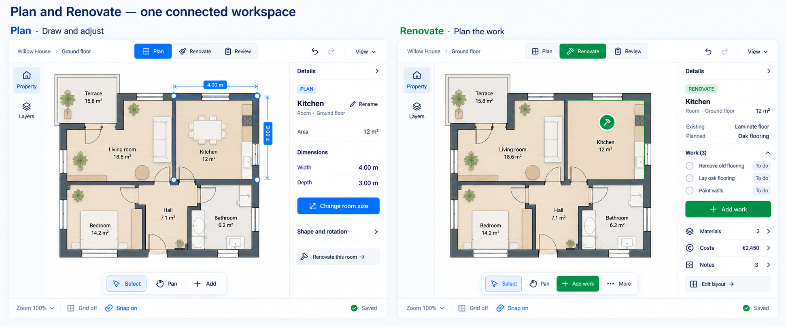

# Next-increment mockups — selected hybrid

**2026-09-13 · User-selected combination of directions 1 and 3 · Screen review set produced · No implementation.**

The chosen design combines direction 1's clear Plan/Renovate distinction and readable Details hierarchy with direction 3's larger canvas and compact labeled navigation. The working interpretation is a shared Property/Layers rail, stable Details panel and the existing bottom taskbar. Property opens existing property/floor/room navigation; expanded/resizable panels and non-canvas entity access remain available.

Plan exposes layout information and deliberate exact editing. Renovate exposes existing conditions, planned changes, work and related information, with an explicit Edit layout route. Labels, icons, content and primary actions distinguish the modes; blue/green are theme-aware design directions rather than fixed product colors. Renovate has no default geometry handles.

## Screen review set

The [gallery and interaction contracts](hybrid-screens.md) contain ten boards covering twelve planned screen areas. Multi-frame boards show related states in a flow, not additional design alternatives.

| Screen | Image | Focus |
|---|---|---|
| UX-01 | [Mode pair](images/hybrid-01-modes.png) | Shared identity/camera, different tools and Details |
| UX-02 | [Start](images/ux02-start.png) | Three starting routes; reference optional |
| UX-03 | [Room draft](images/ux03-room-draft.png) | Valid/invalid input and Create/Cancel |
| UX-04/05 | [Selection and precision](images/ux04-05-selection-precision-v2.png) | Conditional chooser and size preview |
| UX-06 | [Opening](images/ux06-opening.png) | Door/host identity and precise edit |
| UX-07 | [Paste result](images/ux07-copy-paste.png) | Actual scope, exclusions and Undo |
| UX-08 | [Reference setup](images/ux08-reference.png) | Choose, scale, review/consent |
| UX-09 | [Narrow panes](images/ux09-narrow-v2.png) | Canvas, draft drawer and Renovate |
| UX-10 | [Dark appearance](images/ux10-dark.png) | Same mode hierarchy in dark theme |
| UX-11/12 | [Recovery and draft guard](images/ux11-12-recovery-mode-guard-v2.png) | Stale, unconfirmed save and mode change |

The user selected the combination; the new images do not imply approval of every generated detail or authorize implementation. The [merged increment plan](../implementation-plan.md) remains authoritative. The overlap chooser remains a conditional U4 study. Image creation does not close its adoption decision.

## Visual QA and limits

All outputs were inspected. Targeted Image Gen correction passes made the Plan precision action blue, replaced unsupported Door Rename with Edit opening, corrected safety-screen quantities and changed the narrow draft footer to Draft not saved. Revised files replace those initial renderings in this review set. Original generator outputs remain at their source locations.

The hybrid/dark boards remove the earlier Renovate corner handles and generic Scale not set message. Reference review explicitly retains whole-plan rescale consent. Paste shows a committed result and Undo with no placement wizard.

Remaining limitations:

- Floor geometry, camera matching, furniture and line lengths are illustrative raster artwork. Use a validated saved scene and actual rendered measurements during implementation; never reconstruct geometry by tracing these images.
- Small rotated labels, counts and icons can contain generation artifacts. The adjacent screen contract and existing locale/command definitions govern exact copy and supported controls. For example, the precision proposal is 4.00 m × 3.50 m = 14 m², regardless of a malformed rotated glyph.
- The draft board's Select styling is not authority for active-tool state. During creation it remains a route, not a pressed active tool; the task banner and accessible state must agree.
- Synthetic €2,450, measurements and counts are examples, not calculated facts. The Paste Room row means one Room; it is not an extra naming field.
- Target sizes, contrast, German labels and actual 460 px reflow require real UI verification. Loading/saving and every advanced expansion are specified in prose rather than separately drawn.

These are visual proposals with reviewed interaction notes, not executable prototypes or native Obsidian acceptance evidence.

## Provenance and handoff

- [Original directions](directions.md) preserve the earlier exploration; pending-selection statements there are historical.
- [Original prompts](prompts.md) and [hybrid/screen/correction prompts](hybrid-prompts.md) record exact instructions and attached inputs.
- [Manifest](manifest.json) records the user's selection, original files, actual sizes and hashes. Original PNG bytes are preserved without code-based cropping, scaling or repainting.
- [Parallel implementation packets](../parallel-delivery/README.md) define future session boundaries, dependencies and verification. They do not start implementation.

- [x] User selected a combined direction.
- [x] Hybrid and all screen-area review boards generated and inspected.
- [x] Important mode/safety inconsistencies received correction passes.
- [x] Conditional scope and image limits documented.
- [ ] User reviews screen details and requested refinements.
- [ ] Implementation verifies exact controls, copy, accessibility and scene data.

This continues draft PR #170. Only documentation and mockup assets change.
