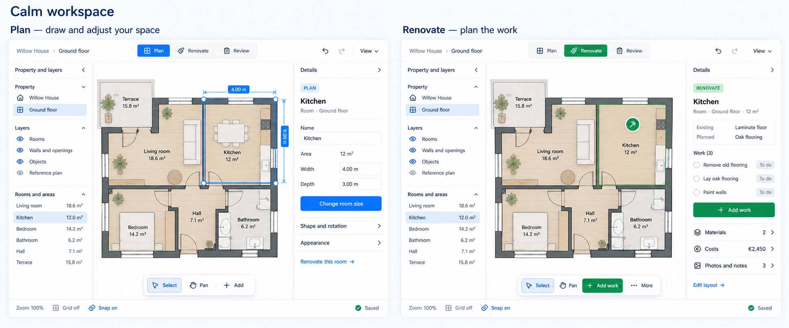
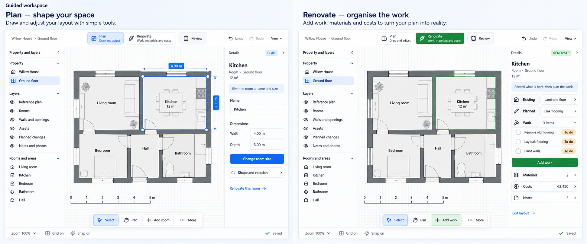
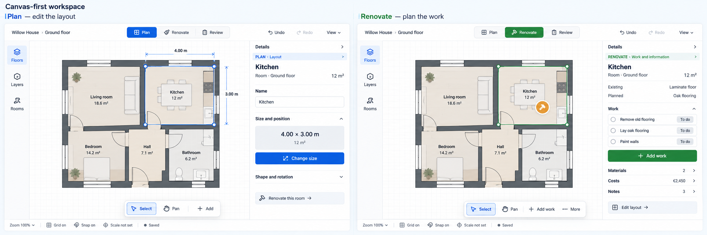

# Next-increment mockups

**2026-09-13 · Visual exploration · Direction selection pending · No implementation.**

These mockups turn the merged [usability plan](../README.md) into visual proposals. The first review concentrates on its required distinction between Plan and Renovate. Each image contains one coherent direction shown in both modes, using the same selected Kitchen. Three independent directions were generated with built-in Image Gen using both user reference images and the current editor captures as actual image inputs.

The numbers below match the order the generated results were displayed in the task. They do not imply a ranking. The [prompt set](prompts.md) records the full generation instructions; [manifest.json](manifest.json) records source/output provenance, actual dimensions, hashes and selection status.

## Direction 1

## Direction 2

## Direction 3

## Review contract

Choose the working hierarchy and mode treatment to carry through the remaining screens. This is not authorization to implement and does not lock every generated detail. The selected direction receives a correction pass before it becomes a screen-level visual target.

All directions must ultimately satisfy:

- A visibly labeled Plan/Renovate switch, with restrained mode accents plus text/icons and different relevant controls.
- Plan Details focuses on identity, dimensions and layout editing; Renovate Details focuses on existing conditions, planned changes, work, materials, costs and evidence.
- The established bottom taskbar adapts to the active mode; shared navigation and save feedback stay predictable.
- The same selection and camera survive Plan/Renovate switching. Renovate does not display actionable geometry handles by default; Edit layout returns to deliberate layout editing.
- Native Obsidian themes, resizable/collapsible panels, supported geometry and command boundaries remain the foundation. Blue/green are candidate accent treatments, not hardcoded theme requirements.

## Inspection findings and corrections before approval

The generated images have been visually inspected. They are useful for hierarchy selection, but are **not implementation-ready specifications** and must not override the merged plan.

| Direction | Observed issue | Required treatment before screen approval |
|---|---|---|
| 1 | The drawn Kitchen is taller than its 4 m × 3 m labels imply; textured furnishing/floor treatment is more decorative than the requested neutral canvas. | Use a validated, correctly proportioned common scene; simplify material rendering. The numbers are mock data, not geometry evidence. |
| 2 | Room proportions and scale-bar markings are approximate; grouped fields plus Change room size leave the field-edit/commit behavior visually ambiguous. | Use a validated scene and a single explicit resting-versus-editing contract; preserve existing command/Apply behavior. |
| 3 | Green corner dots are still shown on the Renovate selection, contrary to the no-geometry-handles requirement; the generic Scale not set footer was carried over. | Remove manipulation handles in Renovate and use truthful reference-specific scale status. Treat the compact rail as an arrangement of existing navigation, not a new navigation model. |
| All | Generated text, counts, currency formatting, icons, exact target sizes, camera geometry and contrast are illustrative. Some labels combine content differently from current UI. | Normalize copy and supported routes in the selected pass; validate actual accessibility and behavior later in implementation. No mockup proves a live workflow or conformance. |

Selection accents and mode accents must remain distinguishable from renovation status. The planned €2,450 and three work items are synthetic data. No amounts imply a quantity/cost calculation has been performed. No generated furniture arrangement creates an asset-catalogue requirement.

## Screen coverage to produce from the selected direction

The requested mockup set is tracked below. The paired directions are delivered as candidates; the remaining screens are deliberately not marked complete. They will share one approved visual vocabulary rather than mixing three variants across an implementation.

| Screen ID | State/frame to specify | Plan packages | Status |
|---|---|---|---|
| UX-01 | Matched full-width Plan and Renovate with the same selected Room, camera and content | U1/U7 | Three candidate pairs produced; selection/correction pending |
| UX-02 | Empty floor with clear room/reference/empty starting routes | U1/U2 | Pending direction selection |
| UX-03 | Create Room: ordinary name/size path, valid preview, invalid input and explicit completion/cancellation | U2 | Pending direction selection |
| UX-04 | Dense overlap: current selection route and conditional named chooser if adopted | U4 | Pending direction and U4 decision; chooser is not automatically approved |
| UX-05 | Precise adjustment: resting Details, active size edit and live snapping/measurement feedback | U1/U5 | Pending direction selection |
| UX-06 | Wall/opening Details with clear host/room identity and supported numeric controls | U1/U5 | Pending direction selection |
| UX-07 | Copy scope and direct Paste result/Undo; no implied placement-preview lifecycle | U6 | Pending direction selection |
| UX-08 | Reference setup: choose an existing vault file, optional preparation, two points/known distance, final review/consented rescale | U3 | Pending direction selection |
| UX-09 | 460 px Plan and Renovate: labeled mode control, Details rail/drawer and return to canvas with a draft | U7/U8 | Pending direction selection |
| UX-10 | Dark-theme paired Plan/Renovate using the same scene and corresponding mode cues | U7/U8 | Pending direction selection |
| UX-11 | Saving, failed/stale view and safe recovery with truthful retained content | U6/U8 | Pending direction selection |
| UX-12 | Attempted mode change during an active task: existing draft guard and explicit next action | U2/U7 | Pending direction selection |

Some rows require multiple frames to specify the transition. Each final screen should include a short adjacent contract: entry state, primary action, secondary routes, selection/camera behavior, completion/cancel semantics, relevant data limitations and acceptance-test mapping. Keep explanatory notes outside the product UI.

## Completion criteria for the visual package

- [ ] One direction selected and its correction pass reviewed.
- [ ] Required screen states produced and linked to U0–U9; conditional scope remains identified.
- [ ] Plan/Renovate pairs use the same validated scene and selection/camera.
- [ ] Full/narrow and light/dark variants agree on hierarchy and mode meaning.
- [ ] All depicted controls map to existing capabilities or an explicit usability decision in the plan.
- [ ] Copy/paste, calibration, room/wall independence and staged Escape contracts remain truthful.
- [ ] Exact labels, dimensions and interaction notes reviewed before implementation.

PR #168 was confirmed merged, local main was fast-forwarded, and its clean worktree/local branch were removed before this separate mockup branch was created from `ba7fce3ad88b528ae9e9de479f7917d9d0ec371e`. This package changes documentation and image assets only.
