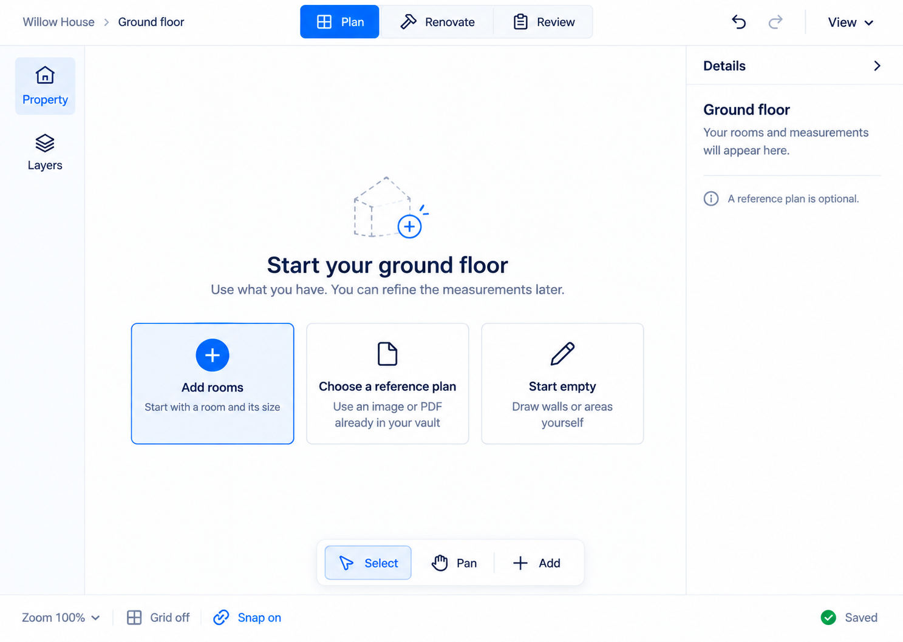
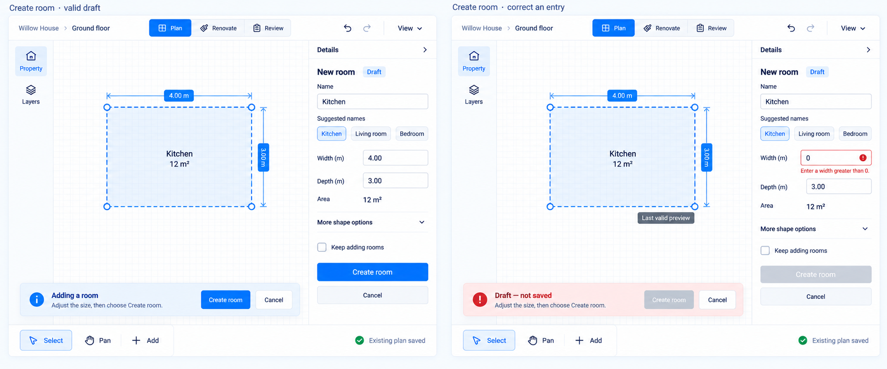
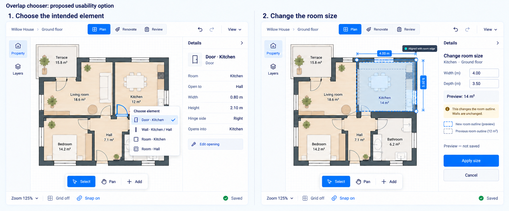
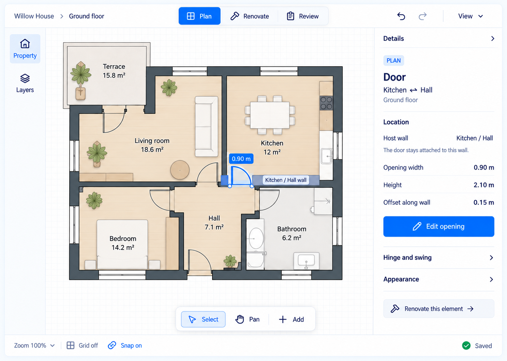
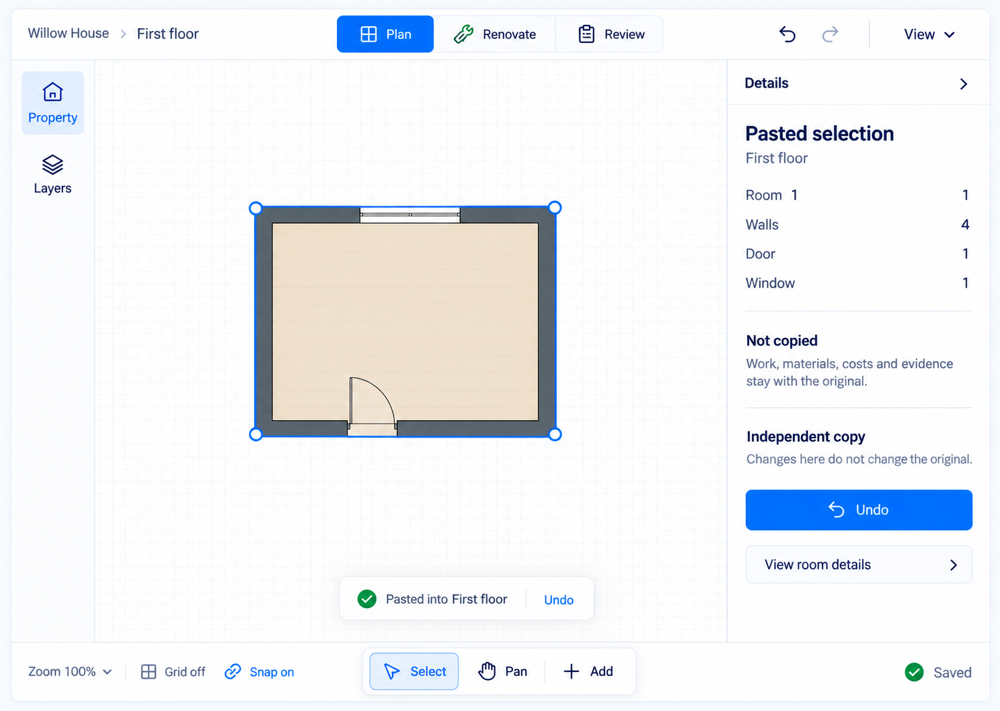
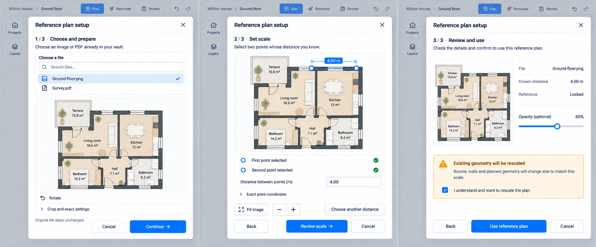
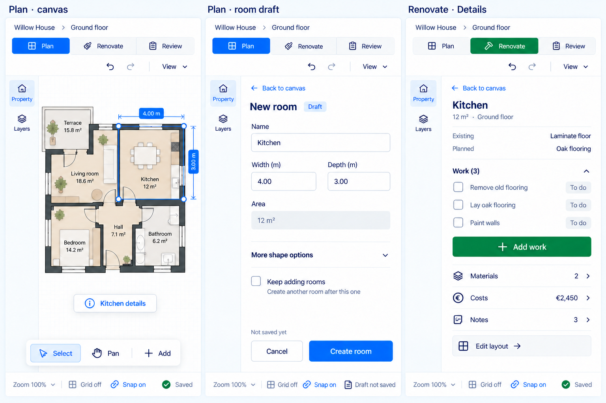
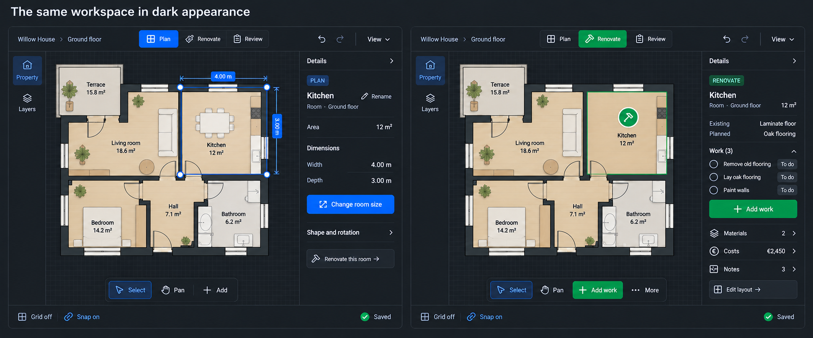
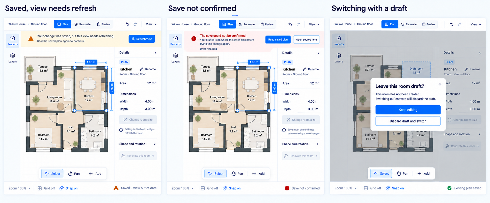

# Hybrid screen gallery and interaction contracts

**Design review set, 2026-09-13.** The user chose directions 1 and 3 combined. The [increment plan](../implementation-plan.md) and [validation plan](../validation-plan.md) govern scope and acceptance. These images show proposed interfaces, not completed implementation or passing tests.

Shared contract: stable breadcrumb and labeled modes, expandable Property/Layers navigation, generous canvas, readable Details, bottom taskbar and truthful save state. Primary Plan actions use its blue accent; Renovate actions use its green accent. Text/icons and content distinguish modes independently of color. Theme tokens and existing command/state owners remain authoritative.

## UX-01 — One element, two clear modes

**Entry:** Kitchen selected, current projection, no draft. **Plan:** read identity and dimensions, then Change room size or reveal Shape and rotation. Resting values are not automatically committing fields. Renovate this room keeps the target and changes task focus.

**Renovate:** Existing/Planned, Work and related-content routes; Add work for an eligible target; Edit layout deliberately returns to geometry editing. No default geometry handles or drag. Room-less elements retain their own identity rather than a fabricated Room.

**State:** switching writes nothing; keep direct Plan/Renovate selection/camera and existing pre-Review restoration semantics. Guard drafts. Mode presentation must not overwrite saved layer preferences or status meaning. Pixel geometry is illustrative; implementation needs a common validated fixture.

**Acceptance:** U1/U7; T11 and paired theme/narrow checks.

## UX-02 — Start with what you have

**Entry:** empty floor in Plan. **Primary:** Add rooms. **Alternatives:** an existing vault reference image/PDF, or Start empty for supported wall/area drawing. The reference is optional; Details adds brief help without a competing upload checklist.

Choosing a route starts its current task; it does not save geometry or clear a populated plan. Cancel retains existing task semantics. The reference choice does not imply an external-file/cloud upload capability. Property retains non-canvas access.

**Acceptance:** U1/U2/U3; T1/T2; preserve three actual command entry paths.

## UX-03 — Create or correct a draft

**Entry:** Room creation. Ordinary name/size precede advanced shape options. Valid example: Kitchen, 4.00 m × 3.00 m = 12 m². Create room commits once. Cancel exits without changing committed geometry. Keep adding rooms is explicit.

**Invalid:** width 0 stays editable with a nearby explanation; name/depth remain. The displayed outline is labeled Last valid preview, not saved invalid geometry. Both completion routes remain disabled until valid. Existing locale parsing governs input.

Details and task-banner buttons use the same state/operation. Escape remains staged rather than an alias for Cancel. An in-flight write cannot be aborted by an old Cancel affordance. During creation, Select is a route, not the active pressed tool, regardless of illustrative button styling. Draft not saved and Existing plan saved describe different state.

**Acceptance:** U2/U8; valid/invalid/no-op/repeated activation, field focus, keyboard/non-drag and T2/T3.

## UX-04/05 — Find the target and edit precisely

**UX-04:** the named chooser is a conditional U4 study over existing hit candidates. It is not approved merely by being drawn and must not appear on every ordinary click. Kind/context, current target, keyboard/Escape and focus must be clear. Lists, Alt cycling, hidden/locked and group-member selection remain regression cases.

The frames show separate target-specific steps: a Door on the left; a Room size proposal on the right. They do not resize a Door through Room controls. Door Edit opening uses the existing property route.

**UX-05:** eligible axis-aligned Room proposal: width 4.00 m, depth 3.50 m, area 14 m². Apply size validates/commits; Cancel discards. Prior and proposed outlines are distinguished. The exact values in this paragraph override malformed small rotated raster text.

Room-outline editing does not silently move independent walls. Rotated/free-form/curved rooms use their existing truthful precision routes. Snap enabled differs from acquired alignment; show the latter only with a real candidate, near the gesture and clear of labels.

**Acceptance:** U4/U5; T3/T6/T8 and actual hit/geometry/history boundaries.

## UX-06 — Explain the opening and its host

**Entry:** Door selected in Plan. Highlight the opening and its host distinctly; Details names Door, Kitchen/Hall context and Ground floor. Example readouts: width 0.90 m, height 2.10 m, offset along wall 0.15 m.

**Primary:** Edit opening enters existing property editing. Hinge/swing and appearance are secondary. Renovate this element retains the structural target. There is no invented Door Rename command or freely floating opening. Preserve host attachment, current offset meaning and bounds validation; work without an enclosing Room where supported. Precise action labels may be normalized to existing vocabulary during implementation.

**Acceptance:** U1/U5/U7; T8, hosted limits, identity and room-less context.

## UX-07 — Explain the committed Paste result

**Entry:** direct Paste succeeded on First floor. No placement ghost or pending confirmation. The synthetic snapshot contains one Room, four walls, one Door and one Window; use actual captured counts in production. The rendered Room row means count 1, not another name field.

Work, materials, costs and evidence remain with the source. The independent copy does not create duplicate accounting or linked geometry. Existing command dependency closure governs inclusion; furniture in other drawings is not automatically copied here.

One Paste creates one undoable intent. Undo is accessible through existing history/result feedback. View room details restores ordinary Details. Saving gates conflicting actions; Saved is qualified if the projection is stale. Do not invent a Paste here/Cancel lifecycle or OS clipboard interchange.

**Acceptance:** U6; T9, cross-floor/leaf, dependency/identity remapping, conflict and text clipboard isolation.

## UX-08 — Guide reference preparation and scale

**Prepare:** choose a supported file already in the vault, show filename/preview, then continue. Rotate, crop, exact keyboard controls and PDF-page choice remain available where applicable. Expanded states are not all drawn. Loading/retry/unreadable states retain source context. Original content remains unchanged.

**Scale:** explain two known-distance points; show point state, segment and 4.00 m input together. Fit/zoom/choose-another-distance support recovery. Exact coordinates remain accessible in a disclosure; invalid/zero distance cannot proceed and errors retain input.

**Review:** the right frame illustrates recalibration with existing geometry. Preserve actual whole-plan transform scope, including authored zones and current/intended structures. Consent is shown checked after user action; it must not be preselected. Do not show a rescale warning where no such impact applies.

Use reference plan completes current atomic setup; intermediate actions preview only. Back retains the right draft; Cancel restores previous reference configuration. Presentation labels do not introduce a new persistence step.

**Acceptance:** U3; T7, native PDF/PNG/JPEG, locale, crop/rotation, point transforms, consent, cancellation and recovery.

## UX-09 — Finish the task in a narrow pane

Three approximately 460 px desktop leaf designs, not mobile drawing screens. The image is not a measured CSS breakpoint test. Both mode labels remain visible.

Canvas state exposes Kitchen details and View/fit. The draft drawer retains values, target and validation when returning via Back to canvas; Create room/Cancel remain reachable at its footer. Draft not saved is explicit. Renovate Details shows work/context and Edit layout without geometry controls.

Drawers may cover the canvas temporarily; closing must restore meaningful context/focus. Preserve intentional camera behavior and expose Fit/reveal instead of auto-fitting during gestures. Verify actual 900/899 and 400/399 transitions, nonspatial reflow, enlarged text and host zoom separately. Expanded Property/Layers and non-canvas lists remain available through existing navigation.

**Acceptance:** U7/U8; T10/T11, real leaf width, German copy, field/caret preservation and AT focus.

## UX-10 — Keep meaning in dark appearance

Use corresponding semantic surfaces, text and borders rather than a dark overlay. Both modes keep positions, purpose-specific content and selected identity; Renovate has no geometry handles. Mode, selection/focus and renovation status are separate meanings.

Measure contrast and hit regions in the actual theme/custom accent. Check defaults and a representative community theme. The image does not establish WCAG compliance or exact scene matching. Furniture/geometry/camera fidelity must come from shared validated data in the real renderer.

**Acceptance:** U7/U8; theme, non-color distinction, focus and contrast checks.

## UX-11/12 — Recover honestly and protect drafts

**Saved but stale:** write succeeded; displayed read is out of date. Retain trustworthy content, pause affected editing and offer Refresh view. It reads again rather than replaying the successful write. Footer qualifies Saved with View out of date.

**Save unconfirmed:** no green success. Keep draft/target and pause Apply until supported recovery establishes state. Read saved plan/Open source note illustrate safe read/inspection routes. Available actions depend on error/compensation state; do not collapse a known rolled-back failure and an unknown outcome into inaccurate copy.

**Saving:** specified without a separate bitmap: show Saving/busy, preserve inputs and gate conflicting actions/mode changes. Do not offer Cancel as if it could abort a transaction in flight.

**Mode guard:** Plan remains active while the user decides about an uncommitted Room draft. Keep editing preserves it; Discard draft and switch deliberately abandons only that draft and enters Renovate. No Save and switch is invented; no committed Room is deleted. Existing staged Escape/dialog semantics remain. During an active write, use the current busy guard instead of this dialog.

**Acceptance:** U2/U6/U7/U8; T4/T12, failure classes, read-only recovery, double submission, draft guards and native return.

## Review boundary

All twelve screen areas have a visual entry; not every transient/expanded state has a separate image. Locked/deleted/multi-selection, keyboard progression and room-less targets retain explicit tests. Images do not close those tests or conditional U4 scope. Review the visual hierarchy and state contracts, then implement using validated scene data and existing locale/command semantics.
