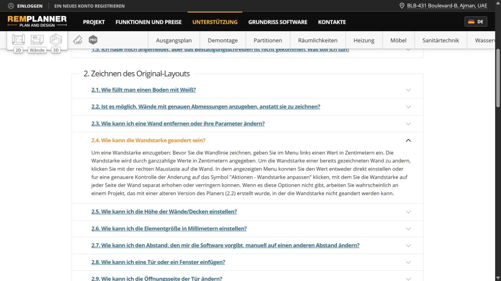
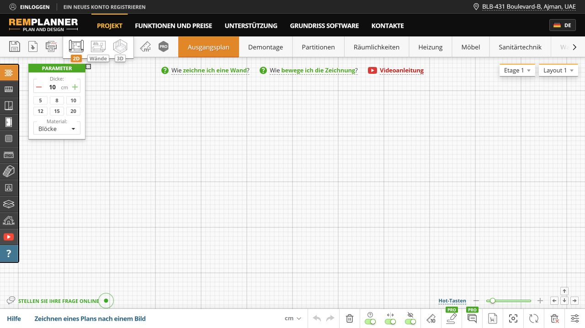
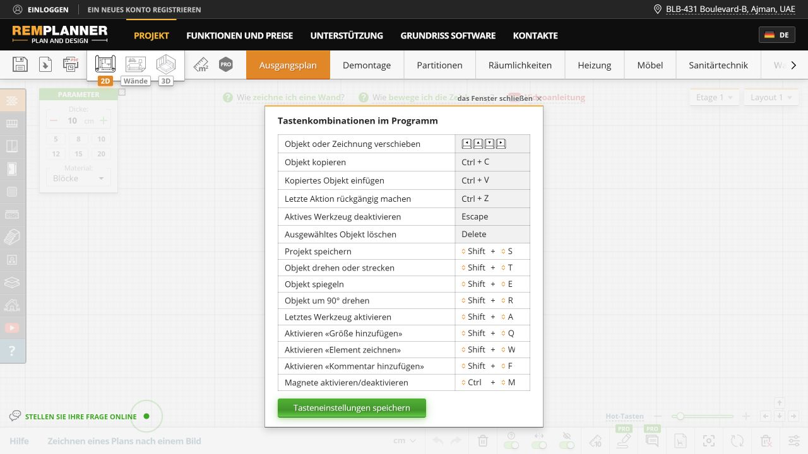
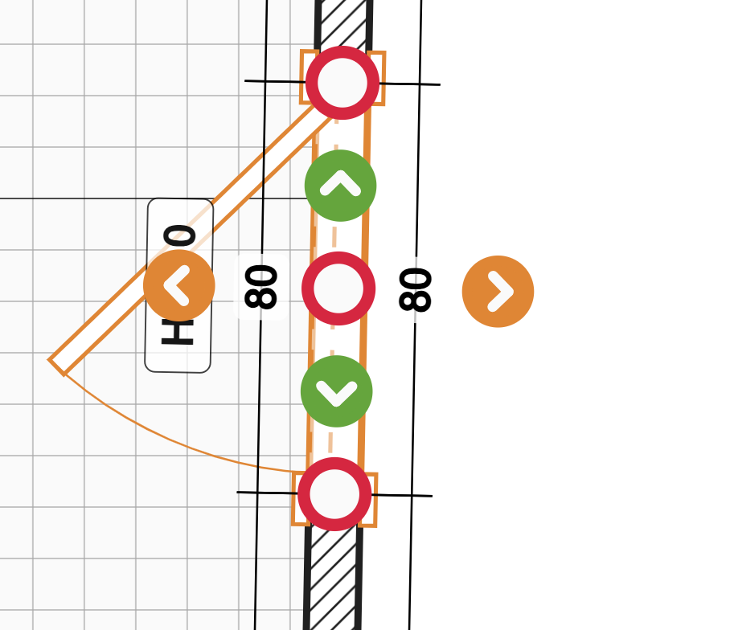

# Research report — 2026-09-14

## Question and method

How can a private renovator trace, correct and discuss a 2D plan with fewer uncertain steps in an Obsidian leaf? This is a focused comparative review, not a usability study or a claim that RemPlanner is accessible. Product Design audit lenses cover task entry, visible state, recovery, focus and evidence limits. Impeccable Operate guidance favors familiar native controls, progressive disclosure and restraint over decorative imitation.

Official pages were read on 2026-09-14. Browser captures below were taken during this task in the Codex in-app browser and saved/visually inspected. Visible-tab creation timed out twice; Chrome was unavailable; background in-app navigation succeeded. One planner navigation timed out but a subsequent state read confirmed the loaded anonymous planner. No account, login, purchase, file upload, save or access bypass occurred. Only the initial instructional overlay was dismissed and the shortcut reference opened. No anonymous drawing or export operation was tested.

## Source register

Dates mean access dates, not publication dates. The site does not supply reliable update dates for these pages.

| ID | Official source, accessed 2026-09-14 | Supports / caveat |
|---|---|---|
| S1 | [German homepage](https://remplanner.com/de/) | Public positioning and scope; marketing is not validation. |
| S2 | [German step-by-step guide](https://remplanner.com/de/planner/support/) | Tool groups, connection indication, direct manipulation, display controls and hosted openings. Illustrations may predate live UI. |
| S3 | [German FAQ](https://remplanner.com/de/planner/support/faq/) | Numeric properties, thickness, image tracing, opening edits, room-linked sheet caveats and output description. Version-sensitive and partly inconsistent with homepage. |
| S4 | [German print page](https://remplanner.com/de/planner/print/) | PDF album positioned as a handoff artifact. This run inspected the offer, not a generated file. |
| S5 | [English homepage](https://remplanner.com/) | Advertises wall elevations; conflicts with FAQ §4.5's absence statement. Do not infer universal availability. |
| S6 | [English step-by-step guide](https://remplanner.com/planner/support/) | Cross-check of task grouping, Escape, node movement and display settings. Translation differences are not our copy source. |
| S7 | [Anonymous German planner](https://remplanner.com/de/planner/) | Current-run visible controls, floor/layout selectors, wall parameters, task help and shortcut reference. Presence does not prove behavior or persistence. |

## Current-run flow and findings

1. **Learn the tool structure.** The guide presents an illustrated sequence and exposes a route back to the drawing. This ties explanation to the user's task rather than requiring category knowledge. A large horizontal sheet strip remains visible, but its breadth would be costly inside a narrow Obsidian leaf. Adopt task-level guidance, preserve Plan/Renovate/Review. [S2](https://remplanner.com/de/planner/support/)

   

2. **Find exact properties.** Expanded FAQ §2.4 explains pre-draw thickness and subsequent context edits. This is evidence for the wall owner's work, not a separate packet. At the original baseline, side-specific thickness exceeded the symmetric model. The user subsequently approved independent A/B depths, delivered by #213 and reconciled below. [S3](https://remplanner.com/de/planner/support/faq/)

   

3. **Understand the eventual output.** The print landing page makes the handoff result tangible with a PDF example illustration. Renovation Planner can learn from this clarity, but its existing generated Review note is not a scale-accurate drawing album. A preview/inclusion/scale contract must precede a new export feature. [S4](https://remplanner.com/de/planner/print/)

   

4. **Enter the anonymous canvas.** After dismissing the introductory hint, wall thickness and presets sit beside the drawing, task questions above it, floor/layout choices at the upper right, and view aids below. The spatial proximity is useful. The dense icon rows and partially exposed sheets should not be copied. Screenshot and accessibility tree establish control presence, not that every icon is keyboard operable. [S7](https://remplanner.com/de/planner/)

   

5. **Recall keyboard routes.** The visible shortcut reference groups an action with its key. This is the strongest remaining low-risk learning pattern. Adopt an on-demand reference for our existing routes, with focus scope and exceptions; do not adopt RemPlanner bindings, introduce global hotkeys or add a shortcut-customization system. [S7](https://remplanner.com/de/planner/)

   

The official guide also describes a connection marker, hiding measurements, optional snapping, recentering and openings placed on walls. Our next work should preserve visible numeric and non-color feedback even when passive labels are hidden. [S2](https://remplanner.com/de/planner/support/), [S6](https://remplanner.com/planner/support/)

## User-provided references — separate provenance

These are the user's existing screenshots retrieved from the wall/color tasks, plus the newly supplied opening image. Capture date, product version, viewport and intervening actions are unknown. They were inspected as design inputs and copied unchanged; hash validation completed after the 2026-09-15 lease release. Their washed-out appearance is not evidence of the live site's contrast. They are not current-run captures.

| Image | Visible evidence | Scope disposition |
|---|---|---|
| [Wall drawing](evidence/user-wall-drawing.png) | Thickness presets, unit, inner/outer measurement labels and task hints | Wall owner; do not infer inner/outer measurements equal our centre-line length. |
| [Wall menu](evidence/user-wall-menu.png) | Numeric length/thickness, measurement toggle, contextual actions | Wall owner; later visibility proposal is a view choice, not stored wall data. |
| [Wall thickness](evidence/user-wall-thickness.png) | Controls on opposite wall sides | Original symmetric-only disposition is superseded by approved #213 A/B face controls and ADR-0032; preserve their fixed-reference contract. |
| [Item color](evidence/user-item-color.png) | Compact palette next to object properties | Color owner; appearance is not renovation status or material identity. |
| [Opening handles](evidence/user-opening-handles.png) | Three circular handles, two arrow pairs, width label and door swing | Opening owner first. Arrows' exact semantics are hypotheses until interaction evidence; no conclusion about resizing, hinge flipping or side switching from shape alone. |

## Important counter-evidence and limits

The FAQ documents that changing room-defining walls can discard technical-sheet information. Renovation Planner must retain its independent Room identity and explicit linked-change commands, not imitate that consequence. The FAQ's wall-elevation statement conflicts with the English homepage; it cannot support a reliable current capability judgment. [S3](https://remplanner.com/de/planner/support/faq/), [S5](https://remplanner.com/)

No timings, task-success rates, accessibility conformance or user preference were measured. The current-run screenshots establish visual affordances only. Browser AX text is not a screen-reader test. German and English official text were compared; the live planner was inspected in German only. Print generation, plan reopening, floor creation and private/PRO flows were not exercised. Our static code inventory and historical baseline receipts are distinct from competitor observations; no fresh Renovation Planner harness capture was completed under the machine restriction. See [validation](validation-plan.md) for the evidence still required before implementation acceptance.

## Delivery reconciliation — 2026-09-15

The original research date and official-source caveat remain unchanged; no new competitor observations are claimed. Wall #212/#213 now delivers whole-wall and independent A/B edits, face cues and opening host clipping; color #214 delivers named single-item presets through schema 14. Final imported tip is `b5c4ccda08d98e0e966941250de90544948d2e62`. See [wall receipt](../editor-usability-increment/parallel-delivery/receipts/ASTRA-WALL-SIDES.md) and [color receipt](../editor-usability-increment/astra-item-colors/README.md). The current opening gap remains compact direct width/along-wall offset/hinge/swing controls with task buttons, overlay/right-click menu and Inspector/keyboard parity. R01 retains the supplied opening image as primary input; unspecified arrow meanings remain unverified.

Validation found that current-run screenshots were JPEG bytes with PNG filenames. They were renamed to `.jpg` without resampling or changing bytes; user-reference PNGs retain their format. The package validation report records decoded dimensions and SHA-256 for every image.
