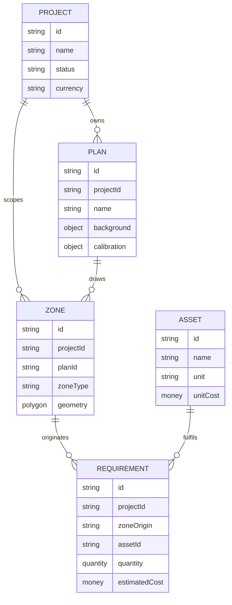
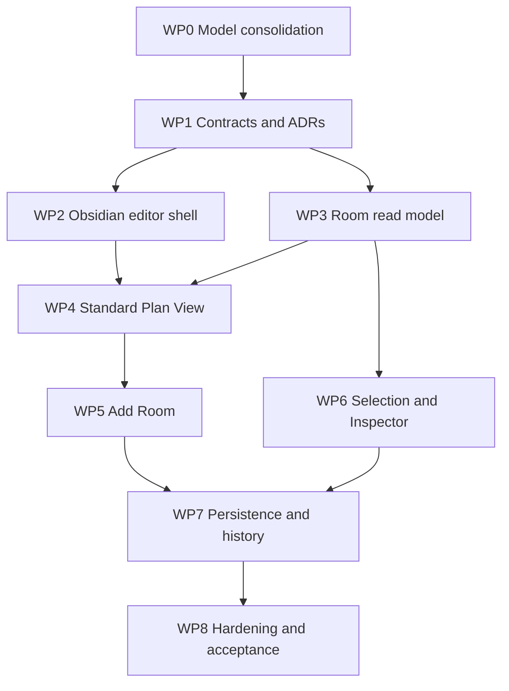

# Renovation Planner — First Vertical Slice Plan and Data-Model Specification

**Status:** Implementation-readiness plan; no production-code authorization  
**Product:** Renovation Planner, an Obsidian plugin  
**Repository:** [Luis85/renovation-planner](https://github.com/Luis85/renovation-planner)  
**Repository baseline:** `main` at `63fe38b1e72dfb85afeac75990d9721e38fac896`, inspected 2026-09-01  
**Design baseline:** Locked M00–M17 editor mockups and screen specifications  
**Primary user:** A private homeowner with little or no CAD experience

## 1. Decision summary

The first implementation increment should be a narrow, end-to-end editor slice:

> A homeowner opens a floor plan in Obsidian, sees a safe Standard Plan View, adds a room, selects it, reviews its contextual Inspector, reloads the workspace, and finds the room unchanged. The action can be undone and redone, and the experience works naturally in Obsidian light and dark themes.

The slice must **not** begin by replacing the current domain model. The repository already implements a versioned, tested model around `Project`, `Plan`, `Zone`, `Asset`, and `Requirement`. Before any new entity, schema version, rename, or migration is approved, the team must complete **WP0 — Current Data-Model Consolidation**.

The preferred starting hypothesis is compatibility-first:

- Keep `Zone` as the implementation concept for the first slice.
- Present `Zone` with `zoneType: Room` as **Room** in homeowner-facing UI.
- Introduce Room-oriented application/read-model contracts around the current domain rather than renaming persisted types immediately.
- Keep Markdown notes canonical for metadata and `.rpgeo` sidecars canonical for plan geometry.
- Add schema fields or entities only when the selected slice cannot be delivered truthfully through current contracts.

This hypothesis becomes a decision only after WP0 is accepted.

## 2. Slice goals and measurable outcomes

### 2.1 Product outcome

A homeowner can create and recover a useful spatial room without learning CAD terminology or understanding the storage model.

### 2.2 User journey

1. Open Renovation Planner in an Obsidian workspace leaf.
2. Navigate to a project and floor/plan.
3. Arrive in M01 Standard Plan View with Select as the safe default.
4. Choose `Add → Room`.
5. Drag a rectangular room, optionally adjust dimensions, name it Kitchen, and confirm.
6. Return automatically to Select with Kitchen selected.
7. See M00 Kitchen Selected Overview in the Inspector.
8. Undo room creation and redo it.
9. Close/reopen the view or reload the plugin.
10. See the same Kitchen geometry and metadata restored from the vault.

### 2.3 Success measures

| Measure | Target for slice acceptance |
|---|---|
| Task completion | A first-time user can create and reselect a Kitchen without instruction |
| Vocabulary | No primary interaction exposes Zone, Polygon, Vertex, Scene, or Calibrate tool |
| Persistence | Metadata and geometry survive reload with the same stable identity |
| Consistency | Canvas selection and Inspector refer to the same entity ID |
| Reversibility | Create, move, undo, and redo produce deterministic persisted state |
| Theme support | No product-specific light/dark switch; both Obsidian themes remain legible |
| Keyboard access | Add, cancel, select, Inspector navigation, undo, and redo have keyboard paths |
| Failure safety | A failed read/write never presents uncertain data as successfully current |

## 3. Scope

### 3.1 Included

- Existing Obsidian plugin workspace leaf and composition root.
- Project and plan/floor context sufficient to open one editor surface.
- M01 Standard Plan View.
- M02 Add Menu, limited to Room as the implemented creation option.
- M03 Add Room, initially rectangular.
- M00 Room Selected Overview for a Kitchen.
- Select as default editor state.
- Direct manipulation, snapping already supported by the editor foundation, and numeric dimensions where current geometry contracts allow them.
- Room creation, selection, movement, undo, redo, persistence, reload, and recoverable errors.
- Native Obsidian light/dark theming and constrained-leaf sanity behavior.
- Non-canvas access to the room through the Inspector or entity list/read model.

### 3.2 Explicitly deferred

- Wall-first modelling, doors, windows, and openings.
- Full Site → Building → Floor hierarchy unless WP0 proves it is required for truthful persistence now.
- Existing, Planned, and Work editing forms.
- Materials, procurement, costs, documents, photos, and notes workflows.
- Calibration redesign and imported-plan setup beyond preserving current behavior.
- Multi-selection, Review perspective, and complete constrained-workspace drawers.
- Mobile editing.
- Renaming every implementation-level `Zone` symbol to `Room`.
- Migration of valid existing vaults unless an accepted model decision makes it unavoidable.

### 3.3 Inspector honesty rule

The M00 Inspector may expose navigation headings for future concepts only when they are clearly inactive or marked unavailable. It must not show invented counts, statuses, costs, materials, or completion values. In the first slice, the implemented overview should be limited to data the current read model can actually support, such as:

- Room name and type.
- Area derived from geometry.
- Plan/floor context.
- Selection state.
- Geometry editing entry points implemented by the slice.
- Existing linked requirements only if the current query supplies them reliably.

## 4. Mandatory gate: WP0 — Current Data-Model Consolidation

### 4.1 Purpose

Reconcile the locked product-design language and the proposed target model with what is actually implemented. This work package is a **blocking predecessor** for schema changes and new persistence-backed entities.

### 4.2 Task statement

> Inventory every implemented domain entity, value object, storage DTO, mapper, repository contract, command, query/read model, index, migration, and representative vault fixture that participates in the editor. Map each one to the locked homeowner concepts and first-slice use cases. Identify equivalence, gaps, conflicts, unused model declarations, persistence omissions, compatibility risks, and decisions. Produce an approved consolidation matrix and ADR set before changing a schema or introducing a competing entity.

### 4.3 Evidence to inspect

The inventory must cover, at minimum:

- Domain: `src/domain/{project,plan,zone,asset,requirement}` and relevant `src/core` types.
- Application: editor commands, queries, event handlers, reference resolution, and repository ports.
- Persistence: frontmatter DTOs, geometry DTO, mappers, migrations, Obsidian repositories, project index, versioning, and path rules.
- Presentation: `PlanDto`, `ZoneDto`, editor stores, selection, Inspector, shell, tools, save state, and error surfaces.
- Tests: domain, contract, repository, migration, editor, harness, and vault fixtures.
- Documentation: accepted ADRs, entity notes, business rules, PRD/SDD passages, and the new M00–M17 specifications.

### 4.4 Consolidation tasks

| ID | Task | Required output |
|---|---|---|
| DM-01 | Freeze and record the inspected commit | Baseline SHA and inventory date |
| DM-02 | Inventory implemented entities and value objects | Current-state entity catalogue with fields and invariants |
| DM-03 | Inventory persisted shapes | Frontmatter/sidecar field catalogue by schema version |
| DM-04 | Trace round trips | Entity → mapper → note/sidecar → mapper → entity matrix |
| DM-05 | Trace editor use cases | UI action → command/query → repository → event → refresh sequence |
| DM-06 | Compare design vocabulary | Homeowner term ↔ application term ↔ domain term ↔ persisted term |
| DM-07 | Identify mismatches | Gap/conflict register with severity and affected vault data |
| DM-08 | Classify proposed changes | Retain, adapt, extend, rename later, migrate, or reject |
| DM-09 | Inspect backward compatibility | Existing-vault fixtures and version/migration impact analysis |
| DM-10 | Decide model boundaries | ADRs for Room/Zone, Plan/Floor, hierarchy, and state modelling |
| DM-11 | Define canonical IDs and links | Reference and ownership rules for all slice entities |
| DM-12 | Approve target slice schema | Signed consolidation report and implementation contract |

### 4.5 Required mapping matrix

The team must complete this table with code-level evidence. The entries below are the inspected starting point, not permission to skip verification.

| Homeowner concept | Current implementation | Initial classification | Decision required |
|---|---|---|---|
| Renovation project | `Project` | Retain | Confirm which domain fields are persisted in the slice |
| Property | No implemented entity | Defer or derive from Project | Is Project sufficient as top-level homeowner context initially? |
| Building | Documented, not implemented | Defer candidate | Is multi-building navigation needed before first room creation? |
| Floor | Documented, not implemented | Adapter candidate | Can `Plan.name` safely provide floor context in the first slice? |
| Plan | `Plan` with background, calibration and layers | Retain | Separate drawing/document identity from future Floor identity |
| Room | `Zone` where `zoneType = Room` | Adapt | Is Room a semantic view of Zone or a distinct domain entity? |
| Area | `Zone` types including Garden/Terrace/etc. | Retain internally | Define homeowner labels and future subtype strategy |
| Spatial object | Geometry entry in a plan sidecar | Extend later | Current sidecar supports only polygon objects |
| Wall/opening | Not implemented | Defer | Define future geometry compatibility without implementing now |
| Existing state | Not represented as a separate implemented concept | Gap | State-on-object, snapshot, or related record? |
| Planned state | `Zone.status` is a work lifecycle, not the planned outcome | Conflict | Do not reuse `ZoneStatus` to mean Existing/Planned |
| Work | No implemented Work Item entity | Gap | Future note-backed entity linked by stable target IDs |
| Material | `Asset` + `Requirement` | Partial equivalence | UI vocabulary and later procurement separation |
| Cost | Calculated/overridden estimate on Requirement; Project money fields partly present | Partial equivalence | Do not present this as complete cost accounting |
| Documents/photos/notes | Documented, not implemented as editor entities | Gap | Defer but reserve stable relationship model |

### 4.6 Known current-state findings to verify

1. `Project` is immutable and already contains name, description, lifecycle status, dates, budget, contingency, location description, and currency.
2. Project frontmatter v1 currently persists name, status, description, dates, and optional currency; budget, contingency, and location description are not yet stored.
3. `Plan` belongs to one Project and contains a name, optional background reference, calibration, and layer names.
4. Plan metadata is Markdown frontmatter; calibration and spatial geometry are stored in one project-scoped `.rpgeo` sidecar per Plan.
5. `Zone` belongs to one Plan and Project, owns validated polygon geometry, and derives area/perimeter.
6. Zone frontmatter v1 stores identity, Project, Plan, name, type, and lifecycle status. Geometry is keyed by the same ID in the Plan sidecar.
7. `domainNoteLink` exists on the `Zone` domain entity but is not present in the inspected v1 frontmatter DTO or mapper. The consolidation must decide whether this is intentional, obsolete, or an unimplemented persistence requirement.
8. Current sidecar objects are only `{ id, type: polygon, points }`; they do not persist semantic subtype, layer, object state, or domain-note link.
9. `Asset` is a vault-level catalogue entity, not project-owned.
10. `Requirement` is project-owned, links an Asset to a Zone origin, and persists calculated/overridden quantity and estimated cost with stale-input protection.
11. `ZoneStatus = Planned | InProgress | Complete` is a progress axis and must not be silently reinterpreted as Existing/Planned/Work.
12. Repositories use stable IDs, optimistic revisions, migrations, a Project Index, error Results, and user-body preservation; these are compatibility constraints, not incidental implementation details.

### 4.7 Decisions that must be recorded as ADRs

| ADR | Required decision |
|---|---|
| ADR-RZ | Is Room a Zone specialization/facade, a renamed Zone, or a separate entity linked to geometry? |
| ADR-PF | What is the boundary between Plan and Floor, and when is Floor introduced? |
| ADR-HI | How much of Property → Building → Floor is persisted versus progressively introduced? |
| ADR-EPW | How are Existing, Planned, and Work represented without conflating axes? |
| ADR-SO | How can polygon-only sidecars evolve to walls/openings/annotations compatibly? |
| ADR-RL | What is the single relationship mechanism between spatial targets and vault-backed records? |
| ADR-SV | Which additive changes remain schema v1 and which require migrations/version bumps? |

### 4.8 WP0 exit criteria

WP0 is complete only when:

- Every slice field has one named source of truth.
- Every persisted change has a round-trip test plan.
- Every new term is mapped across UI, read model, domain, and storage.
- The Room/Zone and Plan/Floor ADRs are accepted.
- Existing fixtures have an explicit preserve/migrate decision.
- No unresolved high-severity conflict remains for create, select, move, undo/redo, save, or reload.
- The approved target schema is linked from the implementation backlog.

## 5. Data-model specification

### 5.1 Model principles

1. Stable IDs define identity; filenames, titles, and paths never do.
2. Markdown remains canonical for human-readable entity metadata.
3. `.rpgeo` remains canonical for high-frequency plan geometry unless an ADR supersedes it.
4. The same ID connects canvas geometry, Inspector data, and project-management records.
5. User-visible vocabulary may differ from implementation vocabulary, but the mapping must be explicit and tested.
6. Existing, Planned, and Work are separate concepts and never overloaded onto a single status enum.
7. Derived values such as area are calculated from geometry and not independently persisted.
8. Writes occur only through completed commands; read failure must never replay a successful write.
9. Unknown future-compatible values should round-trip where the accepted storage rule allows them.
10. The free-form body of a user note remains user-owned and is preserved across plugin writes.

### 5.2 Current implemented model



### 5.3 Recommended first-slice compatibility model

This model is **provisional until WP0 approval**.

| Contract | Slice role | Backing model |
|---|---|---|
| `ProjectContextDto` | Top context label and project identity | Existing `Project` summary/query |
| `FloorPlanDto` | Homeowner floor/plan context | Adapter over existing `PlanDto`; no new persistence initially |
| `RoomDto` | Canvas and Inspector representation | Adapter over `ZoneDto` constrained to `zoneType = Room` |
| `RoomGeometryDto` | Polygon in world millimetres | Existing Zone geometry entry in `.rpgeo` |
| `RoomOverviewDto` | Selected-room Inspector | Existing Zone Inspector/read queries plus truthful available counts only |
| `CreateRoom` | Homeowner application command | Facade/delegation to `CreateZone` with `zoneType = Room` |
| `MoveRoom` | Direct manipulation command | Existing spatial-object move command |
| `EditorSelection` | Shared selected identity | Existing selection store, exposed as Room vocabulary |

Suggested presentation contract:

```ts
interface RoomDto {
  readonly id: string;
  readonly projectId: string;
  readonly planId: string;
  readonly name: string;
  readonly points: readonly Point[];
  readonly areaMm2: number;
  readonly progressStatus: 'Planned' | 'InProgress' | 'Complete';
}

interface RoomOverviewDto {
  readonly room: RoomDto;
  readonly planName: string;
  readonly requirementCount: number;
  readonly unavailableSections: readonly (
    | 'existing'
    | 'planned'
    | 'work'
    | 'materials'
    | 'costs'
    | 'documents'
    | 'photos'
    | 'notes'
  )[];
}
```

`unavailableSections` is preferable to fabricated empty data. If a section has no implemented repository/query contract, the UI must be able to distinguish **not yet supported** from **supported and empty**.

### 5.4 Identity and ownership

| Entity/contract | Identity | Owner | Persistence in first slice |
|---|---|---|---|
| Project | Existing `ProjectId` | Vault/project index | Project Markdown note |
| Plan/floor presentation | Existing `PlanId` | Project | Plan note + plan `.rpgeo` |
| Room presentation | Existing `ZoneId` | Plan and Project | Zone note + entry in plan `.rpgeo` |
| Selection | Room/Zone stable ID | Editor session | Ephemeral Pinia state |
| Undo/redo record | Command instance and captured versions | Editor session | Ephemeral; resulting entity state persists |

### 5.5 Persistence contract for first slice

Unless WP0 approves a schema change, room creation should continue to produce:

```yaml
---
type: renovation-zone
schema-version: 1
id: <stable-zone-id>
revision: <non-negative-integer>
project: <project-id>
plan: <plan-id>
name: Kitchen
zone-type: room
status: planned
---
```

The corresponding plan sidecar entry remains:

```json
{
  "id": "<same-stable-zone-id>",
  "type": "polygon",
  "points": [[0, 0], [4200, 0], [4200, 3600], [0, 3600]]
}
```

Coordinates are world millimetres. The note and geometry entry form one logical Room/Zone and must be written, compensated, recovered, and tested as such.

### 5.6 Future model seams reserved but not implemented

| Future concept | Reserved relationship |
|---|---|
| Floor | Stable `FloorId`; a Plan may depict one Floor |
| Wall/opening | New spatial-object geometry kinds linked to stable domain IDs |
| Existing state | Description of what is present now, independently queryable |
| Planned state | Intended outcome/change state, not progress status |
| Work Item | Project-owned note linked to one or more stable spatial target IDs |
| Material requirement | Evolution/mapping of current Requirement, separated from procurement state |
| Cost Item | Project-owned financial record linked to Work/Material/spatial context |
| Evidence | Vault file/note relationship carrying phase and stable target IDs |

No first-slice field should block these seams by conflating them.

## 6. Vertical-slice work breakdown

### Dependency flow



### WP1 — Approve slice contracts and ADRs

**Goal:** Turn WP0 decisions into enforceable contracts before UI work depends on them.

Tasks:

- Accept Room/Zone and Plan/Floor decisions.
- Define Room-oriented command, query, and read-model interfaces.
- Decide whether adapters live in application or presentation boundaries.
- Define unavailable-versus-empty Inspector semantics.
- Define event names and refresh ownership for create/move/delete.
- Define schema/migration decision; prefer no migration for this slice.
- Add contract-test scenarios and architectural dependency rules to the plan.

Exit criteria:

- Interfaces compile in an isolated contract branch/prototype.
- No Vue component imports domain entities or persistence DTOs.
- No homeowner label is used as an accidental persistence discriminator.
- ADRs and mapping matrix are approved.

### WP2 — Obsidian-native editor shell

**Goal:** Implement the locked shell inside an Obsidian leaf without a standalone application frame.

Tasks:

- Reconcile existing `PlanEditorView`, editor shell, toolbar, status bar, and Inspector components with M00/M01.
- Remove/relocate logo, avatar, account, and user surfaces if present.
- Use Obsidian workspace tab, ribbon, commands, menus, and leaf lifecycle appropriately.
- Implement context bar for Project and plan/floor presentation.
- Implement left Property/Layers panel using existing queries where possible.
- Implement canvas center and contextual Inspector region.
- Implement status bar for zoom, grid, snapping, scale, and save state using truthful current capabilities.
- Consume Obsidian semantic CSS variables; prohibit a plugin theme switch.
- Define constrained-leaf breakpoint behavior without claiming mobile support.

Acceptance criteria:

- The view mounts/unmounts without leaking listeners or stores.
- Both Obsidian default light and dark themes remain readable.
- No hard-coded white/black surface is required for layout to work.
- The shell remains usable when another workspace leaf is open beside it.

### WP3 — Room-oriented read model

**Goal:** Expose existing Zone data as a stable homeowner-facing Room contract.

Tasks:

- Add `RoomDto` mapping from compatible `ZoneDto` records.
- Add `FloorPlanDto` mapping from `PlanDto` if WP0 retains Plan as the initial backing concept.
- Add room list/summary query without rescanning the vault from the view.
- Add `RoomOverviewDto` query with derived area and supported-section metadata.
- Preserve unreadable-entity counts and repository errors instead of flattening them into empty arrays.
- Unit test user vocabulary and ID preservation.

Acceptance criteria:

- A Room DTO and its source Zone have the same ID.
- Area is derived from geometry and never copied into frontmatter.
- An unreadable room is distinguishable from a plan with zero rooms.
- Unsupported Inspector sections are distinguishable from supported empty sections.

### WP4 — Standard Plan View

**Goal:** Deliver M01 as the safe editor home state.

Tasks:

- Make Select the default after load, completion, cancellation, and Escape.
- Render loaded room polygons, reference background, selection affordances, and current scale truthfully.
- Replace persistent Pan emphasis with pointer/wheel/space navigation gestures.
- Implement `Select`, `Add`, `Undo`, and `Redo` as primary actions.
- Open M02 Add Menu from button and keyboard command.
- Show floor/plan summary in the no-selection Inspector.
- Provide non-canvas room selection through an accessible room list.
- Preserve viewport and selection through supported panel layout changes.

Acceptance criteria:

- Opening a plan never leaves a destructive creation tool active.
- Pan/zoom does not require a persistent mode under normal use.
- Keyboard users can reach Add and every room in the alternative list.
- Clearing selection restores the floor/plan summary.

### WP5 — Add Room interaction

**Goal:** Deliver M02 → M03 → M00 as one coherent creation flow.

Tasks:

- Show the homeowner Add menu; only Room is enabled as implemented in this slice.
- Implement rectangular drag preview in world coordinates.
- Reuse/extend snapping service and show snap guides without CAD vocabulary.
- Display live width and depth; allow exact numeric entry when available.
- Capture room name and type; default type to Room and suggest localized names carefully.
- Validate minimum geometry, non-self-intersection, and input bounds at the domain boundary.
- Dispatch one reversible `CreateRoom` application command.
- After success, return to Select and select the created room.
- On cancel/refusal, remove draft geometry and retain the last valid persisted scene.

Acceptance criteria:

- One user confirmation creates one logical room note and one geometry entry.
- The room is immediately selected after successful creation.
- Cancel writes nothing.
- Validation explains the problem without exposing polygon terminology.
- A write failure does not leave a phantom room in the canvas.

### WP6 — Room selection and contextual Inspector

**Goal:** Deliver an honest, useful M00 overview linked to canvas selection.

Tasks:

- Normalize selection by stable entity ID.
- Synchronize canvas selection, alternative room list, and Inspector.
- Render room name, type, dimensions/area, context, and current supported linked data.
- Add Overview plus disabled/unavailable section navigation for unimplemented concepts.
- Support direct movement and numeric precision through existing command boundaries.
- Keep selection while switching Obsidian light/dark themes or resizing the leaf.
- Restore focus meaningfully after Inspector edits, cancel, and undo.

Acceptance criteria:

- Canvas and Inspector never disagree about the selected ID.
- Selecting Kitchen from the canvas or list produces the same Inspector DTO.
- No future section presents fabricated zero values.
- Color is not the only selection indicator.

### WP7 — Persistence, undo/redo, and recovery

**Goal:** Make the slice trustworthy across command history and vault round trips.

Tasks:

- Reuse command-based mutations and optimistic revision checks.
- Treat note plus sidecar update as one logical write sequence with compensation/recovery.
- Ensure create, move, undo, and redo refresh through queries rather than mutating read models as a second source of truth.
- Preserve user-owned Markdown body and unknown allowed frontmatter.
- Keep stable IDs through rename, move, reload, undo, and redo.
- Rehydrate project, plan, rooms, selection-safe state, and save-state indicator.
- Surface stale-data state if write succeeds but refresh fails; retry the read only.
- Add migration fixtures only if WP0 accepts a schema change.

Acceptance criteria:

- Reload reproduces the last successful command state.
- Undo removes/reverts both metadata and geometry effects.
- Redo replays exactly once with valid revision handling.
- A failed post-write read never repeats the write.
- Existing valid-vault fixtures still load or migrate through a tested, documented path.

### WP8 — Hardening, design QA, and acceptance

**Goal:** Prove the slice is usable, accessible, compatible, and ready for the next increment.

Tasks:

- Add domain, command, repository contract, mapper, migration, store, component, and harness tests.
- Capture light, dark, wide-leaf, and constrained-leaf visual states.
- Run keyboard-only and screen-reader-oriented checks.
- Test 200% zoom, long room names, German/English strings, empty plans, unreadable rooms, and save failures.
- Run a five-task moderated homeowner test using the slice journey.
- Record findings as defects or backlog items; do not silently expand slice scope.
- Update entity docs, ADRs, screen traceability, changelog, and implementation status.

Acceptance criteria:

- All automated quality gates pass.
- No critical accessibility or data-loss defect remains.
- The accepted screenshots have an implementation comparison record.
- At least one first-time homeowner completes create/select/reload without CAD explanation.

## 7. Backlog decomposition

| PBI | Use-case title | Primary work packages | Depends on |
|---|---|---|---|
| VS-00 | Consolidate the current and target editor data models | WP0 | — |
| VS-01 | Open a floor plan in the Obsidian editor shell | WP1–WP4 | VS-00 |
| VS-02 | View rooms in the Standard Plan View | WP3–WP4 | VS-01 |
| VS-03 | Start room creation from Add | WP4–WP5 | VS-02 |
| VS-04 | Draw and name a rectangular room | WP5 | VS-03 |
| VS-05 | Select a room from canvas or room list | WP4, WP6 | VS-02 |
| VS-06 | Inspect the selected Kitchen overview | WP3, WP6 | VS-05 |
| VS-07 | Move a selected room with direct manipulation | WP5–WP7 | VS-05 |
| VS-08 | Undo and redo editor changes | WP7 | VS-04, VS-07 |
| VS-09 | Reload the editor without losing room data | WP7 | VS-04 |
| VS-10 | Recover safely from failed writes and stale reads | WP7 | VS-09 |
| VS-11 | Use the slice in Obsidian light, dark, and constrained layouts | WP2, WP8 | VS-01–VS-10 |

Each PBI should be expanded into whole-team tasks for requirements/design confirmation, domain/application work, persistence, presentation, automated tests, accessibility, documentation, and review.

## 8. Core acceptance scenarios

### Scenario A — Create Kitchen

```gherkin
Given an editable Ground Floor plan is open
And Select is the active default state
When the homeowner chooses Add and then Room
And draws a valid rectangular room
And names it Kitchen
And confirms creation
Then exactly one room is persisted
And the room metadata and geometry share one stable ID
And Select becomes active
And Kitchen is selected
And the Room Overview Inspector is shown
```

### Scenario B — Cancel room creation

```gherkin
Given the homeowner is previewing a new room
When they press Escape
Then the draft disappears
And no note or geometry entry is written
And Select becomes active
And the last valid plan remains visible
```

### Scenario C — Reload

```gherkin
Given Kitchen was created successfully
When the editor is closed and reopened
Then Kitchen is loaded with the same stable ID
And its geometry is restored from the plan sidecar
And its name and type are restored from Markdown metadata
And its derived area matches the restored geometry
```

### Scenario D — Write succeeded, refresh failed

```gherkin
Given a room mutation was written successfully
And the following read-back fails
Then the editor keeps the last valid projection visible
And identifies it as potentially stale
And disables unsafe follow-up edits
When the homeowner retries
Then only hydration is repeated
And the original mutation is not replayed
```

### Scenario E — Native theme change

```gherkin
Given Kitchen is selected in the editor
When Obsidian changes from light to dark theme
Then the editor adopts the host theme without reloading
And Kitchen remains selected
And text, focus, selection, guides, and error states remain distinguishable
```

## 9. Test strategy

| Layer | Required coverage |
|---|---|
| Domain | Room-compatible Zone validation, geometry invariants, derived area, ID stability |
| Application | CreateRoom facade/delegation, move, history, events, error Results |
| Persistence DTO | Current and any newly accepted schema shapes |
| Mapper | Full note + sidecar round trip and field preservation |
| Repository contract | Insert/update/delete, revisions, compensation, unreadable entries |
| Migration | Every accepted version transition and legacy fixture |
| Read model | Zone→Room mapping, unavailable vs empty, unreadable counts |
| Store | Default Select, selection sync, refresh, stale state |
| Component | Add menu, room form, Inspector, status indicators, keyboard paths |
| Harness | End-to-end journey in light/dark and full/constrained layouts |
| Manual usability | First-time homeowner task completion and terminology comprehension |

## 10. Non-functional requirements

### Usability

- Selection is always the safe recovery state.
- Creation uses Room language and a guided completion action.
- Numeric precision is optional, not required to make progress.
- The UI distinguishes unavailable capability from empty project data.

### Accessibility

- All primary actions are keyboard reachable and have visible focus.
- Canvas-only actions have an alternative list/form route.
- Touch targets and pointer handles remain operable at supported densities.
- State uses text/icon/shape in addition to color.
- Reduced-motion preferences are respected.

### Reliability and data integrity

- No optimistic UI is allowed to become a second persisted truth.
- All mutations use current version checks.
- Multi-file writes have tested failure and compensation behavior.
- Stale projections are explicitly marked and guarded.
- Unknown user body content is preserved.

### Performance budgets to confirm in WP0/WP1

- Initial editor shell should become interactive without waiting for nonessential Inspector details.
- Pointer drag and pan/zoom should target smooth visual feedback on a typical homeowner plan.
- Geometry writes may be serialized, but pointer previews must not await vault I/O.
- Large-plan thresholds and virtualization are measured, not guessed; they are not reasons to expand the first slice prematurely.

### Obsidian compatibility

- Theme values come from Obsidian semantic variables.
- The plugin provides no account, authentication, avatar, logo shell, or independent theme preference.
- Workspace leaf lifecycle, commands, menus, notices, vault events, and file links follow Obsidian conventions.
- The editor must not assume it owns the entire application window.

## 11. Definition of Ready

A vertical-slice PBI may enter implementation only when:

- VS-00/WP0 is accepted.
- Relevant screen specification and mockup are linked.
- User vocabulary and implementation mapping are stated.
- Commands, queries, IDs, source of truth, and error outcomes are named.
- Persistence/migration impact is classified.
- Acceptance criteria include light/dark, keyboard, failure, and reload behavior where relevant.
- Dependencies and out-of-scope behavior are explicit.
- Tests are identified at the correct layers.

## 12. Definition of Done

The vertical slice is done when:

- The complete journey in §2.2 works in the Obsidian plugin.
- All accepted model decisions and ADRs are reflected in code and documentation.
- Existing vault data remains compatible or follows an automated, tested migration.
- Canvas, Inspector, and Markdown/sidecar storage resolve the same stable room identity.
- Undo/redo and post-write recovery are verified.
- Light/dark and constrained-leaf checks pass.
- Keyboard and alternative non-canvas paths pass.
- Automated tests and repository quality gates pass.
- Usability findings are recorded and critical issues resolved.
- Deferred concepts remain clearly deferred and are not represented with misleading placeholders.

## 13. Risks and controls

| Risk | Consequence | Control |
|---|---|---|
| Renaming Zone to Room too early | Wide migration and test churn without user value | Compatibility facade first; ADR-RZ gate |
| Treating Plan as Floor permanently | Building hierarchy becomes ambiguous later | Explicit adapter and ADR-PF; no accidental persistence promise |
| Reusing ZoneStatus for Planned state | Existing/Planned/Work concepts become conflated | ADR-EPW and separate vocabulary |
| Adding hierarchy before it is needed | Slice expands into property-management infrastructure | Defer unless WP0 demonstrates a blocking use case |
| Inspector shows future data as zero | Homeowner mistakes unsupported data for complete planning | Unavailable-versus-empty contract |
| Note and sidecar diverge | Ghost or unselectable rooms | One logical write sequence, compensation and contract tests |
| Hard-coded design colors | Breaks community themes and accessibility | Obsidian semantic variables and theme harness |
| UI mutates store without command | Undo/reload differs from visible state | Commands as the only mutation path; query-based refresh |

## 14. Delivery checkpoints

| Checkpoint | Demonstrable result | Go/no-go question |
|---|---|---|
| C0 — Consolidated model | Matrix, ADRs, schema decision, compatibility plan | Do we know exactly how new design concepts map to current code/data? |
| C1 — Shell and read path | Existing plan and rooms render in locked shell | Can the editor show current vault truth without new writes? |
| C2 — Creation path | Add Room creates and selects Kitchen | Does one homeowner action produce one coherent domain result? |
| C3 — Trust path | Undo/redo/reload/failure recovery pass | Can users trust the state across failure and time? |
| C4 — Acceptance | Theme, accessibility, visual QA, and usability checks pass | Is the slice safe to become the base for Existing/Planned/Work? |

## 15. Recommended next increment after acceptance

After this slice is accepted, the next increment should model and implement **Existing → Planned → Work** for a selected Room. It should begin with ADR-EPW from WP0, then add one truthful end-to-end relationship—such as an existing floor finish, its planned replacement, and the work item required to produce it—before Materials and Costs expand the chain.

## 16. Repository evidence used for this plan

- [`Project.ts`](https://github.com/Luis85/renovation-planner/blob/main/src/domain/project/Project.ts)
- [`Plan.ts`](https://github.com/Luis85/renovation-planner/blob/main/src/domain/plan/Plan.ts)
- [`Zone.ts`](https://github.com/Luis85/renovation-planner/blob/main/src/domain/zone/Zone.ts)
- [`Asset.ts`](https://github.com/Luis85/renovation-planner/blob/main/src/domain/asset/Asset.ts)
- [`Requirement.ts`](https://github.com/Luis85/renovation-planner/blob/main/src/domain/requirement/Requirement.ts)
- [`projectFrontmatter.ts`](https://github.com/Luis85/renovation-planner/blob/main/src/infrastructure/persistence/dto/projectFrontmatter.ts)
- [`planFrontmatter.ts`](https://github.com/Luis85/renovation-planner/blob/main/src/infrastructure/persistence/dto/planFrontmatter.ts)
- [`zoneFrontmatter.ts`](https://github.com/Luis85/renovation-planner/blob/main/src/infrastructure/persistence/dto/zoneFrontmatter.ts)
- [`planGeometry.ts`](https://github.com/Luis85/renovation-planner/blob/main/src/infrastructure/persistence/dto/planGeometry.ts)
- [`PlanDto.ts`](https://github.com/Luis85/renovation-planner/blob/main/src/presentation/read-models/PlanDto.ts)
- [`paths.ts`](https://github.com/Luis85/renovation-planner/blob/main/src/infrastructure/obsidian/repositories/paths.ts)
- [ADR-001: Markdown metadata](https://github.com/Luis85/renovation-planner/blob/main/docs/development/adrs/0001-markdown-as-canonical-metadata-storage.md)
- [ADR-002: JSON geometry sidecar](https://github.com/Luis85/renovation-planner/blob/main/docs/development/adrs/0002-json-sidecar-for-plan-geometry.md)
- [ADR-011: Project-scoped `.rpgeo` sidecars](https://github.com/Luis85/renovation-planner/blob/main/docs/development/adrs/0011-project-scoped-geometry-sidecar-folder-and-file-extension.md)
- [ADR-013: Project folder derived from Project note](https://github.com/Luis85/renovation-planner/blob/main/docs/development/adrs/0013-a-project-folder-is-derived-from-its-note.md)

