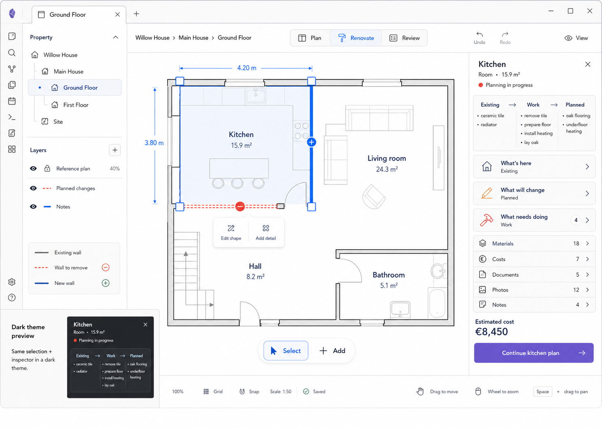

# M00 — Kitchen Selected Overview

## Screen description

This is the locked reference screen for the editor. The user is in the **Renovate** perspective on the Ground Floor and has selected the Kitchen. The selection connects geometry, renovation state, work, materials, cost, and evidence through one contextual Inspector.

The screen lives inside an Obsidian workspace leaf. A restrained host ribbon and tab frame the plugin. The plugin itself contains a compact context bar, Property/Layers panel, canvas, Inspector, and status bar.

## Entry conditions

- A project, building, floor, and Kitchen room exist.
- The Ground Floor plan has a known scale.
- The Kitchen has geometry and at least some Existing, Planned, or Work data.
- The user selects the Kitchen from the canvas or from a non-canvas list.

## Primary use cases

1. Understand the Kitchen's renovation status at a glance.
2. Move from the spatial room to Existing, Planned, Work, Materials, Costs, Documents, Photos, or Notes.
3. Adjust the Kitchen shape using direct manipulation.
4. Add a contextual renovation detail already linked to the Kitchen.
5. Compare the current state, required transformation, and intended result.

## Layout and information hierarchy

- **Host frame:** Obsidian ribbon and active `Ground Floor` tab.
- **Context bar:** `Willow House › Main House › Ground Floor`, perspective switch, Undo, Redo, View.
- **Left panel:** Property tree followed by Layers and a change legend.
- **Canvas:** Kitchen selection dominates; unrelated rooms remain visible for context.
- **Inspector:** Kitchen identity, transformation summary, homeowner-question navigation, linked content, estimate, primary continuation action.
- **Status bar:** zoom, grid, snap, scale, save state, gesture hints.

## Interactions

| Trigger | Result |
|---|---|
| Click Kitchen | Select Kitchen and open its Inspector |
| Click empty canvas | Clear selection and return to M01 |
| Drag selected boundary/handle | Preview geometry change with snapping; commit on release |
| Click a displayed dimension | Replace label with numeric entry; Enter commits; Esc cancels |
| Click `Edit shape` | Enter a temporary geometry-edit substate |
| Click `Add detail` | Open a contextual Add menu pre-linked to Kitchen |
| Click `What's here` | Open M08 |
| Click `What will change` | Open M09 |
| Click `What needs doing` | Open M10 |
| Click Materials/Costs/Photos | Open M12/M13/M14 without changing selection |
| Press Esc | Cancel temporary action; otherwise clear selection |
| Delete/Backspace | Open a confirmation only when deletion is valid and focus is not in a field |

Pan remains available through Space+drag, middle-button drag, and trackpad gestures. Wheel/pinch zooms around the pointer.

## Used components

- `ObsidianWorkspaceFrame`
- `EditorContextBar`
- `PerspectiveSwitch`
- `PropertyLayerPanel`
- `PropertyTree`
- `LayerList`
- `PlanCanvas`
- `RoomShape`
- `SelectionOverlay`
- `DimensionLabel`
- `DirectActionPopover`
- `EntityInspector`
- `TransformationSummary`
- `HomeownerQuestionNav`
- `LinkedContentList`
- `EditorStatusBar`
- `SaveStateIndicator`

## Data and state requirements

- `selectedEntityId` and `selectedEntityType = room`
- Room identity, geometry, floor, calculated area, dimensions
- Existing and Planned summaries
- Work-item count and state aggregation
- Linked material, cost, document, photo, and note counts
- Viewport, zoom, snapping, grid, scale, and save state
- Layer visibility and reference-plan lock/opacity

## Accessibility and themes

- Selection uses outline, handles, and fill—not accent color alone.
- The Inspector is keyboard reachable after selection without trapping focus.
- Canvas selection has a non-canvas equivalent through Property/room lists.
- Theme colors inherit Obsidian semantic variables.
- New and removed walls retain plus/minus markers and solid/dashed patterns in both themes.
- Focus order follows context bar → left panel → canvas controls → Inspector → status controls.

## Acceptance criteria

- Selecting Kitchen exposes Kitchen-specific project information without navigating away from the plan.
- Clearing selection restores the Ground Floor summary.
- Editing geometry updates calculated area and dependent quantities through one command path.
- Inspector drill-down preserves Kitchen selection and canvas viewport.
- The screen is legible in Obsidian default light and dark themes and under a custom accent color.
