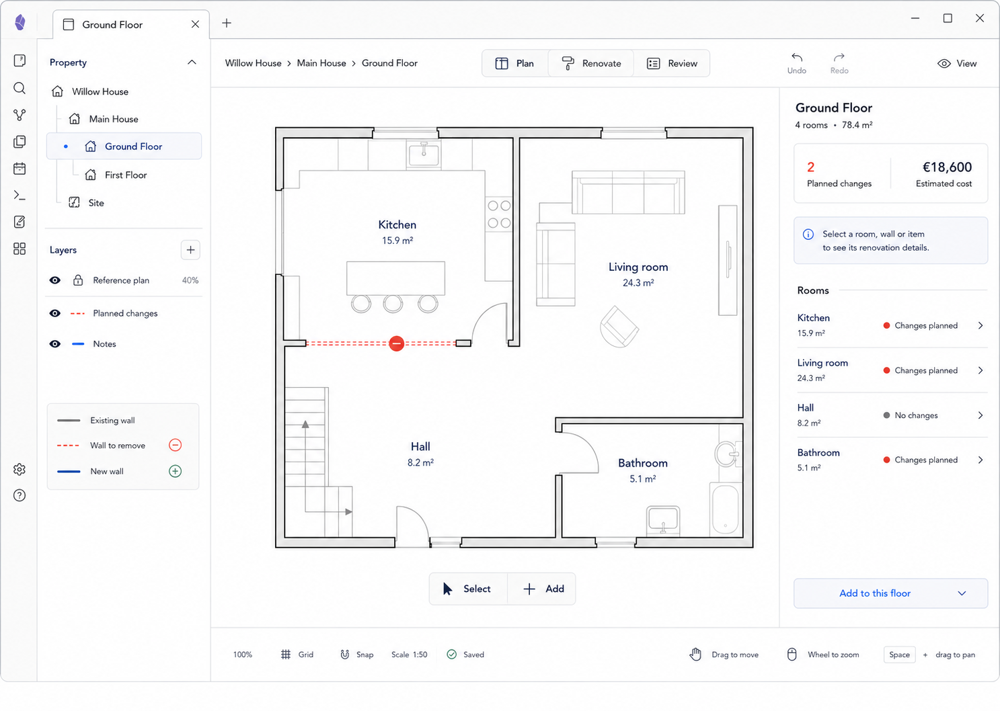

# M01 — Standard Plan View

## Screen description

The Standard Plan View is the editor's safe home state. No entity is selected. The canvas shows the whole floor, while the Inspector summarizes the Ground Floor and invites selection without forcing the user into a tool.

## Entry conditions

- A floor exists and can be loaded.
- The user opens the editor, clears selection, completes a creation action, or presses Esc from an idle selection.

## Primary use cases

1. Orient within the property and floor.
2. Inspect the overall floor without editing.
3. Select a room, wall, opening, object, or marker.
4. Start adding something through the single Add entry point.
5. Toggle layers and reference-plan visibility.

## Layout

- Plan perspective is active by default when entering geometry work.
- Property tree identifies the current floor.
- Canvas fits the floor to the available viewport.
- Inspector shows floor name, room count, total area, planned-change count, estimated cost, and a room list.
- Floating action control contains Select and Add.

## Interactions

| Trigger | Result |
|---|---|
| Click/keyboard-select an entity | Select it and open the matching Inspector |
| Hover entity | Show a subtle preview outline and appropriate cursor |
| Click `+ Add` | Open M02 |
| Choose a room in Inspector list | Select and fit/center that room, then open M00 |
| Toggle layer visibility | Update canvas projection without changing domain data |
| Click reference-plan lock | Require explicit unlock confirmation before editing its placement |
| Space+drag / middle drag | Pan |
| Wheel/pinch | Zoom around pointer |
| Press F or `Fit floor` | Fit the current floor |

## Used components

- `EditorContextBar`
- `PropertyLayerPanel`
- `PlanCanvas`
- `FloorGeometryLayer`
- `HoverOverlay`
- `FloorInspector`
- `RoomSummaryList`
- `FloatingPrimaryActions`
- `EditorStatusBar`

## Data and state requirements

- Current project/building/floor hierarchy
- Floor geometry and entity summaries
- Aggregated room count, area, change count, and cost
- No active selection and no active temporary tool
- Layer, viewport, scale, and save state

## Accessibility and themes

- The canvas has a parallel navigable room/entity list.
- Hover is never the sole source of information.
- The empty selection hint is announced when selection clears.
- Floor geometry remains visible against both theme backgrounds.

## Acceptance criteria

- Opening a populated floor starts in Select with no persistent Pan mode.
- No selection displays useful floor context rather than an empty Inspector.
- All visible entities can be reached through a keyboard-accessible alternative.
- The Add entry point is visible without exposing the full creation catalog.
