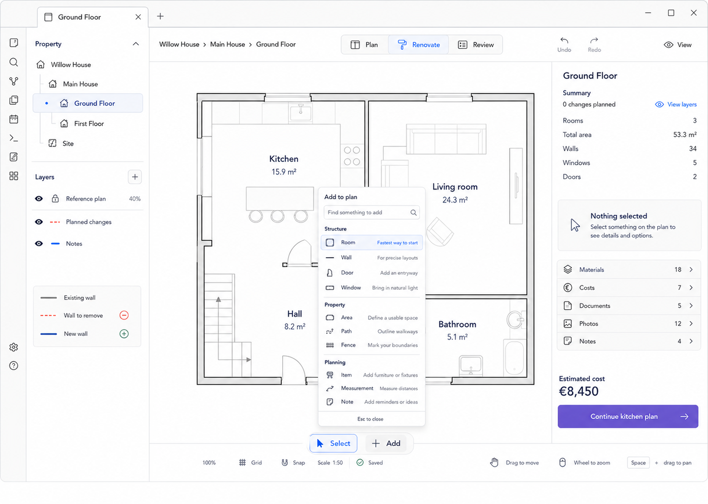

# M02 — Add Menu

## Screen description

The Add menu is the single scalable creation entry point. It translates a growing catalog of technical creation capabilities into homeowner concepts and short plain-language choices.

## Entry conditions

- The editor is loaded and not blocked by an unrecoverable failure.
- The user activates `+ Add` from M01, M00, or another selected-entity state.

## Primary use cases

1. Add a room using the fastest beginner path.
2. Draw walls for a precise or irregular layout.
3. Add doors, windows, property areas, paths, fences, items, measurements, or notes.
4. Search the catalog when it becomes too large to scan.

## Menu structure

- **Structure:** Room, Wall, Door, Window
- **Property:** Area, Path, Fence
- **Planning:** Item, Measurement, Note

Room carries the hint `Fastest way to start`; Wall carries `For precise layouts`.

## Interactions

| Trigger | Result |
|---|---|
| Activate Add | Open anchored menu and focus the first recommended item |
| Arrow keys | Move between menu items |
| Type in search | Filter by localized label and synonym |
| Select Room | Close menu and enter M03 |
| Select Wall | Close menu and enter M04 |
| Select context-dependent item | Start its temporary creation state, optionally pre-linked to current selection |
| Click outside / Esc | Close menu and return to Select |

Creation tools are temporary. After one successful creation, the editor returns to Select unless the user explicitly enables repeated creation.

## Used components

- `FloatingPrimaryActions`
- `AddMenu`
- `AddMenuSearch`
- `AddMenuGroup`
- `AddMenuItem`
- `KeyboardHint`
- `Icon`

## Data and state requirements

- Catalog entries with localized label, description, group, icon, availability predicate, and activation command
- Optional current selection context
- Search query and focused item
- Active temporary-tool identifier after selection

## Accessibility and themes

- Implements menu semantics and roving focus.
- Icon is supplementary to the label.
- Disabled/unavailable entries explain why.
- Menu surfaces use Obsidian popover/background/border variables.

## Acceptance criteria

- The menu contains no internal terms such as Zone or Polygon.
- Esc always closes it without changing data.
- Choosing an item invokes exactly one creation path.
- The catalog remains usable by keyboard and in both themes.
