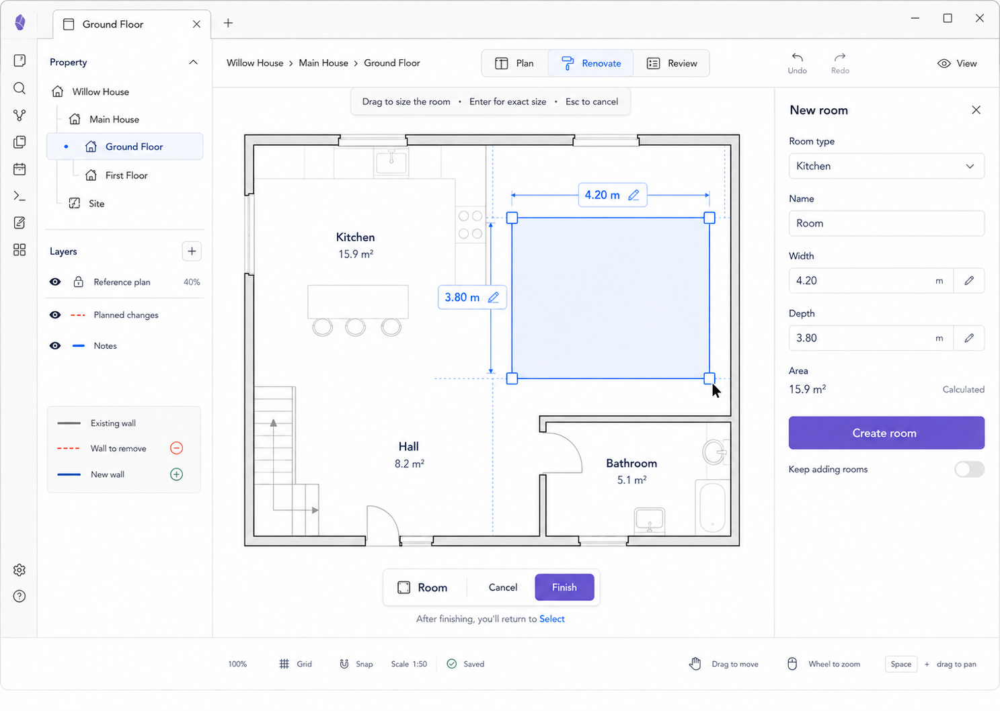

# M03 — Add Room

## Screen description

This state supports fast room-first creation. The homeowner drags a rectangular room visually, sees live dimensions, and may type exact values before creating it.

## Entry conditions

- User chooses `Add → Room`.
- The current floor is editable.

## Primary use cases

1. Create a roughly sized room quickly.
2. Enter exact width/depth when known.
3. Choose a common room type and name.
4. Continue adding rooms deliberately.

## Interactions

| Trigger | Result |
|---|---|
| Pointer down + drag | Preview rectangular room and live dimensions |
| Snap near wall/guide | Align preview and announce snapped relation |
| Click dimension | Focus numeric entry; Enter applies preview value |
| Choose room type | Set semantic type; suggest a default localized name |
| Click `Create room` / Finish | Validate, execute one reversible create command, select new room, return to Select |
| Toggle `Keep adding rooms` | Return to room tool after creation instead of Select |
| Esc / Cancel | Discard preview with no write |

## Inspector content

- Room type
- Name
- Width and depth
- Calculated area
- `Keep adding rooms` off by default
- Create action

## Used components

- `TemporaryToolBanner`
- `RoomCreationOverlay`
- `SnapGuideLayer`
- `EditableDimensionLabel`
- `CreationToolBar`
- `NewRoomInspector`
- `Field`
- `SelectField`
- `CalculatedValue`
- `Toggle`

## Data and state requirements

- Draft geometry separate from persisted geometry
- Unit-aware length parser/formatter
- Snapping candidates and active guides
- Validation errors for zero/invalid dimensions or out-of-bounds numeric entry
- Reversible `CreateRoom` command

## Accessibility and themes

- Numeric fields provide the non-pointer route.
- Live measurements are announced without excessive repetition.
- Preview outline and handles remain visible in both themes.
- Focus returns to the created room or Add action after completion.

## Acceptance criteria

- The user can complete room creation without understanding wall drawing.
- Direct drag and exact numeric entry produce the same domain command.
- Cancellation writes nothing.
- Creation returns to Select by default.
