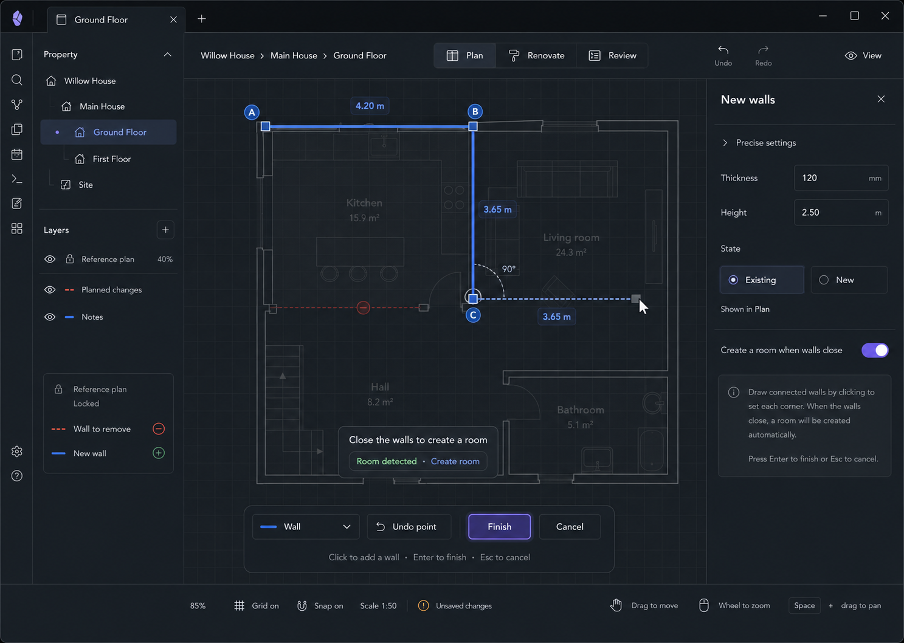

# M04 — Draw Walls

**Spatial implementation, 2026-09-06:** ADR-0020 is the accepted minimal contract. The current
task supports exact first-point x/y and segment length/angle fields, point/axis snapping, Undo
point, Close walls to start, Finish and Cancel. Height/thickness live in a disclosure. A closed
simple chain offers a checkbox and existing Room name field; the whole operation is reversible.
Existing/New state, project defaults, implicit intersection splitting and automatic room detection
remain later work. [Acceptance evidence](../../../tests/cases/Draw%20connected%20walls%20and%20openings.md).

Native inputs retain Space, Backspace, Delete and Escape. Enter submits the focused form action;
on the canvas it finishes. Canvas Escape clears a draft first, then exits an empty task, following
the shared temporary-tool lifecycle. The explicit Cancel button discards and exits in one action.
Invalid geometry retains the draft with an error. A version conflict pauses it until cancellation
and reopening against the latest floor.

## Screen description

Draw Walls is the progressive-precision path for irregular or accurately known layouts. It supports connected segments, dimensions, snapping, and room detection while using plain homeowner language.

## Entry conditions

- User chooses `Add → Wall`.
- Current floor is editable.

## Primary use cases

1. Draw connected walls from known dimensions.
2. Trace a locked reference plan.
3. Close a wall loop and create a room.
4. Undo the most recent point without leaving the task.

## Interactions

| Trigger | Result |
|---|---|
| Click canvas | Set first wall point |
| Move pointer | Preview next segment, length, angle, and snap candidates |
| Click again | Commit preview segment to the draft chain |
| Type while dimension focused | Set exact current segment length |
| `Undo point` / Backspace in tool | Remove the last draft segment only |
| Close near start | Detect closed boundary and offer/create Room |
| Enter / Finish | Commit valid connected walls as one undoable transaction |
| Esc / Cancel | Discard entire uncommitted chain |

## Inspector content

- State: Existing or New
- Precise settings disclosure: thickness, height
- `Create a room when walls close`
- Plain-language task help

## Used components

- `WallDrawingOverlay`
- `DraftSegment`
- `AngleIndicator`
- `SnapGuideLayer`
- `CreationToolBar`
- `NewWallsInspector`
- `RoomDetectedPrompt`
- `UnitInput`

## Data and state requirements

- Draft point/segment chain
- Current segment length and angle
- Snapping, intersection, and loop-detection service
- Wall defaults by project/floor
- One composite reversible command for committed walls and optional room

## Accessibility and themes

- Keyboard-operable numeric length and finish/cancel controls.
- Dark canvas uses semantic surfaces and non-glowing contrast.
- Angle and snapped state use shape/text in addition to color.
- Instructions avoid vertex, polyline, and CAD terminology.

## Acceptance criteria

- Draft segments are not persisted until Finish.
- Enter completes a valid chain; Esc safely cancels.
- Closing walls can create a Room through the same transaction.
- The workflow is usable over a dimmed reference plan in both themes.
