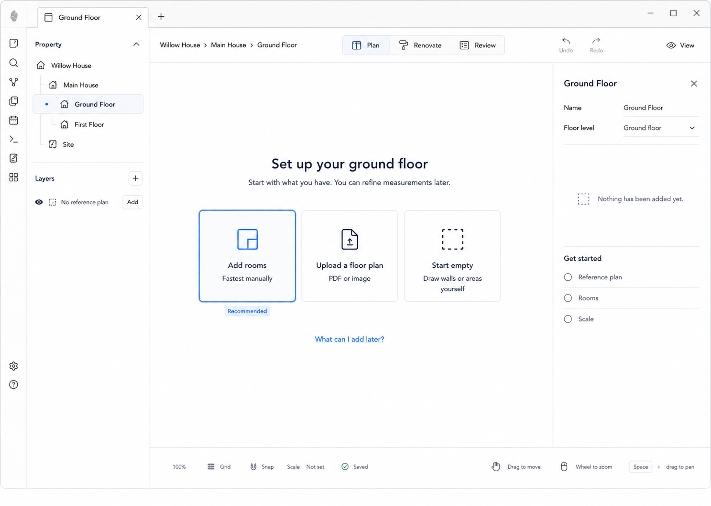

# M05 — New Floor Start

## Screen description

This is the meaningful empty state for a floor with no rooms or reference plan. It helps homeowners begin with incomplete information and avoids presenting a blank CAD canvas.

## Entry conditions

- Floor exists.
- No room/area geometry exists.
- No usable reference plan is attached.

## Primary use cases

1. Start by adding rooms.
2. Upload an image or PDF floor plan.
3. Start empty and draw walls/areas manually.
4. Edit basic floor metadata.

## Interactions

| Trigger | Result |
|---|---|
| Select `Add rooms` | Enter M03 |
| Select `Upload a floor plan` | Open file picker, then M06 |
| Select `Start empty` | Dismiss onboarding and open M01 with Add available |
| Activate `No reference plan → Add` | Same upload path as above |
| Edit floor name/level | Validate and persist through floor command |

## Used components

- `FloorEmptyState`
- `StartChoice`
- `FloorInspector`
- `SetupChecklist`
- `PropertyLayerPanel`
- `EditorStatusBar`

## Data and state requirements

- Empty-state selector based on query results, not visual guesswork
- Floor metadata
- Supported file types and upload command availability
- Scale unset state

## Accessibility and themes

- Choices are real buttons with headings and descriptions.
- Recommended state does not prevent equal keyboard access to alternatives.
- No decorative illustration is required.
- Empty state uses host surfaces and inherited accent.

## Acceptance criteria

- The user sees three understandable ways to start.
- No path requires a floor plan.
- Selecting an option leads into the canonical existing command/tool path.
- Empty state disappears while a temporary creation task is active.

## Implementation contract — 2026-09-06

M05 is query-derived: show the three choices only when the ready floor has no reference and no
readable or unreadable spatial records. A floor with rooms but no reference is a valid drawing
workspace. Add rooms uses the canonical room creation entry. Upload opens M06; Start empty
hides this overlay for the current mounted floor. Active creation/reference setup hides it too.
The Floor Inspector and layer panel retain reference entry after dismissal. Missing reference
files remain a named warning rather than silently becoming a new empty floor. Existing floor
metadata editing is reused.

Automated/query and browser acceptance is recorded in
[Configure a reference plan](../../../tests/cases/Configure%20a%20reference%20plan.md).
Live Obsidian, screenreader and final product acceptance remain open.
