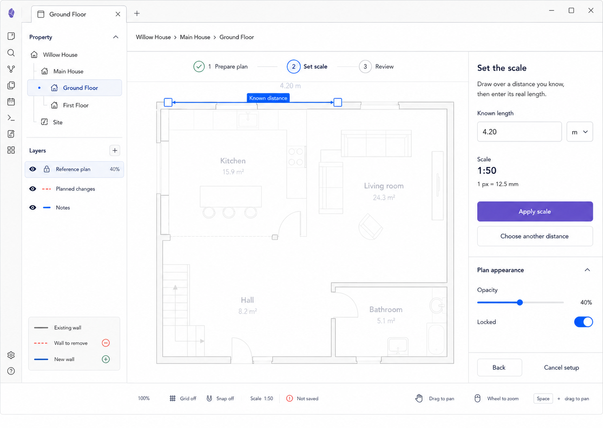

# M06 — Reference Plan Setup

## Screen description

Reference Plan Setup is a contextual three-step workflow for preparing an imported PDF/image, setting real-world scale, and reviewing the resulting locked layer. It replaces a permanent Calibrate toolbar tool.

## Entry conditions

- User uploads a supported image/PDF or chooses to replace/reconfigure a reference plan.
- Source can be read and previewed.

## Primary use cases

1. Crop/rotate the imported plan.
2. Set scale from one known distance.
3. Review opacity, lock state, and calculated scale.
4. Retry or replace an unreadable source.

## Workflow

1. **Prepare plan:** rotate, crop, choose page for PDF.
2. **Set scale:** draw over a known distance and enter its real length.
3. **Review:** confirm scale, opacity, alignment, and lock.

## Interactions

| Trigger | Result |
|---|---|
| Draw measurement line | Set two image-space endpoints |
| Enter known length | Calculate scale preview using project units |
| `Choose another distance` | Clear calibration draft but retain prepared source |
| Change opacity | Preview immediately; persist on final confirmation |
| Toggle Locked | Default on; show consequences before allowing off |
| `Apply scale` | Validate and advance to Review |
| Finish setup | Persist reference metadata and layer configuration as one transaction |
| Cancel setup | Restore prior reference state, if any |

## Used components

- `ReferencePlanSetup`
- `SetupStepper`
- `ReferenceImageLayer`
- `KnownDistanceOverlay`
- `KnownDistanceForm`
- `OpacitySlider`
- `LockToggle`
- `ReferencePlanInspector`
- `EditorStatusBar`

## Data and state requirements

- Source file link, page, crop, rotation, opacity, lock state
- Image-space endpoints and real-world known length
- Derived scale and unit conversion
- Draft vs previously committed reference configuration
- Background load/readability status

## Accessibility and themes

- Known length is operable without precise pointer placement after endpoints exist.
- Measurement line uses endpoints, label, and focus state.
- Setup step is announced and keyboard navigable.
- Reference opacity remains readable in light and dark themes.

## Acceptance criteria

- Calibration is only exposed inside reference-plan context.
- Applying scale produces a deterministic unit conversion.
- Cancel restores the previous committed reference plan.
- Completed references default to visible and locked.
