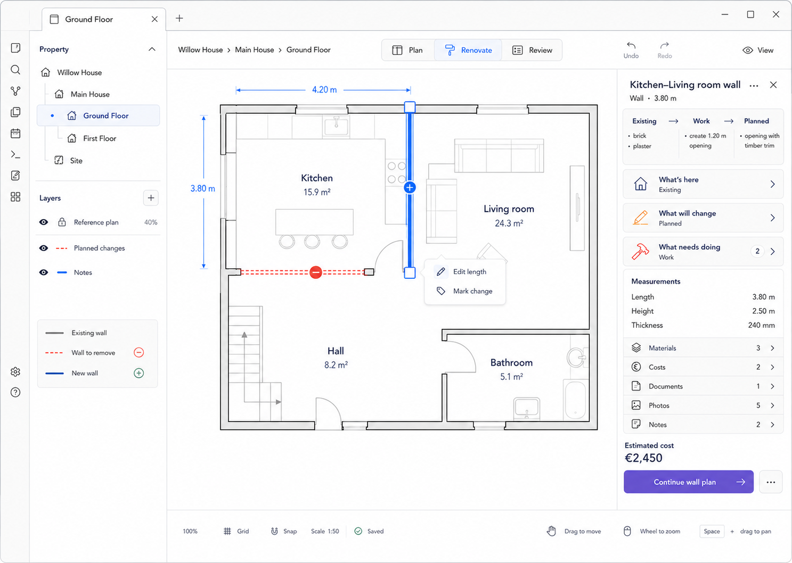

# M07 — Wall Selected

**Current implementation checkpoint:** Wall/Opening Inspector retains measurements and adjacent-room context while connecting its own Existing/Planned/Work records, overview and linked planning routes. Standalone elements have an explicit Room context selector. New drafts target the selected element; an existing subject is reused when marking a change. This supersedes the spatial-only capability boundary below. Final integrated visual and host acceptance remain open in [implementation evidence](../implementation/editor-visual-fidelity.md).

**Spatial subset, 2026-09-06:** Wall/Opening selection, persistent list access, measurements,
associated Room names, exact numeric edits with impact preview, end-junction dragging and
confirmed deletion are implemented under ADR-0020. `Edit measurements` opens the root-owned
form; Preview then Apply is required for both typed length and pointer endpoint proposals.
Length anchors the start; coincident endpoints at the end move together. Invalid host
containment/overlap refuses the edit. Rooms retain their original outlines, stated in the preview.

Opening → Wall → Room priority and Alt-click cycling share the existing selection resolver.
Shift activation from the list adds/removes selection members; mixed selection remains read-only.
No shared delete, Existing/New, Mark change, Work, Materials, Costs, construction or Evidence
control is advertised. Those illustrated capabilities await later phases; **full M07 is open**.
See [acceptance evidence](../../../tests/cases/Draw%20connected%20walls%20and%20openings.md).

## Screen description

This screen applies the same selection-first model to a wall. The wall remains spatially visible between adjacent rooms while the Inspector exposes measurements, Existing/Work/Planned information, and linked renovation records.

## Entry conditions

- A wall entity exists on the current floor.
- User selects the wall from the canvas or a non-canvas entity list.

## Primary use cases

1. Inspect wall length, height, thickness, and adjacent rooms.
2. Describe its current construction/finish.
3. Mark it for removal, modification, or a new opening.
4. Connect work, materials, cost, evidence, and notes to the wall.
5. Enter an exact length when geometry allows it.

## Interactions

| Trigger | Result |
|---|---|
| Select wall | Highlight wall and endpoints; open Wall Inspector |
| Click displayed length | Enter exact length; preview affected geometry before commit |
| `Edit length` | Focus numeric length editor |
| `Mark change` | Choose Unchanged, Remove, Modify, or Add where semantically valid |
| Select homeowner question | Drill into Existing, Planned, or Work for this wall |
| Select linked-content row | Open related collection while preserving wall selection |
| More → Delete | Open destructive confirmation describing affected rooms/openings/references |

## Used components

- `WallShape`
- `SelectionOverlay`
- `EditableDimensionLabel`
- `DirectActionPopover`
- `WallInspector`
- `TransformationSummary`
- `MeasurementGroup`
- `LinkedContentList`
- `DestructiveActionMenu`

## Data and state requirements

- Wall geometry and normalized measurements
- Adjacent room relationships
- Hosted openings
- Existing/Planned change state
- Work and linked-content summaries
- Referential-impact query for deletion

## Accessibility and themes

- Selected wall uses outline/handles, not color alone.
- Wall is reachable through a list/table route.
- Destructive action is not a primary button.
- Change states retain line pattern, markers, and labels in both themes.

## Acceptance criteria

- Selecting a wall never selects an overlapping room accidentally without predictable cycling/priority.
- Numeric edits use the same reversible command path as direct manipulation.
- Deletion cannot silently orphan hosted openings or linked records.
- Inspector content is wall-specific and retains adjacent-room context.

## Implemented Increment C boundary — 2026-09-06

The connected implementation uses ADR-0021: independent Existing/Planned facts in the owning
Plan register, project-owned Work/outcome links, minimal Decisions, separate intended
straight-wall/opening geometry and scoped Review. All records have Inspector list routes;
Room selection remains spatial. See [evidence and traceability](../implementation/connected-renovation-evidence.md).
Evidence, financial reconciliation, materials purchasing, Trade catalogue and scheduling remain
later work. These screens are not declared fully accepted; live Obsidian and screenreader
acceptance remain unperformed.
