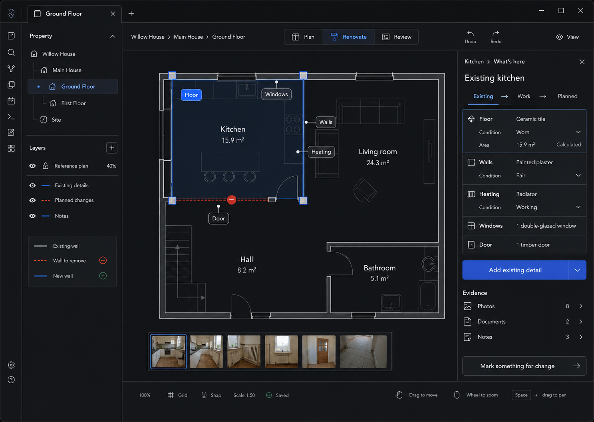

# M08 — Existing Room Details

## Screen description

The Existing detail state answers **What is here now?** for the selected room. It captures finishes, fixtures, condition, and evidence without forcing a full survey before the room becomes useful.

## Entry conditions

- A Room is selected.
- User chooses `What's here`.

## Primary use cases

1. Record current floor, walls, heating, windows, doors, and fixtures.
2. Record condition in homeowner language.
3. Add photos/documents/notes as evidence of the current state.
4. Mark an existing element for change.

## Interactions

| Trigger | Result |
|---|---|
| Select a surface chip on canvas | Focus corresponding Existing row in Inspector |
| Expand a row | Show editable description, condition, measurements, and evidence links |
| `Add existing detail` | Open contextual type picker pre-linked to room and Existing state |
| Select photo thumbnail | Show photo metadata and related spatial pin |
| `Mark something for change` | Start Planned/Change creation from the selected Existing item |
| Existing/Work/Planned switch | Move between M08, M10, and M09 while retaining room/viewport |

## Used components

- `SemanticStateSwitch`
- `RoomSurfaceMarkers`
- `ExistingRoomInspector`
- `ExistingDetailRow`
- `ConditionSelect`
- `CalculatedValue`
- `EvidenceSummary`
- `PhotoStrip`

## Data and state requirements

- Existing-state items by room and surface/object type
- Condition vocabulary
- Derived area/length values with provenance `Calculated`
- Evidence links and counts
- Relationship from Existing item to proposed change

## Accessibility and themes

- Surface chips have list equivalents in Inspector.
- Condition uses text, not traffic-light color.
- Photo thumbnails include filenames/descriptions and keyboard selection.
- Dark theme uses host surfaces; thumbnails retain visible selected borders.

## Acceptance criteria

- Existing information can be added incrementally.
- Derived values are labeled and not editable as if manually stored.
- Starting a change preserves a link to the source Existing item.
- The user can complete the workflow without interacting with canvas chips.
