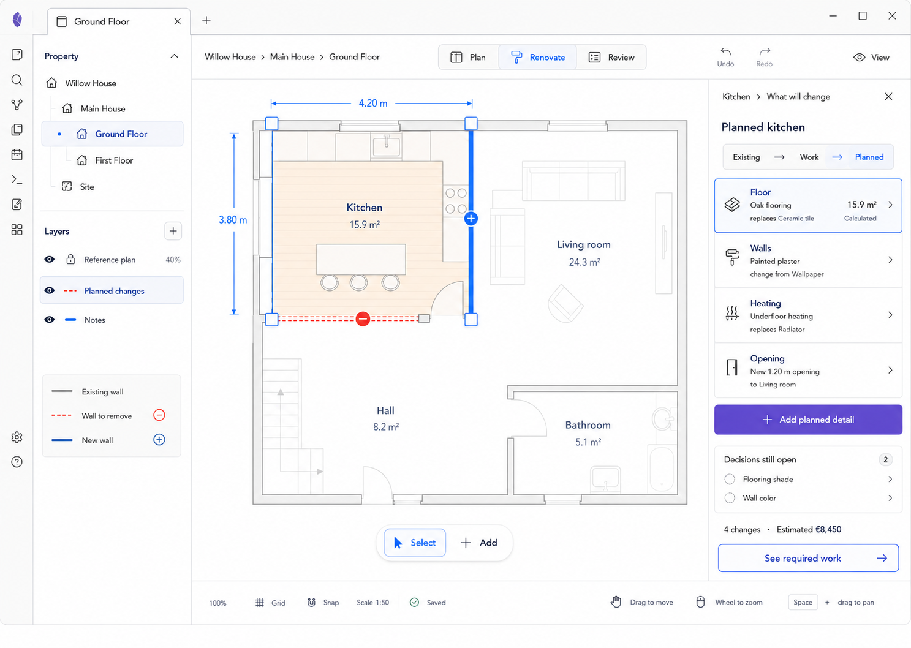

# M09 — Planned Room Details

## Screen description

The Planned state answers **What should exist afterwards?** It shows intended finishes, fixtures, openings, and spatial changes while preserving the current structure for comparison.

## Entry conditions

- A Room is selected.
- User chooses `What will change` or follows `Mark something for change` from M08.

## Primary use cases

1. Define intended floor/wall/heating finishes or elements.
2. Represent added, removed, and modified geometry.
3. Record unresolved decisions.
4. Navigate from planned outcomes to required work.

## Interactions

| Trigger | Result |
|---|---|
| Select planned overlay/marker | Focus corresponding Planned row |
| Add planned detail | Choose semantic type; pre-link to selected room and optional Existing item |
| Edit finish/element | Update draft and show downstream work/cost impact before commit where applicable |
| Select unresolved decision | Open/edit linked Decision note |
| `See required work` | Open M10 and highlight work producing selected Planned item |
| Toggle Planned layer | Hide/show planned overlays without deleting data |

## Used components

- `SemanticStateSwitch`
- `PlannedGeometryLayer`
- `ChangeMarker`
- `PlannedRoomInspector`
- `PlannedDetailRow`
- `DecisionList`
- `ImpactPreview`

## Data and state requirements

- Planned-state items
- Change classification: unchanged/remove/modify/add
- Relationship to Existing source and Work outcomes
- Decision records and resolved state
- Derived quantities and estimated cost summary

## Accessibility and themes

- Removed/new/modified states use pattern, marker, and label.
- Planned overlays meet contrast requirements without obscuring geometry.
- Decisions use icon plus status text.
- All Planned items are reachable in Inspector/list form.

## Acceptance criteria

- Planned items do not overwrite Existing records.
- Each spatial change is readable without opening the Inspector.
- A user can trace a Planned outcome to its required Work.
- Hiding the Planned layer changes only presentation.

## Historical Increment C checkpoint — 2026-09-06

The connected implementation uses ADR-0021: independent Existing/Planned facts in the owning
Plan register, project-owned Work/outcome links, minimal Decisions, separate intended
straight-wall/opening geometry and scoped Review. All records have Inspector list routes;
Room selection remains spatial. See [evidence and traceability](../implementation/connected-renovation-evidence.md).
At that checkpoint, Evidence, financial reconciliation, materials purchasing, Trade catalogue
and scheduling were still outstanding. They are implemented in the current integration through
the existing planning repositories and the [downstream Work/Quote routes](../implementation/downstream-planning-evidence.md).
This supersedes the earlier implementation boundary; final integrated gates, visual, live Obsidian
and screen-reader acceptance remain open.
