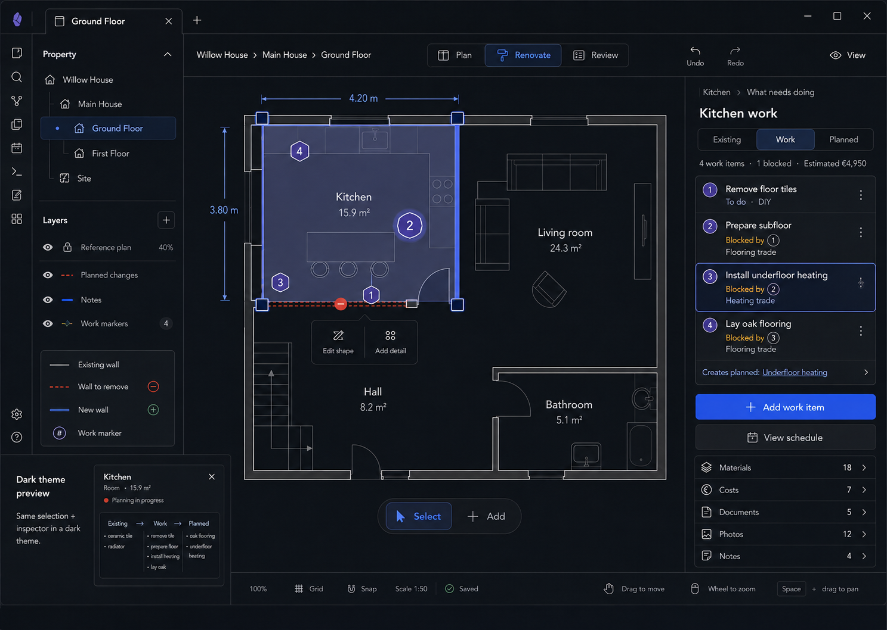

# M10 — Room Work

## Screen description

Room Work answers **What needs doing?** It translates changes into ordered work items and spatial markers. The Inspector provides a focused list rather than embedding a full scheduling product in the canvas.

## Entry conditions

- A Room is selected.
- User chooses `What needs doing` or follows `See required work` from Planned.

## Primary use cases

1. Add work required to reach the Planned state.
2. Order work and represent dependencies.
3. Assign responsibility such as DIY or trade.
4. Identify blocked work.
5. Navigate between a spatial marker and its work item.

## Interactions

| Trigger | Result |
|---|---|
| Select numbered canvas marker | Select matching work item in Inspector |
| Select work row | Highlight its spatial target/marker |
| Add work item | Create a contextual draft linked to Room and optional Planned outcome |
| Change order/dependency | Validate cycles and update blocked state |
| Change responsibility | Choose DIY or an existing Trade record |
| `Creates planned` link | Open the resulting Planned item in M09 |
| `View schedule` | Open the broader schedule view outside the Inspector while retaining context |

## Used components

- `WorkMarkerLayer`
- `WorkMarker`
- `RoomWorkInspector`
- `OrderedWorkList`
- `WorkItemRow`
- `DependencyBadge`
- `ResponsibilityLabel`
- `LinkedOutcome`

## Data and state requirements

- Work items, order, status, responsibility, dependencies
- Spatial target(s)
- Relationship to Existing source and Planned outcome
- Derived blocked state and cost/material summaries
- Validation preventing dependency cycles

## Accessibility and themes

- Markers use stable numbers matching list rows.
- Work status and blocked state include text.
- Ordering has keyboard controls in addition to drag/reorder.
- Dark theme selected rows and markers meet contrast requirements.

## Acceptance criteria

- Selecting marker and list row is bidirectional.
- Work dependencies cannot create a cycle.
- A work item can state what Planned outcome it creates.
- Inspector stays focused on the selected room rather than becoming a whole-project board.
