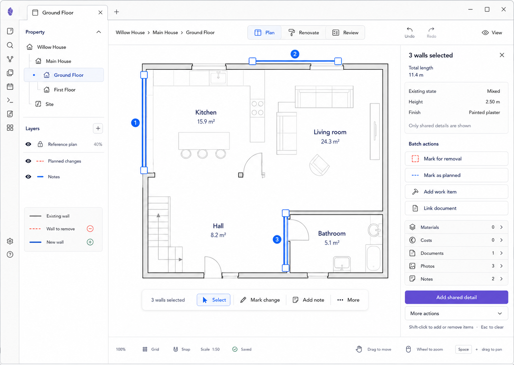

# M11 — Multi-Selection

**Current implementation checkpoint:** Compatible selections now support one shared Work/Evidence record, a previewed atomic planned modification/removal of walls/openings, and confirmed atomic current-structure deletion. Additional links preserve a single record identity with explicit unlink and whole-record deletion impacts. Selected Rooms can share Work/Evidence; unknown records and Areas have an explicit unsupported reason, and geometry change/delete requires walls/openings. Length is the sum of selected elements, with hosted openings counted separately. Plans with shared links write schema v5 so older writers refuse them safely. See [implementation evidence and pending acceptance](../implementation/editor-visual-fidelity.md).

## Screen description

Multi-selection supports safe shared actions across several spatial entities. It shows only shared properties and aggregated measurements, avoiding misleading mixed-value editing.

## Entry conditions

- The user adds compatible entities to selection with Shift-click or keyboard selection.
- At least two entities are selected.

## Primary use cases

1. Mark several walls for removal or planning.
2. Add shared work, note, or document links.
3. Inspect aggregate length/area.
4. Clear or modify the selection safely.

## Interactions

| Trigger | Result |
|---|---|
| Shift-click entity | Add/remove it from selection |
| Select numbered badge/list row | Focus one member without discarding selection |
| Mark for removal/planned | Preview affected entities, then execute one composite reversible command |
| Add shared detail | Link one new/existing record to all selected entities |
| Esc | Clear multi-selection and return to M01 |
| More → Delete | Require explicit impact summary and confirmation |

## Used components

- `MultiSelectionOverlay`
- `SelectionBadge`
- `MultiSelectionActionBar`
- `MultiSelectionInspector`
- `SharedPropertyList`
- `BatchActionList`
- `ImpactConfirmationDialog`

## Data and state requirements

- Ordered selected entity IDs/types
- Shared-property intersection and mixed-value representation
- Aggregated measurement query
- Compatibility rules per batch action
- Composite commands and reference-impact summaries

## Accessibility and themes

- Numbered badges associate canvas entities with the selection list.
- Keyboard selection supports additive/removal operations.
- Mixed values are explicitly labeled.
- Destructive batch actions are not primary.

## Acceptance criteria

- Inspector never shows a mixed property as if it were shared.
- Batch commands are atomic and undo as one user action.
- Unsupported entity combinations disable actions with explanation.
- Esc reliably returns to the safe no-selection state.
