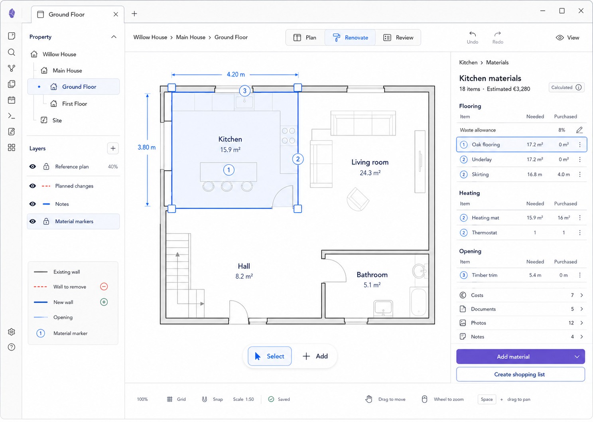

# M12 — Room Materials

## Screen description

Materials connects geometry and work to required quantities and procurement progress. The screen distinguishes calculated need from purchased quantity and keeps all items contextual to the selected room.

## Entry conditions

- A Room is selected.
- User chooses Materials.

## Primary use cases

1. View materials grouped by related work.
2. Derive quantities from area/length plus waste allowance.
3. Track purchased versus needed quantity.
4. Add a manual material.
5. Create a shopping list.

## Interactions

| Trigger | Result |
|---|---|
| Select material row | Highlight related room surface/work marker |
| Edit waste allowance | Recalculate derived need and show cost impact preview |
| Edit purchased quantity | Validate units and update procurement status |
| Add material | Create manual or calculated material requirement linked to Room/Work |
| Create shopping list | Generate/open a vault-backed list from outstanding quantities |
| Select `Calculated` | Explain geometry, formula, unit, and waste inputs |

## Used components

- `MaterialMarkerLayer`
- `MaterialsInspector`
- `MaterialGroup`
- `MaterialRow`
- `QuantityCell`
- `CalculatedBadge`
- `WasteAllowanceField`
- `ProcurementStatus`

## Data and state requirements

- Material requirements and unit types
- Needed, purchased, reserved quantities
- Calculation provenance and source geometry/work
- Waste allowance
- Unit/currency formatting and estimated cost

## Accessibility and themes

- Table-like rows use semantic headers and keyboard navigation.
- Procurement status includes text.
- Calculated provenance is available without hover.
- Markers and rows remain linked through numbers/icons.

## Acceptance criteria

- Geometry-derived quantities update after relevant geometry changes.
- Calculated and manual values are distinguishable.
- Unit-incompatible quantities cannot be combined silently.
- Shopping list includes only outstanding quantities unless configured otherwise.

### Implemented continuation — 2026-09-06

The connected planning slice implements Asset-backed contextual Requirements, source rules, overrides, provenance, exclusive local allocations and an outstanding-only shopping projection. Contracts and exclusions are in
[ADR-0022](../../../development/adrs/0022-material-quantities-cost-facts-and-vault-evidence.md).
See [evidence and traceability](../implementation/connected-planning-evidence.md) for reproducible
verification and unperformed acceptance. This records bounded criteria, not complete screen
acceptance, Increment D completion or release readiness.
