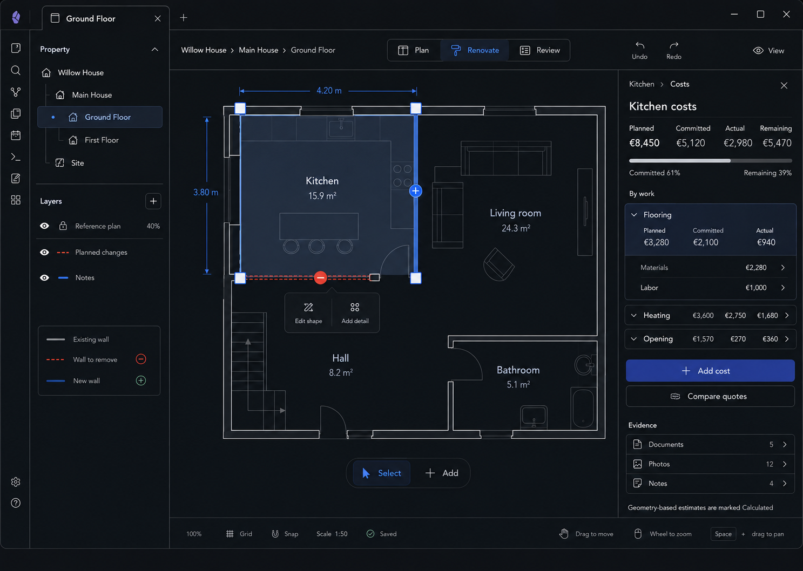

# M13 — Room Costs

## Screen description

Costs relates planned, committed, and actual spending to the selected room and its work. It provides financial control without becoming an accounting dashboard.

## Entry conditions

- A Room is selected.
- User chooses Costs.

## Primary use cases

1. Understand planned, committed, actual, and remaining room cost.
2. Inspect cost by work group.
3. Distinguish material and labor cost.
4. Add a cost or link a quote/invoice.
5. Compare quotes in a dedicated downstream view.

## Interactions

| Trigger | Result |
|---|---|
| Select work-cost group | Expand breakdown and highlight related work/surface |
| Add cost | Create planned/committed/actual item with context inherited from Room |
| Link evidence | Choose vault document and relate it to cost/work/supplier |
| Compare quotes | Open quote comparison outside the narrow Inspector |
| Select calculated estimate | Explain quantity × rate × waste inputs |

## Used components

- `CostsInspector`
- `CostTotals`
- `BudgetProgress`
- `CostGroup`
- `CostBreakdownRow`
- `CalculatedBadge`
- `EvidenceLinks`

## Data and state requirements

- Cost items with stage: planned/committed/actual
- Category: material/labor/other
- Work, material, quote, document, and supplier relationships
- Project currency and normalized money representation
- Aggregations and calculation provenance

## Accessibility and themes

- Financial stages are always text-labeled.
- Progress bars include numeric equivalents.
- Currency formatting follows project currency, not UI locale alone.
- Dark theme avoids low-contrast muted totals.

## Acceptance criteria

- Totals reconcile to visible cost items.
- Remaining is derived and clearly defined.
- Geometry-based estimates are marked Calculated.
- The Inspector never implies accounting/tax validity.
