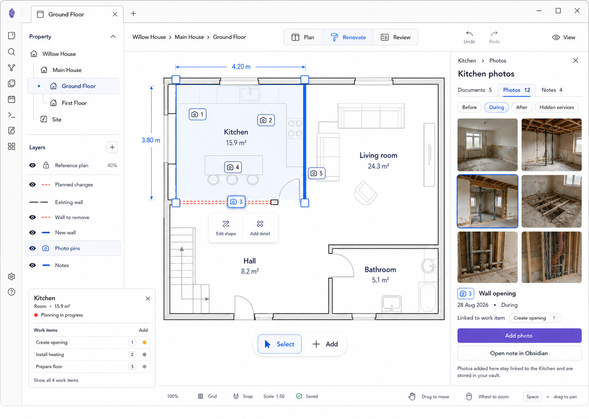

# M14 — Room Evidence

## Screen description

Evidence is a shared contextual shell for Documents, Photos, and Notes. The locked mockup shows Photos as the active view, with numbered spatial pins and vault-backed metadata. Documents and Notes reuse the same shell and relationship model.

## Entry conditions

- A spatial entity is selected.
- User chooses Documents, Photos, or Notes.

## Primary use cases

1. Add a photo already linked to a room/wall/work item.
2. Find evidence by phase: Before, During, After, Hidden services.
3. Link a vault document or note to the selected entity.
4. Navigate between canvas pin and evidence item.
5. Preserve evidence context for later maintenance, warranty, or disputes.

## Interactions

| Trigger | Result |
|---|---|
| Select numbered pin | Select matching evidence item in Inspector |
| Select thumbnail/row | Focus corresponding pin and metadata |
| Change phase filter | Filter evidence without changing entity selection |
| Add photo | Choose/capture file, then prefill room, phase, and optional work link |
| Add/link document | Use Obsidian file chooser and preserve vault link |
| Add note | Create/open Markdown note using configured folder/template |
| Open note in Obsidian | Reveal linked note in a workspace leaf |
| Switch Documents/Photos/Notes | Keep same entity and evidence context |

## Used components

- `EvidencePinLayer`
- `EvidencePin`
- `EvidenceInspector`
- `EvidenceTypeSwitch`
- `EvidenceFilters`
- `PhotoGrid`
- `PhotoThumbnail`
- `EvidenceMetadata`
- `VaultLinkPicker`
- `OpenInObsidianAction`

## Data and state requirements

- Vault file links, metadata, and optional thumbnails
- Evidence type, phase, date, description
- Spatial entity and optional Work/Decision/Issue relationship
- Stable pin number within the current filtered context
- Missing-file and unreadable-thumbnail state

## Accessibility and themes

- Thumbnails have descriptive accessible names and selected borders.
- Filters are real toggle buttons with pressed state.
- Pins use icon and number, not color alone.
- Missing thumbnails degrade to labeled file rows.

## Acceptance criteria

- New evidence inherits the current spatial context.
- Selecting a pin and evidence item is bidirectional.
- Files remain ordinary vault files/links.
- Documents and Notes can reuse the shell without requiring separate editor navigation systems.
