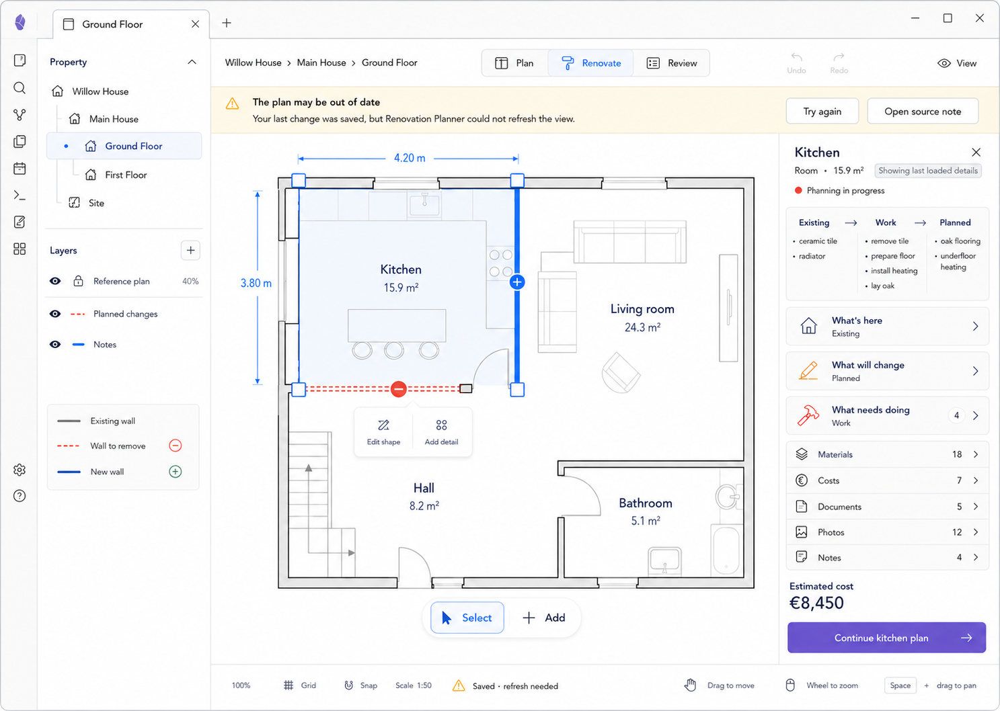

# M15 — Stale-Data Warning

## Screen description

This recoverable state appears when a write succeeded but the follow-up read failed. The last valid plan remains visible, while the interface explains that it may be out of date and prevents risky edits until refreshed.

## Entry conditions

- A mutation completed successfully.
- Rehydration/read-back fails.
- The store retains the last valid projection and marks it stale.

## Primary use cases

1. Understand that the change was saved even though the view did not refresh.
2. Retry the read without repeating the write.
3. Open the source note to inspect data directly.
4. Avoid making another edit against stale geometry.

## Interactions

| Trigger | Result |
|---|---|
| `Try again` | Re-run hydration only; never replay the mutation |
| `Open source note` | Reveal the relevant Markdown source |
| Selection/navigation | May remain available for inspection |
| Geometry/add/delete actions | Disabled until refresh succeeds, with explanation |
| Successful retry | Remove strip and stale labels; restore actions |
| Failed retry | Keep current valid content and update accessible failure message |

## Used components

- `PersistentWarningStrip`
- `StaleContentLabel`
- `SaveStateIndicator`
- `DisabledActionReason`
- Existing editor shell and Inspector components

## Data and state requirements

- Distinct write success and refresh failure states
- Last valid plan projection
- `stale` flag and recoverable error
- Source note target
- Retry-in-progress state

## Accessibility and themes

- Warning uses icon, heading, and body—not color alone.
- Strip is announced without stealing focus repeatedly.
- Disabled controls remain legible and expose reason.
- Warning surface uses Obsidian semantic warning variables.

## Acceptance criteria

- A failed read-back never causes a successful write to be repeated.
- Last valid content is not replaced by a generic failure page.
- Save state reads `Saved · refresh needed`.
- The warning persists while the stale condition persists.
