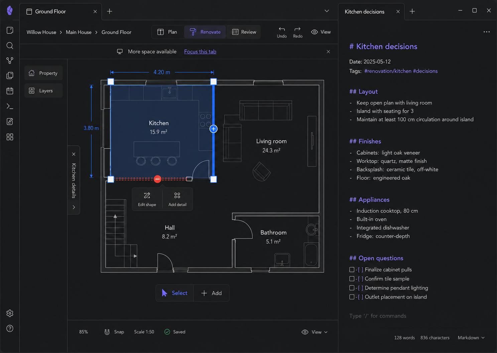

# M16 — Constrained Workspace

## Screen description

This screen defines graceful behavior when the editor shares the Obsidian workspace with another leaf. It is not a mobile layout. The canvas remains usable, while side panels collapse into accessible rails/drawers.

## Entry conditions

- Editor leaf width falls below the full-layout threshold.
- The workspace is still wide enough for desktop canvas interaction.

## Primary use cases

1. Keep planning while a related Markdown note is visible.
2. Temporarily open Property, Layers, or Inspector.
3. Focus the editor tab for more space.
4. Preserve selection and viewport across layout changes.

## Responsive behavior

| Width condition | Behavior |
|---|---|
| Full | Persistent left panel + canvas + Inspector |
| Constrained | Property/Layers become rail-triggered overlay; Inspector becomes edge drawer |
| Below supported editor width | Replace editing with a clear `Focus this tab` action and non-canvas summary; do not create horizontal scroll |

## Interactions

| Trigger | Result |
|---|---|
| Property/Layers rail button | Open one temporary panel; opening one closes the other |
| `Kitchen details` edge button | Open Inspector drawer over canvas |
| Click canvas / Esc | Close temporary panel when safe |
| `Focus this tab` | Ask Obsidian workspace to maximize/focus leaf using supported API |
| Resize leaf | Reflow at thresholds without resetting selection/viewport |

## Used components

- `ResponsiveEditorShell`
- `PanelRail`
- `OverlayPanel`
- `InspectorDrawer`
- `FocusLeafNotice`
- `CompactStatusBar`
- Standard canvas/selection components

## Data and state requirements

- Leaf/container width observer
- Panel open/closed state independent from selection
- Preserved viewport and selected entity
- Layout breakpoint state

## Accessibility and themes

- Overlay panels trap focus only while open and restore it on close.
- Rail buttons have text labels, not mystery icons.
- No essential action disappears without an alternate location.
- Hit targets remain desktop-sized; text is not miniaturized.

## Acceptance criteria

- No horizontal scrollbar appears at supported constrained widths.
- Select and Add remain reachable.
- Canvas state survives resizing and focusing the leaf.
- The editor clearly refuses unsupported widths rather than rendering broken controls.
