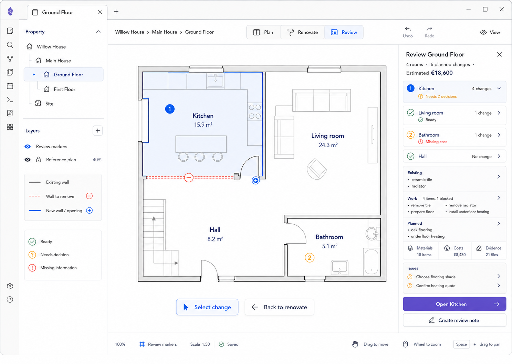

# M17 — Review Perspective

## Screen description

Review is a read-oriented perspective for checking renovation readiness across the floor. It emphasizes missing decisions, costs, and blocked work and routes the user back to the relevant spatial context for correction.

## Entry conditions

- A floor contains at least one room or change.
- User selects Review in the perspective switch.

## Primary use cases

1. See which rooms are ready, need decisions, or miss information.
2. Review Existing → Work → Planned coherence for a selected room.
3. Find blocked work or missing cost.
4. Create a vault-backed review note.
5. Return to Renovate at the exact item needing attention.

## Interactions

| Trigger | Result |
|---|---|
| Select review marker | Select room/change and expand its readiness summary |
| Select readiness row | Center/focus relevant room on canvas |
| Select issue | Open the specific Decision, Work, Cost, or Evidence detail in Renovate |
| `Open Kitchen` | Switch to Renovate while retaining Kitchen selection |
| `Create review note` | Generate/open a Markdown summary with links to reviewed entities |
| `Back to renovate` | Return to prior Renovate selection and viewport |

## Used components

- `PerspectiveSwitch`
- `ReviewMarkerLayer`
- `ReviewMarker`
- `ReviewInspector`
- `ReadinessList`
- `ReadinessStatus`
- `TransformationSummary`
- `IssueList`
- `CreateReviewNoteAction`

## Data and state requirements

- Derived readiness rule results per room/change
- Unresolved decisions, missing estimates, blocked work, missing evidence
- Aggregated change/material/cost/evidence summaries
- Previous Renovate selection and viewport for return

## Accessibility and themes

- Readiness uses icon plus label.
- Marker number/status matches the list.
- Review is fully usable through the Inspector list without canvas.
- Review does not add collaboration/approval semantics that the product does not support.

## Acceptance criteria

- Readiness results are deterministic and explainable.
- Every issue routes to one actionable source screen.
- Review does not expose geometry editing or Add creation controls.
- Returning to Renovate preserves context.
