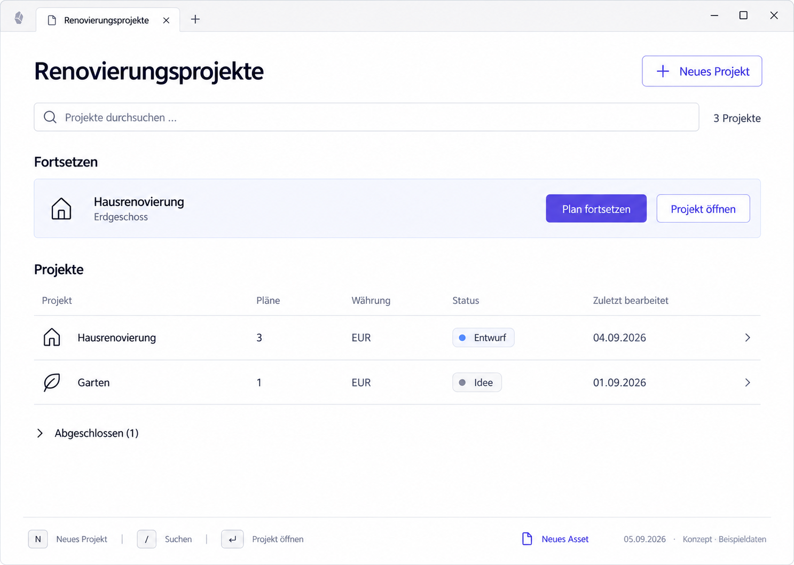

# P00 — Project overview



> Generated concept mockup with sample data, not an implementation screenshot. Original images illustrate German UI localization. English specification rules and the [UI copy table](../ui-copy.md) take precedence over incidental image details.

## Purpose and entry
Find an existing project, deliberately open it, or resume the last work context. Enter by opening the plugin view or choosing “All projects”. The project index must be loaded, or the view must show an explicit loading/error state.

## Layout
1. Title and “New project”.
2. Search with loaded and matching project counts.
3. At most one optional Resume entry naming the project and, when available, the plan.
4. Calm, aligned active-project rows.
5. Collapsed completed projects; matching completed projects become visible during search.
6. Secondary “New asset” and existing “Asset library” access.

## Interactions
| Trigger | Result |
| --- | --- |
| Activate project row | P01/P02 in the current leaf, not the editor |
| Resume plan | Validate saved context, open editor, or use P03 fallback |
| Open project in Resume entry | Always project details |
| Change search | Update filter/count; retain input focus |
| No matches | “Create project ‘{name}’” opens a prefilled form; no automatic creation |
| New project | Existing form; P01 after success |
| Expand completed | Show completed projects, not a portfolio mode |

## Use cases
- UC-P00-01: Identify the right project by name, status, and plan count.
- UC-P00-02: Resume the last plan directly.
- UC-P00-03: Create a missing project from unsuccessful search.
- UC-P00-04: Revisit a completed project.

## Components
ProjectList, ProjectRow, ProjectFilter, ContinueRow, EmptyState, PersistentWarningStrip, ViewFailure. Extend existing components; lists emit IDs/intents.

## Data contract
ProjectSummaryDto: id, name, status, currency, planCount, lastWorked, libraryOverlap. Last worked is not last opened. Counts describe successfully read data; warnings prevent false completeness. No cross-project money totals.

## Empty, error, and special states
Empty vault: one primary creation action, no Resume, no ineffective keyboard legend. Unreadable projects are not “no projects”. Partial lists remain usable. Discard last context only after reliable validation. No unsupported session-error retry.

## Keyboard, focus, and narrow layouts
No autofocus on leaf opening. Preserve roving focus and keyboard behavior; Enter opens the focused project. No unverified global single-key shortcuts. Restore search, scroll, and focus on return; if the original ID is unavailable, focus the filter. P06 shows the narrow composition.

## Acceptance criteria
- A row opens the identified project's details.
- Open and Resume are separate labelled actions.
- No matches offers search adjustment and deliberate creation.
- Unreadable data is not zero inventory.

```gherkin
Given a filtered project is focused
When I open it and then choose "All projects"
Then the search text and meaningful focus are restored
And the editor was not opened instead of project details
```

## Image clarifications
N and / shortcuts are illustrative, not approved. Show only implemented, conflict-free shortcuts. The wide arrangement prescribes no new table/keyboard model. Preserve Asset library access even if omitted from the image.

## Shared rules and verification

The [state/navigation rules](../states-and-navigation.md), [component library](../components/component-library.md), and [repository reconciliation](../implementation/repository-reconciliation-and-backlog.md) also apply. Document/image links are checked in this package. Runtime interactions, theme contrast, and screen-reader behavior have not been verified in the plugin. See the [verification plan](../implementation/verification-plan.md).

